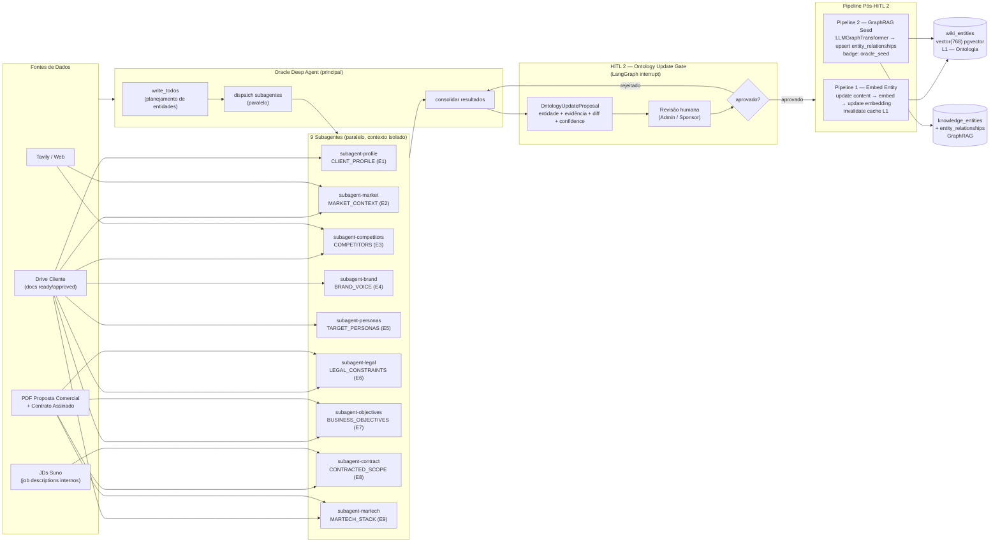

# D1 — Arquitetura Geral do Oracle Deep Agent v2

Visão geral do Oracle Deep Agent v2: orquestração de 9 subagentes paralelos por tipo de entidade, fontes de dados, gates HITL e pipeline pós-aprovação até wiki_entities e knowledge_entities.

