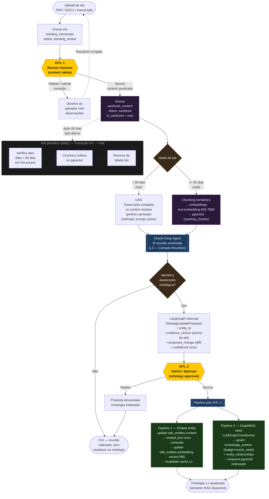

# D2 — Dual HITL Pipeline de Reuniões

Documenta o fluxo completo desde o upload de uma ata até a atualização da ontologia do cliente, passando pelos dois checkpoints humanos obrigatórios.



## Legenda

| Cor | Significado |
|-----|-------------|
| Amarelo (`#FFC801`) | Checkpoint HITL — requer aprovação humana |
| Azul escuro | Oracle Deep Agent / orquestrador |
| Verde escuro | Pipelines automáticos pós-aprovação |
| Roxo escuro | Armazenamento persistente (pgvector / DB) |
| Cinza | Job assíncrono periódico |

## Pontos-chave

### HITL 1 — Content Safety
- Ocorre **antes** de qualquer processamento por IA
- Remove: PII, conteúdo de RH (demissões, avaliações), fofoca, menções pessoais
- Resultado gravado em `meeting_transcripts.sanitized_content`
- Somente após aprovação o conteúdo entra na camada L4

### Bifurcação hot / cold (Decisão 5)
- **Hot (< 60 dias):** transcript completo no context window via CAG; prefixo cacheado com Anthropic prompt cache para queries repetidas
- **Cold (>= 60 dias):** chunking + embeddings `text-embedding-004` (768d) → pgvector

### HITL 2 — Ontology Update (Decisão 6)
- Implementado via `LangGraph interrupt` dentro do grafo do deep agent
- Proposta inclui: entidade-alvo, trecho-evidência da ata, diff proposto, score de confiança
- Somente roles `Admin` / `Sponsor` podem aprovar (especialmente se envolver `CONTRACTED_SCOPE`)

### Pipelines pós-HITL 2 (Decisão 7)
- **Pipeline 1:** atualiza `wiki_entities.content` + re-embeda + invalida cache L1
- **Pipeline 2:** `LLMGraphTransformer` → upsert em `knowledge_entities` (badge `oracle_seed`) + `entity_relationships` → enfileira indexação pgvector
- Infra do Pipeline 2 fornecida pelo ADR-013 (LLMGraphTransformer + AlloyDB)

### Transição hot → cold
- Job diário verifica atas com `data > 60 dias` ainda em modo hot
- Chunka, indexa no pgvector e remove do hot access
- Garante que o contexto não cresce indefinidamente com reuniões antigas
```
