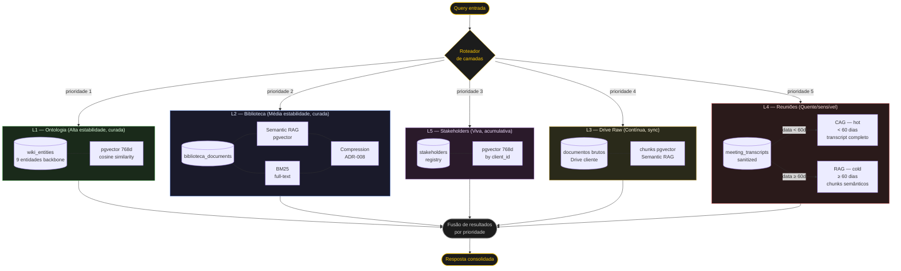

# D3 — Knowledge Layers L1–L5

Diagrama das 5 camadas de conhecimento do Oracle Deep Agent, incluindo prioridade de retrieval e roteamento de queries.



## Legenda de camadas

| Camada | Nome | Conteúdo | Retrieval | Estabilidade |
|--------|------|----------|-----------|--------------|
| **L1** | Ontologia | `wiki_entities` (9 entidades backbone) | Semantic RAG — pgvector 768d | Alta, curada |
| **L2** | Biblioteca | `biblioteca_documents` | Semantic + BM25 + compression (ADR-008) | Média, curada |
| **L3** | Drive Raw | Documentos brutos do Drive cliente | Semantic RAG chunks | Contínua, sync |
| **L4** | Reuniões | Atas processadas (pós-HITL 1) | CAG hot (< 60d) + RAG cold (≥ 60d) | Quente/sensível |
| **L5** | Stakeholders | Registry stakeholders | Semantic RAG by `client_id` | Viva, acumulativa |

## Prioridade de retrieval

Quando há sobreposição semântica entre camadas, a resposta com maior precedência é entregue:

```
L1 (Ontologia) > L2 (Biblioteca) > L5 (Stakeholders) > L3 (Drive Raw) > L4 (Reuniões)
```

Racional: L1 é a fonte mais curada e estável (Oracle-gerada, HITL-validada). L4 tem menor prioridade por ser conteúdo mais volátil e sensível (reuniões recentes).

## Notas de implementação

- **L1 embedding:** requer `ALTER TABLE wiki_entities ADD COLUMN embedding vector(768)` (Decisão 3)
- **L4 CAG:** transcrição sanitizada carregada inteira no context window para reuniões hot; Anthropic prompt cache para queries repetidas
- **L4 cold transition:** job diário verifica atas > 60 dias, chunka e indexa no pgvector, remove da tabela hot
- **L5 isolamento:** filtro obrigatório por `client_id` em todas as queries (caixa-preta RN-010)
- **Embeddings:** `text-embedding-004` (Gemini, 768 dims) — mesmo modelo de `api/chat/knowledge/embeddings.py`
