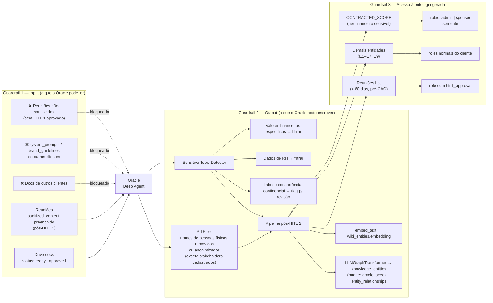

# D4 — Oracle Guardrails

Três camadas de proteção que governam o que o Oracle pode ler, escrever e quem pode acessar o que ele produz.

## Notas de implementação

| Guardrail | Onde vive | Referência |
|-----------|-----------|------------|
| G1 — Input | `api/onboarding/service.py` (gate pré-agent) | Decisão 8, Decisão 6 (HITL 1) |
| G2 — Output | Filtros pós-agent antes de gravar em `wiki_entities` | Decisão 7 (Pipelines pós-HITL 2) |
| G3 — Acesso | Column-level security ou row-level filter em `wiki_entities` | ADR-017 (a criar) |

A mesma invariante de caixa-preta (`.claude/rules/caixa-preta.md`) aplica: endpoints retornam 404 (nunca 403) quando o usuário não tem acesso a uma entidade de outro cliente.
