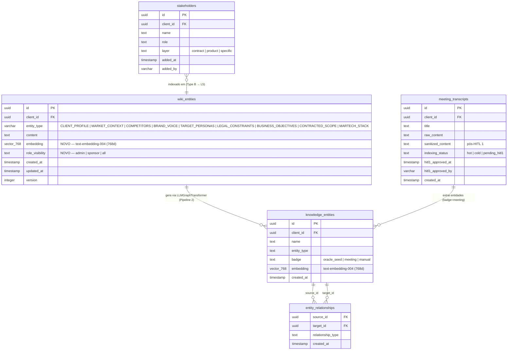

# D5 — Schema de Dados Oracle v2

ER diagram das tabelas que suportam o Oracle Deep Agent e o pipeline de conhecimento do cliente.

## Diagrama



## Notas de Design

### wiki_entities — Type A (narrativa)

- Um registro por `(client_id, entity_type)` — substituível a cada ciclo Oracle
- `embedding` (NOVO): coluna adicionada via `ALTER TABLE wiki_entities ADD COLUMN embedding vector(768)` para habilitar semantic RAG com pgvector cosine similarity
- `role_visibility` (NOVO): guardrail de acesso em nível de linha — `CONTRACTED_SCOPE` usa `admin|sponsor`; demais entidades usam `all`
- `version`: incrementado a cada atualização para auditoria de evolução

### meeting_transcripts — NOVA TABELA

- `raw_content`: upload original, nunca modificado após gravação
- `sanitized_content`: versão pós-HITL 1 (PII removido, HR content, fofoca) — único conteúdo que o pipeline de AI consome
- `indexing_status`:
  - `pending_hitl1` → aguardando revisão humana
  - `hot` → ata < 60 dias, carregada via CAG (transcript completo no contexto)
  - `cold` → ata ≥ 60 dias, chunked e indexada no pgvector para RAG

### knowledge_entities — ADR-013 (GraphRAG)

- Entidades nomeadas extraídas via `LLMGraphTransformer` (Pipeline 2 pós-HITL 2)
- `badge` distingue origem: `oracle_seed` (extraído de wiki_entities), `meeting` (extraído de ata), `manual` (cadastro direto)
- `embedding`: indexado no pgvector para retrieval semântico por camada L5

### entity_relationships — ADR-013

- Grafo dirigido de relacionamentos entre `knowledge_entities`
- `relationship_type`: vocabulário livre gerado pelo LLMGraphTransformer (ex: `COMPETES_WITH`, `REPORTS_TO`, `USES_TECHNOLOGY`)
- Chave primária composta: `(source_id, target_id, relationship_type)`

### stakeholders — Type B (registry)

- NÃO gerado pelo Oracle — acumulado ao longo do tempo
- `layer` define quando o stakeholder foi adicionado:
  - `contract`: início do contrato (clientes diretos + compras)
  - `product`: após primeiras reuniões (times de produto)
  - `specific`: ao longo do tempo (áreas específicas)
- Indexado em `knowledge_entities` (badge=manual) para RAG na camada L5

## Camadas de Conhecimento (contexto)

| Camada | Tabela principal | Retrieval | Estabilidade |
|--------|-----------------|-----------|--------------|
| L1 Ontologia | `wiki_entities` | Semantic RAG (pgvector 768d) | Alta, curada |
| L4 Reuniões | `meeting_transcripts` | CAG (hot) + RAG (cold) | Quente/sensível |
| L5 Stakeholders | `stakeholders` + `knowledge_entities` | Semantic RAG (by client_id) | Viva, acumulativa |
| GraphRAG | `knowledge_entities` + `entity_relationships` | Graph traversal + Semantic | Cresce com uso |

**Prioridade de retrieval quando há sobreposição:** L1 > L2 > L5 > L3 > L4
```
