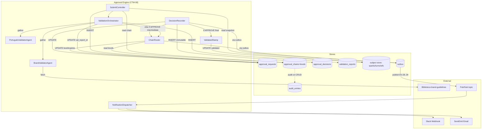
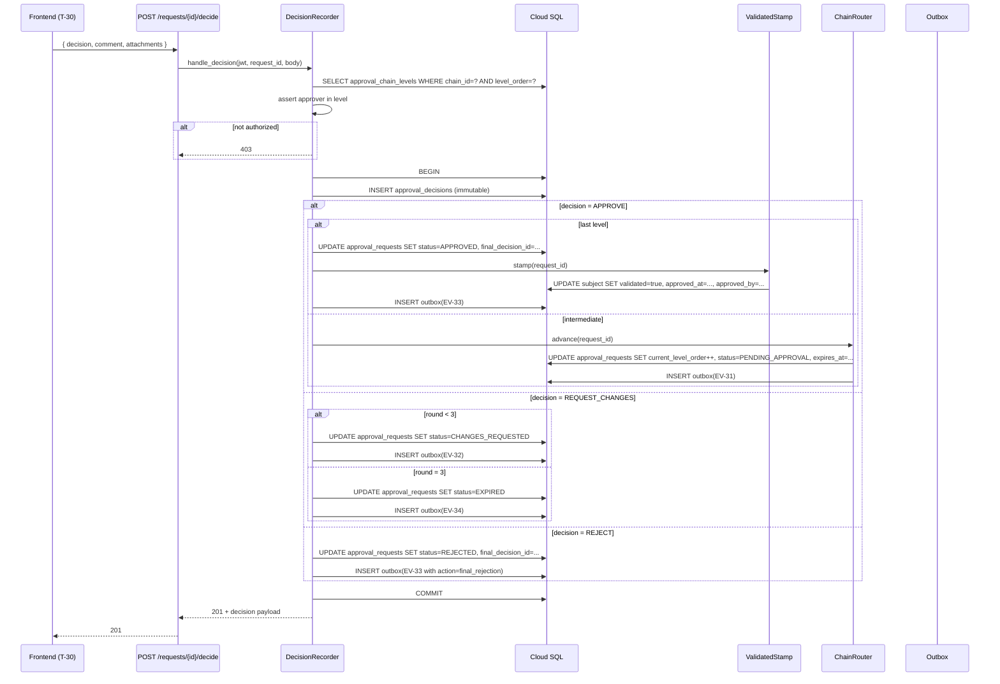

# Design — Aprovação Hierárquica (FA-13)

Documento de arquitetura. Lê o `constitution.md` (princípios) e o `spec.md` (comportamento externo) como pré-requisito. Este aqui responde "como construir" sem entrar em granularidade de tasks.

## 1. Arquitetura

### 1.1. Visão de Contexto (C4 Nível 1)

```
                        ┌────────────────────────┐
       Submitter ──────►│                        │◄────── Approver (Sócio/Líder/Operacional)
       (PX-02/03)       │      sunOS Frontend    │        (PX-06/PX-01/PX-03)
                        │  (Next.js 14, /aprovacoes/*)
                        └───────┬────────────────┘
                                │ HTTPS + JWT
                                │
                        ┌───────▼────────────────────────┐
                        │   sunOS Backend (api/, FastAPI) │
                        │   ├─ Auth Gateway (CTM-01)      │  ─── Firebase Auth
                        │   ├─ Approval Engine (CTM-08)   │
                        │   │   ├─ SubmitController       │
                        │   │   ├─ ValidationOrchestrator │
                        │   │   ├─ BrandValidatorAgent    │  ─── Biblioteca (FA-01) brand-guidelines
                        │   │   ├─ PortuguêsValidator     │  ─── (sem dependências externas)
                        │   │   ├─ ChainRouter            │
                        │   │   ├─ DecisionRecorder       │
                        │   │   ├─ ValidatedStamp         │  ─── subject store (sparks/turns/wfo)
                        │   │   └─ NotificationDispatcher │  ─── Slack Webhook + Email (SendGrid/SES)
                        │   └─ ...other modules           │
                        └───────┬─────────────┬───────────┘
                                │             │
                       ┌────────▼──┐    ┌─────▼─────┐
                       │ Cloud SQL │    │ Pub/Sub    │  ── consumers (NotificationDispatcher,
                       │  (PG 16)  │    │ topic:     │     AuditLogger, MetricsExporter,
                       └────────┬──┘    │ sunos.     │     downstream T-29 push)
                                │       │ approval. │
                                │       │ events    │
                                │       └────────────┘
                                ▼
                       ┌─────────────────┐
                       │ MLflow tracing  │ (validators sub-graph + tools)
                       └─────────────────┘
```

### 1.2. Visão de Containers (C4 Nível 2 — recorte FA-13 do CTM-08)

```
┌─────────────────────────────── Frontend (Next.js 14) ────────────────────────────────┐
│                                                                                       │
│  app/aprovacoes/                                                                      │
│  ├── page.tsx                  (T-29: Inbox Aprovador)                                │
│  ├── [requestId]/page.tsx      (T-30: Detalhe da Submissão)                           │
│  └── configuracao/[clientSlug]/page.tsx  (Chain admin — FR-169)                       │
│                                                                                       │
│  components/aprovacoes/                                                               │
│  ├── InboxList, InboxCard, InboxFilters                                               │
│  ├── RequestDetail, RequestHeader, SubjectPreview, FindingHighlight                   │
│  ├── ValidationCard, ChainStepper, DecisionsHistoryTimeline                           │
│  ├── DecisionActions (Aprovar / Solicitar Ajustes / Reprovar)                         │
│  ├── ValidatedStamp (animação RN-024)                                                 │
│  ├── SubmitModal (T-31)                                                               │
│  └── ChainEditor (FR-169)                                                             │
│                                                                                       │
│  lib/api.ts                    (existente — adicionar funções de approval)            │
│  hooks/useApprovalPolling.ts   (polling 30s para T-29 e T-30)                         │
│  contexts/ApprovalContext.tsx  (estado compartilhado mínimo)                          │
│                                                                                       │
└──────────────────────────────────┬────────────────────────────────────────────────────┘
                                   │ HTTPS + JWT
┌──────────────────────────────────▼────────────────────────────────────────────────────┐
│                          Backend (api/, FastAPI + LangGraph)                          │
│                                                                                       │
│  api/approval/                       ← CTM-08 Approval Engine                         │
│  ├── router.py                       (endpoints API-130..136)                         │
│  ├── schemas.py                      (SCH-013/014/015 + request/response models)      │
│  ├── service.py                      (orchestration entry points por endpoint)        │
│  ├── submit.py                       (SubmitController)                               │
│  ├── orchestrator.py                 (ValidationOrchestrator — gather paralelo)       │
│  ├── validators/                                                                      │
│  │   ├── base.py                     (BaseValidator ABC)                              │
│  │   ├── brand.py                    (BrandValidatorAgent)                            │
│  │   └── portugues.py                (PortuguêsValidatorAgent)                        │
│  ├── chain.py                        (ChainRouter + chain CRUD)                       │
│  ├── decisions.py                    (DecisionRecorder)                               │
│  ├── stamp.py                        (ValidatedStamp — UPDATE no subject)             │
│  ├── notifications.py                (NotificationDispatcher: in-app, Slack, email)   │
│  ├── events.py                       (publishers EV-28..34, idempotency)              │
│  ├── outbox.py                       (outbox pattern para Pub/Sub publish)            │
│  └── models.py                       (SQLAlchemy ORM mappings ENT-34..38)             │
│                                                                                       │
│  api/migrations/versions/              ← Alembic migrations                           │
│  └── 2026XXXXXX_create_approval_tables.py                                             │
│                                                                                       │
│  api/core/audit.py                   (existente — extender para approval_chain edits) │
│                                                                                       │
└──────────────────────────────────┬────────────────────────────────────────────────────┘
                                   │
                    ┌──────────────┼──────────────┬──────────────┐
                    ▼              ▼              ▼              ▼
            Cloud SQL (PG)    Pub/Sub          MLflow         Biblioteca (FA-01)
            (5 tables ENT-    sunos.           tracing        brand-guidelines API
             34..38 + audit)  approval.events  spans          (interno)
```

### 1.3. Visão de Componentes (C4 Nível 3 — Approval Engine interno)

Os 8 componentes do CTM-08 do SRD §5.7 mapeados em módulos Python:

| Componente | Arquivo | Responsabilidade chave |
|------------|---------|------------------------|
| **SubmitController** | `submit.py` | POST API-130: valida subject, resolve chain, captura `subject_snapshot` imutável, INSERT em `approval_requests`, dispara EV-28 + EV-29, dispara orchestrator async |
| **ValidationOrchestrator** | `orchestrator.py` | `asyncio.gather(BrandValidator, PortuguêsValidator)` com timeout 60s/agent. Consolida `Finding[]` em `ValidationReport`, persiste, publica EV-30, chama ChainRouter se status ≠ BLOCKING_ERRORS |
| **BrandValidatorAgent** | `validators/brand.py` | `BaseValidator` subclass. Tool `fetch_brand_guidelines(client_id)`. LLM call (Gemini Flash default; Claude Sonnet opcional). Output: `Finding[]` |
| **PortuguêsValidatorAgent** | `validators/portugues.py` | `BaseValidator` subclass. Sem tool externa. LLM call. Output: `Finding[]` |
| **ChainRouter** | `chain.py` | Resolve next approver: lê `approval_chain_levels` para `current_level_order + 1`, faz fallback se inativo, atualiza `approval_requests.current_level_order`, calcula `expires_at`, publica EV-31, NotificationDispatcher trigger |
| **DecisionRecorder** | `decisions.py` | POST API-133: valida approver_id no chain level atual, INSERT `approval_decisions` (transação), UPDATE `approval_requests` (status / current_level_order / final_decision_id), publica EV-32/33/34, chama ValidatedStamp ou ChainRouter conforme caminho |
| **ValidatedStamp** | `stamp.py` | UPDATE no subject (spark/turn/workflow_output) com `validated=true, approved_at, approved_by`. Polymorphic dispatch por `subject_type` |
| **NotificationDispatcher** | `notifications.py` | Consumer de EV-31/32/33/34: in-app via WebSocket/SSE (futuro) ou polling — no MVP só publica no canal de notification do user; Slack via webhook se configurado; email via SendGrid |



## 2. Modelo de Dados

ENT-34..38 já existem no SRD parte 3 com schemas SQL completos. Esta seção referencia, lista relacionamentos e descreve detalhes operacionais que cabem aqui.

### 2.1. Tabelas (referência)

| Tabela | ID | Resumo | PK | Imutável após criação? |
|--------|-----|--------|-----|------------------------|
| `approval_chains` | ENT-34 | Versões de chain por cliente (e opcional por skill) | `chain_id` UUID | Não — versão imutável: cria nova `version` |
| `approval_chain_levels` | ENT-35 | Níveis ordenados de cada chain | `level_id` UUID, UNIQUE(chain_id, level_order) | Sim (relativo à chain version) |
| `approval_requests` | ENT-36 | Submissões | `request_id` UUID | `subject_snapshot` é imutável; outras colunas mudam por máquina de estados |
| `approval_decisions` | ENT-37 | Decisões humanas | `decision_id` UUID, UNIQUE(request_id, level_order, round) | **Sim — trigger PG bloqueia UPDATE/DELETE** |
| `validation_reports` | ENT-38 | Reports consolidados de pré-validação | `report_id` UUID, UNIQUE(request_id, round) | Sim após `completed_at` (trigger PG) |

### 2.2. Triggers de imutabilidade

Já documentados no ERD parte 3. Implementação Alembic:

```python
op.execute("""
CREATE OR REPLACE FUNCTION approval_decisions_immutable()
RETURNS TRIGGER AS $$
BEGIN
    IF TG_OP IN ('UPDATE', 'DELETE') THEN
        RAISE EXCEPTION 'approval_decisions is immutable (RN-024)';
    END IF;
    RETURN NULL;
END;
$$ LANGUAGE plpgsql;
""")

op.execute("""
CREATE TRIGGER approval_decisions_no_modify
AFTER UPDATE OR DELETE ON approval_decisions
FOR EACH ROW
EXECUTE FUNCTION approval_decisions_immutable();
""")

op.execute("""
CREATE OR REPLACE FUNCTION approval_requests_snapshot_immutable()
RETURNS TRIGGER AS $$
BEGIN
    IF NEW.subject_snapshot IS DISTINCT FROM OLD.subject_snapshot THEN
        RAISE EXCEPTION 'approval_requests.subject_snapshot is immutable (DO-43 invariant 4)';
    END IF;
    RETURN NEW;
END;
$$ LANGUAGE plpgsql;
""")

op.execute("""
CREATE TRIGGER approval_requests_snapshot_lock
BEFORE UPDATE ON approval_requests
FOR EACH ROW
EXECUTE FUNCTION approval_requests_snapshot_immutable();
""")

op.execute("""
CREATE OR REPLACE FUNCTION validation_reports_immutable()
RETURNS TRIGGER AS $$
BEGIN
    IF OLD.completed_at IS NOT NULL AND TG_OP IN ('UPDATE', 'DELETE') THEN
        RAISE EXCEPTION 'validation_reports is immutable after completion';
    END IF;
    RETURN NULL;
END;
$$ LANGUAGE plpgsql;
""")
```

### 2.3. Outbox table (pattern para Pub/Sub atomic publish)

Não está no ERD upstream — proposta local para esta SPEC. **Decisão registrada como ADR-LOCAL-01 (§5.1).**

```sql
CREATE TABLE approval_event_outbox (
  outbox_id        UUID PRIMARY KEY DEFAULT gen_random_uuid(),
  event_id         UUID NOT NULL UNIQUE,         -- idempotency key
  event_type       VARCHAR(50) NOT NULL,         -- 'EV-28' | 'EV-29' | ...
  payload          JSONB NOT NULL,
  created_at       TIMESTAMP NOT NULL DEFAULT now(),
  published_at     TIMESTAMP,
  attempts         INT NOT NULL DEFAULT 0,
  last_error       TEXT
);

CREATE INDEX idx_outbox_pending
  ON approval_event_outbox(created_at)
  WHERE published_at IS NULL;
```

Worker em `api/approval/outbox.py` faz `SELECT ... FOR UPDATE SKIP LOCKED` em batches, publica para Pub/Sub, marca `published_at`. Falhas incrementam `attempts`; após 5 retries entra em DLQ (TODO-FE-DLQ).

### 2.4. Índices de query crítica

Já no ERD: `idx_ar_inbox`, `idx_ar_submitter`, `idx_ar_client_status`, `idx_ad_request`, `idx_ad_approver`, `idx_vr_request`, `idx_chain_active`. Novo: `idx_outbox_pending` (acima).

### 2.5. Política de retenção e LGPD

- `approval_requests`: 24 meses cold storage; dados pessoais (submitter_id, comment) mantidos via FK; expurgo respeita TTL global de auditoria.
- `approval_decisions`: 24 meses cold storage; **nunca delete** decisões assinadas (auditoria legal).
- `validation_reports`: 12 meses cold storage; após, archive para GCS com mascaramento de finding messages que possam conter PII.
- `approval_chains` + `approval_chain_levels`: sem expiração; histórico de versão é parte do audit trail.

## 3. Fluxos Sequenciais

### 3.1. Submeter (DFL-08.1–4)

```mermaid
sequenceDiagram
    participant FE as Frontend (T-31)
    participant API as POST /api/approval/submit
    participant SC as SubmitController
    participant DB as Cloud SQL
    participant OB as Outbox
    participant VO as ValidationOrchestrator
    participant PS as Pub/Sub

    FE->>API: { subject_type, subject_id, comment }
    API->>SC: handle_submit(jwt, body)
    SC->>DB: SELECT subject WHERE id=? AND client_id=?
    DB-->>SC: row OR null
    alt subject not found
        SC-->>API: 400
        API-->>FE: 400
    end
    SC->>DB: SELECT chain WHERE client_id=? AND status=ACTIVE
    DB-->>SC: chain OR null
    alt no active chain
        SC-->>API: 404
        API-->>FE: 404
    end
    SC->>DB: BEGIN; INSERT approval_requests (snapshot=...); INSERT outbox(EV-28); INSERT outbox(EV-29); COMMIT
    DB-->>SC: request_id
    SC-->>API: 201 + ApprovalRequestSchema
    API-->>FE: 201
    Note over OB,PS: outbox worker async
    OB->>PS: publish EV-28
    OB->>PS: publish EV-29
    Note over VO: dispatched async (BackgroundTasks)
    VO->>VO: validate(request_id)
```

### 3.2. Validators paralelos (DFL-08.4–8)

```mermaid
sequenceDiagram
    participant VO as ValidationOrchestrator
    participant B as BrandValidatorAgent
    participant P as PortuguêsValidatorAgent
    participant BG as Biblioteca
    participant DB as Cloud SQL
    participant OB as Outbox
    participant CR as ChainRouter

    VO->>VO: load(request_id)
    par BrandValidator
        VO->>B: validate(snapshot, client_id)
        B->>BG: GET /api/biblioteca/brand-guidelines?client_id=...
        BG-->>B: guidelines
        B->>B: LLM call (Gemini Flash)
        B-->>VO: Finding[] OR timeout
    and PortuguêsValidator
        VO->>P: validate(snapshot)
        P->>P: LLM call (Gemini Flash)
        P-->>VO: Finding[] OR timeout
    end
    VO->>VO: consolidate(brand, portugues) → status
    VO->>DB: BEGIN; INSERT validation_reports; UPDATE approval_requests(validation_report_id, status); INSERT outbox(EV-30); COMMIT
    alt status != BLOCKING_ERRORS
        VO->>CR: route(request_id)
    else
        Note over VO: status=CHANGES_REQUESTED, submitter notificado via EV-30
    end
```

### 3.3. Decisão humana (DFL-08.13–16)



## 4. Frontend Architecture

### 4.1. Páginas e roteamento

| Rota | Tela | Server/Client | Notas |
|------|------|---------------|-------|
| `/aprovacoes` | T-29 Inbox | Server Component (lista inicial) + Client (filtros + polling) | SSR pré-render, hydratação injeta polling hook |
| `/aprovacoes/[requestId]` | T-30 Detalhe | Server Component (fetch inicial) + Client (ações) | Polling para atualizar caso outro nível decida em paralelo |
| `/aprovacoes/configuracao/[clientSlug]` | Chain admin | Client Component (form-heavy) | Apenas Admin/Líder; usa `<ChainEditor />` |

### 4.2. Componentes-chave

```
components/aprovacoes/
├── InboxList.tsx                 # Lista de cards
├── InboxCard.tsx                 # Card individual (chip de status, SLA, CTA)
├── InboxFilters.tsx              # Cliente / Tipo / Urgência
├── InboxEmpty.tsx                # Empty state ("Nada pendente. Bom trabalho.")
├── RequestDetail.tsx             # Container T-30
├── RequestHeader.tsx             # Sticky: cliente, tipo, submitter, round, SLA
├── SubjectPreview.tsx            # Rich render com finding spans
├── FindingHighlight.tsx          # <mark> com tooltip e click-to-scroll
├── ValidationCard.tsx            # Brand card / Português card
├── ChainStepper.tsx              # Submitter → Validators → L1 → L2 → L3
├── DecisionsHistoryTimeline.tsx  # Timeline collapsible (hidden if round=1)
├── DecisionActions.tsx           # 3 botões + textareas de ajuste/rejeição
├── ConfirmDecisionModal.tsx      # Modal de confirmação (re-confirmação RN-024)
├── ValidatedStamp.tsx            # Stamp animado (RN-024 microinteração)
├── SubmitModal.tsx               # T-31
├── SubmitForApprovalButton.tsx   # CTA reusável (em T-05/T-07/T-23)
└── ChainEditor.tsx               # Form admin de chain
```

### 4.3. State management

- **Server-fetched per page** para cargas iniciais (T-29 lista, T-30 detalhe).
- **`useApprovalPolling`** hook (re-uso): poll com interval 30s, pausa quando `document.visibilityState === 'hidden'`, retoma no focus.
- **`ApprovalContext`** (mínimo): apenas para `unreadCount` no badge global da sidebar quando o usuário tem permissão de aprovador. Não para state de detalhes.
- **Optimistic UI** no DecisionActions: ao clicar "Aprovar" + Confirmar, marca a request como "Decidindo..." localmente; reverter em caso de 4xx/5xx.

### 4.4. Tipos compartilhados (TypeScript)

```typescript
// lib/approval-types.ts
export type ApprovalStatus =
  | 'PENDING_VALIDATION' | 'PENDING_APPROVAL' | 'CHANGES_REQUESTED'
  | 'APPROVED' | 'REJECTED' | 'EXPIRED';

export type ValidationStatus = 'PASS' | 'WARNINGS_ONLY' | 'BLOCKING_ERRORS';

export type DecisionType = 'APPROVE' | 'REJECT' | 'REQUEST_CHANGES';

export type SubjectType = 'spark' | 'turn' | 'workflow_output';

export type Severity = 'error' | 'warning' | 'info';

export interface Finding {
  severity: Severity;
  span: { start: number; end: number };
  message: string;
  suggestion?: string;
}

export interface ValidationReport {
  report_id: string;
  request_id: string;
  round: number;
  status: ValidationStatus;
  brand_findings: Finding[];
  portugues_findings: Finding[];
  brand_validator_version: string;
  portugues_validator_version: string;
  started_at: string;
  completed_at: string;
  latency_ms: number;
}

export interface ChainLevel {
  level_order: number;
  approver_kind: 'USER' | 'ROLE';
  approver_user_id?: string;
  approver_role?: 'Admin' | 'Lider' | 'Operacional' | 'Socio';
  sla_hours: number;
  escalation_policy?: Record<string, unknown>;
}

export interface ApprovalChain {
  chain_id: string;
  client_id: string;
  applies_to_skill_id?: string;
  version: number;
  status: 'ACTIVE' | 'DEPRECATED';
  levels: ChainLevel[];
  created_at: string;
}

// (... ApprovalRequest, ApprovalRequestDetail, etc.)
```

## 5. Decisões Locais desta SPEC (ADR-LOCAL-XX)

ADRs canônicos do projeto (ADR-008/010/011) cobrem decisões de produto. Esta seção documenta **decisões locais** desta SPEC que não merecem ADR no SRD mas precisam ficar registradas.

### ADR-LOCAL-01 — Outbox pattern para publicação atômica de eventos

- **Status:** Aceita (esta SPEC).
- **Contexto:** Pub/Sub publish de EV-28..34 não pode rodar dentro da transação SQL (latência + acoplamento). Sem outbox, falha de Pub/Sub deixa estado inconsistente (decisão registrada no DB mas ninguém notificado).
- **Decisão:** Tabela `approval_event_outbox` no mesmo schema. Producer faz INSERT no outbox dentro da transação principal. Worker assíncrono lê pendentes e publica para Pub/Sub com retry + DLQ.
- **Alternativas consideradas:**
  1. Publicar direto após COMMIT e tolerar falhas → rejeitado (perda silenciosa de eventos).
  2. Transactional outbox com Debezium CDC → rejeitado por overhead operacional desnecessário no MVP.
- **Consequências:**
  - ✅ Atomicidade DB ↔ eventos garantida.
  - ✅ Idempotência fácil (consumer dedupa por `event_id`).
  - ❌ +1 tabela, +1 worker.
  - ⚠️ TODO-FE-DLQ: dead letter handling após N retries.

### ADR-LOCAL-02 — Polling 30s no MVP (WebSocket é V2)

- **Status:** Aceita.
- **Contexto:** Realtime ideal seria WebSocket/SSE para EV-31 chegar instantâneo no inbox do approver. SSE em FastAPI já está implementado para chat (SPEC-001), mas adicionar para approval requer pub/sub fan-out por usuário e gestão de conexões — não-trivial.
- **Decisão:** Polling de 30s em T-29 e T-30 ativos (NFR-001 permite ≤5s — polling de 30s viola só no pior caso). Notificações in-app via toast podem ser empurradas via SSE existente do chat **se** for trivial reusar; senão via polling também.
- **Consequências:**
  - ✅ Implementação simples, MVP em ~1 sprint.
  - ❌ Latência E2E pior no pior caso (até 30s para aparecer no inbox).
  - ⚠️ TODO-FE-realtime: migrar para WebSocket após MVP.

### ADR-LOCAL-03 — Compatibilidade com `deepagents` (ADR-011) sem implementar

- **Status:** Aceita.
- **Contexto:** ADR-011 ainda Proposto. PoC vive em SPEC separada. Esta SPEC não pode bloquear até PoC concluir.
- **Decisão:** Implementar em LangGraph nativo, mas com `BaseValidator` ABC e ValidationOrchestrator desacoplado, de forma que migração para deepagents seja substituição da implementação do orchestrator (não reescrita do BC inteiro).
- **Consequências:**
  - ✅ MVP destravado.
  - ✅ Custo de migração contido a um único módulo.
  - ❌ Algum boilerplate em LangGraph que deepagents removeria.
  - ⚠️ Diferenças de tracing entre LangGraph e deepagents podem exigir adaptador MLflow no momento da migração.

### ADR-LOCAL-04 — Política de fallback quando approver inativo

- **Status:** Aceita.
- **Contexto:** RN-026 + ADR-010 mandam "fallback para próximo nível ou Líder da área" quando approver está inativo. Precisamos de regra concreta.
- **Decisão:** ChainRouter resolve approver na ordem: (1) `approver_user_id` se ainda ativo (`users.deleted_at IS NULL` AND `users.is_active=true`); (2) primeiro user ativo com `approver_role` no cliente; (3) próximo `level_order` da chain (skip do nível atual); (4) Líder do cliente como último recurso (resolvido via `clients.lider_user_id` se existir, OU primeiro user com role=Líder no cliente). Se TUDO falha: ApprovalRequest fica `PENDING_APPROVAL` com `current_level_order=0` e flag `requires_admin_attention=true` (nova coluna; default `false`); alerta para admin do cliente via Pub/Sub `sunos.alerts`.
- **Consequências:**
  - ✅ Cobre casos de chain quebrado por mudança organizacional.
  - ❌ Nova coluna em `approval_requests` (`requires_admin_attention BOOLEAN DEFAULT FALSE`).
  - ⚠️ T-29 pode mostrar request "órfã" para admins quando flag set; comportamento documentado em CA-34.


### ADR-LOCAL-05 — Pré-validação via agentes especializados em paralelo (não LLM genérico)

- **Status:** Aceita.
- **Contexto:** BR-017 requer pré-validação de assets antes do aprovador humano. Três abordagens possíveis: (a) único LLM genérico que avalia tudo, (b) agentes especializados em paralelo (BrandValidator, PortuguêsValidator), (c) linters determinísticos puros.
- **Decisão:** Adotar **agentes especializados em paralelo** via `asyncio.gather` com timeout 60s/agent. Cada validator tem prompt, tools e context-window próprios. Output consolidado em `ValidationReport` estruturado. Implementação de referência: ADR-012 (`deepagents` como harness para os sub-agents quando PoC concluir; enquanto isso, LangGraph nativo com `BaseValidator` ABC — ver ADR-LOCAL-03).
- **Alternativas consideradas:**
  1. LLM genérico único — rejeitado: dilui responsabilidade de cada dimensão; difícil debugar ou calibrar individualmente.
  2. Linters determinísticos puros — rejeitado para Brand; aceito como **complemento** para Português.
  3. Pipeline sequencial (A → B) — rejeitado: latência total = soma; paralelo permite latência ≈ max(validators).
- **Consequências:**
  - ✅ Cada validator evoluível independentemente (A/B test, troca de modelo).
  - ✅ Latência paralela: P95 ≈ 60s (vs. ≥10min sequencial).
  - ✅ `ValidationReport` estruturado por dimensão facilita UX (FindingHighlight por categoria).
  - ⚠️ Custo de LLM = N validators por submissão — mitigação: Gemini Flash (ADR-009) + prompt caching.
  - ⚠️ Novo validator = novo agente — mitigação: `BaseValidator` ABC reutilizável.

### ADR-LOCAL-06 — Hierarquia de aprovação configurável manualmente (não hardcoded nem sync RH)

- **Status:** Aceita.
- **Contexto:** BR-017 requer encaminhamento ao aprovador correto. Hierarquia da Suno é dinâmica. Três abordagens possíveis: (a) hardcoded em código, (b) configuração admin manual em tabela, (c) sync com sistema de RH externo.
- **Decisão:** **Configuração admin manual** no MVP. Mapa área/cliente → aprovador mantido em `approval_chain` + `approval_chain_levels`. Suporta fallback (ver ADR-LOCAL-04). **Futuro (post-MVP):** avaliar sync com RH se mantida fricção operacional.
- **Alternativas consideradas:**
  1. Hardcoded em código — rejeitado: hierarquia muda toda semana; deploy desnecessário.
  2. Sync com RH externo — postergado: sem API estável no sistema de RH atual; risco de bloqueio externo.
  3. Aprovação multi-nível obrigatória (sócio → diretor → CEO) — postergado: MVP usa 1 nível; adicionar pós-Piloto se necessário.
- **Consequências:**
  - ✅ Time mantém controle total; mudanças refletem em < 5min sem deploy.
  - ✅ UI de configuração via `/aprovacoes/configuracao/[clientSlug]`.
  - ⚠️ Dependência de processo admin estar mantido — mitigação: alerta se aprovador inativo > 30 dias.
  - ⚠️ Auditoria de mudanças obrigatória (RN-026 + RN-012) — implementada via `api/core/audit.py`.

<!-- REVIEW: As 6 decisões locais (outbox, polling, deepagents-compat, approver-fallback, validators-paralelos, hierarquia-configurável) cobrem os trade-offs principais? Falta alguma decisão arquitetural não-óbvia? -->

## 6. Estratégia de Testes

| Nível | Escopo | Framework | Cobertura alvo |
|-------|--------|-----------|----------------|
| Unitário | DecisionRecorder, ChainRouter, ValidationOrchestrator (consolidação), schemas Pydantic | pytest | 90% no domínio |
| Unitário (UI) | InboxCard, FindingHighlight, ChainStepper isolados | Vitest + React Testing Library | 80% |
| Integração (backend) | Endpoints API-130..136 com DB real (test schema) | pytest + httpx + alembic apply | 100% dos caminhos felizes + 4xx documentados |
| Integração de evento | Outbox worker publica EV-28..34 e consumer dedupa | pytest + Pub/Sub emulator | Cobertura por evento |
| E2E | T-31 submit → T-29 inbox → T-30 decide → carimbo Validado | Playwright | 1 happy path + 1 round-3-EXPIRED |
| Tests destrutivos | UPDATE/DELETE em `approval_decisions`, mutação de `subject_snapshot` | pytest (espera exception) | 100% |
| Performance | p95 latência de validators sob 50 submissões concorrentes | pytest + locust | Bate NFR-001 |
| Acessibilidade | T-29, T-30, T-31 com axe-core | Playwright + axe | 0 violations Level AA |

## 7. Observabilidade

### 7.1. Tracing

- MLflow span hierárquico:
  - `approval.submit` (parent)
    - `db.insert_request`
    - `outbox.insert_ev28_ev29`
  - `approval.validate` (parent)
    - `validators.brand` (child)
      - `tool.fetch_brand_guidelines`
      - `llm.call`
    - `validators.portugues` (child)
      - `llm.call`
    - `db.insert_report`
    - `outbox.insert_ev30`
  - `approval.decide` (parent)
    - `db.insert_decision`
    - (conditional) `chain.advance` OR `stamp.apply`
    - `outbox.insert_evXX`

Tags obrigatórias por span: `client_id`, `request_id`, `round`, `level_order` (quando aplicável).

### 7.2. Métricas

| Métrica | Tipo | Descrição |
|---------|------|-----------|
| `approval_submit_total{client_id}` | counter | Total de submissões |
| `approval_validation_latency_ms{validator}` | histogram | Latência por validator |
| `approval_decision_total{decision}` | counter | APPROVE / REJECT / REQUEST_CHANGES |
| `approval_round_distribution{round}` | histogram | Distribuição de round em decisões finais (sucess metric: maioria = 1) |
| `approval_validators_pass_rate` | gauge | % de requests que passam direto pelos agentes (target ≥80%, BR-017) |
| `approval_chain_misconfig_total` | counter | Casos de fallback acionado em ChainRouter (alerta se >threshold) |
| `approval_outbox_pending` | gauge | Itens não publicados (alerta se >100) |

### 7.3. Logs

Logs estruturados em JSON com campos: `request_id, client_id, submitter_id, status, round, level_order, action, latency_ms`. Mascaramento de `subject_snapshot.content` (truncar 200 chars no log) — full content fica só no DB.

## 8. Segurança

| Vetor | Mitigação |
|-------|-----------|
| Cross-tenant data leak | `client_id` filter em 100% das queries; SQL templating com binding (sem string concat); review de cada nova query |
| Privilege escalation | Authorization checada em DecisionRecorder com lookup do chain ativo, não do role global |
| Bypass de aprovador humano | DecisionRecorder rejeita qualquer chamada não-humana (verificar `actor.kind == 'user'` no JWT claims; service accounts → 403) |
| Tampering de decisão | Trigger PG bloqueia UPDATE/DELETE; teste destrutivo no CI |
| Replay de submit (mesmo subject N vezes) | UNIQUE check em `(client_id, subject_id)` para status não-final retornando 409 |
| Brute force inbox listing | Rate limit 60 req/min por usuário (já existente no Auth Gateway) |
| Vazamento de finding via log | Mascaramento; dashboards usam IDs, não conteúdo |
| OAuth/secret leak | N/A para esta SPEC (fora-de-escopo Drive) |

## 9. Dependências e Sequenciamento

### 9.1. Dependências externas

```
                ┌──────────────────────┐
                │ CTM-01 Auth Gateway  │  ← bloqueante (JWT com client_id + roles)
                └─────────┬────────────┘
                          │
                ┌─────────▼────────────┐
                │ FA-09 RBAC (roles)   │  ← bloqueante para chain config
                └─────────┬────────────┘
                          │
       ┌──────────────────┼──────────────────┐
       │                  │                  │
┌──────▼──────┐    ┌──────▼──────┐    ┌──────▼──────┐
│ FA-13 SPEC  │    │ FA-01 Bibl. │    │ Pub/Sub      │
│ (esta)      │◄───│ (brand-     │    │ topic        │
└─────────────┘    │  guidelines)│    │ existente    │
                   └─────────────┘    └──────────────┘
```

### 9.2. Componentes de outros módulos esta SPEC NÃO toca

- CTM-02 Knowledge & Skills: BrandValidator consome apenas; não muda.
- CTM-03 Conversation Service: T-05 trigger é injeção de botão; não muda chat engine.
- CTM-04 Provocation Engine: nenhuma alteração.

## 10. Diagramas de estado e decisão

Estado da `ApprovalRequest` formal (FSM):

```
S = { PV, PA, CR, AP, RJ, EX }
   onde PV=PENDING_VALIDATION, PA=PENDING_APPROVAL, CR=CHANGES_REQUESTED,
        AP=APPROVED, RJ=REJECTED, EX=EXPIRED

transitions:
  PV → PA   when ValidationCompleted.status ∈ {PASS, WARNINGS_ONLY}
  PV → CR   when ValidationCompleted.status = BLOCKING_ERRORS
  PA → PA   when Decision=APPROVE & not last level (current_level_order++)
  PA → AP   when Decision=APPROVE & last level
  PA → CR   when Decision=REQUEST_CHANGES & round<3
  PA → EX   when Decision=REQUEST_CHANGES & round=3
  PA → RJ   when Decision=REJECT
  CR → PV   when Resubmit (round++, current_level_order=0)
  CR → EX   when Resubmit attempt & round=3 (rejeitado em API-134)

terminal states: AP, RJ, EX
```

## 11. Open Questions / TODOs

- **TODO-DESIGN-01.** Política exata de `expires_at` quando avança nível: recalcula a cada UPDATE de `current_level_order` ou estende de uma vez? Decisão: **recalcula** (`expires_at = now() + sla_hours_do_level_atual`). Confirmar com Heitor.
- **TODO-DESIGN-02.** Comportamento quando subject original foi deletado durante o fluxo: snapshot é imutável, decisão segue, MAS `ValidatedStamp.apply()` pode falhar em UPDATE de subject deletado. Decisão: stamp tolera 404 (subject removido) e marca request com flag `subject_unavailable=true`. Documentar em CA futuro.
- **TODO-DESIGN-03.** Slack webhook por cliente: onde guardar? Tabela `client_notification_configs` (nova) ou JSONB em `clients.metadata`? Inclinação: tabela nova (auditável). Discutir com Eng.
- **TODO-DESIGN-04.** `ApprovalRequestDetail` para Operacional: confirmar se ele vê `decisions_history` completo (com nomes de Sócios) ou só estado agregado. Inclinação: vê histórico (não revela infraestrutura, só pessoas com quem ele já interage). Validar com Guga.

<!-- REVIEW: A arquitetura faz sentido para as restrições do projeto? Os 8 componentes do CTM-08 estão bem mapeados? Os ADR-LOCAL-01..04 são as 4 decisões certas para registrar? Algum trade-off não-óbvio que deveria ter virado ADR-LOCAL? -->

## 12. Changelog

| Versão | Data | Mudança |
|--------|------|---------|
| 1.0 | 2026-04-30 | Versão inicial — arquitetura CTM-08 mapeada para módulos Python, fluxos sequenciais, 4 ADRs locais, estratégia de testes, observabilidade, FSM formal |
