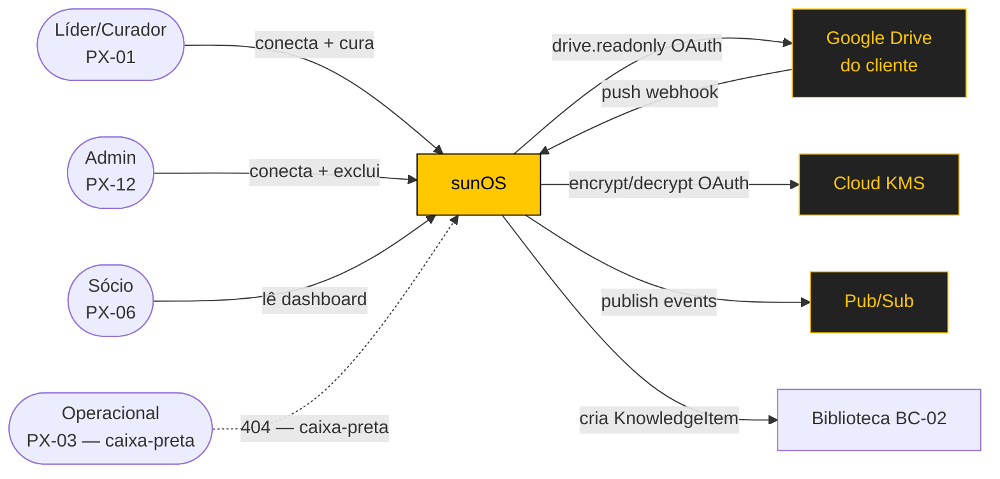
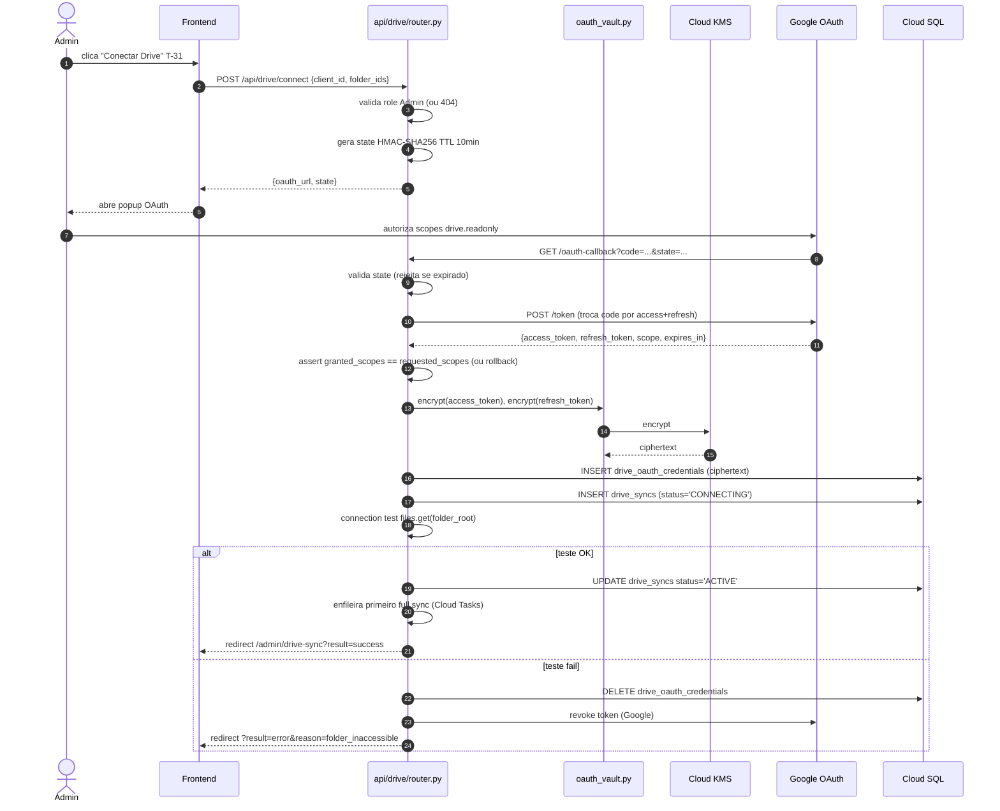
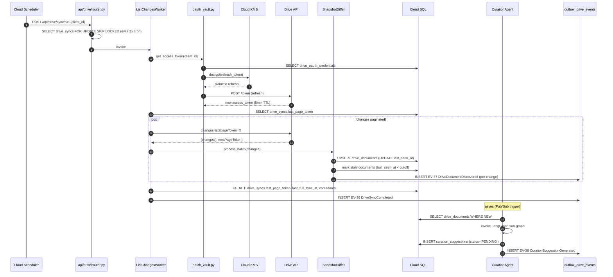
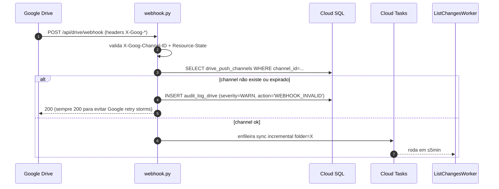
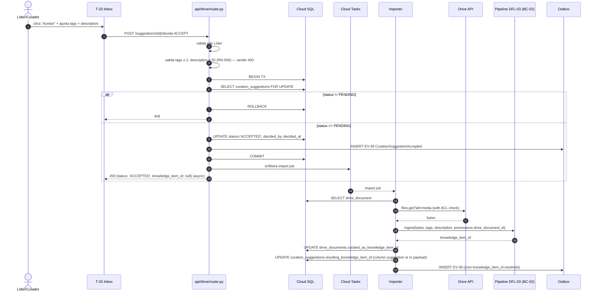
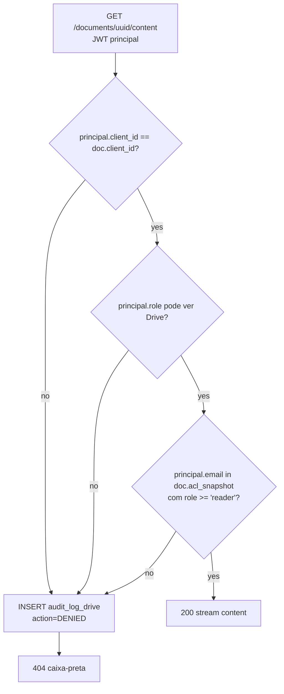

# Design — Drive Read-Only Curation (FA-14)

Este documento descreve a arquitetura, modelo de dados, fluxos sequenciais e decisões técnicas locais que materializam o `spec.md`. Serve como leitura prévia obrigatória do agente de codificação antes de qualquer task de `tasks.md`.

## 1. Arquitetura

### 1.1. Visão de Contexto (C4 Nível 1)



**Atores externos:**
- **Google Drive** (do cliente) — fonte de dados read-only.
- **Cloud KMS** — encrypt/decrypt OAuth tokens.
- **Pub/Sub** — publicação de eventos EV-35..41.
- **Biblioteca BC-02** — destino da ingestão (`KnowledgeItem`).

### 1.2. Visão de Containers (C4 Nível 2 — recorte FA-14 do CTM-09)

```mermaid
flowchart TB
    subgraph Frontend["Next.js 14 (CT-01)"]
        T31[T-31 Connect Modal]
        T32[T-32 Sync Dashboard]
        T33[T-33 Suggestions Inbox]
        ADMIN[Admin Exclusions]
    end

    subgraph Backend["FastAPI (CTM-09 Drive Connector)"]
        Router[api/drive/router.py]
        OAuth[OAuth Flow + Vault]
        Sync[Sync Engine]
        Webhook[Webhook Receiver]
        Curation[CurationAgent]
        Cleanup[Cleanup Job]
        Importer[Importer]
        Guard[AccessGuard]
        Outbox[Outbox Worker]
    end

    subgraph DataStores["Cloud SQL (CT-03)"]
        DOC[(drive_oauth_credentials)]
        DSY[(drive_syncs)]
        DDC[(drive_documents)]
        DCS[(curation_suggestions)]
        DCR[(drive_cleanup_reports)]
        OUT[(outbox_drive_events)]
        AUD[(audit_log_drive)]
    end

    subgraph External
        DriveAPI[Google Drive API v3]
        DrivePush[Drive Push]
        KMSx[Cloud KMS]
        Scheduler[Cloud Scheduler]
        Tasks[Cloud Tasks]
        PubSub2[Pub/Sub topic<br/>sunos.drive.events]
        BC02x[Biblioteca BC-02 API]
    end

    T31 -->|POST /connect| Router
    T32 -->|GET /sync-state| Router
    T33 -->|GET /suggestions, POST /decide| Router
    ADMIN -->|DELETE /oauth| Router

    Router --> OAuth & Sync & Curation & Cleanup & Importer & Guard
    Sync --> DriveAPI
    Sync --> DDC & DSY
    Webhook -->|on push| Sync
    DrivePush --> Webhook

    OAuth --> KMSx & DOC
    Sync --> KMSx
    Curation --> DCS
    Cleanup --> DDC & DCR
    Importer --> DriveAPI
    Importer --> BC02x
    Importer --> DDC

    Scheduler -->|cron 15min| Router
    Scheduler -->|cron 0 6 * * 0| Cleanup
    Tasks --> Importer
    Tasks --> Sync

    Guard --> DDC

    Outbox --> OUT
    Outbox --> PubSub2
    Sync --> OUT
    Curation --> OUT
    Cleanup --> OUT

    Router --> AUD

    classDef new fill:#FFC801,stroke:#000,color:#000;
    classDef ext fill:#222,stroke:#FFC801,color:#FFC801;
    class Router,OAuth,Sync,Webhook,Curation,Cleanup,Importer,Guard,Outbox new
    class DriveAPI,DrivePush,KMSx,Scheduler,Tasks,PubSub2,BC02x ext
```



### 1.3. Visão de Componentes (C4 Nível 3 — Drive Connector interno)

Mapeamento entre os 8 componentes definidos no SRD Parte 6 §5.8 e seus módulos Python:

| Componente (CTM-09) | Módulo Python | Responsabilidade |
|---------------------|---------------|------------------|
| OAuthVault | `api/drive/oauth_vault.py` | Encrypt/decrypt OAuth via KMS; valida escopo `drive.readonly`; alerta `OAuthExpired` |
| WebhookReceiver | `api/drive/webhook.py` | Endpoint `/api/drive/webhook`; valida headers `X-Goog-*`; lookup channel→sync; enfileira sync incremental |
| ListChangesWorker | `api/drive/sync.py` (classe `ListChangesWorker`) | Drive `changes.list` paginated; persiste `last_page_token`; respeita scope readonly |
| SnapshotDiffer | `api/drive/differ.py` | Diff snapshot local vs. Drive listagem; UPSERT/stale; emite `DriveDocumentDiscovered` |
| CurationAgent | `api/drive/curation_agent.py` | LangGraph sub-graph; gera `CurationSuggestion` (sempre PENDING — RN-029); RBAC-aware tools |
| CleanupJob | `api/drive/cleanup.py` | Cron domingo 06:00; produz `DriveCleanupReport` (apenas relatório) |
| Importer | `api/drive/importer.py` | Aceitar `IMPORT_TO_LIBRARY` → fetch content → pipeline DFL-03 → `KnowledgeItem` com provenance |
| AccessGuard | `api/drive/access_guard.py` | Filtra `acl_snapshot ∩ RBAC` antes de devolver `DriveDocument`; 404 default deny |

Adicionais não listados em CTM-09 mas necessários:
- `api/drive/sdk_wrapper.py` — adapter Google Drive API que **só expõe métodos read**. Implementação detalhada em §1.3.1.
- `api/drive/kms.py` — wrapper Cloud KMS encrypt/decrypt.
- `api/drive/events.py` — publisher de EV-35..41 via outbox pattern.
- `api/drive/router.py` — FastAPI router para API-140..150.
- `api/drive/schemas.py` — Pydantic SCH-016/017 + DriveSyncState + OAuthRevokeRequest.
- `api/drive/models.py` — SQLAlchemy models para ENT-39..43 + outbox + audit.

#### 1.3.1. SDK Wrapper — somente read

```python
# api/drive/sdk_wrapper.py (esquemático)
from google.oauth2.credentials import Credentials
from googleapiclient.discovery import build

ALLOWED_SCOPES = frozenset({
    'https://www.googleapis.com/auth/drive.readonly',
    'https://www.googleapis.com/auth/drive.metadata.readonly',
})

class DriveReadOnlyClient:
    """Wrapper que SÓ expõe métodos read. Tentativa de write falha em runtime."""

    def __init__(self, credentials: Credentials):
        # Valida scopes ANTES de instanciar service.
        granted = frozenset(credentials.scopes or [])
        if not granted.issubset(ALLOWED_SCOPES):
            raise WriteNotPermittedError(
                f"Scopes inválidos: {granted - ALLOWED_SCOPES}. "
                f"Apenas {ALLOWED_SCOPES} permitidos (RN-027)."
            )
        self._service = build('drive', 'v3', credentials=credentials)

    def list_changes(self, page_token: str, page_size: int = 100):
        return self._service.changes().list(
            pageToken=page_token, pageSize=page_size,
            fields="nextPageToken,changes(fileId,removed,file(id,name,mimeType,parents,modifiedTime,owners,permissions))",
        ).execute()

    def get_file_metadata(self, file_id: str):
        return self._service.files().get(
            fileId=file_id,
            fields="id,name,mimeType,parents,modifiedTime,size,permissions",
        ).execute()

    def download_content(self, file_id: str) -> bytes:
        request = self._service.files().get_media(fileId=file_id)
        # Stream + retorna bytes (truncar se > 100MB conforme política).
        ...

    def get_start_page_token(self):
        return self._service.changes().getStartPageToken().execute()

    def watch_folder(self, file_id: str, channel_id: str, address: str):
        """Registra Drive Push channel. Aceita apenas porque watch não é write — é subscription."""
        return self._service.files().watch(
            fileId=file_id,
            body={"id": channel_id, "type": "web_hook", "address": address, "expiration": ...},
        ).execute()

    # NÃO expõe: files().create, files().update, files().delete, files().copy,
    # permissions().create, permissions().update, permissions().delete.
    # Code review + lint (TODO-DESIGN-B) bloqueia commits que tentem expor.
```

**Teste de regressão obrigatório (TASK-A09):**
```python
def test_wrapper_blocks_write_methods():
    client = DriveReadOnlyClient(creds_with_readonly_scopes)
    assert not hasattr(client, 'create_file')
    assert not hasattr(client, 'update_file')
    # Tentativa de acesso direto ao service interno também é bloqueada via __slots__.
```

## 2. Modelo de Dados

### 2.1. Tabelas (referência ao SRD Parte 3)

Tabelas definidas em `docs/srd/parte3-data-model-erd.md` §ENT-39..43. Não duplicar DDL aqui — referenciar.

- **ENT-39** `drive_oauth_credentials` — tokens encriptados via KMS. PK `credential_id`. Único por `client_id`.
- **ENT-40** `drive_syncs` — estado do sync. PK `sync_id`. FK `client_id`, `credential_id`. Status enum.
- **ENT-41** `drive_documents` — snapshot Drive metadata + ACL + `content_hash`. PK `document_id`. FK `sync_id`, `client_id`.
- **ENT-42** `curation_suggestions` — sugestões. PK `suggestion_id`. FK `document_id`, `client_id`. Status enum.
- **ENT-43** `drive_cleanup_reports` — relatórios. PK `report_id`. FK `sync_id`, `client_id`.

### 2.2. Tabelas Adicionais (criadas nesta SPEC)

#### `outbox_drive_events`

Mesmo pattern da SPEC-004. Garante atomicidade DB↔Pub/Sub.

```sql
CREATE TABLE outbox_drive_events (
    outbox_id   UUID PRIMARY KEY DEFAULT gen_random_uuid(),
    event_id    TEXT NOT NULL UNIQUE, -- hash(sync_id + event_type + minute)
    event_type  TEXT NOT NULL,        -- 'DriveSyncStarted', 'CurationSuggestionGenerated', etc.
    event_version TEXT NOT NULL DEFAULT 'v1',
    occurred_at TIMESTAMPTZ NOT NULL DEFAULT now(),
    client_id   UUID NOT NULL,
    sync_id     UUID,                 -- pode ser NULL para OAuthExpired (sem sync ainda ativo)
    payload     JSONB NOT NULL,
    published_at TIMESTAMPTZ,         -- NULL = pendente; non-NULL = publicado
    publish_attempts INTEGER NOT NULL DEFAULT 0,
    last_publish_error TEXT
);

CREATE INDEX idx_outbox_drive_pending
    ON outbox_drive_events (occurred_at)
    WHERE published_at IS NULL;
```

#### `audit_log_drive`

Append-only. Trigger PG bloqueia UPDATE/DELETE.

```sql
CREATE TABLE audit_log_drive (
    log_id      UUID PRIMARY KEY DEFAULT gen_random_uuid(),
    occurred_at TIMESTAMPTZ NOT NULL DEFAULT now(),
    client_id   UUID NOT NULL,
    sync_id     UUID,
    actor_id    UUID,                 -- principal.user_id se houver
    actor_role  TEXT,                 -- 'Admin', 'Líder', 'Service Account'
    action      TEXT NOT NULL,        -- 'CONNECT', 'SYNC_RUN', 'WRITE_ATTEMPT_BLOCKED', 'DECIDE_SUGGESTION', 'REVOKE'
    endpoint    TEXT,                 -- ex: 'files.list', 'POST /api/drive/connect'
    result      TEXT NOT NULL,        -- 'OK', 'ERROR', 'BLOCKED', 'DENIED'
    severity    TEXT NOT NULL DEFAULT 'INFO',  -- 'INFO', 'WARN', 'CRITICAL'
    latency_ms  INTEGER,
    details     JSONB                 -- contexto, sem PII (emails mascarados)
);

CREATE INDEX idx_audit_log_drive_client_time ON audit_log_drive (client_id, occurred_at DESC);
CREATE INDEX idx_audit_log_drive_severity ON audit_log_drive (severity, occurred_at DESC);

-- Imutabilidade
CREATE OR REPLACE FUNCTION reject_audit_drive_mutation()
RETURNS TRIGGER AS $$
BEGIN
    RAISE EXCEPTION 'audit_log_drive é append-only — UPDATE/DELETE proibido';
END;
$$ LANGUAGE plpgsql;

CREATE TRIGGER trg_audit_drive_immutable
    BEFORE UPDATE OR DELETE ON audit_log_drive
    FOR EACH ROW EXECUTE FUNCTION reject_audit_drive_mutation();
```

### 2.3. Triggers de imutabilidade

#### `drive_oauth_credentials.access_token` / `refresh_token` — proteção contra plaintext leak

```sql
-- Função verifica que token armazenado é ciphertext (heurística: começa com prefixo KMS-aware).
CREATE OR REPLACE FUNCTION enforce_token_ciphertext()
RETURNS TRIGGER AS $$
BEGIN
    IF NEW.access_token IS NOT NULL AND NEW.access_token NOT LIKE 'CiQ%' THEN
        -- 'CiQ' é prefixo base64 típico de output KMS encrypt; heurística defensiva.
        RAISE EXCEPTION 'access_token não parece estar encriptado (prefixo inesperado)';
    END IF;
    IF NEW.refresh_token IS NOT NULL AND NEW.refresh_token NOT LIKE 'CiQ%' THEN
        RAISE EXCEPTION 'refresh_token não parece estar encriptado';
    END IF;
    RETURN NEW;
END;
$$ LANGUAGE plpgsql;

CREATE TRIGGER trg_token_ciphertext
    BEFORE INSERT OR UPDATE ON drive_oauth_credentials
    FOR EACH ROW EXECUTE FUNCTION enforce_token_ciphertext();
```

#### `drive_oauth_credentials` cascade hard delete on `revoked_at`

```sql
CREATE OR REPLACE FUNCTION cascade_revoke_drive()
RETURNS TRIGGER AS $$
BEGIN
    IF OLD.revoked_at IS NULL AND NEW.revoked_at IS NOT NULL THEN
        UPDATE drive_syncs SET status = 'REVOKED' WHERE credential_id = NEW.credential_id;
    END IF;
    RETURN NEW;
END;
$$ LANGUAGE plpgsql;

CREATE TRIGGER trg_revoke_cascade
    AFTER UPDATE OF revoked_at ON drive_oauth_credentials
    FOR EACH ROW EXECUTE FUNCTION cascade_revoke_drive();
```

### 2.4. Índices de query crítica

```sql
-- Fluxo: GET /sync-state (1 query por client)
CREATE INDEX idx_drive_syncs_client_status ON drive_syncs (client_id, status);

-- Fluxo: GET /documents (paginação por last_seen_at)
CREATE INDEX idx_drive_documents_client_seen
    ON drive_documents (client_id, last_seen_at DESC)
    WHERE marked_orphan_at IS NULL;

-- Fluxo: detecção de duplicatas (CleanupJob)
CREATE INDEX idx_drive_documents_hash ON drive_documents (client_id, content_hash);

-- Fluxo: GET /suggestions (filter por status + kind)
CREATE INDEX idx_curation_suggestions_inbox
    ON curation_suggestions (client_id, status, created_at DESC);

-- Fluxo: outbox worker (publica eventos pendentes)
-- (já criado em §2.2 como partial index)

-- Fluxo: auditoria por cliente em janela de tempo
-- (já criado em §2.2)
```

### 2.5. Política de retenção e LGPD

| Tabela | Retenção | Trigger |
|--------|----------|---------|
| `drive_oauth_credentials` | Até `revoked_at`; depois hard delete imediato | Trigger no UPDATE de `revoked_at` |
| `drive_documents` | Até `revoked_at` do sync OU `last_seen_at > 30d` | Cleanup job diário |
| `curation_suggestions` | Indefinida (mantém histórico de decisão); apaga em cascade quando cliente revoked | Cascade ON DELETE de drive_syncs (definido na FK) |
| `drive_cleanup_reports` | 1 ano (auditoria); apagado em cascade quando cliente revoked | Cascade |
| `outbox_drive_events` | 30 dias após `published_at IS NOT NULL` | Job diário de housekeeping |
| `audit_log_drive` | 5 anos (compliance LGPD); append-only | (sem trigger automático) |

## 3. Fluxos Sequenciais

### 3.1. OAuth flow (DFL-09 setup)



### 3.2. Sync incremental (DFL-09 cron)



### 3.3. Webhook reactive



### 3.4. Aceitar suggestion `IMPORT_TO_LIBRARY` (DFL-09 import)



### 3.5. AccessGuard fluxo de autorização



<!-- REVIEW: Os 5 fluxos sequenciais cobrem os caminhos críticos? Falta diagrama para CleanupJob ou Exclusão de cliente? -->

## 4. Frontend Architecture

### 4.1. Páginas e roteamento

| Rota | Tela | Persona | Server/Client | Componente principal |
|------|------|---------|---------------|----------------------|
| `/admin/drive-sync` | Lista de syncs por cliente (admin global) | Admin | Server Component | `DriveSyncList` |
| `/admin/drive-sync/connect` | T-31 modal connect | Admin/Líder | Client (interatividade) | `ConnectDriveModal` |
| `/admin/drive-sync/exclusions` | Gestão de exclusões LGPD | Admin | Client (forms) | `ExclusionsManager` |
| `/drive/[clientSlug]` | T-32 Sync Dashboard | Líder, Sócio (read-only), Admin | Server Component (dados estáticos) + Client (polling) | `SyncDashboard` |
| `/drive/[clientSlug]/sugestoes` | T-33 Suggestions Inbox | Líder, Curador | Client (decisões) | `SuggestionInbox` |
| `/drive/[clientSlug]/relatorios` | Lista de Cleanup Reports | Líder | Server Component | `CleanupReportList` |

### 4.2. Componentes-chave

```
components/drive/
├── ConnectDriveModal.tsx         # T-31; OAuth popup launcher
├── ReadonlyBadge.tsx             # 🔒 drive.readonly — sempre visível em T-32
├── SyncDashboard.tsx             # T-32 wrapper
│   ├── SyncStatusIndicator.tsx   # Verde/Amarelo/Vermelho
│   ├── MetricsCard.tsx           # discovered/indexed/curated tween animado
│   ├── OAuthStatusCard.tsx       # token expira em N dias + Reconectar
│   ├── ExclusionsCard.tsx        # lista clientes excluídos
│   └── ForceSyncButton.tsx       # admin only
├── SuggestionInbox.tsx           # T-33 wrapper
│   ├── SuggestionFilter.tsx      # por kind, confidence
│   ├── SuggestionCard.tsx
│   │   ├── ConfidenceBadge.tsx   # 0–1 colored
│   │   ├── RationaleDisclosure.tsx # collapsible
│   │   └── DecisionButtons.tsx   # Aceitar / Rejeitar / Adiar
│   └── PreviewModal.tsx          # fetch on-demand API-146
├── CleanupReportList.tsx
└── ExclusionsManager.tsx
```

### 4.3. State management

- **`DriveContext`** (`contexts/DriveContext.tsx`) — estado de sync por cliente: `{[clientId]: DriveSyncState}`. Atualizado via polling 30s no `useDriveSyncPolling`.
- **`useDriveSyncPolling(clientId, enabled)`** hook — `setInterval` 30s; `clearInterval` em unmount; pausa quando aba não-visível (`document.hidden`).
- **`useCurationSuggestions(clientId, filters)`** hook — fetch + paginação cursor; mutations otimistas para `decide`.

### 4.4. Tipos compartilhados (TypeScript em `lib/drive-types.ts`)

```ts
export type DriveSyncStatus =
  | 'CONNECTING' | 'ACTIVE' | 'PAUSED' | 'OAUTH_EXPIRED' | 'ERROR' | 'REVOKED';

export type SuggestionKind =
  | 'IMPORT_TO_LIBRARY' | 'TAG' | 'MERGE_WITH' | 'MARK_DUPLICATE' | 'MARK_OUTDATED';

export type SuggestionStatus = 'PENDING' | 'ACCEPTED' | 'REJECTED' | 'STALE';

export interface DriveSyncState {
  syncId: string;
  clientId: string;
  status: DriveSyncStatus;
  lastFullSyncAt: string | null;
  lastWebhookEventAt: string | null;
  nextScheduledSyncAt: string | null;
  documentsTotal: number;
  documentsIndexed: number;
  documentsCurated: number;
  driveWriteAttemptsTotal: number; // deve ser 0
  errorMessage: string | null;
}

export interface DriveDocument {
  documentId: string;
  driveFileId: string;
  name: string;
  mimeType: string;
  sizeBytes: number;
  lastSeenAt: string;
  curatedAsKnowledgeItemId: string | null;
}

export interface CurationSuggestion {
  suggestionId: string;
  document: { documentId: string; name: string; mimeType: string };
  kind: SuggestionKind;
  payload: Record<string, unknown>;
  confidence: number; // 0..1
  rationale: string;
  status: SuggestionStatus;
  decidedBy: string | null;
  decidedAt: string | null;
  createdAt: string;
}

export interface DecideRequest {
  decision: 'ACCEPT' | 'REJECT' | 'DEFER';
  overrideTags?: string[];
  description?: string;
  reason?: string;
}

export interface CleanupReportSummary {
  reportId: string;
  periodStart: string;
  periodEnd: string;
  duplicatesFound: number;
  orphansFound: number;
  candidatesToArchive: number;
  namingInconsistencies: number;
  generatedAt: string;
}
```

## 5. Decisões Locais desta SPEC (ADR-LOCAL-XX)

São decisões que valem somente para esta SPEC e não merecem subir para o catálogo principal de ADRs. Cada uma documenta alternativas e racional.

### ADR-LOCAL-01 — Outbox pattern para publicação atômica de eventos

**Status:** Aceito (mesmo pattern de SPEC-004 ADR-LOCAL-01).

**Contexto:** Mudança em `drive_documents` ou `curation_suggestions` deve emitir EV-37/38/39 atomicamente. Publicar direto a Pub/Sub dentro da transação cria risco de inconsistência (DB commit ok, Pub/Sub falha — ou vice-versa).

**Decisão:** INSERT em `outbox_drive_events` dentro da mesma transação. Worker dedicado (`OutboxWorker`) lê pending events e publica em Pub/Sub. Em caso de falha de publish, retry com backoff; idempotência por `event_id`.

**Alternativas:**
- Publish direto no commit hook do SQLAlchemy — rejeitado (menos visível, menos auditável).
- Two-phase commit XA — rejeitado (complexidade desnecessária; Cloud SQL não suporta XA com Pub/Sub).

**Consequências:** ✅ atomicidade garantida. ⚠️ latência de evento +5–30s (lag do worker).

### ADR-LOCAL-02 — Cron sync 15min default; webhook para pastas críticas

**Status:** Aceito.

**Contexto:** RN-030 fala em "lag ≤ 24h geral, ≤ 5min crítico". Trade-off: cron muito frequente esgota quota Drive API; cron raro deixa lag alto.

**Decisão:**
- Cron default: **15min** (`*/15 * * * *`) por cliente.
- Pastas críticas (flag `critical=true`): registram Drive Push channel; webhook dispara sync imediato (≤5min P95).
- Cron full pass: 24h (uma vez por dia), valida que não há documentos perdidos vs. snapshot.

**Alternativas:**
- 5min default sem webhook — rejeitado (esgota quota; piora pastas regulares sem ganho real para críticas).
- 1h default com webhook — rejeitado (lag muito alto para pastas regulares; usuários ficam frustrados).
- Sem webhook (só cron) — rejeitado (não atinge SLA crítico de 5min).

**Consequências:** ✅ atinge ambos SLAs. ⚠️ requer `drive_push_channels` table + renewal job. ⚠️ 96 cron runs/dia/cliente = ~96 chamadas `changes.list` mínimas.

### ADR-LOCAL-03 — `content_hash` SHA256 com truncate em arquivos > 100MB

**Status:** Aceito.

**Contexto:** Detecção de duplicatas exige hash determinístico do conteúdo. Arquivos grandes (vídeos, PDFs com imagens) podem chegar a GB, fazendo hashing custoso.

**Decisão:**
- Hash padrão: SHA256 do bytes completo.
- Para arquivos > 100MB: hash dos primeiros 10MB com sufixo `:truncated:<size_bytes>`.
- Detecção de duplicata exige hash idêntico **E** `size_bytes` idêntico para arquivos truncados (defense-in-depth contra colisão).

**Alternativas:**
- xxhash (mais rápido) — rejeitado (não é cryptographic; aumenta risco teórico de colisão).
- MD5 — rejeitado (deprecated; mesma performance que SHA256 em hardware moderno).
- Hash do nome+size apenas — rejeitado (renomes legítimos quebram dedup).

**Consequências:** ✅ dedup funciona para arquivos < 100MB e para arquivos grandes com mesmo nome+size. ⚠️ arquivos grandes editados nos últimos bytes podem aparecer como duplicata falsa — risco aceito (mitigação: `mime_type` + `modified_time` confirmam).

### ADR-LOCAL-04 — KMS key per environment (não per client)

**Status:** Aceito.

**Contexto:** TODO-DT-10 do SRD pergunta key per environment vs. key per cliente para `drive_oauth_credentials`.

**Decisão:** **Key per environment** (`projects/sunos-prod/keyrings/sunos/keys/drive-oauth`). Todos os clientes compartilham a mesma key.

**Alternativas:**
- Key per cliente — rejeitado: 50+ clientes = 50+ keys no KMS = overhead operacional + custo significativo (cada key tem custo mensal). Granularidade não justificada — encryption per-row já protege em DB compromise; key per cliente só protege contra "key holder rouba decrypt rights de UM cliente", cenário improvável dado IAM bem configurado.
- Key per BU (área Suno) — rejeitado: similar overhead sem benefício claro.

**Consequências:** ✅ operacional simples; KMS billable por key/mês. ⚠️ rotação de key afeta todos os clientes simultaneamente — exige migration ritual (re-encrypt all rows) — TODO-DESIGN-C.

### ADR-LOCAL-05 — CurationAgent em LangGraph nativo, compatível com `deepagents` (ADR-011)

**Status:** Aceito.

**Contexto:** ADR-011 propõe `deepagents` como harness para BC-07 CurationAgent (status Proposto). Implementar agora em LangGraph nativo permite entregar Piloto sem bloquear na PoC do `deepagents`.

**Decisão:** Implementação inicial em LangGraph nativo seguindo padrão estabelecido em `api/chat/`. Tools definidas como `BaseTool`-shaped e RBAC-aware. Orquestração interna isolada em `curation_agent.py` para troca atômica quando ADR-011 sair Aceito.

**Alternativas:**
- Esperar ADR-011 sair Aceito — rejeitado (bloqueia Piloto por meses).
- Implementar `deepagents` em risco — rejeitado (ADR-011 ainda Proposto; PoC obrigatório antes).

**Consequências:** ✅ entrega não-bloqueada. ⚠️ refactor isolado quando ADR-011 sair Aceito (≤2 dias estimado).

### ADR-LOCAL-06 — Drive Push channel renewal automático a cada 6 dias

**Status:** Aceito.

**Contexto:** Google Drive Push channels expiram em 7 dias (default). Renewal manual cliente a cliente é frágil.

**Decisão:** Job dedicado `drive-channel-renewal` roda diariamente. Para cada channel com expiração em < 24h, chama `files.watch` com novo `channel_id` e atualiza `drive_push_channels.channel_id` + `expires_at`. Renewal a cada 6 dias garante margem de segurança.

**Alternativas:**
- Renewal apenas quando channel expira (lazy) — rejeitado: gap entre expiração e detecção pode ser > 5min, violando SLA.
- Renewal cada 24h (sempre) — rejeitado: esgota quota desnecessariamente.

**Consequências:** ✅ webhook continuamente disponível. ⚠️ requer estabilidade do cron de renewal (monitorar).

<!-- REVIEW: 6 ADR-LOCAL cobrem as decisões não-triviais? Falta ADR sobre algum trade-off importante (ex: mime_type filter list, kind de suggestion adicional, idioma do CurationAgent)? -->

## 6. Estratégia de Testes

| Nível | Escopo | Framework | Cobertura alvo |
|-------|--------|-----------|----------------|
| Unitário | `oauth_vault`, `kms`, `differ`, `access_guard`, `cleanup` | pytest | 80%+ |
| Unitário (regressão segurança) | `sdk_wrapper` — assert que métodos write não existem; assert que tentativa de write falha antes de HTTP | pytest | 100% |
| Integração — DB | Migrations (Alembic up/down); triggers (audit imutável; cascade revoke); índices | pytest + testcontainers PostgreSQL | Fluxos críticos |
| Integração — API | API-140..150 com httpx + Pub/Sub emulator + Drive API mock (responses VCR) | pytest + pytest-asyncio | Caminho feliz + 4xx + caixa-preta |
| Integração — KMS | Encrypt/decrypt round-trip com KMS emulator | pytest | 100% |
| Integração — Sync | Mock Drive API com fixtures de `changes.list`; valida UPSERT + stale + outbox events | pytest | Fluxo Sync |
| Contrato — Pub/Sub | Schema validation contra subscribers (Measurement Service) | pytest + Pub/Sub emulator | EV-35..41 |
| E2E (staging) | OAuth flow real → sync → suggestion → import → KnowledgeItem | Playwright | T-31 + T-32 + T-33 fluxos |
| Carga | 1000 changes em batch sync; 100 suggestions concurrent decide | locust | NFR-001/006 |
| Segurança | RBAC matrix (4 roles × 11 endpoints) — 44 cenários | pytest | 100% |
| Acessibilidade | T-32 e T-33 — keyboard nav, ARIA, prefers-reduced-motion | axe-core | Axe AA |

## 7. Observabilidade

### 7.1. Tracing (MLflow)

Decorator `@mlflow.trace` em:
- `OAuthVault.get_access_token` (latência decrypt)
- `ListChangesWorker.run` (latência sync; tag `client_id`, `sync_id`, `pages_count`)
- `SnapshotDiffer.process_batch` (tag `documents_added`, `documents_marked_orphan`)
- `CurationAgent.invoke` (tag `client_id`, `sync_id`, `document_id`, `kind`, `confidence`)
- `Importer.run` (tag `suggestion_id`, `document_id`, `knowledge_item_id`)
- `CleanupJob.run` (tag `client_id`, `report_id`, `duplicates_found`, `orphans_found`)
- `AccessGuard.can_read` (tag `decision`, `reason`)

### 7.2. Métricas (Prometheus / Cloud Monitoring)

| Métrica | Tipo | Tags | Alvo |
|---------|------|------|------|
| `drive_sync_runs_total` | Counter | client_id, status | — |
| `drive_sync_duration_seconds` | Histogram | client_id | p95 ≤ 60 |
| `drive_sync_lag_seconds` | Gauge | client_id, folder_critical | p95 ≤ 5min crítico, ≤ 24h geral |
| `drive_documents_indexed_total` | Counter | client_id | — |
| `drive_api_calls_total` | Counter | client_id, endpoint | < 70% quota Google |
| `drive_write_attempts_total` | Counter | client_id, blocker | **=0 em prod** |
| `drive_acl_intersection_denials_total` | Counter | client_id, reason | — (auditoria) |
| `curation_suggestions_pending_total` | Gauge | client_id, kind | — |
| `curation_agent_latency_seconds` | Histogram | client_id, kind | p95 ≤ 8 |
| `outbox_drive_events_pending` | Gauge | event_type | — |
| `kms_decrypt_latency_seconds` | Histogram | — | p95 ≤ 100ms |

### 7.3. Logs estruturados

Formato JSON com campos canônicos:
```json
{
  "ts": "...", "level": "INFO|WARN|CRITICAL",
  "module": "api.drive.sync", "client_id": "...",
  "sync_id": "...", "request_id": "...",
  "msg": "..."
}
```

Tokens **sempre mascarados** como `***REDACTED***`. Emails em logs (não em audit_log_drive) mascarados como `***@suno.ag` (preserva domínio).

### 7.4. Alertas

| Alerta | Condição | Severity | Destino |
|--------|----------|----------|---------|
| `DriveWriteAttemptBlocked` | `drive_write_attempts_total > 0` | CRITICAL | PagerDuty + Slack |
| `DriveSyncErrorPersistent` | `drive_syncs.status='ERROR'` por > 30min | HIGH | Slack |
| `DriveOAuthExpiringSoon` | token expira em < 7d | MEDIUM | Email líder |
| `DriveAPIQuotaApproaching` | `drive_api_calls_total > 70% quota` | MEDIUM | Slack |
| `OutboxDriveBacklog` | `outbox_drive_events_pending > 100` | HIGH | Slack |
| `ChannelRenewalFailed` | renewal falhou 3x consecutivos | MEDIUM | Slack |

## 8. Segurança

1. **OAuth scopes** — hard-coded em `oauth_vault.py`; teste de regressão se um literal de scope fora da whitelist aparecer no PR.
2. **KMS keys** — IAM rule: apenas o service account do backend (`sunos-drive-sa@...`) tem `encrypter` + `decrypter`. Audit logs de KMS habilitados.
3. **Drive Push validation** — verificar `X-Goog-Channel-ID` matches DB; rejeitar headers ausentes; sempre retornar 200 (evitar Google retry storms).
4. **Rate limiting endpoint público** — `/api/drive/webhook` aceita até 100 req/s per IP Google (quota standard); fora disso 429.
5. **PII** — emails em `acl_snapshot` apenas em DB. Logs mascaram. Audit log mascara. UI mostra `<email>@<dominio>` apenas para Líder/Curador/Admin (RBAC-gated component).
6. **Cross-client tests** — para cada endpoint, 1 teste que verifica acesso cross-client retorna 404 (não 403).
7. **Time-of-check-vs-time-of-use** em `AccessGuard` — `acl_snapshot` é checado por request; janela de risco até próximo sync (mitigada por NFR-002).

## 9. Dependências e Sequenciamento

### 9.1. Dependências externas (mesmo pattern de SPEC-004 §9.1)

- **Cloud SQL** com pgvector — assumido em produção.
- **Cloud KMS keyring** — verificar/provisionar em Fase A. Se ausente, Terraform/manual.
- **Cloud Scheduler** — 1 job por cliente; provisionado dinamicamente quando OAuth conecta.
- **Cloud Tasks** — fila para sync e import jobs.
- **Pub/Sub topic `sunos.drive.events`** — provisionar em Fase A com schema validation.
- **Domain restriction OAuth** — Google Cloud Project precisa ter OAuth consent screen configurado em modo "internal" (apenas org Suno) ou "external" com `verified` (V2).

### 9.2. Componentes que esta SPEC NÃO toca (importante)

- **CTM-01 Auth Gateway** — assume JWT funcionando; não modifica.
- **CTM-02 Knowledge & Skills** — pipeline DFL-03 reutilizado via API; não modifica.
- **CTM-08 Approval Engine** — Drive não usa hierarquia (curador decide direto). Sem dependência runtime.
- **BC-04 Provocation Engine** — sem relação direta.

## 10. Open Questions / TODOs

- **TODO-DESIGN-A** — modelo do CurationAgent: Gemini 2.5 Flash padrão; Sonnet híbrido para `MERGE_WITH` (heurística). Validar com PoC em Fase C; documentar resultado em LOG.md.
- **TODO-DESIGN-B** — lint custom: detectar PRs que tentam adicionar métodos write em `sdk_wrapper.py`. Considerar regra `ast` ou pre-commit hook.
- **TODO-DESIGN-C** — KMS key rotation runbook: re-encrypt all credentials. Estimativa 1h por 1k credentials (assume <100 credentials no MVP). Rotina anual.
- **TODO-DESIGN-D** — `STALE` transition job: cadência diária ou per-sync? Cadência diária é mais simples; per-sync detecta mais rápido. Default diária.
- **TODO-DESIGN-E** — purge index assíncrono em FR-178: Cloud Tasks job apaga `KnowledgeItem`s + chunks. Definir SLA do job (≤30min para até 10k items?). Validar com Eng.
- **TODO-DESIGN-F** — Drive Push channel storage: tabela dedicada `drive_push_channels (channel_id PK, sync_id FK, folder_id, expires_at)` ou JSONB em `drive_syncs`? Tabela dedicada é mais cara mas auditável. Default tabela dedicada.

## 11. Diagramas de estado e decisão (referências)

- FSM `DriveSync` — em §4.1 do `spec.md`.
- FSM `CurationSuggestion` — em §4.2 do `spec.md`.
- FSM `outbox_drive_events` — implícito: `pending → published` (sem retry separado; campo `publish_attempts++`).
- DFL-09 (canonical) — `docs/srd/parte4-data-flows-dfd.md` §4.9.

## 12. Changelog

| Versão | Data | Mudança |
|--------|------|---------|
| 1.0 | 2026-04-30 | Versão inicial — C4 L1/L2/L3, mapeamento dos 8 componentes do CTM-09 + 6 módulos auxiliares, DDL outbox+audit+triggers, índices críticos, política LGPD, 5 fluxos sequenciais Mermaid, 6 ADR-LOCAL, estratégia testes 11 níveis, observabilidade (5 traces + 11 métricas + 6 alertas), 6 TODOs design |
