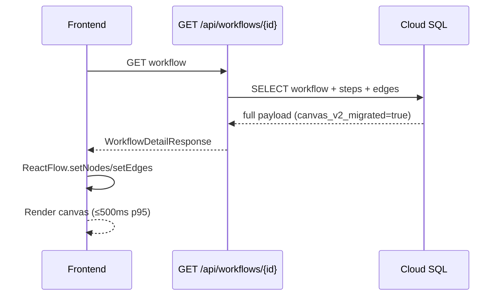
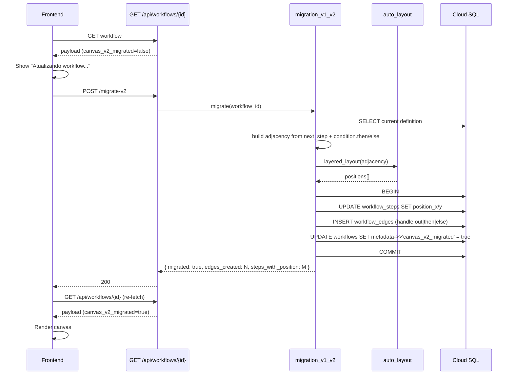
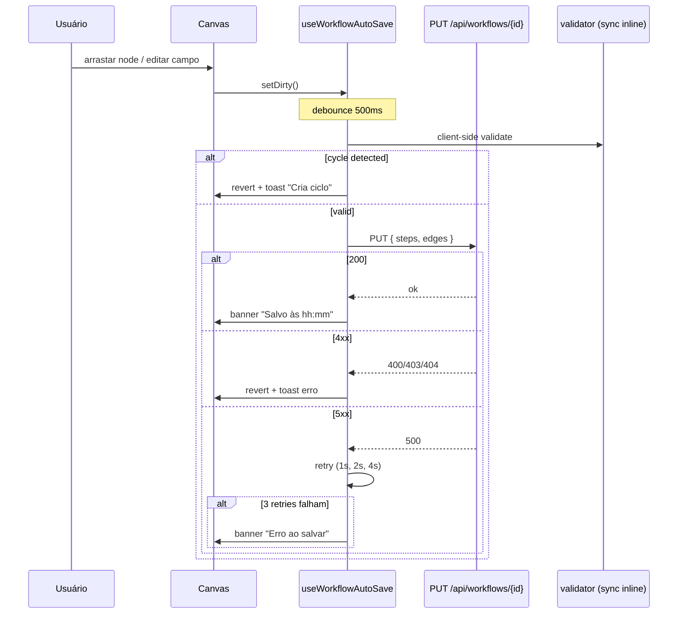
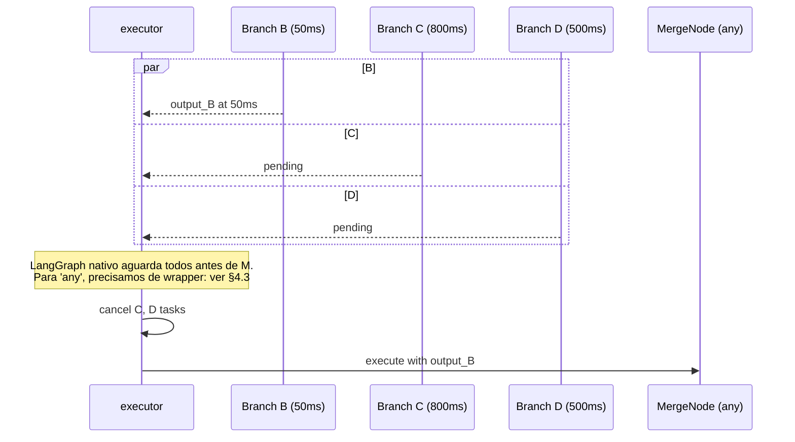

# Design — Workflow Builder Canvas (SPEC-005)

Pré-requisito: `constitution.md` + `spec.md` desta SPEC. Este documento responde "como construir" sem entrar em granularidade de tasks.

## 1. Arquitetura

### 1.1. Visão de Contexto (C4 Nível 1)

```
                    ┌────────────────────────────┐
   PX-01 Líder ────►│  sunOS Frontend (Next.js)  │◄──── PX-03 Operacional
                    │  /workflows/[id]            │
                    │  Canvas (React Flow lazy)   │
                    └─────────┬──────────────────┘
                              │ HTTPS + JWT
                              ▼
                    ┌────────────────────────────┐
                    │  sunOS Backend (api/)       │
                    │  ├─ Auth Gateway (CTM-01)   │
                    │  ├─ Workflow Engine (CTM-02)│
                    │  │   ├─ router (existente)   │
                    │  │   ├─ compiler (estendido) │
                    │  │   ├─ executor (estendido) │
                    │  │   ├─ scheduler (igual)    │
                    │  │   ├─ edges.py (NOVO)      │
                    │  │   ├─ auto_layout.py (NOVO)│
                    │  │   ├─ validator.py (NOVO)  │
                    │  │   └─ migration_v1_v2.py   │
                    │  └─ ...                       │
                    └─────────┬─────────┬──────────┘
                              │         │
                       ┌──────▼──┐  ┌───▼────────┐
                       │ Cloud   │  │ MLflow      │
                       │ SQL     │  │ tracing     │
                       │ (PG)    │  └─────────────┘
                       └─────────┘
                              │
                       Cloud Scheduler (existente, sem mudança)
```

### 1.2. Visão de Containers (C4 Nível 2)

```
┌──────────────────────────── Frontend ──────────────────────────────┐
│                                                                     │
│  app/workflows/                                                     │
│  ├── page.tsx                       (T-20: catálogo, sem mudança)  │
│  ├── new/page.tsx                   (T-22: novo, agora abre canvas)│
│  ├── [workflowId]/                                                  │
│  │   ├── page.tsx                   (T-21: canvas — REWRITE)        │
│  │   └── runs/                      (T-23, sem mudança)            │
│                                                                     │
│  components/workflows/                                              │
│  ├── WorkflowBuilder.tsx            (DEPRECATED — remove na fase E)│
│  ├── WorkflowStepEditor.tsx         (movido p/ NodeConfigDrawer)   │
│  ├── canvas/                        (NOVO)                          │
│  │   ├── WorkflowCanvas.tsx         (raiz React Flow)              │
│  │   ├── nodes/                                                     │
│  │   │   ├── ToolNode.tsx                                           │
│  │   │   ├── LLMNode.tsx                                            │
│  │   │   ├── ConditionNode.tsx                                      │
│  │   │   ├── ActionNode.tsx                                         │
│  │   │   ├── HITLNode.tsx                                           │
│  │   │   ├── SubWorkflowNode.tsx                                    │
│  │   │   └── MergeNode.tsx          (NOVO step type)               │
│  │   ├── edges/                                                     │
│  │   │   └── CustomEdge.tsx         (cores por handle)             │
│  │   ├── panels/                                                    │
│  │   │   ├── NodePalette.tsx        (sidebar drag source)          │
│  │   │   ├── NodeConfigDrawer.tsx   (substitui modal editor)       │
│  │   │   └── CanvasToolbar.tsx      (zoom/fit/layout/validate)     │
│  │   └── hooks/                                                     │
│  │       ├── useWorkflowGraph.ts    (sync canvas ↔ DB, debounce)   │
│  │       ├── useAutoLayout.ts       (dagre wrapper)                │
│  │       └── useGraphValidation.ts  (DFS local — ciclos)           │
│                                                                     │
│  lib/                                                               │
│  ├── workflow-types.ts              (estendido: edges, position)   │
│  └── api.ts                         (extensão: edges/layout/validate)│
│                                                                     │
│  hooks/                                                             │
│  └── useWorkflowAutoSave.ts         (debounce 500ms + retry)       │
│                                                                     │
│  contexts/WorkflowsContext.tsx      (sem mudança)                  │
└─────────────────────────────────────────────────────────────────────┘

┌──────────────────────────── Backend ───────────────────────────────┐
│                                                                     │
│  api/workflows/                                                     │
│  ├── router.py                  (estendido: edges/layout/validate)  │
│  ├── schemas.py                  (WorkflowEdge, WorkflowStepV2,     │
│  │                                ValidationError)                  │
│  ├── compiler.py                 (lê edges OU fallback v1)          │
│  ├── executor.py                 (asyncio.gather + asyncio.wait)    │
│  ├── edges.py                    (NOVO: CRUD edges)                 │
│  ├── auto_layout.py              (NOVO: layered layout em Python)   │
│  ├── validator.py                (NOVO: cycle detection + checks)   │
│  ├── migration_v1_v2.py          (NOVO: server-side JIT migration)  │
│  ├── scheduler.py                (sem mudança)                      │
│  └── models.py                   (estendido: WorkflowEdge ORM)      │
│                                                                     │
│  api/migrations/versions/                                           │
│  └── 2026XXXX_workflow_canvas_v2.py    (Alembic)                   │
│                                                                     │
│  api/scripts/                                                       │
│  └── migrate_workflows_v1_to_v2.py     (one-shot CLI)              │
└─────────────────────────────────────────────────────────────────────┘
```

### 1.3. Componentes do Workflow Engine (estendido)

| Componente | Arquivo | Responsabilidade |
|------------|---------|------------------|
| Router | `router.py` (estendido) | Endpoints existentes + 4 novos (edges, layout, validate, migrate-v2) |
| Schemas | `schemas.py` (estendido) | + `WorkflowEdge`, `WorkflowStepV2`, `ValidationError` |
| Compiler | `compiler.py` (estendido) | Lê edges quando presentes; fallback `next_step`/`condition.then/else` para retrocompat 1 release |
| Executor | `executor.py` (estendido) | Já usa LangGraph compile; ganha lógica de fan-out/merge via `add_edge` múltiplo + `merge_policy` |
| EdgesService | `edges.py` (NOVO) | CRUD bulk de edges com validação |
| AutoLayoutService | `auto_layout.py` (NOVO) | Layered layout em Python puro (~100 LoC, determinístico) |
| Validator | `validator.py` (NOVO) | DFS para ciclo + checagem de fan-in sem merge + handle válido |
| MigrationV1V2 | `migration_v1_v2.py` (NOVO) | Idempotente; cria edges + popula coordenadas; flag em metadata |
| Scheduler | `scheduler.py` (sem mudança) | Cron via Cloud Scheduler |

## 2. Modelo de Dados

### 2.1. Schema novo

```sql
-- Migration 2026XXXX_workflow_canvas_v2.py

-- Adições em workflow_steps
ALTER TABLE workflow_steps ADD COLUMN position_x INT NOT NULL DEFAULT 0;
ALTER TABLE workflow_steps ADD COLUMN position_y INT NOT NULL DEFAULT 0;
ALTER TABLE workflow_steps ADD COLUMN merge_policy VARCHAR(10);  -- 'all'|'any'|null
ALTER TABLE workflow_steps ADD CONSTRAINT chk_merge_policy
  CHECK (
    (type = 'merge' AND merge_policy IN ('all','any'))
    OR (type != 'merge' AND merge_policy IS NULL)
  );

-- Adição em workflows (suporta banner de edição concorrente — FR-WBC-13)
ALTER TABLE workflows ADD COLUMN updated_by UUID REFERENCES users(user_id);

-- Tabela nova: edges
CREATE TABLE workflow_edges (
  edge_id        UUID PRIMARY KEY DEFAULT gen_random_uuid(),
  workflow_id    UUID NOT NULL REFERENCES workflows(id) ON DELETE CASCADE,
  source_step_id UUID NOT NULL REFERENCES workflow_steps(id) ON DELETE CASCADE,
  source_handle  VARCHAR(20) NOT NULL,
  target_step_id UUID NOT NULL REFERENCES workflow_steps(id) ON DELETE CASCADE,
  target_handle  VARCHAR(20) NOT NULL DEFAULT 'in',
  created_at     TIMESTAMP NOT NULL DEFAULT now(),
  CONSTRAINT chk_handle_values
    CHECK (source_handle IN ('out','error','then','else','approved','rejected','modified')
       AND target_handle IN ('in')),
  UNIQUE(workflow_id, source_step_id, source_handle, target_step_id, target_handle)
);

CREATE INDEX idx_we_workflow ON workflow_edges(workflow_id);
CREATE INDEX idx_we_source ON workflow_edges(source_step_id);
CREATE INDEX idx_we_target ON workflow_edges(target_step_id);

-- Adicionar canvas_v2_migrated em metadata JSONB do workflow
-- (sem migration; campo é JSONB, lê/escreve via app)

-- Comentário: NÃO dropar workflow_steps.next_step, condition.then/else nesta migration.
-- Drop fica para migration de release N+1 após sunset confirmado.
```

### 2.2. Política de retenção e LGPD

- `workflow_edges`: mesma política da `workflow_steps` (parte do workflow definition; sem PII direta).
- `position_x/y`: sem implicação LGPD; apenas layout visual.
- `merge_policy`: sem implicação LGPD.

### 2.3. Constraint de validação `merge_policy`

CHECK constraint garante que apenas nodes de `type='merge'` têm `merge_policy` setado, e que nodes `type='merge'` SEMPRE têm `merge_policy` em `{'all','any'}`. Validação adicional (>=1 entrada para merge) é app-side via `validator.py`.

## 3. Fluxos Sequenciais

### 3.1. Abertura de workflow v2 (caminho rápido)



### 3.2. Abertura de workflow v1 (migration JIT)



### 3.3. Auto-save (debounce + retry)



### 3.4. Execução de workflow com fan-out + merge `all`

```mermaid
sequenceDiagram
    participant API as POST /run
    participant COMP as compiler
    participant EXEC as executor (LangGraph)
    participant T1 as Tool node B
    participant T2 as Tool node C
    participant T3 as Tool node D
    participant M as MergeNode

    API->>COMP: compile(definition)
    COMP->>COMP: read edges; build StateGraph
    Note over COMP: A → B, A → C, A → D, B → M, C → M, D → M
    COMP-->>API: compiled graph
    API->>EXEC: ainvoke(initial_state)
    EXEC->>T1: execute B
    EXEC->>T2: execute C (parallel)
    EXEC->>T3: execute D (parallel)
    par B
        T1-->>EXEC: output_B
    and C
        T2-->>EXEC: output_C
    and D
        T3-->>EXEC: output_D
    end
    Note over EXEC: LangGraph aguarda todos predecessores
    EXEC->>M: execute merge (all received)
    M-->>EXEC: { B: ..., C: ..., D: ... }
    EXEC-->>API: WorkflowRun completed
```

### 3.5. Execução com merge `any` (cancelamento)



## 4. Decisões Técnicas

ADRs canônicos (ADR-XXX em `docs/srd/parte7-ADRs.md`) cobrem decisões de produto. Esta seção tem **ADR-LOCAL-XX** — decisões scoped a esta SPEC, sem inflação do catálogo SRD.

### ADR-LOCAL-01 — React Flow + dagre como stack do canvas

- **Status.** Aceita.
- **Contexto.** Usuário pediu drag-and-drop visual via `reactflow.dev`. CLAUDE.md proíbe deps novas sem ADR. Precisamos canvas com nodes/edges customizados, panning, zoom, minimap, controls.
- **Decisão.** Adoptar `reactflow@^12` (MIT, ~50KB gz) + `dagre@^0.8.5` (~80KB gz, MIT) para auto-layout. Free tier cobre 100% do MVP.
- **Alternativas rejeitadas.**
  1. **dnd-kit puro.** Rejeitado: não tem canvas/edges; viraria projeto de UI interno.
  2. **Rete.js.** Rejeitado: comunidade menor, manutenção menos ativa, integração TS frágil.
  3. **xyflow Pro.** Rejeitado: paywall por features (auto-layout, sub-flows) que `dagre` cobre.
  4. **Custom SVG.** Rejeitado: cost prohibitivo; React Flow resolve em horas o que SVG resolve em meses.
- **Consequências.**
  - ✅ Canvas funcional em poucas tasks; padrão de mercado.
  - ✅ Comunidade ativa; docs ricos.
  - ❌ Dep nova no frontend; mitigada por lazy-load + ESLint rule.
  - ⚠️ React Flow major releases podem quebrar (v11→v12 mudou imports). **Mitigação:** pin `^12.0.0`; monitorar releases.

### ADR-LOCAL-02 — Auto-layout server-side em Python puro (não chamar dagre via subprocess)

- **Status.** Aceita.
- **Contexto.** Migration JIT roda no backend; precisa calcular posições. `dagre` é JavaScript; chamar via Node subprocess é frágil (cold start, error handling).
- **Decisão.** Implementar layered layout (Sugiyama 2-camadas simplificado) em Python puro, ~100 LoC, em `api/workflows/auto_layout.py`. Determinístico, dependency-free.
- **Alternativas rejeitadas.**
  1. **`networkx`.** Adicionar dep para algo que cabe em 100 linhas é overkill.
  2. **Subprocess Node + dagre.js.** Frágil; adiciona Node.js runtime ao container Python.
  3. **Frontend faz layout, backend só persiste.** Quebraria migration JIT; frontend não está envolvido nesse momento.
  4. **`igraph` (Python).** Dep grande (~5MB) para feature pequena.
- **Consequências.**
  - ✅ Backend self-contained; deploy não muda.
  - ✅ Layered layout simples cobre 95% dos workflows reais.
  - ❌ Para grafos muito densos (>50 nodes), o layout pode ser sub-ótimo vs. `dagre` cheio. **Mitigação:** usuário tem botão "Reorganizar" no canvas (front-end usa `dagre` JS de verdade) — server-side é só seed inicial em migration.

### ADR-LOCAL-03 — Migration retrocompat por 1 release (compiler aceita ambos formatos)

- **Status.** Aceita.
- **Contexto.** Workflows em produção (FA-05 piloto) não podem quebrar no deploy. Migration JIT preenche edges/positions, mas há janela onde alguns têm e outros não.
- **Decisão.** Compiler em `compiler.py` lê edges quando `workflow_edges` tem registros para o workflow_id; fallback para `step.next_step` + `step.condition.then/else` quando não. Após 1 release inteira (~2 sprints) confirmando 100% migrados, remove fallback em release N+1 (drop colunas legacy).
- **Alternativas rejeitadas.**
  1. **Migration big-bang offline.** Down de produção; inaceitável.
  2. **Forçar migração no PUT.** Frontend pode estar fora-do-ar quando alguém chama o backend direto.
  3. **Manter retrocompat para sempre.** Compiler fica complexo; débito permanente.
- **Consequências.**
  - ✅ Zero-downtime deploy.
  - ✅ Risco contido (rollback simples — basta apontar para v1).
  - ❌ 1 release de complexidade dupla no compiler. **Mitigação:** branches de código bem nomeadas (`_compile_v2_with_edges` vs `_compile_v1_legacy`) + log "USING_V1_FALLBACK" para visibilidade.

### ADR-LOCAL-04 — `merge_policy='any'` cancela tasks pendentes via wrapper externo ao LangGraph

- **Status.** Aceita.
- **Contexto.** LangGraph nativamente espera todos os predecessores de um node antes de executar. Para `any`, precisamos cortar.
- **Decisão.** Implementar `MergeNode` com `merge_policy='any'` via wrapper: o executor mantém map `{step_id: asyncio.Task}` para fan-out branches. MergeNode com `any` chama `asyncio.wait(tasks, return_when=FIRST_COMPLETED)` e depois `task.cancel()` para os pendentes.
- **Alternativas rejeitadas.**
  1. **Esperar todos sempre (ignorar `any`).** Não atende FR-WBC-05.
  2. **Implementar via LangGraph custom edge.** LangGraph não expõe API limpa para isso; gambiarra.
- **Consequências.**
  - ✅ FR-05 atendido.
  - ❌ Tasks canceladas ainda contam tokens/custo até o cancel reach. **Mitigação:** documentar; logar.
  - ⚠️ Cancelamento de LLM call não interrompe billing externo. Aceitável.

### ADR-LOCAL-05 — Lazy-load enforcement via ESLint custom rule

- **Status.** Aceita.
- **Contexto.** Bundle audit no CI detecta vazamento *após* o build. Queremos detectar *antes*.
- **Decisão.** ESLint custom rule (`no-reactflow-outside-canvas`) que falha se `import 'reactflow'` ou `import 'dagre'` aparecer fora de `components/workflows/canvas/**`. Roda em pre-commit + CI.
- **Alternativas rejeitadas.**
  1. **Apenas bundle audit.** Detecta tarde; fixar PR já mergeado é mais doloroso.
  2. **Convenção em CLAUDE.md sem enforcement.** Skill issue inevitável.
- **Consequências.**
  - ✅ Erro na hora.
  - ❌ Manter regra ESLint custom (~30 LoC). Mitigação: testar a própria regra.

## 5. Frontend Architecture

### 5.1. Estrutura

Já listada em §1.2.

### 5.2. Hooks principais

```typescript
// hooks/useWorkflowAutoSave.ts
//
// Cuidado com race: edits durante save em andamento NÃO podem ser perdidos.
// Estratégia: ref para latest definition + comparação pré/pós-save. Se a
// referência mudou enquanto o PUT estava em voo, dispara novo save imediatamente.
function useWorkflowAutoSave(workflowId: string, definition: WorkflowDefinition) {
  const [status, setStatus] = useState<'idle'|'dirty'|'saving'|'saved'|'error'>('idle');
  const debouncedDefinition = useDebounce(definition, 500);
  const latestRef = useRef(definition);
  const inFlightRef = useRef<WorkflowDefinition | null>(null);

  useEffect(() => { latestRef.current = definition; }, [definition]);

  useEffect(() => {
    if (status !== 'dirty') return;
    if (inFlightRef.current) return;  // já tem save em andamento; o "after" path cobre
    setStatus('saving');
    inFlightRef.current = debouncedDefinition;
    putWorkflow(workflowId, debouncedDefinition)
      .then(() => {
        inFlightRef.current = null;
        // Se latest mudou enquanto salvávamos, marca dirty para próxima rodada.
        if (latestRef.current !== debouncedDefinition) {
          setStatus('dirty');
        } else {
          setStatus('saved');
        }
      })
      .catch(() => {
        inFlightRef.current = null;
        setStatus('error');  // retry exponential gerenciado em camada acima
      });
  }, [debouncedDefinition, status]);

  const markDirty = () => { if (status !== 'saving') setStatus('dirty'); };
  return { status, markDirty };
}

// components/workflows/canvas/hooks/useGraphValidation.ts
//
// Validações locais síncronas (rodam em onConnect e em renders do canvas).
// Validações server-side completas (incluindo unauthorized_tool, que precisa de
// roles) ficam em POST /validate.
function useGraphValidation(nodes: Node[], edges: Edge[]) {
  const wouldCreateCycle = (newEdge: Edge): boolean => {
    const adj = buildAdjacency(edges.concat(newEdge));
    return hasCycleDFS(adj, newEdge.source);
  };

  const getOrphanNodes = (): Node[] => {
    const inDegree = new Map(nodes.map(n => [n.id, 0]));
    edges.forEach(e => inDegree.set(e.target, (inDegree.get(e.target) ?? 0) + 1));
    return nodes.filter(n => (inDegree.get(n.id) ?? 0) === 0).slice(1);  // entry é OK; demais são órfãos
  };

  const getFanInWithoutMerge = (): Node[] => {
    const inDegree = new Map<string, number>();
    edges.forEach(e => inDegree.set(e.target, (inDegree.get(e.target) ?? 0) + 1));
    return nodes.filter(n => n.data.type !== 'merge' && (inDegree.get(n.id) ?? 0) > 1);
  };

  const getMergeWithoutInputs = (): Node[] =>
    nodes.filter(n => n.data.type === 'merge' && !edges.some(e => e.target === n.id));

  // isValidConnection callback para React Flow (CA-08): bloqueia conexão saída→saída.
  const isValidConnection = (conn: { source: string; sourceHandle: string | null; target: string; targetHandle: string | null }): boolean => {
    if (conn.targetHandle !== 'in') return false;
    if (conn.source === conn.target) return false;
    if (wouldCreateCycle({ id: 'tmp', source: conn.source, target: conn.target } as Edge)) return false;
    return true;
  };

  return { wouldCreateCycle, getOrphanNodes, getFanInWithoutMerge, getMergeWithoutInputs, isValidConnection };
}

// components/workflows/canvas/hooks/useAutoLayout.ts
function useAutoLayout() {
  // Wrapper de dagre — chamado quando user clica "Reorganizar"
  return async (nodes: Node[], edges: Edge[]) => {
    const dagre = await import('dagre');  // dynamic import
    const g = new dagre.graphlib.Graph();
    g.setGraph({ rankdir: 'TB', ranksep: 80, nodesep: 60 });
    g.setDefaultEdgeLabel(() => ({}));
    nodes.forEach(n => g.setNode(n.id, { width: 220, height: 80 }));
    edges.forEach(e => g.setEdge(e.source, e.target));
    dagre.layout(g);
    return nodes.map(n => {
      const { x, y } = g.node(n.id);
      return { ...n, position: { x: x - 110, y: y - 40 } };
    });
  };
}
```

### 5.3. Tipos compartilhados (TypeScript) — extensão

```typescript
// lib/workflow-types.ts — adicionar:

export type SourceHandle =
  | 'out'                                  // universal — todo node tool/llm/action/workflow/merge
  | 'error'                                // opcional em tool/llm/action/workflow
  | 'then' | 'else'                        // só em condition
  | 'approved' | 'rejected' | 'modified';  // só em hitl

export interface WorkflowEdge {
  edge_id: string;
  source_step_id: string;
  source_handle: SourceHandle;
  target_step_id: string;
  target_handle: 'in';
}

export interface WorkflowStepV2 extends WorkflowStep {
  position_x: number;
  position_y: number;
  merge_policy?: 'all' | 'any';
}

// Extender Workflow:
export interface WorkflowV2 extends Workflow {
  edges: WorkflowEdge[];
  metadata?: { canvas_v2_migrated?: boolean; updated_by?: string };
}

export type ValidationErrorKind =
  | 'cycle'
  | 'fan_in_without_merge'
  | 'merge_with_zero_inputs'
  | 'edge_to_nonexistent_handle'
  | 'unauthorized_tool'
  | 'max_nodes_exceeded';

export interface ValidationError {
  kind: ValidationErrorKind;
  edges?: string[];
  step_id?: string;
  detail?: string;
}
```

## 6. Backend Internals

### 6.1. Compiler (`compiler.py`) — estendido

```python
# Pseudocódigo simplificado — implementação real em api/workflows/compiler.py.
def compile(self, definition: dict) -> CompiledStateGraph:
    edges = definition.get("edges", [])
    if edges:
        return self._compile_v2_with_edges(definition, edges)
    return self._compile_v1_legacy(definition)  # fallback 1 release

def _compile_v2_with_edges(self, definition: dict, edges: list[dict]) -> CompiledStateGraph:
    graph = StateGraph(WorkflowState)
    steps = definition["steps"]
    steps_by_id = {s["id"]: s for s in steps}

    # 1) Criar nodes — step.type='merge' com policy='any' usa wrapper especial.
    for step in steps:
        if step["type"] == "merge" and step.get("merge_policy") == "any":
            node_fn = self._make_merge_any_node(step, edges)
        elif step["type"] in ("tool", "llm", "action", "workflow"):
            # Wrap em try/except quando há edge saindo de 'error'
            has_error_edge = any(
                e for e in edges
                if e["source_step_id"] == step["id"] and e["source_handle"] == "error"
            )
            node_fn = self._make_step_node(
                step,
                definition.get("default_model", "gemini-flash"),
                wrap_error=has_error_edge,
            )
        else:
            node_fn = self._make_step_node(step, definition.get("default_model", "gemini-flash"))
        graph.add_node(step["id"], node_fn)

    # 2) START → todos os entries (in-degree 0), suporta múltiplos entry nodes.
    in_count = {s["id"]: 0 for s in steps}
    for e in edges:
        in_count[e["target_step_id"]] += 1
    entries = [sid for sid, c in in_count.items() if c == 0]
    if not entries:
        raise WorkflowValidationError(kind="no_entry_node")
    for entry in sorted(entries):  # ordenar para determinismo
        graph.add_edge(START, entry)

    # 3) Edges, com 3 caminhos: condition (then/else), error-routing, default fan-out.
    cond_steps = {s["id"] for s in steps if s["type"] == "condition"}
    error_routes: dict[str, str] = {}  # source_id → target em caso de erro

    for e in edges:
        src, h, tgt = e["source_step_id"], e["source_handle"], e["target_step_id"]
        if src in cond_steps:
            continue  # tratado abaixo em batch
        if h == "error":
            error_routes[src] = tgt
        else:
            # h == 'out' (universal) ou handles específicos de hitl/merge
            graph.add_edge(src, tgt)

    # 3a) Condition: usar add_conditional_edges com mapping {'then','else'}.
    for cond_id in cond_steps:
        cond = steps_by_id[cond_id]["condition"]
        then_target = next(
            (e["target_step_id"] for e in edges if e["source_step_id"] == cond_id and e["source_handle"] == "then"),
            END,
        )
        else_target = next(
            (e["target_step_id"] for e in edges if e["source_step_id"] == cond_id and e["source_handle"] == "else"),
            END,
        )
        graph.add_conditional_edges(cond_id, self._make_condition(cond), {"then": then_target, "else": else_target})

    # 3b) Error routing: usar add_conditional_edges que lê marker de erro do state.
    # _make_step_node com wrap_error=True faz: try { ... } catch (e) { return {error_marker: e, step_id: ...} }
    # _route_after_step lê state e retorna 'error' se marker presente, senão 'ok'.
    for src_id, error_target in error_routes.items():
        # nodes ok-path saem por edges normais já adicionadas; aqui adicionamos a rota condicional para erro.
        ok_target = next(
            (e["target_step_id"] for e in edges
             if e["source_step_id"] == src_id and e["source_handle"] == "out"),
            END,
        )
        graph.add_conditional_edges(
            src_id,
            self._route_after_step(src_id),
            {"ok": ok_target, "error": error_target},
        )

    # 4) END: nodes sem out-edges.
    out_count = {s["id"]: 0 for s in steps}
    for e in edges:
        out_count[e["source_step_id"]] += 1
    for sid, c in sorted(out_count.items()):  # ordenar para determinismo
        if c == 0 and sid not in cond_steps and sid not in error_routes:
            graph.add_edge(sid, END)

    return graph.compile()
```

**Notas críticas sobre o pseudocódigo acima.**

1. **Múltiplos entries são suportados** (loop sobre `entries`).
2. **Error routing exige `_make_step_node(wrap_error=True)`** que retorna `{error_marker: ...}` em vez de levantar exception. Combinado com `_route_after_step` (uma função que decide entre `'ok'` e `'error'` lendo marker do state), o roteamento condicional funciona via `add_conditional_edges`. Se o node tem edge `error` E edge `out`, o `add_edge` simples NÃO é usado nele — apenas o `add_conditional_edges` cobre os 2 caminhos.
3. **MergeNode `merge_policy='any'`** usa `_make_merge_any_node` que recebe a lista de edges entrantes e implementa `asyncio.wait` + `task.cancel()` internamente. Detalhes em §6.2.
4. **Determinismo via `sorted(...)`** em entries e em out_count loop — garante mesma ordem de `add_edge` em runs distintos.

### 6.2. Executor — fan-out e merge

LangGraph nativamente paraleliza nodes que recebem `add_edge(src, target)` múltiplo apontando para targets diferentes. Os predecessores executam em paralelo e o node target espera todos antes de rodar — ou seja, fan-out + fan-in implícito = `merge_policy='all'` por padrão. Para `merge_policy='any'`, precisamos do wrapper documentado em ADR-LOCAL-04.

**`_make_merge_any_node` (compiler.py).** Não é o LangGraph que chama os predecessores — eles rodam dentro do graph. O que mudamos é a forma como o MergeNode recebe os outputs. Estratégia: o MergeNode lê `state.steps_output` que é populado pelos predecessores; mas como o LangGraph espera todos antes de invocar, precisamos **interceptar** isso. A solução prática: cada predecessor de um MergeNode `any` é wrapped para escrever `state.steps_output[step_id]` E também publicar em uma `asyncio.Event` compartilhada. O MergeNode `any` aguarda o `Event` e lê o primeiro output disponível, sinalizando aos demais para cancelarem.

```python
# api/workflows/executor.py — sketch
async def _make_merge_any_node(merge_step: dict, predecessors: list[str]):
    async def node_fn(state: WorkflowState) -> dict:
        # Tasks rodando em paralelo já foram criadas pelo LangGraph quando o fan-out aconteceu.
        # Aqui simplificamos via state.steps_output: o primeiro predecessor que completar marca
        # state[f'__merge_{merge_step["id"]}_first'] = predecessor_id.
        first_id = state.get(f'__merge_{merge_step["id"]}_first')
        if first_id is None:
            # Todos os predecessores ainda rodando: aguarda Event.
            event = state[f'__merge_{merge_step["id"]}_event']
            await event.wait()
            first_id = state[f'__merge_{merge_step["id"]}_first']
        # Cancelar tasks pendentes (registradas no state pelo wrapper de cada predecessor).
        for pred_id in predecessors:
            if pred_id != first_id:
                task = state.get(f'__task_{pred_id}')
                if task and not task.done():
                    task.cancel()
        return {"steps_output": {**state.get("steps_output", {}), merge_step["id"]: state["steps_output"][first_id]}}
    return node_fn

# Cada predecessor de um MergeNode 'any' tem seu node_fn wrapped para sinalizar conclusão.
def _wrap_predecessor_for_any_merge(original_fn, merge_step_id, predecessor_id):
    async def wrapped(state: WorkflowState) -> dict:
        result = await original_fn(state)
        # First-completed marker (CAS atômico via dict — basta um setdefault).
        marker_key = f'__merge_{merge_step_id}_first'
        if marker_key not in state:
            state[marker_key] = predecessor_id
            event = state.get(f'__merge_{merge_step_id}_event')
            if event:
                event.set()
        return result
    return wrapped
```

**Observação operacional.** A implementação acima requer que o `WorkflowState` (TypedDict do LangGraph) tenha campos auxiliares (`__merge_*_event`, `__task_*`) inicializados no run startup. Não-trivial; melhor encapsular em uma helper `setup_merge_any_state(workflow_definition, initial_state)` que detecta MergeNodes `any` e popula os auxiliares antes de chamar `graph.ainvoke(state)`. Isso será refinado durante implementação — TASK-B05 marca como "GG" justamente por essa complexidade.

**Error handling (`wrap_error=True`).** Implementação muito mais simples:

```python
def _make_step_node(self, step: dict, default_model: str, wrap_error: bool = False) -> Callable:
    inner = self._build_step_logic(step, default_model)
    if not wrap_error:
        return inner
    async def wrapped(state: WorkflowState) -> dict:
        try:
            return await inner(state)
        except Exception as exc:
            return {"_step_error": {"step_id": step["id"], "exc": str(exc)}, "steps_output": state.get("steps_output", {})}
    return wrapped

def _route_after_step(self, step_id: str):
    def route(state: WorkflowState) -> str:
        err = state.get("_step_error")
        if err and err["step_id"] == step_id:
            return "error"
        return "ok"
    return route
```

**Cascade deactivation — `compute_skipped_steps` (executor.py).** Quando um nó `condition` toma `then` ou `else`, os nós que só eram atingíveis pelo caminho não-tomado recebem `status: skipped` em `step_logs`. Algoritmo DFS:

```python
def compute_skipped_steps(edges, condition_step_id, taken_handle) -> set[str]:
    not_taken_handle = "else" if taken_handle == "then" else "then"
    reachable_taken = _dfs(edges, condition_step_id, taken_handle)
    reachable_not_taken = _dfs(edges, condition_step_id, not_taken_handle)
    return reachable_not_taken - reachable_taken  # steps exclusivos do ramo não-tomado

def _dfs(edges, start_id, start_handle=None) -> set[str]:
    adj: dict[str, list[str]] = {}
    for e in edges:
        adj.setdefault(e["source_step_id"], []).append(e["target_step_id"])
    visited: set[str] = set()
    queue = [
        e["target_step_id"] for e in edges
        if e["source_step_id"] == start_id
        and (start_handle is None or e["source_handle"] == start_handle)
    ]
    while queue:
        node = queue.pop()
        if node in visited:
            continue
        visited.add(node)
        queue.extend(adj.get(node, []))
    return visited
```

O resultado é diferença dos conjuntos: nós atingíveis apenas pelo ramo não-tomado (excluindo nós que ambos os ramos alcançam antes de um merge). O executor marca esses step_ids com `status: skipped, skip_reason: branch_not_taken` em `step_logs`. A UI reflete via `ExecutionStateContext` (ADR-LOCAL-07).

### 6.3. HITL Resume Token

Quando um step `hitl` é alcançado, o executor pausa e emite um `HITLResumeToken` para o operador externo:

```python
@dataclass
class HITLResumeToken:
    thread_id: str
    execution_id: str
    workflow_id: str
    step_id: str
    resume_url: str   # POST /api/workflows/{workflow_id}/runs/{execution_id}/resume
    ui_url: str       # https://sunos.suno.com.br/workflows/{workflow_id}/runs/{execution_id}
    expires_at: str   # ISO 8601, default +48h
    input_schema: dict

def generate_resume_token(workflow_id, execution_id, step, thread_id) -> HITLResumeToken:
    return HITLResumeToken(
        thread_id=thread_id,
        execution_id=execution_id,
        workflow_id=workflow_id,
        step_id=step["id"],
        resume_url=f"{settings.API_BASE_URL}/api/workflows/{workflow_id}/runs/{execution_id}/resume",
        ui_url=f"{settings.FRONTEND_BASE_URL}/workflows/{workflow_id}/runs/{execution_id}",
        expires_at=(datetime.utcnow() + timedelta(hours=48)).isoformat(),
        input_schema=step.get("hitl_input_schema", {}),
    )
```

O token é enviado via `NotificationDispatcher` (Slack/email) e armazenado em `workflow_runs.hitl_token` para lookup quando o operador POST `/resume`. `thread_id` é o ID de suspensão do LangGraph (`graph.get_state(config).config["configurable"]["thread_id"]`) necessário para o `graph.ainvoke(resume_payload, config)` de retomada.


### 6.4. Validator (`validator.py`)

Validador retorna lista de `ValidationError`. **Os 5 primeiros (cycle/unauthorized_tool/max_nodes_exceeded/edge_to_nonexistent_handle/no_entry_node) bloqueiam o PUT**; os 2 últimos (fan_in_without_merge/merge_with_zero_inputs) só bloqueiam "Executar".

```python
# Pseudocódigo. Implementação real em api/workflows/validator.py.
def validate(workflow_id: UUID, user: User) -> list[ValidationError]:
    edges = fetch_edges(workflow_id)
    steps = fetch_steps(workflow_id)
    errors: list[ValidationError] = []

    # Hard-blocking validations (também rodadas no PUT)
    if len(steps) > MAX_NODES:
        errors.append(ValidationError(kind="max_nodes_exceeded", detail=f"{len(steps)}/{MAX_NODES}"))
    if has_cycle(edges):
        errors.append(ValidationError(kind="cycle", edges=cycle_edges(edges)))

    in_count = {s.id: 0 for s in steps}
    for e in edges:
        in_count[e.target_step_id] = in_count.get(e.target_step_id, 0) + 1
    entries = [sid for sid, c in in_count.items() if c == 0]
    if not entries and steps:
        errors.append(ValidationError(kind="no_entry_node"))

    handles_by_step = {s.id: valid_handles_for_type(s.type) for s in steps}
    for e in edges:
        if e.source_handle not in handles_by_step.get(e.source_step_id, set()):
            errors.append(ValidationError(kind="edge_to_nonexistent_handle", edges=[e.edge_id]))

    user_authorized_tools = fetch_authorized_tools(user)
    for step in steps:
        if step.type == "tool" and step.tool_name not in user_authorized_tools:
            errors.append(ValidationError(kind="unauthorized_tool", step_id=step.id, detail=step.tool_name))

    # Soft validations (só "Executar" gate)
    for step in steps:
        in_edges = [e for e in edges if e.target_step_id == step.id]
        if step.type != "merge" and len(in_edges) > 1:
            errors.append(ValidationError(kind="fan_in_without_merge", step_id=step.id))
        if step.type == "merge" and len(in_edges) < 1:
            errors.append(ValidationError(kind="merge_with_zero_inputs", step_id=step.id))

    return errors

HARD_BLOCKING_KINDS = {"cycle", "unauthorized_tool", "max_nodes_exceeded", "edge_to_nonexistent_handle", "no_entry_node"}

def hard_validate_for_put(workflow_id, user, candidate_definition) -> list[ValidationError]:
    """Subset chamado pelo handler do PUT antes de persistir."""
    all_errors = validate_in_memory(candidate_definition, user)
    return [e for e in all_errors if e.kind in HARD_BLOCKING_KINDS]
```

### 6.5. Migration v1 → v2

```python
# migration_v1_v2.py
def migrate_workflow(workflow_id: UUID, db) -> MigrationResult:
    wf = db.fetch_workflow(workflow_id)
    if wf.metadata.get("canvas_v2_migrated"):
        return MigrationResult(migrated=True, previously_migrated=True, ...)

    steps = wf.definition["steps"]
    adjacency = build_adjacency_from_v1(steps)  # le next_step e condition.then/else
    positions = layered_layout(steps, adjacency)  # auto_layout.py

    # Migration usa source_handle='out' para todos os tipos com next_step
    # (handle 'out' é universal — constituição §2.4 / B1 decisão).
    # Para condition steps, usa 'then' / 'else'.
    edges_to_create = []
    for step in steps:
        if step.get("next_step"):
            edges_to_create.append(make_edge(step["id"], "out", step["next_step"]))
        if step.get("condition"):
            cond = step["condition"]
            edges_to_create.append(make_edge(step["id"], "then", cond["then"]))
            if cond.get("else"):
                edges_to_create.append(make_edge(step["id"], "else", cond["else"]))

    with db.transaction():
        for sid, (x, y) in positions.items():
            db.update_step_position(sid, x, y)
        for e in edges_to_create:
            db.insert_edge(e)
        db.set_workflow_metadata(workflow_id, "canvas_v2_migrated", True)

    return MigrationResult(migrated=True, previously_migrated=False, edges_created=len(edges_to_create))
```

### 6.6. Auto-layout server-side (~100 LoC)

Algoritmo Sugiyama simplificado:
1. **Layer assignment.** BFS a partir de entry node; cada node ganha layer = max(predecessors_layer) + 1.
2. **Crossing reduction.** Heurística: barycenter por layer (média da posição dos predecessores).
3. **Coordinate assignment.** `position_y = layer * 120`, `position_x = index_in_layer * 220`.

Determinístico (BFS estável quando nodes ordenados por id). Cobre 95% dos casos. Frontend usa `dagre` JS para refinements.

## 7. Estratégia de Testes

| Nível | Escopo | Framework | Cobertura alvo |
|-------|--------|-----------|----------------|
| Unitário | compiler v2 (linear / fan-out / merge-all / merge-any / condition / error-handle), validator (DFS ciclo), auto-layout (determinismo) | pytest | 90% |
| Unitário (UI) | nodes individuais, NodePalette, NodeConfigDrawer, useGraphValidation, useAutoSave | Vitest + RTL | 80% |
| Integração (backend) | endpoints novos + PUT estendido + migration JIT | pytest + httpx + alembic | 100% caminhos felizes + 4xx |
| Equivalência | workflow linear v1 vs v2 produz `StateGraph` byte-equivalente | pytest | obrigatório CA-26 |
| E2E | criar workflow no canvas, executar, ver resultado em T-23 | Playwright | 1 happy + 1 com fan-out + 1 migration JIT |
| Performance | render canvas 50/70 ≤500ms; auto-save ≤800ms p95; migration JIT ≤2s | Lighthouse + locust | bate NFR |
| Bundle audit | rotas não-canvas têm delta ≤30KB | next bundle analyzer + script CI | falha build |
| Acessibilidade | T-21 + T-22 | Playwright + axe-core | 0 violations AA |
| Lint enforcement | `import 'reactflow'` fora de `components/workflows/canvas/**` falha | ESLint custom rule | obrigatório |

## 8. Observabilidade

### 8.1. Tracing

MLflow spans:
- `workflow.compile` (parent)
  - tag `compiler_version: v1|v2`
- `workflow.execute` (parent)
  - `step.{step_id}` (child por node)
    - tag `step_type`, `step_name`, `parallel_group_id` (para fan-out), `skip_reason` (se `status=skipped`)
- `workflow.migration_v1_v2` (parent)
  - `migration.layered_layout`
  - `migration.create_edges`

Tags obrigatórias: `workflow_id`, `run_id`, `client_id`.

### 8.2. Métricas

| Métrica | Tipo | Descrição |
|---------|------|-----------|
| `workflow_compile_total{version}` | counter | v1 fallback vs v2 — alvo: v1 → 0 após sunset |
| `workflow_run_latency_ms{has_fanout}` | histogram | comparação fan-out vs linear |
| `workflow_validation_errors_total{kind}` | counter | distribuição dos tipos de erro |
| `workflow_migration_jit_total` | counter | quantos workflows ainda migrando JIT |
| `workflow_canvas_save_latency_ms` | histogram | PUT auto-save |
| `workflow_canvas_render_first_paint_ms` | histogram | RUM frontend |

### 8.3. Logs

Estruturado JSON: `workflow_id`, `run_id`, `step_id`, `compiler_version`, `action`, `latency_ms`. Log explícito quando fallback v1 é usado: `compiler_version=v1_fallback` para alarmar se persistir após sunset.

## 9. Segurança

| Vetor | Mitigação |
|-------|-----------|
| Cross-tenant via edges órfãs | FK CASCADE em `workflow_edges` + cross-client guard em PUT |
| Tool não autorizada injetada via PUT | `validator.py` chamado pelo handler do PUT com subset crítico (`cycle`, `unauthorized_tool`, `max_nodes_exceeded`, `edge_to_nonexistent_handle`, `no_entry_node`); retorna 400 e bloqueia persistência. `fan_in_without_merge` e `merge_with_zero_inputs` NÃO bloqueiam o PUT (são "trabalho em progresso"). |
| Bundle bloat | ESLint rule + bundle audit CI |
| Auto-save spam (DDoS sem querer) | Debounce 500ms front + rate limit 60 req/min/user no Auth Gateway (já existente) |
| Migration corrompe workflow | Idempotente + transação atômica; backup pré-deploy via Alembic |
| Canvas exibe tool privada | `NodePalette` consulta `/api/tools?for_user=current` que filtra server-side |

## 10. Open Questions / TODOs

- **TODO-DESIGN-A.** Decidir se MergeNode com `merge_policy='any'` deve cancelar branches em paralelo OU deixar terminarem em background sem usar output. Inclinação: cancelar (economiza tokens/custo). Confirmar.
- **TODO-DESIGN-B.** Frontend usa `dagre` JS para "Reorganizar" interativo; backend usa Python puro para migration JIT. Quando trocar de layout no frontend e salvar, dagre JS pode produzir layout diferente do Python — inconsistência visual? Inclinação: aceitar; ambos são válidos. Confirmar.
- **TODO-DESIGN-C.** Templates atuais (4 em produção) têm que ser explicitamente migrados ou são pegos pela migration JIT como qualquer workflow? Inclinação: mesma migration. Confirmar que não há campos especiais nos templates que quebram.
- **TODO-DESIGN-D.** Canvas em mobile (<768px) — read-only com aviso ou redirect? Inclinação: read-only com banner "Edição apenas em desktop". Confirmar.


### ADR-LOCAL-06 — Cascade deactivation: marcar `skipped` via DFS no executor

- **Status:** Aceita (v1.1 — identificado em análise comparativa com simstudioai/sim).
- **Contexto:** Steps no ramo não-tomado de um `condition` ficavam com `status: null` em `step_logs`, tornando impossível para a UI distinguir "ainda não executou" de "foi pulado propositalmente". A UI precisava colorir corretamente esses nodes.
- **Decisão:** Executor chama `compute_skipped_steps(edges, condition_step_id, taken_handle)` imediatamente após tomar uma branch. Nodes no resultado recebem `status: skipped, skip_reason: branch_not_taken` em `step_logs` antes do próximo step executar. `ExecutionStateContext` no frontend lê esse status e colore o nó em cinza.
- **Alternativas consideradas:**
  1. Marcar skipped só no final da execução — rejeitado: UI ficaria sem feedback durante execução longa.
  2. Deixar sem marcação e UI inferir por ausência de log — rejeitado: impossível distinguir de "aguardando".
- **Consequências:**
  - ✅ UI sempre consistente: cada node está em `idle | running | completed | error | skipped`.
  - ✅ DFS é O(V+E) e síncrono; overhead negligível.
  - ⚠️ Nodes que ambas as branches alcançam (antes de merge) NÃO são marcados skipped (intersecção excluída pela operação de diferença de conjuntos).

### ADR-LOCAL-07 — Canvas state: separação geometry vs. execution status

- **Status:** Aceita (v1.1 — identificado em análise comparativa com simstudioai/sim).
- **Contexto:** `useNodesState` e `useEdgesState` do React Flow gerenciam posição e geometria. Sobrepor status de execução por node nesse mesmo estado causaria re-renders desnecessários e acoplamento entre domínios.
- **Decisão:** Três camadas de estado distintas:
  1. **Geometry** → `useNodesState` / `useEdgesState` (React Flow nativo)
  2. **Execution per node** → `ExecutionStateContext`: `Map<step_id, 'idle'|'running'|'completed'|'error'|'skipped'>` atualizado via polling ou SSE de `workflow_runs/{id}/stream`
  3. **Interaction** → `useState` local no `page.tsx` (panel aberto, step selecionado, etc.)
- **Alternativas consideradas:**
  1. Zustand global para tudo — rejeitado: overhead de store e acoplamento desnecessário para MVP.
  2. Colocar execution status como custom data nos nodes do React Flow — rejeitado: força re-render do canvas inteiro a cada tick de polling.
- **Consequências:**
  - ✅ Polling/SSE de execution status não causa re-render do canvas.
  - ✅ Cada camada evoluível independentemente.
  - ⚠️ `ExecutionStateContext` precisa ser provido apenas na rota `/workflows/[workflowId]` — não global.

### ADR-LOCAL-08 — 11 tipos de input MVP para NodeConfigDrawer

- **Status:** Aceita (v1.1 — identificado em análise comparativa com simstudioai/sim).
- **Contexto:** `NodeConfigDrawer` (painel lateral de configuração de step) precisava de tipos de input definidos antes da implementação; sem lista explícita, cada step seria implementado com inputs ad-hoc.
- **Decisão:** 11 tipos MVP em `components/workflows/canvas/panels/inputs/`:
  `ShortTextInput`, `LongTextInput`, `DropdownInput`, `ComboboxInput`, `ToggleInput`, `SliderInput`, `MessagesInput`, `VariableRefInput`, `WorkflowSelectInput`, `ToolSelectInput`, `ConditionExprInput`.
  Cada type tem schema Zod próprio. Novos tipos pós-MVP adicionam arquivo sem quebrar existentes.
- **Alternativas consideradas:**
  1. JSON Schema form gerado automaticamente — rejeitado: perda de controle sobre UX por tipo.
  2. Apenas `ShortText` e `Dropdown` no MVP — rejeitado: `ConditionExprInput` e `VariableRefInput` são bloqueantes para condition e LLM steps.
- **Consequências:**
  - ✅ Implementação consistente entre os 7 node types.
  - ✅ Schema Zod por tipo valida antes de salvar.
  - ⚠️ 11 componentes iniciais — mas cada um é ~40 LoC (simples).

<!-- REVIEW: Os 8 ADR-LOCAL cobrem os trade-offs? Algum outro merece registro (ex: schema de auto-save — debounce 500ms vs throttle)? Os fluxos sequenciais cobrem todos os casos? -->

## 11. Changelog

| Versão | Data | Mudança |
|--------|------|---------|
| 1.0 | 2026-04-30 | Versão inicial — substitui design.md da SPEC-003. Arquitetura canvas + 5 ADR-LOCAL (React Flow, auto-layout Python, retrocompat 1 release, merge any cancellation, ESLint enforcement) + estratégia de testes em 9 níveis |
| 1.1 | 2026-05-26 | ADR-LOCAL-06 (cascade deactivation DFS), ADR-LOCAL-07 (ExecutionStateContext), ADR-LOCAL-08 (11 input types); §6.2 compute_skipped_steps; §6.3 HITLResumeToken; §6.3–6.5 renumerados; §8.1 skip_reason tag |
