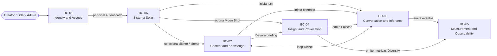

# SRD Parte 2 — Domain Model

## 1. Introdução

### 1.1. Objetivo

Este documento define o **Modelo de Domínio** do sunOS — sistema operacional de IA da Suno United Creators — em **Domain-Driven Design (DDD)**, mapeando os conceitos de negócio, suas relações e invariantes em **7 Bounded Contexts** com vocabulário ubíquo derivado do Glossário do BRD (Devorar, Provocar, Faísca, Brasa, Bioma, Skill, Moon, Biblioteca, Sistema Solar, Caixa-preta, Validado, Aprovador, Drive Sync).

O Domain Model serve como ponte entre os Requisitos de Negócio (BR) / Regras de Negócio (RN) do BRD e o Data Model (Parte 3) e a Arquitetura To-Be (Parte 6) deste SRD.

### 1.2. Escopo

O modelo cobre:
- **Bounded Contexts** — fronteiras conceituais com linguagem própria
- **Aggregates** — clusters de entidades com raiz e invariantes
- **Entities** — objetos com identidade própria
- **Value Objects** — objetos imutáveis definidos por atributos
- **Domain Events** — fatos relevantes ao negócio que disparam reações

### 1.3. Relação com Outros Artefatos

| Artefato | Relação |
|----------|---------|
| BRD Parte 2 (Glossário) | Linguagem ubíqua adotada (Devorar, Provocar, Faísca, etc.) |
| BRD Parte 3 (BR-XXX) | Aggregates respondem a BRs específicos |
| BRD Parte 4 (RN-XXX) | Invariantes implementam Regras de Negócio |
| PRD Parte 1 (Feature Map) | Cada Bounded Context implementa uma ou mais Features (FA-XX) |
| SRD Parte 1 (NFRs) | NFRs restringem comportamento dos aggregates |
| SRD Parte 3 (Data Model) | Entities/VOs viram tabelas |
| SRD Parte 5 (Arch As-Is) | Componentes existentes mapeiam parcialmente este modelo |
| SRD Parte 6 (Arch To-Be) | Bounded Contexts viram containers/módulos |
| SRD Parte 7 (ADRs) | ADRs orientam implementação dos aggregates |

### 1.4. Convenções

- **DO-XX**: Objeto de Domínio (Entity, Aggregate Root ou VO)
- **EV-XX**: Domain Event
- **BC-XX**: Bounded Context
- Nomes em **inglês** para consistência técnica nos artefatos downstream
- Atributos descritos semanticamente (sem tipos físicos)
- Aggregate Root marcado como **AR**

---

## 2. Visão Geral do Domínio

### 2.1. Núcleos do Domínio (Bounded Contexts)

O domínio do sunOS é fragmentado em **6 Bounded Contexts**, cada um com vocabulário próprio e responsabilidades coesas. A separação respeita as fronteiras semânticas do BRD (cultura: Devorar/Provocar; governança: Caixa-preta; mensuração: Inteligência Coletiva) e prepara a arquitetura To-Be (Parte 6) para evoluir em módulos desacoplados.

| ID | Bounded Context | Responsabilidade Central | Linguagem Própria | Features (PRD) |
|----|-----------------|--------------------------|-------------------|----------------|
| **BC-01** | Identity & Access | Autenticação, RBAC, perfis (Admin/Líder/Operacional), auditoria de acessos administrativos | User, Role, Profile, Session, AuditEntry | FA-09, FA-12 |
| **BC-02** | Content & Knowledge | Curadoria da Biblioteca, ingestão multimodal, indexação vetorial+grafo, Skills (definição) e Workflows | KnowledgeItem, Chunk, Skill, Moon, Workflow, Reference | FA-01, FA-03, FA-05 |
| **BC-03** | Conversation & Inference | Chat com agentes ReAct, orquestração LangGraph, streaming SSE, eval de turnos, geração de texto/imagem | Conversation, Turn, Agent, Tool, Trace, Score | FA-04, FA-07, FA-08 |
| **BC-04** | Insight & Provocation | Motor Moon Shot — Devorar briefing, Provocar Faíscas via loop Explorer↔Crítico, filtragem por zona de bisociação | Brief, Spark, Provocation, BisociationZone, ExplorerRun, CriticReview | FA-02 |
| **BC-05** | Measurement & Observability | Mensuração de custo evitado, homogeneização coletiva, tracing MLflow, dashboard executivo, safety cultural | CostBaseline, AvoidedCost, DiversityMetric, ExecutiveReport, ReflectionMoment | FA-10, FA-11 |
| **BC-06** | Multi-tenant (Sistema Solar) | Modelo de Cliente (Planeta) e área (Bioma), Sistema Solar como navegação, scope de retrieval, governança cross-client | Client, Bioma, SolarSystem, Scope, ClientStatus | FA-06 |
| **BC-07** | Approval & Validation (External Sources) | Submissão de outputs para aprovação hierárquica, pré-validação automatizada por agentes paralelos (Brand/Português), curadoria sugestiva sobre fontes externas (Google Drive read-only) | ApprovalRequest, ApprovalChain, ApprovalDecision, ValidationReport, BrandValidatorAgent, PortuguêsValidatorAgent, DriveSync, DriveDocument, CurationSuggestion, OAuthCredential, DriveCleanupReport, Aprovador, Validado | FA-13, FA-14 |

### 2.2. Mapa de Contextos (Context Map)

```mermaid
flowchart TB
    subgraph BC01["BC-01 Identity and Access"]
        IA[User / Role / Profile / Session / AuditEntry]
    end

    subgraph BC06["BC-06 Multi-tenant Sistema Solar"]
        MT[Client / Bioma / Scope / SolarSystem]
    end

    subgraph BC02["BC-02 Content and Knowledge"]
        CK[KnowledgeItem / Skill / Workflow]
    end

    subgraph BC03["BC-03 Conversation and Inference"]
        CI[Conversation / Turn / Agent]
    end

    subgraph BC04["BC-04 Insight and Provocation"]
        IP[Brief / Spark / Provocation]
    end

    subgraph BC05["BC-05 Measurement and Observability"]
        MO[Trace / CostBaseline / DiversityMetric / Report]
    end

    subgraph BC07["BC-07 Approval and Validation"]
        AV[ApprovalRequest / ValidationReport / DriveSync / DriveDocument]
    end

    BC01 -->|U/D Customer-Supplier<br/>fornece principal_id, perfil| BC02
    BC01 -->|U/D Customer-Supplier| BC03
    BC01 -->|U/D Customer-Supplier| BC04
    BC01 -->|U/D Customer-Supplier| BC05
    BC01 -->|U/D Customer-Supplier| BC06

    BC06 -->|U/D Conformist<br/>scope/client_id| BC02
    BC06 -->|U/D Conformist| BC03
    BC06 -->|U/D Conformist| BC04

    BC02 -->|Open Host Service<br/>retrieve(scope, query)| BC03
    BC02 -->|Open Host Service<br/>devour(brief)| BC04

    BC03 -->|Published Language<br/>Trace events| BC05
    BC04 -->|Published Language<br/>Spark events + Diversity| BC05

    BC03 -.->|invoca| BC04

    BC03 -->|Customer-Supplier<br/>output ready for approval| BC07
    BC04 -->|Customer-Supplier<br/>Spark for approval| BC07
    BC07 -->|Published Language<br/>Validado / Aprovado events| BC05
    BC07 -->|Conformist<br/>brand guidelines| BC02
    BC01 -->|U/D Customer-Supplier<br/>aprovador role| BC07
    BC06 -->|Conformist<br/>client_id scope| BC07
```

**Padrões de relação (DDD context mapping):**

- **BC-01 → demais (Customer-Supplier upstream)**: Identity & Access fornece a identidade do `principal` (user_id, role) que todos os contextos consomem.
- **BC-06 → BC-02/03/04 (Conformist)**: scope de cliente atravessa retrieval, conversation e provocação — clientes consomem o modelo do Sistema Solar sem influenciá-lo.
- **BC-02 → BC-03 (Open Host Service)**: Biblioteca expõe interface estável `retrieve(scope, query)` consumida por agentes.
- **BC-02 → BC-04 (Open Host Service)**: Biblioteca expõe `devour(brief)` para Moon Shot — retrieval divergente, não convergente.
- **BC-03/04 → BC-05 (Published Language)**: Conversation e Provocation publicam eventos `TurnCompleted`, `SparkApproved`, `ProvocationGenerated` consumidos pela Mensuração via tópicos/streams.
- **BC-03/04 → BC-07 (Customer-Supplier)**: Conversation e Provocation submetem outputs para aprovação; BC-07 retorna `Validado` (carimbo após pré-validação automatizada) e `Aprovado` (decisão humana hierárquica).
- **BC-07 → BC-02 (Conformist)**: Brand Validator e Português Validator consomem `KnowledgeItem`s tagueados como `brand-guideline`, `tone-of-voice` e `glossary` da Biblioteca como base de regra — não influenciam a curadoria.
- **BC-07 → BC-05 (Published Language)**: emite `ValidationCompleted`, `ApprovalDecided`, `DriveSyncCompleted`, `CleanupReportGenerated` consumidos pela Mensuração (KPI de retrabalho, taxa de aprovação primeiro round, cobertura de pré-validação).
- **BC-01 → BC-07 (Customer-Supplier)**: aprovador é Role validado por BC-01 (RBAC); inbox de aprovação respeita `principal_id` e hierarquia configurada.
- **BC-06 → BC-07 (Conformist)**: ApprovalChain e DriveSync respeitam `client_id` scope para isolamento entre Vivo, Sicredi etc. (RN-010).

### 2.3. Diagrama Conceitual de Alto Nível



---

## 3. Catálogo de Objetos de Domínio

### 3.1. Tabela Consolidada (60 objetos)

| ID | Nome | Tipo | Bounded Context | Descrição | Features | BRs/RNs |
|----|------|------|-----------------|-----------|----------|---------|
| DO-01 | User | Entity (AR) | BC-01 | Creator autenticado pertencente ao grupo United Creators | FA-09, FA-12 | BR-007, RN-009 |
| DO-02 | Role | VO | BC-01 | Papel/perfil (Admin, Líder, Operacional) — RN-009 | FA-09 | BR-007, RN-009 |
| DO-03 | Profile | Entity | BC-01 | Metadados do creator (área, cargo, estágio carreira) | FA-09, FA-12 | BR-012 |
| DO-04 | Session | Entity | BC-01 | Sessão autenticada com Firebase JWT | FA-09 | BR-007, RN-009 |
| DO-05 | AuditEntry | Entity (AR) | BC-01 | Registro auditável de operação administrativa (CRUD Skill, CRUD Biblioteca) | FA-09, FA-10 | BR-007, RN-012 |
| DO-06 | Client | Entity (AR) | BC-06 | Cliente da Suno (Planeta no Sistema Solar) — Vivo, Sicredi, etc. | FA-06, FA-09 | BR-008, RN-007, RN-010 |
| DO-07 | Bioma | Entity | BC-06 | Área/disciplina (Mídia, Criação, Planejamento, BI, Growth) — Moon agrupador | FA-06 | BR-006 |
| DO-08 | SolarSystem | Aggregate (conceitual) | BC-06 | Visão hierárquica Home → Planet → Skill → Moon | FA-06 | BR-001, RN-003 |
| DO-09 | Scope | VO | BC-06 | Tag de visibilidade: `suno-global`, `client:<slug>`, `cross-client` | FA-01, FA-03 | BR-008, RN-010 |
| DO-10 | KnowledgeItem | Entity (AR) | BC-02 | Item curado da Biblioteca (PDF, áudio, vídeo, imagem, texto) | FA-01 | BR-004, RN-006 |
| DO-11 | KnowledgeChunk | Entity | BC-02 | Pedaço embeddado de KnowledgeItem (Vector(768)) | FA-01 | BR-004 |
| DO-12 | KnowledgeGraphNode | Entity | BC-02 | Nó do grafo de conhecimento (relações entre Items) | FA-01, FA-02 | BR-004, RN-001 |
| DO-13 | Embedding | VO | BC-02 | Vetor de 768 dimensões (model-pinned) | FA-01 | BR-004 |
| DO-14 | Tag | VO | BC-02 | Categoria livre por Item (≥2 obrigatórias por RN-006) | FA-01 | BR-004, RN-006 |
| DO-15 | IngestionJob | Entity (AR) | BC-02 | Tarefa de ingestão multimodal (extração + chunking + embedding) | FA-01 | BR-004, RN-006 |
| DO-16 | RiskFlag | VO | BC-02 | Marca "conhecimento crítico em risco" (RN-008) | FA-01 | BR-005, RN-008 |
| DO-17 | Skill | Entity (AR) | BC-02 | Capacidade processual configurável (Copy Social, Plano Mídia, etc.) | FA-03, FA-12 | BR-002, RN-021 |
| DO-18 | Moon | Entity | BC-02 | Sub-área de Skill (variação configurável) | FA-03, FA-06 | BR-002 |
| DO-19 | SkillReference | Entity | BC-02 | Reference em `references/*.md` (progressive disclosure) — ADR-007 | FA-03 | BR-015, NFR-016 |
| DO-20 | SystemPrompt | VO | BC-02 | Versão imutável do system prompt da Skill (Caixa-preta) | FA-03, FA-09 | BR-007, RN-009 |
| DO-21 | TimeBaseline | VO | BC-02 | Tempo manual histórico da tarefa equivalente (RN-018) | FA-10 | BR-013, RN-018 |
| DO-22 | Workflow | Entity (AR) | BC-02 | Definição declarativa de fluxo (StateGraph compilado em runtime) | FA-05 | BR-002, BR-015 |
| DO-23 | WorkflowRun | Entity | BC-02 | Execução individual de Workflow (manual/scheduled) | FA-05 | BR-002 |
| DO-24 | StepLog | Entity | BC-02 | Log por step de WorkflowRun | FA-05 | BR-009, RN-013 |
| DO-25 | Schedule | VO | BC-02 | Especificação cron+timezone para Cloud Scheduler | FA-05 | — |
| DO-26 | Conversation | Entity (AR) | BC-03 | Sessão de chat com skill ativa (StateGraph state) | FA-04 | BR-002 |
| DO-27 | Turn | Entity | BC-03 | Mensagem (creator) + resposta (assistant) + tool calls | FA-04 | BR-002, NFR-001 |
| DO-28 | Agent | Entity | BC-03 | Persona executora (ContentCreator, Conversational, VisualCreator) | FA-04 | BR-015 |
| DO-29 | Tool | Entity | BC-03 | Ferramenta invocável (search_knowledge, generate_text, generate_image) | FA-04 | BR-015 |
| DO-30 | Trace | Entity (AR) | BC-05 | Trace MLflow com prompt/output/latency/cost (NFR-026) | FA-10 | BR-009, RN-013 |
| DO-31 | Brief | Entity (AR) | BC-04 | Briefing/tema do creator que alimenta o pipeline Moon Shot | FA-02 | BR-001, RN-003 |
| DO-32 | Spark | Entity (AR) | BC-04 | Faísca (provocação aprovada) — saída do pipeline ao creator | FA-02 | BR-001, RN-001 |
| DO-33 | Provocation | Entity | BC-04 | Candidato gerado pelo Explorer antes da revisão do Crítico | FA-02 | BR-001, RN-002 |
| DO-34 | BisociationZone | VO | BC-04 | Classificação por distância semântica (Óbvio / Sweet Spot / Incoerente / Adjacente / Radical) — RN-001 | FA-02 | BR-001, RN-001 |
| DO-35 | ExplorerRun | Entity | BC-04 | Execução do agente Explorer (gera N candidatos) | FA-02 | BR-001, RN-002 |
| DO-36 | CriticReview | Entity | BC-04 | Avaliação do agente Crítico (Novidade, Coerência, Potencial) | FA-02 | BR-001, RN-002 |
| DO-37 | ReflectionMoment | Entity | BC-05 | Forced reflection após N stars (RN-015) | FA-11 | BR-010, RN-015 |
| DO-38 | DiversityMetric | Entity | BC-05 | Mean Pairwise Cosine, Self-BLEU, Compression Ratio (mensal) | FA-10, FA-11 | BR-014, RN-019, RN-020 |
| DO-39 | AvoidedCost | Entity | BC-05 | Custo evitado por execução (RN-018) | FA-10 | BR-013, RN-018 |
| DO-40 | ExecutiveReport | Entity | BC-05 | Dashboard mensal/trimestral à Diretoria (RN-005) | FA-10 | BR-003, RN-005 |
| DO-41 | Score | VO | BC-03 | Avaliação HITL (thumbs up/down + comentário, rating 1-5) | FA-07 | BR-014 |
| DO-42 | SafetyAlert | Entity (AR) | BC-05 | Alerta automático (homogeneização > 2σ, custo cap, anomalia auditoria) | FA-10, FA-11 | BR-014, RN-019, RN-012 |
| DO-43 | ApprovalRequest | Entity (AR) | BC-07 | Submissão de output (Spark, Turn, Workflow output) para aprovação humana | FA-13 | BR-017, RN-024, RN-025 |
| DO-44 | ApprovalChain | Entity | BC-07 | Hierarquia configurada de aprovadores para um cliente/skill (níveis ordenados) | FA-13 | BR-017, RN-026 |
| DO-45 | ApprovalDecision | Entity | BC-07 | Decisão humana (Aprovar / Reprovar / Solicitar ajuste) com comentário e nível | FA-13 | BR-017, RN-024 |
| DO-46 | ValidationReport | Entity (AR) | BC-07 | Relatório consolidado da pré-validação automatizada (Brand + Português em paralelo) | FA-13 | BR-017, RN-023 |
| DO-47 | BrandValidatorAgent | Entity | BC-07 | Agente especializado em verificar aderência a brand guidelines do cliente | FA-13 | BR-017, RN-023 |
| DO-48 | PortuguêsValidatorAgent | Entity | BC-07 | Agente especializado em ortografia, gramática, tone-of-voice e glossário | FA-13 | BR-017, RN-023 |
| DO-49 | SubmissionRound | VO | BC-07 | Número de rodada (1, 2, 3 — limite máximo RN-025) com snapshot da versão submetida | FA-13 | BR-017, RN-025 |
| DO-50 | DriveSync | Entity (AR) | BC-07 | Estado de sincronização periódica + webhook com Google Drive (read-only) | FA-14 | BR-018, RN-027, RN-030 |
| DO-51 | DriveDocument | Entity | BC-07 | Documento descoberto no Drive (snapshot de metadata + permissões ACL Drive) | FA-14 | BR-018, RN-027, RN-028 |
| DO-52 | OAuthCredential | Entity | BC-07 | Token OAuth do cliente para acesso ao Drive (escopo `drive.readonly`) | FA-14 | BR-018, RN-027 |
| DO-53 | CurationSuggestion | Entity (AR) | BC-07 | Sugestão de curadoria (mover, renomear, taggear) gerada por agente sobre DriveDocument | FA-14 | BR-018, RN-029 |
| DO-54 | DriveCleanupReport | Entity (AR) | BC-07 | Relatório periódico de duplicatas, órfãos e candidatos a arquivamento no Drive | FA-14 | BR-018, RN-029 |
| DO-55 | ValidatedStamp | VO | BC-03/04 | Carimbo "Validado" anexado a Spark/Turn após ValidationReport sem erros bloqueantes | FA-13 | BR-017, RN-023 |
| DO-56 | WikiEntity | Entity (AR) | BC-07 | Entidade ontológica do cliente gerada pelo Oráculo e validada por HITL (PROFILE, MARKET, COMPETITORS, TARGET_PERSONAS, CAMPAIGN_HISTORY, LEGAL_CONSTRAINTS) | FA-15 | BR-021, RN-032 |
| DO-57 | EntityHITLEvent | Entity | BC-07 | Registro imutável de ação HITL sobre WikiEntity (accept/edit_accept/reject_regenerate) — audit log append-only | FA-15 | BR-021, RN-032 |
| DO-58 | OnboardingJob | Entity | BC-06 | Estado do job assíncrono do Oráculo — rastreia progresso de drive sync + geração de entidades com checkpoint por entidade | FA-15 | BR-021 |
| DO-59 | MeetingCapture | Entity (AR) | BC-02 | Sessão de reunião capturada seletivamente para processamento em conhecimento — consentimento LGPD obrigatório | FA-16 | BR-020, RN-033 (previsto) |
| DO-60 | MeetingTranscript | Entity | BC-02 | Transcrição processada de MeetingCapture com segmentação por speaker e resumo gerado | FA-16 | BR-020 |

> Total: **60 objetos** distribuídos em 7 Bounded Contexts. **23 Aggregate Roots** consolidam invariantes; demais são entities/VOs internos a aggregates.

---

## 4. Descrição Detalhada dos Aggregates

### 4.1. BC-01 Identity & Access

#### DO-01 — User (Aggregate Root)

**Descrição de Negócio**

Representa um **Creator** autenticado pertencente ao grupo United Creators (Suno, Paim, Revo, Koro, Ludi, etc.). É o `principal` portado em todos os requests do sunOS via Firebase JWT. Identidade delegada ao Firebase (ADR-006); metadados específicos do sunOS (área, cargo, estágio carreira) ficam em Profile interno ao aggregate.

**Atributos Principais**

| Atributo | Descrição | Obrigatório |
|----------|-----------|-------------|
| `user_id` | UUID interno (mapeia 1:1 com Firebase `uid`) | Sim |
| `firebase_uid` | UID do Firebase Auth | Sim |
| `email` | Email institucional (`@suno.com.br` ou afiliada) | Sim |
| `display_name` | Nome de exibição | Sim |
| `role` | Role atual (Admin / Líder / Operacional) | Sim |
| `default_client_id` | Cliente padrão para login (UX) | Não |
| `status` | ACTIVE / INACTIVE | Sim |
| `created_at` | Data de criação | Sim |

**Identidade e Ciclo de Vida**

- **Identidade**: `user_id` (UUID v4)
- **Criação**: SignUp via Firebase + sincronização no `users` interno (lazy)
- **Modificação**: Admin altera role; creator altera default_client_id
- **Inativação**: Soft delete preservando AuditEntries históricos

**Invariantes (Aggregate)**

1. Um User tem exatamente uma Role ativa por vez (RN-009 - default deny em ambiguidade)
2. Profile.career_stage define track de onboarding sugerida (RN-017)
3. Mudança de Role gera AuditEntry obrigatório

**Domain Events Emitidos**

| Evento | Quando | Consumidores |
|--------|--------|--------------|
| `EV-01 UserCreated` | Sign-up bem-sucedido | BC-05 (mensuração de adoção) |
| `EV-02 RoleChanged` | Role alterada por Admin | BC-01 (audit) |
| `EV-03 SessionStarted` | Login/refresh | BC-05, BC-01 (audit) |

**Rastreabilidade**

| Tipo | IDs |
|------|-----|
| Features | FA-09, FA-12 |
| BRs | BR-007 |
| RNs | RN-009, RN-017 |
| NFRs | NFR-008, NFR-009 |

---

#### DO-05 — AuditEntry (Aggregate Root)

**Descrição de Negócio**

Registro **imutável** de operação administrativa relevante (CRUD Skill, CRUD Biblioteca, mudança de role, acesso fora de horário comercial, anomalia 3σ na baseline mensal). Implementa RN-012 (auditabilidade administrativa) e alimenta SafetyAlert quando há padrão anômalo.

**Atributos Principais**

| Atributo | Descrição |
|----------|-----------|
| `entry_id` | UUID |
| `user_id` | Quem realizou |
| `action` | Tipo (`skill.create`, `library.update`, `role.change`, `prompt.read`) |
| `resource_type` | `skill` / `knowledge_item` / `user` / `workflow` |
| `resource_id` | ID do recurso afetado |
| `client_id` | Cliente associado (quando aplicável) |
| `before_state` / `after_state` | Snapshots JSON (LGPD-aware) |
| `is_business_hours` | Boolean (RN-012) |
| `request_id` | Correlação com Trace |
| `occurred_at` | Timestamp |

**Invariantes**

1. AuditEntry é **imutável** após criação (audit trail)
2. Operações sobre Skill/SystemPrompt sempre geram AuditEntry (RN-009, RN-012)
3. Acesso fora de horário comercial sem justificativa marca `requires_review = true`

**Rastreabilidade**: BR-007, BR-009, RN-012; NFR-008, NFR-009.

---

### 4.2. BC-06 Multi-tenant (Sistema Solar)

#### DO-06 — Client (Aggregate Root)

**Descrição de Negócio**

Representa um **Cliente da Suno** — Planeta no Sistema Solar (FA-06). Cada Client tem `slug`, status (ativo/inativo) e Biomas associados. Status modula visibilidade no Sistema Solar (RN-007). É a chave de isolamento entre dados de Vivo, Sicredi, Americanas etc. (RN-010).

**Atributos Principais**

| Atributo | Descrição |
|----------|-----------|
| `client_id` | UUID |
| `slug` | Identificador slug (`vivo`, `sicredi`) |
| `name` | Nome de exibição |
| `status` | `ACTIVE` / `INACTIVE` (RN-007) |
| `solar_metadata` | JSON com cores, posição orbital, ícone (FA-06) |
| `nda_status` | `OK` / `PENDING` / `BLOCKED` |
| `created_at` | Data de cadastro |

**Invariantes (Aggregate)**

1. Client `INACTIVE` não aparece em retrievals padrão; permanece para busca explícita por Líder (RN-007)
2. Client com `nda_status=BLOCKED` impede ingestão na Biblioteca de scope `client:<slug>`
3. Soft delete preserva contexto histórico (BR-005)

**Entities/VOs Internos**

- **Bioma (Entity)**: área de atuação do Cliente (mídia, criação, etc.)
- **Scope (VO)**: tag composta `client:<slug>` ou `client:<slug>:bioma:<area>`

**Domain Events**

- `EV-04 ClientStatusChanged` → BC-02 reindexa visibility
- `EV-05 ClientCreated` → BC-06 cria Sistema Solar visualization

**Rastreabilidade**: BR-005, BR-008; RN-007, RN-010; NFR-010, NFR-011; FA-06, FA-09.

---

### 4.3. BC-02 Content & Knowledge

#### DO-10 — KnowledgeItem (Aggregate Root)

**Descrição de Negócio**

Item curado da Biblioteca (PDF, DOCX, áudio, vídeo, imagem, texto puro). É a unidade da **Inteligência Coletiva** (Glossário §1). Alimenta simultaneamente Skills processuais (modo convergente — FA-03) e Moon Shot (modo divergente — FA-02). Invisível para Operacionais (RN-011 — Caixa-preta).

**Atributos Principais**

| Atributo | Descrição |
|----------|-----------|
| `item_id` | UUID |
| `title` | Título curado |
| `description` | ≥50 char (RN-006) |
| `file_type` | PDF / DOCX / AUDIO / VIDEO / IMAGE / TEXT |
| `file_url` | URI no GCS (objeto privado) |
| `tags` | ≥2 (RN-006) |
| `scope` | Lista de Scope (suno-global, client:vivo, cross-client) |
| `domain` | `cliente` / `industria` / `cultura` / `metodologia` / `referencia` |
| `risk_flag` | `OK` / `RISCO_TURNOVER` (RN-008) |
| `chunks_count` | Cache de KnowledgeChunks |
| `status` | `PROCESSING` / `READY` / `DEPRECATED` / `BLOCKED` |
| `created_by` | User ID curador |

**Invariantes (Aggregate)**

1. **Não pode existir** sem ≥2 Tags + descrição ≥50 char + título + domínio (RN-006)
2. KnowledgeItem com `domain=cliente` exige `client_id` referenciado em Scope
3. Quando uma KnowledgeItem entra em `RISCO_TURNOVER`, dispara `EV-08` para BC-05 (alerta a líder/RH)
4. Atualização de conteúdo gera nova versão dos KnowledgeChunks (re-embed)

**Entities Internas**

- **KnowledgeChunk (Entity)**: pedaço com `embedding: Vector(768)` + metadata
- **IngestionJob (Entity)**: job assíncrono de extração + chunking + embedding
- **RiskFlag (VO)**: estado calculado por job batch (acessos últimos 90 dias por usuário único)

**Domain Events**

| Evento | Quando |
|--------|--------|
| `EV-06 KnowledgeItemCurated` | Curadoria aceita (metadata válida) |
| `EV-07 IngestionFailed` | Pipeline esgotou retries |
| `EV-08 RiskFlagRaised` | Item flagged como `RISCO_TURNOVER` |
| `EV-09 ChunksReindexed` | Re-embed concluído |

**Rastreabilidade**: BR-004, BR-005, BR-007, BR-008; RN-006, RN-008, RN-010, RN-011; NFR-002, NFR-003, NFR-004, NFR-007, NFR-010, NFR-011; FA-01.

---

#### DO-17 — Skill (Aggregate Root)

**Descrição de Negócio**

Capacidade processual configurável que **acelera tarefas recorrentes** (Copy Social, Plano de Mídia, etc.) com contexto da Biblioteca injetado automaticamente (FA-03). Implementa progressive disclosure via `SKILL.md` + `references/*.md` (ADR-007). System prompt é **IP proprietário** (Caixa-preta — RN-009/011).

**Atributos Principais**

| Atributo | Descrição |
|----------|-----------|
| `skill_id` | UUID |
| `slug` | `copy-social`, `plano-de-midia`, etc. |
| `name` | Nome de exibição |
| `description` | Visível ao Líder/Admin |
| `intent` | `criacao` / `midia` / `planejamento` / `conversation` (TopSupervisor) |
| `default_model` | `gemini-flash` / `gemini-pro` / `gpt-4o` / `claude` |
| `temperature` | 0.0–1.0 |
| `client_scope` | Lista de client_ids elegíveis (ou `*` para todos) |
| `current_system_prompt_version` | FK → SystemPrompt |
| `time_baseline` | Tempo manual da tarefa (TimeBaseline VO) |
| `status` | `DRAFT` / `ACTIVE` / `DEPRECATED` |

**Invariantes (Aggregate)**

1. Skill `ACTIVE` exige ≥1 SystemPrompt versionado + ≥1 SkillReference
2. Mudança de SystemPrompt cria nova **versão imutável** (history); versão ativa marcada por `current_system_prompt_version`
3. Skill com `time_baseline` ausente registra execuções como `baseline_pendente` (RN-018)
4. Quando avaliação mensal (RN-004) retorna < 30% de redução por 2 meses consecutivos, Skill é marcada `requires_revision`

**Entities Internas**

- **Moon (Entity)**: variação configurável dentro de Skill (chip no PromptTemplateBar)
- **SystemPrompt (VO imutável)**: prompt versionado (history)
- **SkillReference (Entity)**: arquivo `references/*.md` injetado por progressive disclosure
- **TimeBaseline (VO)**: `tempo_manual_minutos`, `custo_hora_area`, `last_calibrated_at`

**Domain Events**

| Evento | Quando |
|--------|--------|
| `EV-10 SkillActivated` | Status → ACTIVE |
| `EV-11 SystemPromptVersioned` | Nova versão imutável criada |
| `EV-12 SkillRequiresRevision` | RN-004 marca para revisão |

**Rastreabilidade**: BR-002, BR-007, BR-013, BR-015; RN-004, RN-009, RN-011, RN-021; NFR-016, NFR-017, NFR-025; FA-03, FA-12.

---

#### DO-22 — Workflow (Aggregate Root)

**Descrição de Negócio**

Definição declarativa de **automação encadeada** (reports, planos, monitoramento) — compilada em `StateGraph` LangGraph em runtime (ADR-001). Mesmo engine do chat. Suporta schedule via Cloud Scheduler.

**Atributos Principais**

| Atributo | Descrição |
|----------|-----------|
| `workflow_id` | UUID |
| `name` | Nome |
| `description` | Texto livre |
| `created_by` | User ID |
| `definition` | JSONB declarativo (steps + edges) |
| `schedule` | Schedule VO (cron + timezone) |
| `client_scope` | Lista de client_ids |
| `default_model` | Modelo padrão |
| `max_execution_time` | Segundos (timeout) |
| `is_template` | Boolean |
| `status` | `DRAFT` / `ACTIVE` / `PAUSED` |

**Invariantes**

1. Workflow `ACTIVE` requer `definition` válida (compila sem erro)
2. Workflow agendado (`schedule_enabled=true`) requer Cloud Scheduler job sincronizado
3. WorkflowRun timeout dispara cancelamento e StepLog `ERROR`

**Entities Internas**

- **WorkflowRun (Entity)**: execução com `started_at`, `completed_at`, `status`, `checkpoint_data`
- **StepLog (Entity)**: log por step com input/output JSON
- **Schedule (VO)**: `cron_expression`, `timezone`, `enabled`

**Rastreabilidade**: BR-002, BR-015; ADR-001; FA-05.

---

### 4.4. BC-03 Conversation & Inference

#### DO-26 — Conversation (Aggregate Root)

**Descrição de Negócio**

Sessão de chat entre creator e o sunOS, ancorada em uma Skill ativa e em um Cliente. Persiste estado serializado do `LangGraph StateGraph` para retomada (planejado).

**Atributos Principais**

| Atributo | Descrição |
|----------|-----------|
| `conversation_id` | UUID |
| `user_id` | Creator dono |
| `client_id` | Cliente em contexto (RN-010) |
| `skill_slug` | Skill ativa |
| `current_model` | Modelo atual |
| `state` | JSON do StateGraph (SunosChatState) |
| `started_at`, `last_message_at`, `closed_at` | Timestamps |

**Invariantes**

1. Conversation só permite Turns coerentes com `client_id` (RN-010)
2. Truncamento de contexto respeita RN-021 — Regras de Negócio do cliente sempre presentes
3. Toda Conversation com state persistido tem ≥1 Turn associado

**Entities Internas**

- **Turn (Entity)**: par mensagem-resposta com tool calls; emite Trace
- **Score (VO)**: avaliação HITL (thumbs/comentário) atrelada a Turn
- **Agent (Entity de referência)**: ContentCreator / VisualCreator / Conversational (catálogo)
- **Tool (Entity de referência)**: search_knowledge / generate_text / etc.

**Domain Events**

| Evento | Quando |
|--------|--------|
| `EV-13 TurnStarted` | Mensagem do creator recebida |
| `EV-14 TurnCompleted` | SSE `done` emitido — alimenta BC-05 (Trace) |
| `EV-15 TurnFailed` | Erro fatal (sem fallback) |
| `EV-16 ScoreSubmitted` | HITL submetido |

**Rastreabilidade**: BR-002, BR-008, BR-015; RN-010, RN-021; NFR-001, NFR-002, NFR-006, NFR-026; FA-04, FA-07.

---

### 4.5. BC-04 Insight & Provocation

#### DO-31 — Brief (Aggregate Root)

**Descrição de Negócio**

Briefing/tema do creator que **alimenta** o pipeline Moon Shot. É o objeto **devorado** (Glossário). Pode ser fornecido explicitamente (free text) ou herdado de Conversation ativa.

**Atributos Principais**

| Atributo | Descrição |
|----------|-----------|
| `brief_id` | UUID |
| `user_id` | Creator dono |
| `client_id` | Cliente em contexto (obrigatório por RN-003) |
| `text` | Briefing textual |
| `embedding` | Vector(768) — base para BisociationZone |
| `mode` | `começando-uma-ideia` / `me-prova-que-ta-errada` (RN-017) |
| `intensity` | `adjacente` / `equilibrado` / `radical` (RN-001) |
| `created_at` | Timestamp |

**Invariantes**

1. Brief sem `client_id` solicita preenchimento antes de executar (RN-003)
2. Brief com mais de 30s sem resposta do pipeline notifica creator com cancelamento (RN-003)

**Domain Events**

- `EV-17 BriefCreated` → dispara ExplorerRun
- `EV-18 BriefDevoured` → contexto da Biblioteca foi recuperado e injetado

**Rastreabilidade**: BR-001; RN-001, RN-003; NFR-024; FA-02.

---

#### DO-32 — Spark (Aggregate Root)

**Descrição de Negócio**

**Faísca aprovada** — provocação que passou pelo loop Explorer↔Crítico (RN-002), foi filtrada na zona Sweet Spot (RN-001), e é **apresentada ao creator** como estímulo (RN-014). Não é peça final — é **Brasa** para o creator continuar.

**Atributos Principais**

| Atributo | Descrição |
|----------|-----------|
| `spark_id` | UUID |
| `brief_id` | Brief de origem |
| `provocation_text` | Texto da Faísca |
| `bisociation_zone` | VO `BisociationZone` (Sweet Spot por padrão) |
| `cosine_distance` | Distância semântica brief ↔ provocation (0.5–0.85 → Sweet) |
| `novelty_score`, `coherence_score`, `creative_potential_score` | Scores 0-10 |
| `agent_persona` | `Antropofaga` / `Carnavalesco` / `Ancia` |
| `is_starred` | Aprovação humana (UX) |
| `mark_visual` | `estimulo` / `provocacao` (RN-014) |
| `created_at` | Timestamp |

**Invariantes (Aggregate)**

1. Spark só existe se **score médio ≥ 8** + **nenhuma dimensão < 5** (RN-002)
2. `cosine_distance` deve estar na zona configurada por `intensity` do Brief (RN-001)
3. Spark **sempre marcado** visualmente (RN-014); remoção da marcação requer confirmação explícita do creator
4. Após N stars (default 5; junior 3 — RN-015), dispara `EV-21 ReflectionMomentTriggered`

**Entities Relacionadas (no contexto BC-04)**

- **Provocation (Entity interna)**: candidato gerado pelo Explorer antes da revisão
- **ExplorerRun (Entity)**: execução do agente Explorer
- **CriticReview (Entity)**: avaliação do agente Crítico (3 dimensões)
- **BisociationZone (VO)**: enum (`Obvio`, `SweetSpot`, `Incoerente`, `Adjacente`, `Radical`)
- **AgentPersona (VO)**: cultura brasileira (`Antropofaga`, `Carnavalesco`, `Ancia`)

**Domain Events**

| Evento | Quando | Consumidores |
|--------|--------|--------------|
| `EV-19 ProvocationGenerated` | Explorer produziu candidato | BC-04 (Crítico) |
| `EV-20 SparkApproved` | Crítico aprovou + filtro de zona OK | BC-03 (apresentar), BC-05 (Diversity) |
| `EV-21 ReflectionMomentTriggered` | N stars atingidos | BC-05 (ReflectionMoment) |
| `EV-22 SparkStarred` | Creator aprovou (UX) | BC-05 (BR-013 attribution) |

**Rastreabilidade**: BR-001, BR-010, BR-014; RN-001, RN-002, RN-014, RN-015; NFR-024; FA-02, FA-11.

---

### 4.6. BC-05 Measurement & Observability

#### DO-30 — Trace (Aggregate Root)

**Descrição de Negócio**

Trace MLflow de **toda chamada LLM** (NFR-026). Captura prompt, output, modelo, latência, custo estimado, scorers. Base para auditoria, debugging e cálculo de AvoidedCost.

**Atributos Principais**

| Atributo | Descrição |
|----------|-----------|
| `trace_id` | UUID + MLflow run_id |
| `turn_id` / `workflow_run_id` | Origem |
| `user_id`, `client_id`, `skill_slug` | Contexto |
| `model` | LLM usado |
| `prompt_tokens`, `output_tokens` | Métrica de uso |
| `latency_ms` | Tempo de resposta |
| `cost_estimate_brl` | Custo estimado |
| `scorer_results` | JSON com scorers |
| `created_at` | Timestamp |

**Invariantes**

1. Toda chamada LLM em produção MUST gerar Trace (NFR-026)
2. Trace > 12 meses migrado para armazenamento frio (RN-013)
3. Dado pessoal de cliente em prompt requer hash/anonimização conforme política LGPD (RN-013)

**Rastreabilidade**: BR-009, BR-013; RN-013; NFR-008, NFR-026; FA-10.

---

#### DO-38 — DiversityMetric (Aggregate Root)

**Descrição de Negócio**

Métrica mensal de **homogeneização criativa coletiva** (RN-019). Calcula 3 dimensões sobre amostra representativa de outputs criativos do mês: Mean Pairwise Cosine Distance, Self-BLEU, Compression Ratio. Alerta automático se > 2σ vs. baseline pré-sunOS.

**Atributos Principais**

| Atributo | Descrição |
|----------|-----------|
| `metric_id` | UUID |
| `period_start`, `period_end` | Mês de referência |
| `sample_size` | N de outputs avaliados |
| `mean_pairwise_cosine` | Distância semântica média |
| `self_bleu` | Similaridade textual interna |
| `compression_ratio` | Compressibilidade média |
| `baseline_*` | Valores baseline pré-sunOS |
| `divergence_sigma` | Quantos σ de divergência |
| `triggered_alert` | Boolean |

**Invariantes**

1. Cálculo mensal **automático** após fechamento do mês (RN-019)
2. Cobertura **100% dos meses** pós-Piloto (NFR-027)
3. **NUNCA** reportar satisfação individual (NPS) sem simultânea exibição destas métricas (RN-020)

**Domain Events**

- `EV-23 DiversityCalculated` → BC-05 (Report)
- `EV-24 HomogenizationAlertRaised` → SafetyAlert (escalação Sponsor + Diretoria)

**Rastreabilidade**: BR-014; RN-019, RN-020; NFR-027; FA-10, FA-11.

---

#### DO-42 — SafetyAlert (Aggregate Root)

**Descrição de Negócio**

Alerta de **safety operacional ou cultural**: homogeneização > 2σ (RN-019), custo cap excedido (GR-001), anomalia auditoria (RN-012), cross-client contamination (RN-010), provocação gerada sem marcação visual (RN-014).

**Atributos Principais**

| Atributo | Descrição |
|----------|-----------|
| `alert_id` | UUID |
| `alert_type` | Enum |
| `severity` | `LOW` / `MEDIUM` / `HIGH` / `CRITICAL` |
| `evidence` | JSON com contexto |
| `escalated_to` | Lista de roles |
| `status` | `OPEN` / `ACK` / `RESOLVED` |
| `created_at`, `resolved_at` | Timestamps |

**Invariantes**

1. SafetyAlert `CRITICAL` notifica Sponsor + Diretoria em ≤ 1h
2. Alerta persistir 90 dias sem mitigação dispara suspensão da feature-causa raiz (RN-019)

**Rastreabilidade**: BR-014; RN-010, RN-012, RN-014, RN-019; NFR-010, NFR-027.

---

### 4.7. BC-07 Approval & Validation (External Sources)

#### DO-43 — ApprovalRequest (Aggregate Root)

**Descrição de Negócio**

Submissão de um output (Spark, Turn, Workflow output) para o **fluxo de aprovação hierárquica configurado** para o cliente/skill. Materializa o pedido do Guga/Prosperi: nada relevante chega ao cliente final sem passar por (a) pré-validação automatizada (Brand + Português em paralelo) e (b) decisão humana hierárquica (FA-13).

**Atributos Principais**

| Atributo | Descrição |
|----------|-----------|
| `request_id` | UUID |
| `submitter_id` | User que submeteu |
| `client_id` | Cliente (escopo RBAC + ACL — RN-010) |
| `subject_type` | `spark` / `turn` / `workflow_output` |
| `subject_id` | ID do objeto submetido |
| `subject_snapshot` | JSON imutável da versão submetida (auditoria) |
| `chain_id` | FK → ApprovalChain ativa para o cliente/skill |
| `current_round` | 1, 2 ou 3 (limite RN-025) |
| `current_level` | Nível corrente da cadeia (0 = pré-validação, 1+ = humano) |
| `status` | `PENDING_VALIDATION` / `PENDING_APPROVAL` / `CHANGES_REQUESTED` / `APPROVED` / `REJECTED` / `EXPIRED` |
| `validation_report_id` | FK → ValidationReport (após pré-validação) |
| `final_decision_id` | FK → ApprovalDecision aprovação final |
| `submitted_at`, `decided_at` | Timestamps |

**Identidade e Ciclo de Vida**

- **Criação**: `POST /approval/submit` por Operacional ou Líder
- **Pré-validação**: dispara `BrandValidatorAgent` + `PortuguêsValidatorAgent` em paralelo (RN-023)
- **Aprovação humana**: roteia para o nível seguinte da `ApprovalChain` quando `ValidationReport` é OK
- **Rejeição / Mudança**: incrementa `current_round`; quando `current_round > 3` marca `EXPIRED` (RN-025)

**Invariantes (Aggregate)**

1. ApprovalRequest **só pode ir para humano após** `ValidationReport` com `status=PASS` ou `WARNINGS_ONLY` (RN-023)
2. **Decisão humana é obrigatória** — pré-validação automatizada nunca aprova sozinha (RN-024)
3. Limite de 3 rodadas; ao exceder, marca `EXPIRED` e exige re-submissão como nova `ApprovalRequest` (RN-025)
4. `subject_snapshot` é **imutável** — qualquer edição posterior cria nova `SubmissionRound`
5. `client_id` da request deve coincidir com `client_id` do `subject` (RN-010)

**Domain Events Emitidos**

| Evento | Quando |
|--------|--------|
| `EV-28 SubmissionCreated` | Submissão registrada |
| `EV-29 ValidationStarted` | Validators acionados em paralelo |
| `EV-30 ValidationCompleted` | ValidationReport persistido |
| `EV-31 ApprovalRouted` | Encaminhada ao próximo aprovador na chain |
| `EV-32 ChangesRequested` | Aprovador pediu ajustes; nova rodada |
| `EV-33 ApprovalDecided` | Decisão final (APPROVED ou REJECTED) |
| `EV-34 ApprovalExpired` | Excedeu 3 rodadas (RN-025) |

**Rastreabilidade**

| Tipo | IDs |
|------|-----|
| Features | FA-13 |
| BRs | BR-017 |
| RNs | RN-023, RN-024, RN-025, RN-026 |
| NFRs | NFR-008, NFR-009, NFR-010 |

---

#### DO-46 — ValidationReport (Aggregate Root)

**Descrição de Negócio**

Relatório consolidado da **pré-validação automatizada** disparada pela `ApprovalRequest`. Reúne em paralelo (RN-023) os achados do `BrandValidatorAgent` e do `PortuguêsValidatorAgent`, classificados por severidade. Define se a request pode subir para aprovação humana ou retorna ao submitter para correção.

**Atributos Principais**

| Atributo | Descrição |
|----------|-----------|
| `report_id` | UUID |
| `request_id` | FK → ApprovalRequest |
| `round` | Rodada da submissão validada |
| `status` | `PASS` / `WARNINGS_ONLY` / `BLOCKING_ERRORS` |
| `brand_findings` | Lista de findings do Brand Validator (issue, severity, span, suggestion) |
| `portugues_findings` | Lista de findings do Português Validator |
| `started_at`, `completed_at` | Timestamps (latência paralela) |
| `validators_versions` | Pinned versions dos agents (auditabilidade) |

**Invariantes**

1. ValidationReport requer **ambos** os validators concluídos para fechar (RN-023) — qualquer falha de agente gera `status=BLOCKING_ERRORS`
2. Validators executam em paralelo, **nunca sequencialmente** — latência total é `max(brand_latency, portugues_latency)` (NFR a definir, ver TODO-DM-08)
3. Reports são **imutáveis** após `completed_at`

**Entities/VOs Internos**

- **BrandValidatorAgent (Entity)**: agente especializado pinned a uma versão (system prompt + brand-guideline KnowledgeItems do cliente)
- **PortuguêsValidatorAgent (Entity)**: agente pinned com glossary + tone-of-voice do cliente
- **Finding (VO)**: `{ severity: error|warning|info, span: {start,end}, message, suggestion }`

**Rastreabilidade**: BR-017; RN-023; NFR-001 (latência), NFR-026 (tracing).

---

#### DO-44 — ApprovalChain (Entity)

**Descrição de Negócio**

Cadeia ordenada de aprovadores configurada manualmente por Admin/Líder por cliente (e opcionalmente por skill). Implementa **RN-026 — hierarquia configurável** sem hardcode: Suno tem padrões diferentes por cliente (Vivo Controle ≠ Sicredi). Mudanças geram AuditEntry.

**Atributos Principais**

| Atributo | Descrição |
|----------|-----------|
| `chain_id` | UUID |
| `client_id` | Escopo de aplicação |
| `applies_to` | `default` (cliente) ou `skill_id` (override) |
| `levels` | Lista ordenada `[{level, role_or_user_id, sla_hours, escalation_policy}]` |
| `version` | Versionado; alterações criam nova versão imutável |
| `status` | `ACTIVE` / `DEPRECATED` |

**Invariantes**

1. Chain tem **ao menos 1 nível humano** (RN-024)
2. Alteração só vale para ApprovalRequests **criadas após** a nova versão entrar em vigor
3. Cada `level.role_or_user_id` deve ser válido em BC-01 (RBAC)

**Rastreabilidade**: BR-017; RN-024, RN-026; NFR-009.

---

#### DO-45 — ApprovalDecision (Entity)

**Descrição de Negócio**

Decisão **humana** registrada por aprovador para uma `ApprovalRequest` em determinado nível. Carrega comentário, anexos, e dimensão decisória (Aprovar / Reprovar / Solicitar Ajustes).

**Atributos Principais**

| Atributo | Descrição |
|----------|-----------|
| `decision_id` | UUID |
| `request_id` | FK |
| `level` | Nível da chain decidindo |
| `approver_id` | User |
| `decision` | `APPROVE` / `REJECT` / `REQUEST_CHANGES` |
| `comment` | Texto livre (recomendado para REJECT/REQUEST_CHANGES) |
| `decided_at` | Timestamp |

**Invariantes**

1. ApprovalDecision exige `approver_id` com permissão para o `level` na `ApprovalChain` ativa (RN-024, RN-026)
2. Decisão é **imutável** (audit trail)
3. `decision=APPROVE` no último nível da chain → ApprovalRequest passa a `APPROVED`; demais níveis → roteia para o próximo

**Rastreabilidade**: BR-017; RN-024.

---

#### DO-50 — DriveSync (Aggregate Root)

**Descrição de Negócio**

Estado de sincronização **read-only** com o Google Drive do cliente (FA-14). Implementa a **decisão arquitetural ADR-009**: Drive permanece como source of truth do cliente; sunOS consome metadados + conteúdo selecionado, sem espelhar/escrever de volta. Combina sync periódico (Cloud Scheduler) com webhooks Drive Push para atualizações reativas (RN-030).

**Atributos Principais**

| Atributo | Descrição |
|----------|-----------|
| `sync_id` | UUID |
| `client_id` | Cliente |
| `oauth_credential_id` | FK → OAuthCredential (token do cliente) |
| `root_folder_ids` | Lista de folder IDs raiz autorizados (escopo) |
| `last_full_sync_at` | Timestamp |
| `last_webhook_event_at` | Timestamp |
| `next_scheduled_sync_at` | Próxima execução cron |
| `documents_total` | Cache |
| `documents_indexed` | Cache (metadata extraída) |
| `documents_curated` | Cache (importadas para Biblioteca por curadoria) |
| `status` | `ACTIVE` / `PAUSED` / `OAUTH_EXPIRED` / `ERROR` |

**Invariantes (Aggregate)**

1. DriveSync **nunca escreve** no Drive — escopo OAuth é `drive.readonly` (RN-027, ADR-009)
2. Sync respeita **ACL Drive ∩ RBAC sunOS** — DriveDocument só visível a quem tem ambos (RN-028)
3. OAuthCredential expirado pausa sync e gera SafetyAlert (`MEDIUM`)

**Entities/VOs Internos**

- **OAuthCredential (Entity)**: token de cliente, refresh_token, scopes, expires_at
- **DriveDocument (Entity)**: snapshot de Drive file metadata + ACL list + content_hash
- **CurationSuggestion (Entity)**: sugestão gerada por agente (`mover`, `renomear`, `taggear`, `arquivar`, `fundir-com-existente`) — sempre sugestiva (RN-029), nunca executada automaticamente
- **DriveCleanupReport (Entity)**: relatório periódico (duplicatas, órfãos, candidatos a arquivamento)

**Domain Events Emitidos**

| Evento | Quando |
|--------|--------|
| `EV-35 DriveSyncStarted` | Início de sync periódico ou webhook |
| `EV-36 DriveSyncCompleted` | Sync concluído com `documents_total` atualizado |
| `EV-37 DriveDocumentDiscovered` | Novo documento ou versão detectada |
| `EV-38 CurationSuggestionGenerated` | Agente gerou sugestão de organização |
| `EV-39 CurationSuggestionAccepted` | Curador aceitou sugestão (importação para Biblioteca) |
| `EV-40 CleanupReportGenerated` | Relatório de duplicatas/órfãos pronto |
| `EV-41 OAuthExpired` | Token expirou — gera SafetyAlert |

**Rastreabilidade**

| Tipo | IDs |
|------|-----|
| Features | FA-14 |
| BRs | BR-018 |
| RNs | RN-027, RN-028, RN-029, RN-030 |
| NFRs | NFR-008 (auth), NFR-009 (RBAC), NFR-010 (cross-client), NFR-011 (Caixa-preta) |
| ADRs | ADR-009 |

---

#### DO-53 — CurationSuggestion (Aggregate Root)

**Descrição de Negócio**

Proposta gerada por agente curador sobre um `DriveDocument` (mover/renomear/taggear/arquivar/fundir). É **sempre sugestiva** — Suno responde por curadoria, não por gestão do drive do cliente (RN-029). Curador humano aceita/rejeita; aceitar dispara importação para Biblioteca como `KnowledgeItem` (BC-02), nunca alteração no Drive original.

**Atributos Principais**

| Atributo | Descrição |
|----------|-----------|
| `suggestion_id` | UUID |
| `document_id` | FK → DriveDocument |
| `client_id` | Cliente |
| `kind` | `IMPORT_TO_LIBRARY` / `TAG` / `MERGE_WITH` / `MARK_DUPLICATE` / `MARK_OUTDATED` |
| `payload` | JSON com proposta (tags sugeridas, item_id alvo de merge, etc.) |
| `confidence` | 0.0–1.0 (score do agente) |
| `rationale` | Texto livre — por que o agente sugeriu |
| `status` | `PENDING` / `ACCEPTED` / `REJECTED` / `STALE` |
| `decided_by`, `decided_at` | Curador humano |

**Invariantes**

1. CurationSuggestion **nunca é auto-aplicada** — exige decisão humana (RN-029)
2. `ACCEPTED` em `IMPORT_TO_LIBRARY` cria `KnowledgeItem` em BC-02 com `provenance.drive_document_id` rastreável
3. Document atualizado no Drive marca sugestões pendentes como `STALE`

**Rastreabilidade**: BR-018; RN-029; FA-14.

---

### 4.8. BC-07 Approval & Validation — FA-15 Extensão (Oráculo do Cliente)

#### DO-56 — WikiEntity (Aggregate Root)

**Descrição de Negócio**

Uma das **6 entidades ontológicas** geradas pelo Oráculo do Cliente para um `Client` durante o onboarding (FA-15). Cada entidade representa um aspecto estratégico do cliente: perfil, mercado, concorrentes, personas-alvo, histórico de campanhas e restrições legais. Gerada automaticamente pelo agente LangGraph (Oráculo) a partir de documentos do Drive + pesquisa web allow-list; validada por HITL obrigatório (RN-032). Visível somente para Admin/Curador (Wiki Ontológica T-39) — **caixa-preta para Operacional** (RN-011 pattern: 404, não 403).

**Atributos Principais**

| Atributo | Descrição | Obrigatório |
|----------|-----------|-------------|
| `entity_id` | UUID | Sim |
| `client_id` | FK → Client | Sim |
| `entity_type` | `PROFILE` / `MARKET` / `COMPETITORS` / `TARGET_PERSONAS` / `CAMPAIGN_HISTORY` / `LEGAL_CONSTRAINTS` | Sim |
| `content` | Texto mínimo 100 palavras gerado pelo Oráculo | Sim |
| `provenance` | `ProvenanceEntry[]` — fontes (drive_file_id, web_url, snippet) | Sim |
| `status` | `pending` / `generated` / `accepted` / `regenerating` | Sim |
| `badge` | `seed_auto` / `hitl_accepted` / `hitl_edited` / `capture` | Sim |
| `updated_by` | FK → User (último editor HITL) | Não |
| `created_at`, `updated_at` | Timestamps | Sim |

**Invariantes (Aggregate)**

1. Cada `client_id` tem exatamente **1 WikiEntity por entity_type** (UNIQUE constraint)
2. `content` deve ter ≥ 100 palavras — validado pelo Oráculo pós-geração (CA-09 da SPEC-015)
3. Transição para `accepted` só ocorre via ação HITL explícita — nunca automática (RN-032)
4. `badge` reflete a história: `seed_auto` → gerado pelo Oráculo; `hitl_edited` → conteúdo alterado pelo curador
5. WikiEntity de client em status `DRAFT` / `PRE_ACTIVE` visível apenas a Admin/Curador (CA-15 da SPEC-015)

**Domain Events Emitidos**

| Evento | Quando |
|--------|--------|
| `EV-43 EntityGenerated` | Oráculo concluiu geração de uma entidade |
| `EV-44 EntityValidated` | HITL aceitou ou editou a entidade |

**Rastreabilidade**

| Tipo | IDs |
|------|-----|
| Features | FA-15 |
| BRs | BR-021 |
| RNs | RN-032 |
| NFRs | NFR-009 (RBAC), NFR-010 (cross-client), NFR-011 (caixa-preta) |
| SPEC | SPEC-015 |

---

#### DO-57 — EntityHITLEvent (Entity, append-only)

**Descrição de Negócio**

Registro **imutável** de uma ação de validação humana (HITL) sobre uma `WikiEntity`. Forma o audit trail completo das decisões do curador durante o gate PRE_ACTIVE → ACTIVE (RN-032). Armazenado em tabela append-only sem DELETE — atende requisito de auditabilidade (NFR-007).

**Atributos Principais**

| Atributo | Descrição | Obrigatório |
|----------|-----------|-------------|
| `event_id` | UUID | Sim |
| `client_id` | FK → Client (desnormalizado para cross-client guard) | Sim |
| `entity_type` | Tipo de entidade afetada | Sim |
| `action` | `accept` / `edit_accept` / `reject_regenerate` | Sim |
| `before_content` | Conteúdo antes da ação (null se accept sem edição) | Não |
| `after_content` | Conteúdo após edição (null se accept ou reject) | Não |
| `user_id` | FK → User (curador que executou a ação) | Sim |
| `timestamp_utc` | UTC timestamp da ação | Sim |

**Invariantes**

1. Imutável após criação — **sem UPDATE, sem DELETE** (audit log puro)
2. `client_id` desnormalizado no registro para cross-client guard em queries de auditoria (RN-010)
3. `action = reject_regenerate` implica re-disparo do Oráculo para aquela entidade (CA-10 da SPEC-015)

**Rastreabilidade**: BR-021; RN-032; FA-15; SPEC-015.

---

#### DO-58 — OnboardingJob (Entity)

**Descrição de Negócio**

Rastreia o estado assíncrono do job do Oráculo para um cliente específico. Serve como **checkpoint** para retomada em caso de reinício de instância (Cloud Run / BackgroundTasks — ADR-LOCAL-02 da SPEC-015). O campo `current_entity` indica onde o Oráculo parou, permitindo recomeço sem reprocessar entidades já concluídas.

**Atributos Principais**

| Atributo | Descrição | Obrigatório |
|----------|-----------|-------------|
| `job_id` | UUID | Sim |
| `client_id` | FK → Client (UNIQUE — um job por cliente) | Sim |
| `drive_sync_status` | `pending` / `running` / `done` / `error` | Sim |
| `oracle_status` | `pending` / `running` / `done` / `error` | Sim |
| `current_entity` | Entidade sendo processada no momento (checkpoint) | Não |
| `entities_done` | Contagem de entidades concluídas (0–6) | Sim |
| `error_detail` | Mensagem de erro se status = `error` | Não |
| `started_at`, `completed_at` | Timestamps | Não |
| `eta_hours` | Estimativa de conclusão em horas (default 24) | Sim |

**Invariantes**

1. Exatamente **1 OnboardingJob por Client** (UNIQUE em `client_id`)
2. `entities_done` cresce monotonicamente de 0 a 6 — nunca regride
3. Client só transita para `ACTIVE` quando `oracle_status = done` E todos WikiEntity `status = accepted` (RN-032)

**Rastreabilidade**: BR-021; FA-15; ADR-LOCAL-02 (SPEC-015).

---

### 4.9. BC-02 Content & Knowledge — FA-16 Extensão (Captura de Reuniões)

#### DO-59 — MeetingCapture (Aggregate Root)

**Descrição de Negócio**

Sessão de reunião **capturada seletivamente** pelo Creator para processamento em conhecimento sunOS (FA-16, Captura Seletiva de Reuniões). Consentimento explícito dos participantes é pré-condição legal (LGPD Art. 7 — PRE-03b da SPEC-016 futura). Após processamento, gera `MeetingTranscript` e potenciais `KnowledgeItem`s na Biblioteca do cliente.

**Atributos Principais**

| Atributo | Descrição | Obrigatório |
|----------|-----------|-------------|
| `capture_id` | UUID | Sim |
| `client_id` | FK → Client | Sim |
| `title` | Título da reunião | Sim |
| `participants` | Lista de participantes (nome + email) | Sim |
| `recorded_at` | Timestamp da gravação | Sim |
| `source_type` | `UPLOAD` / `GMEET_BOT` / `TEAMS_BOT` | Sim |
| `consent_confirmed` | Boolean — obrigatório true para processar | Sim |
| `status` | `PENDING` / `PROCESSING` / `DONE` / `ERROR` | Sim |
| `duration_seconds` | Duração da gravação em segundos | Não |

**Invariantes**

1. `consent_confirmed = true` obrigatório antes de qualquer processamento (LGPD Art. 7)
2. `client_id` garante escopo — gravação de cliente A nunca visível a cliente B (RN-010)

**Domain Events Emitidos**

| Evento | Quando |
|--------|--------|
| `EV-46 MeetingCaptured` | Nova captura criada com consentimento confirmado |

**Rastreabilidade**: BR-020; FA-16 (planejada — FRs FR-190 a FR-195); SPEC-016 (a criar).

---

#### DO-60 — MeetingTranscript (Entity)

**Descrição de Negócio**

Transcrição processada de uma `MeetingCapture`. Contém segmentação por speaker, resumo gerado por LLM e referências aos `KnowledgeItem`s criados a partir do conteúdo da reunião. Entidade interna ao aggregate `MeetingCapture`.

**Atributos Principais**

| Atributo | Descrição | Obrigatório |
|----------|-----------|-------------|
| `transcript_id` | UUID | Sim |
| `capture_id` | FK → MeetingCapture | Sim |
| `client_id` | Desnormalizado para cross-client guard | Sim |
| `content_text` | Texto completo da transcrição | Sim |
| `speaker_segments` | `SpeakerSegment[]` (speaker, start_ms, end_ms, text) | Sim |
| `summary` | Resumo LLM (tópicos, decisões, action items) | Não |
| `knowledge_items_generated` | `UUID[]` — IDs dos KnowledgeItems criados | Não |
| `processed_at` | Timestamp do processamento | Não |

**Invariantes**

1. `client_id` desnormalizado para cross-client guard (RN-010)
2. Transcript criado somente após `MeetingCapture.status = DONE`

**Rastreabilidade**: BR-020; FA-16 (planejada); SPEC-016 (a criar).

---

Eventos são **fatos** publicados por aggregates e consumidos por outros contextos via Published Language.

| ID | Evento | Origem | Consumidores | Carga útil |
|----|--------|--------|--------------|------------|
| EV-01 | UserCreated | BC-01 | BC-05 | user_id, role, area |
| EV-02 | RoleChanged | BC-01 | BC-01 (audit), BC-05 | user_id, before, after |
| EV-03 | SessionStarted | BC-01 | BC-05 | user_id, source_ip |
| EV-04 | ClientStatusChanged | BC-06 | BC-02 | client_id, before, after |
| EV-05 | ClientCreated | BC-06 | BC-06 (FA-06) | client_id, slug |
| EV-06 | KnowledgeItemCurated | BC-02 | BC-04, BC-05 | item_id, scope |
| EV-07 | IngestionFailed | BC-02 | BC-05 | item_id, retry_count, error |
| EV-08 | RiskFlagRaised | BC-02 | BC-01, BC-05 | item_id, owner_user_id |
| EV-09 | ChunksReindexed | BC-02 | — | item_id, chunks_count |
| EV-10 | SkillActivated | BC-02 | BC-05 | skill_id |
| EV-11 | SystemPromptVersioned | BC-02 | BC-01 (audit) | skill_id, version, user_id |
| EV-12 | SkillRequiresRevision | BC-02 | BC-05 (alert) | skill_id, reason |
| EV-13 | TurnStarted | BC-03 | BC-05 | turn_id, conversation_id |
| EV-14 | TurnCompleted | BC-03 | BC-05 | turn_id, latency_ms, tokens, cost |
| EV-15 | TurnFailed | BC-03 | BC-05 | turn_id, error |
| EV-16 | ScoreSubmitted | BC-03 | BC-05 | turn_id, thumbs, rating |
| EV-17 | BriefCreated | BC-04 | BC-04 (Explorer) | brief_id |
| EV-18 | BriefDevoured | BC-04 | — | brief_id, items_used |
| EV-19 | ProvocationGenerated | BC-04 | BC-04 (Crítico) | provocation_id, brief_id |
| EV-20 | SparkApproved | BC-04 | BC-03, BC-05 | spark_id |
| EV-21 | ReflectionMomentTriggered | BC-04 | BC-05 (UX) | user_id, conversation_id, stars_count |
| EV-22 | SparkStarred | BC-04 | BC-05 | spark_id, user_id |
| EV-23 | DiversityCalculated | BC-05 | BC-05 (Report) | metric_id, period |
| EV-24 | HomogenizationAlertRaised | BC-05 | BC-05 (SafetyAlert) | metric_id, sigma |
| EV-25 | AvoidedCostCalculated | BC-05 | BC-05 (Report) | turn_id, brl |
| EV-26 | WorkflowRunCompleted | BC-02 | BC-05 | run_id, duration_ms |
| EV-27 | SafetyAlertRaised | BC-05 | BC-01, externos | alert_id, severity |
| EV-28 | SubmissionCreated | BC-07 | BC-05 | request_id, subject_type, client_id |
| EV-29 | ValidationStarted | BC-07 | BC-05 | request_id, validators |
| EV-30 | ValidationCompleted | BC-07 | BC-03/04, BC-05 | request_id, status, findings_count |
| EV-31 | ApprovalRouted | BC-07 | BC-01 (notify), BC-05 | request_id, level, approver_id |
| EV-32 | ChangesRequested | BC-07 | BC-03/04, BC-05 | request_id, round, comment |
| EV-33 | ApprovalDecided | BC-07 | BC-03/04, BC-05 | request_id, decision, approver_id |
| EV-34 | ApprovalExpired | BC-07 | BC-05 (alert) | request_id, rounds_consumed |
| EV-35 | DriveSyncStarted | BC-07 | BC-05 | sync_id, client_id, trigger |
| EV-36 | DriveSyncCompleted | BC-07 | BC-05 | sync_id, documents_total, duration_ms |
| EV-37 | DriveDocumentDiscovered | BC-07 | BC-07 (curation), BC-05 | document_id, drive_id, mime |
| EV-38 | CurationSuggestionGenerated | BC-07 | BC-05 | suggestion_id, kind, confidence |
| EV-39 | CurationSuggestionAccepted | BC-07 | BC-02, BC-05 | suggestion_id, knowledge_item_id |
| EV-40 | CleanupReportGenerated | BC-07 | BC-05 | report_id, duplicates, orphans |
| EV-41 | OAuthExpired | BC-07 | BC-05 (alert) | credential_id, client_id |
| EV-42 | OnboardingStarted | BC-06 | BC-07 (Oráculo job), BC-05 | client_id, job_id, status=PRE_ACTIVE |
| EV-43 | EntityGenerated | BC-07 | BC-06 (job checkpoint), BC-05 | client_id, entity_type, job_id |
| EV-44 | EntityValidated | BC-07 | BC-06 (gate check), BC-05 | client_id, entity_type, action, user_id |
| EV-45 | ClientActivated | BC-06 | BC-02, BC-03, BC-05 | client_id, activated_by, activated_at |
| EV-46 | MeetingCaptured | BC-02 | BC-05 | capture_id, client_id, source_type |

---

## 6. Diagrama de Domínio (Mermaid)

```mermaid
classDiagram
    class User {
      <<AggregateRoot>>
      +user_id: UUID
      +firebase_uid: String
      +email: String
      +role: Role
      +status: Status
    }
    class Role {
      <<ValueObject>>
      +name: Enum
      +permissions: List
    }
    class AuditEntry {
      <<AggregateRoot>>
      +entry_id: UUID
      +user_id: UUID
      +action: String
      +occurred_at: TS
    }

    class Client {
      <<AggregateRoot>>
      +client_id: UUID
      +slug: String
      +status: Status
    }
    class Bioma {
      +bioma_id: UUID
      +name: String
    }
    class Scope {
      <<ValueObject>>
      +tag: String
    }

    class KnowledgeItem {
      <<AggregateRoot>>
      +item_id: UUID
      +title: String
      +tags: List
      +scope: List
      +status: Status
    }
    class KnowledgeChunk {
      +chunk_id: UUID
      +embedding: Vector768
      +chunk_index: Int
    }
    class IngestionJob {
      +job_id: UUID
      +retries: Int
    }

    class Skill {
      <<AggregateRoot>>
      +skill_id: UUID
      +slug: String
      +intent: Enum
      +default_model: String
    }
    class SystemPrompt {
      <<ValueObject>>
      +version: Int
      +content: Text
    }
    class Moon {
      +moon_id: UUID
      +name: String
    }
    class TimeBaseline {
      <<ValueObject>>
      +tempo_manual_min: Int
      +custo_hora_brl: Decimal
    }

    class Workflow {
      <<AggregateRoot>>
      +workflow_id: UUID
      +definition: JSON
      +schedule: Schedule
    }
    class WorkflowRun {
      +run_id: UUID
      +status: Status
    }

    class Conversation {
      <<AggregateRoot>>
      +conversation_id: UUID
      +client_id: UUID
      +skill_slug: String
      +state: JSON
    }
    class Turn {
      +turn_id: UUID
      +role: Enum
      +content: Text
    }
    class Score {
      <<ValueObject>>
      +thumbs: Enum
      +rating: Int
    }

    class Brief {
      <<AggregateRoot>>
      +brief_id: UUID
      +text: Text
      +intensity: Enum
    }
    class Spark {
      <<AggregateRoot>>
      +spark_id: UUID
      +novelty: Float
      +coherence: Float
      +creative_potential: Float
    }
    class BisociationZone {
      <<ValueObject>>
      +zone: Enum
      +cosine_distance: Float
    }

    class Trace {
      <<AggregateRoot>>
      +trace_id: UUID
      +model: String
      +latency_ms: Int
      +cost_brl: Decimal
    }
    class DiversityMetric {
      <<AggregateRoot>>
      +metric_id: UUID
      +mean_pairwise_cosine: Float
      +self_bleu: Float
    }
    class AvoidedCost {
      +avoided_id: UUID
      +brl: Decimal
    }
    class SafetyAlert {
      <<AggregateRoot>>
      +alert_id: UUID
      +alert_type: Enum
      +severity: Enum
    }

    User --> Role : has
    User "1" --> "N" AuditEntry : produces
    Client "1" --> "N" Bioma : has
    Client "1" --> "N" Scope : exposes

    KnowledgeItem "1" --> "N" KnowledgeChunk : decomposes_into
    KnowledgeItem "1" --> "N" IngestionJob : ingested_by
    KnowledgeItem --> Scope : tagged_by

    Skill "1" --> "N" SystemPrompt : versioned_by
    Skill "1" --> "N" Moon : has
    Skill --> TimeBaseline : measured_by

    Workflow "1" --> "N" WorkflowRun : executes

    Conversation "1" --> "N" Turn : contains
    Turn --> Score : evaluated_by
    Conversation --> Skill : runs
    Conversation --> Client : scoped_by

    Brief --> Client : about
    Brief "1" --> "N" Spark : produces
    Spark --> BisociationZone : classified_as

    Turn --> Trace : emits
    Spark --> DiversityMetric : feeds
    Turn --> AvoidedCost : calculates
    DiversityMetric --> SafetyAlert : may_raise
```



---

## 7. Agregados (Resumo)

| Aggregate | Raiz | Entidades Internas | Invariantes Principais |
|-----------|------|-------------------|------------------------|
| **Identity Aggregate** | User | Profile | Uma Role ativa por vez (RN-009); RoleChange exige AuditEntry |
| **Audit Aggregate** | AuditEntry | — | Imutável após criação |
| **Client Aggregate** | Client | Bioma | Status INACTIVE oculta de retrievals padrão (RN-007) |
| **Knowledge Aggregate** | KnowledgeItem | KnowledgeChunk, IngestionJob, RiskFlag | Metadados completos (RN-006); scope coerente com domain |
| **Skill Aggregate** | Skill | Moon, SystemPrompt (versionado), SkillReference | Versão imutável de SystemPrompt; Caixa-preta (RN-009/011) |
| **Workflow Aggregate** | Workflow | WorkflowRun, StepLog, Schedule | Definition compila; timeout interrompe execução |
| **Conversation Aggregate** | Conversation | Turn, Score | Turns coerentes com client_id (RN-010); truncamento (RN-021) |
| **Brief Aggregate** | Brief | — | Requer client_id (RN-003); embedding presente |
| **Spark Aggregate** | Spark | Provocation, ExplorerRun, CriticReview, BisociationZone | Score médio ≥ 8 + nenhuma dim < 5 (RN-002); zona configurada (RN-001); marcação visual (RN-014) |
| **Trace Aggregate** | Trace | — | 100% das chamadas LLM (NFR-026); retenção 12 meses (RN-013) |
| **DiversityMetric Aggregate** | DiversityMetric | — | Cálculo mensal automático; anti-pattern: nunca isolada (RN-020) |
| **AvoidedCost Aggregate** | AvoidedCost | — | Requer baseline; senão `pendente` (RN-018) |
| **ExecutiveReport Aggregate** | ExecutiveReport | — | Inclui set-level diversity + avoided cost simultaneamente (RN-020, RN-005) |
| **SafetyAlert Aggregate** | SafetyAlert | — | CRITICAL → escalação ≤1h; 90d sem mitigação suspende feature (RN-019) |
| **ReflectionMoment Aggregate** | ReflectionMoment | — | Junior threshold = 3 stars; default = 5 (RN-015) |
| **ApprovalRequest Aggregate** | ApprovalRequest | SubmissionRound | Aprovação humana obrigatória (RN-024); limite 3 rodadas (RN-025); subject_snapshot imutável |
| **ValidationReport Aggregate** | ValidationReport | Finding (VO), BrandValidatorAgent, PortuguêsValidatorAgent | Validators paralelos (RN-023); imutável após completed_at |
| **DriveSync Aggregate** | DriveSync | OAuthCredential, DriveDocument | Read-only (RN-027, ADR-009); ACL Drive ∩ RBAC sunOS (RN-028) |
| **CurationSuggestion Aggregate** | CurationSuggestion | — | Sempre sugestiva (RN-029); aceitar cria KnowledgeItem em BC-02 |
| **DriveCleanupReport Aggregate** | DriveCleanupReport | — | Apenas relatório; nenhuma ação destrutiva no Drive (RN-027, RN-029) |
| **WikiEntity Aggregate** | WikiEntity | EntityHITLEvent | UNIQUE(client_id, entity_type); content ≥ 100 palavras; aceite somente via HITL (RN-032) |
| **OnboardingJob Aggregate** | OnboardingJob | — | UNIQUE(client_id); entities_done monotônico; Client→ACTIVE só quando job done + todos WikiEntity accepted (RN-032) |
| **MeetingCapture Aggregate** | MeetingCapture | MeetingTranscript | consent_confirmed obrigatório (LGPD Art. 7); cross-client guard via client_id (RN-010) |

---

## 8. Mapeamento Bounded Context ↔ Features ↔ Containers (Arch To-Be)

| Bounded Context | Features (PRD) | Containers (Arch To-Be — Parte 6) | ADRs Aplicáveis |
|-----------------|----------------|-----------------------------------|-----------------|
| BC-01 Identity & Access | FA-09, FA-12 | Backend API (módulo `auth`), Firebase Auth (externo) | ADR-006 |
| BC-02 Content & Knowledge | FA-01, FA-03, FA-05, FA-16 | Backend API (`chat/knowledge`, `chat/skills`, `workflows`), pgvector + GCS | ADR-001, ADR-003, ADR-007 |
| BC-03 Conversation & Inference | FA-04, FA-07, FA-08 | Backend API (`chat/graph`, `chat/agents`, `chat/tools`), LLM providers | ADR-002, ADR-004, ADR-005 |
| BC-04 Insight & Provocation | FA-02 | **Provocation Engine** (novo container/módulo To-Be), pgvector grafo | ADR-005, ADR-008 (proposto) |
| BC-05 Measurement & Observability | FA-10, FA-11 | **Measurement Service** (novo módulo To-Be), MLflow, scheduler de métricas | ADR-009 (proposto) |
| BC-06 Multi-tenant (Sistema Solar) | FA-06 | Frontend (`components/solar`), Backend API (módulo `clients`) | — |
| BC-07 Approval & Validation (External Sources) | FA-13, FA-14, FA-15 | **Approval Engine** (CTM-08 — novo container Cloud Run) + **Drive Connector** (CTM-09 — novo container Cloud Run) + **Onboarding Oráculo** (CTM-10 — extensão do Backend API) | ADR-008, ADR-009, ADR-010 |

---

## 9. Mapeamento NFRs ↔ Aggregates

| NFR | Aggregate(s) Impactado(s) | Como o Aggregate atende |
|-----|---------------------------|-------------------------|
| NFR-001 (latência first-token) | Conversation, Turn | Streaming SSE no aggregate Turn |
| NFR-003 (retrieval pgvector) | KnowledgeItem | Índice HNSW em KnowledgeChunk.embedding |
| NFR-008 (Firebase JWT) | User, Session | Identidade Firebase obrigatória em todos os requests |
| NFR-009 (RBAC) | User, AuditEntry | Role + AuditEntry imutável |
| NFR-010 (cross-client) | Client, KnowledgeItem, Conversation | Scope em retrieval; client_id em Conversation |
| NFR-011 (Caixa-preta) | Skill, KnowledgeItem | SystemPrompt invisível; Biblioteca oculta para Operacional |
| NFR-021 (marcação visual) | Spark | Atributo `mark_visual` obrigatório |
| NFR-024 (filtragem zonas) | Spark, BisociationZone | Invariante de Spark (RN-001) |
| NFR-025 (truncamento) | Conversation | Invariante de Turn quando contexto excede window |
| NFR-026 (tracing 100%) | Trace, Turn, WorkflowRun | Toda Turn/WorkflowRun emite Trace |
| NFR-027 (homogeneização) | DiversityMetric | Cálculo mensal automático |
| NFR-028 (custo evitado) | AvoidedCost, TimeBaseline | Calculado por Turn quando baseline existe |
| NFR-008 (Firebase JWT) | ApprovalRequest, ApprovalDecision, DriveSync | Aprovador autenticado via Firebase; OAuth Drive em camada separada |
| NFR-009 (RBAC) | ApprovalChain, ApprovalDecision | Nível da chain valida Role do approver |
| NFR-010 (cross-client) | ApprovalRequest, DriveSync, DriveDocument | client_id obrigatório; ACL Drive ∩ RBAC sunOS para DriveDocument |
| NFR-011 (Caixa-preta) | DriveDocument | Conteúdo importado vira KnowledgeItem (Operacional não vê fonte) |
| NFR-026 (tracing 100%) | ValidationReport, ApprovalDecision | Eventos publicados para BC-05 com latency e versions |

---

## 10. Assunções, Lacunas e Itens a Validar

### 10.1. Assunções

| ID | Assunção | Impacto se Falsa | Status |
|----|----------|------------------|--------|
| ASS-DM-01 | User será sincronizado lazy do Firebase ao primeiro login (não há ETL de provisionamento) | Médio — pode requerer job batch | A confirmar |
| ASS-DM-02 | Bioma é entidade interna do Client (não é tabela própria) — pode ser simples lista de strings nas primeiras versões | Baixo — refator simples | A validar |
| ASS-DM-03 | Spark ≠ provocação rejeitada — somente aprovadas viram Spark; rejeitadas são `Provocation` interna | Baixo — clarifica nomenclatura | Adotado |
| ASS-DM-04 | DiversityMetric calculada por job mensal (não em tempo real) | Médio — afeta NFR-027 design | Confirmado pela RN-019 |
| ASS-DM-05 | KnowledgeGraphNode é separado de KnowledgeChunk (grafo é metadata, não substitui vetores) | Médio — afeta arquitetura BC-04 | A validar com Heitor |
| ASS-DM-06 | ApprovalChain é configurada manualmente (não auto-derivada de skill+client) — versão 1 | Baixo — pode evoluir para auto-derivação | Adotado (ADR-010) |
| ASS-DM-07 | DriveDocument NÃO duplica conteúdo no GCS — somente metadata + ACL snapshot; conteúdo é fetched on-demand para curadoria | Médio — pode requerer cache se latência for alta | A validar com Eng |
| ASS-DM-08 | Brand/Português Validators são agentes LLM com prompt pinned + base de KnowledgeItems do cliente (não regex/spell-checker dedicado) | Médio — afeta custo e latência | A validar com Heitor + Bruno |

### 10.2. Lacunas (TODOs)

| ID | Lacuna | Informação Necessária | Responsável |
|----|--------|----------------------|-------------|
| TODO-DM-01 | Definir formato exato de KnowledgeGraphNode (nó-aresta) e como BC-04 consome retrieval divergente vs. cosine | Bruno Prosperi + Heitor + Eng | Antes do Protótipo |
| TODO-DM-02 | Confirmar se Bioma é Entity ou somente VO (lista de tags) | Heitor | Maio 2026 |
| TODO-DM-03 | Modelar `ReflectionMoment` com gating real ou apenas event-log | UX + Eng | Antes do Piloto |
| TODO-DM-04 | Decidir se Provocation rejeitada é descartada ou persistida para retraining | Heitor + Eng | Antes do Piloto |
| TODO-DM-05 | Especificar política de versionamento de SkillReference (history em git apenas vs. cópia em DB) | Heitor + Eng | Maio 2026 |
| TODO-DM-06 | Validar invariante "Spark sempre marcado" — endpoint público deve impedir remoção sem confirmação | Eng | Antes do Piloto |
| TODO-DM-07 | Definir UX e regra para `ChangesRequested` em rodada > 1 (manter histórico de findings entre rodadas?) | UX + Heitor | Antes da Implementação FA-13 |
| TODO-DM-08 | Definir SLA de latência para ValidationReport — Brand+Português paralelos têm meta agregada (p95 ≤ ?) | Heitor + Eng | Antes da Implementação FA-13 |
| TODO-DM-09 | Confirmar com Guga: Drive read-only é aceito (vs. pedido literal de "espelho") — alinhamento ainda pendente | Heitor + Guga | Antes da Implementação FA-14 |
| TODO-DM-10 | Política de retenção de DriveDocument metadata após desconexão OAuth do cliente (LGPD) | Heitor + Jurídico | Antes da Implementação FA-14 |

---

## Histórico de Versões

| Versão | Data | Autor | Alterações |
|--------|------|-------|------------|
| 1.0 | 2026-04-28 | Heitor Miranda + Claude | Versão inicial. **6 Bounded Contexts** (Identity & Access, Content & Knowledge, Conversation & Inference, Insight & Provocation, Measurement & Observability, Multi-tenant Sistema Solar) com **15 Aggregates Roots** e ~42 objetos de domínio totais (entities + VOs). **27 Domain Events** catalogados. Linguagem ubíqua derivada do Glossário do BRD (Devorar, Provocar, Faísca, Brasa, Bioma, Skill, Moon, Biblioteca, Caixa-preta, Sistema Solar). Diagramas Mermaid de Context Map, hierarquia conceitual e Class Diagram. Rastreabilidade completa a BRs/RNs (Parte 3/4 do BRD), NFRs (Parte 1 do SRD) e Features (Parte 1 do PRD). Status: Rascunho aguardando revisão técnica. |
| 1.2 | 2026-05-15 | Heitor Miranda + Claude | Adicionado **5 Domain Objects** (DO-56 a DO-60) para FA-15 (Onboarding com Oráculo do Cliente) e FA-16 (Captura Seletiva de Reuniões). +3 Aggregate Roots (WikiEntity, OnboardingJob, MeetingCapture), +5 Domain Events (EV-42 a EV-46). WikiEntity e EntityHITLEvent estendem BC-07 (Approval & Validation) com HITL gate de onboarding; OnboardingJob estende BC-06 (Multi-tenant); MeetingCapture e MeetingTranscript estendem BC-02 (Content & Knowledge). Atualizado BC↔Features (FA-15→BC-07, FA-16→BC-02). Total: 60 objetos, 46 eventos. |
| 1.1 | 2026-04-28 | Heitor Miranda + Claude | Adicionado **BC-07 Approval & Validation (External Sources)** para FA-13 (Aprovação Hierárquica) + FA-14 (Google Drive como Fonte). +13 objetos de domínio (DO-43 a DO-55), +5 Aggregate Roots (ApprovalRequest, ValidationReport, DriveSync, CurationSuggestion, DriveCleanupReport), +14 Domain Events (EV-28 a EV-41). Atualizados Context Map (relacionamentos com BC-01/02/03/04/05/06), tabela BC↔Containers (CTM-08 Approval Engine, CTM-09 Drive Connector), mapeamento NFR↔Aggregates, assunções (ASS-DM-06/07/08), TODOs (TODO-DM-07 a TODO-DM-10). Vocabulário ubíquo expandido com `Validado`, `Aprovador`, `Drive Sync`, `Curadoria Sugestiva`. Rastreabilidade a BR-017/018, RN-023 a RN-030, ADR-008/009/010. |
