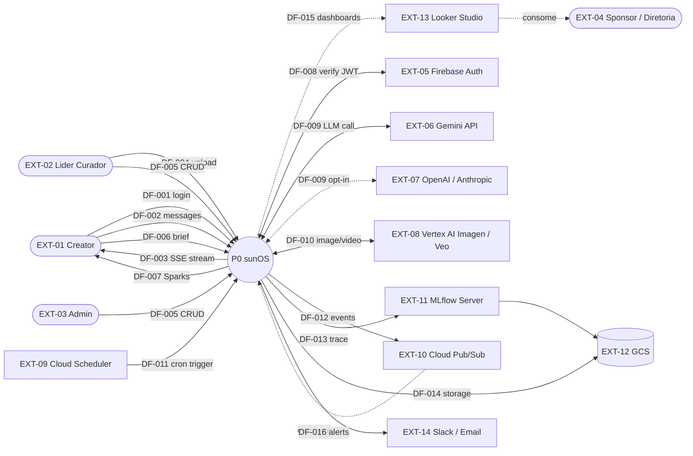
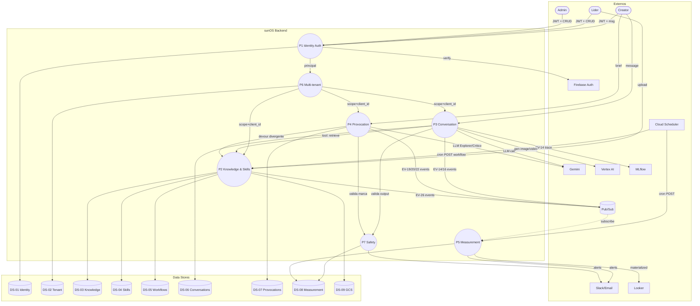
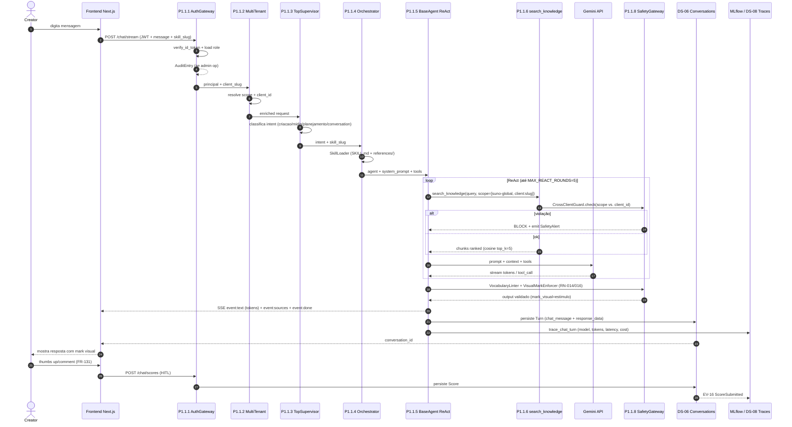
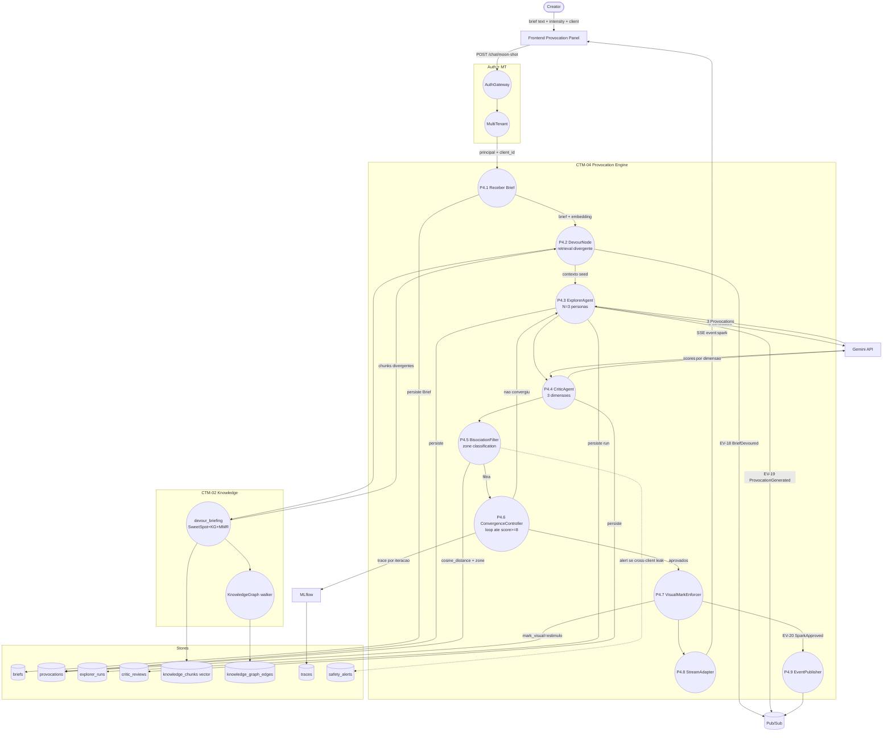
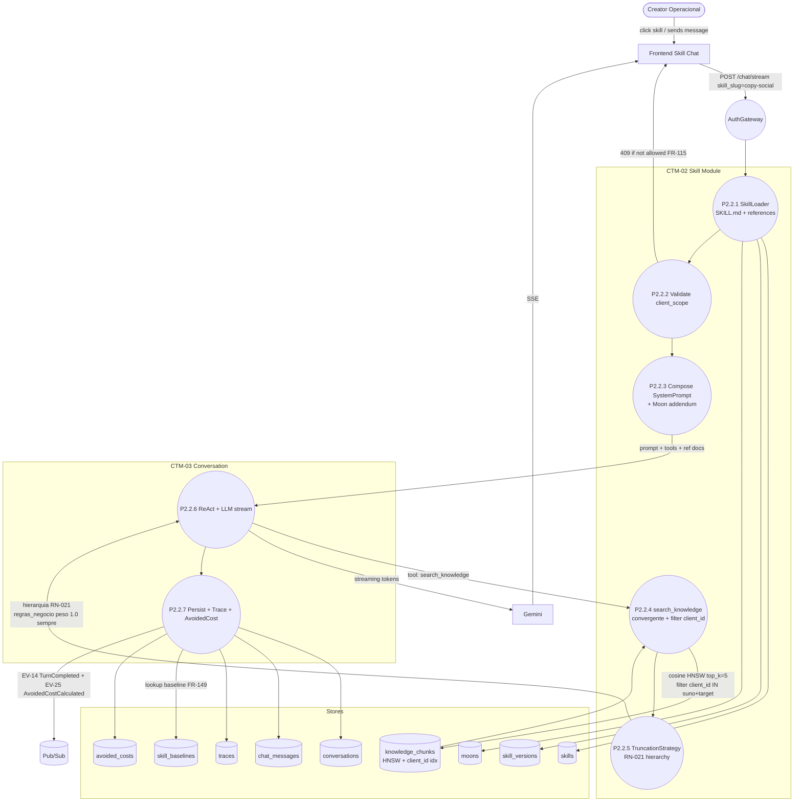
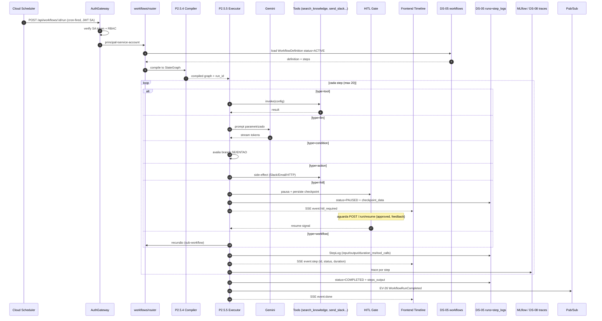
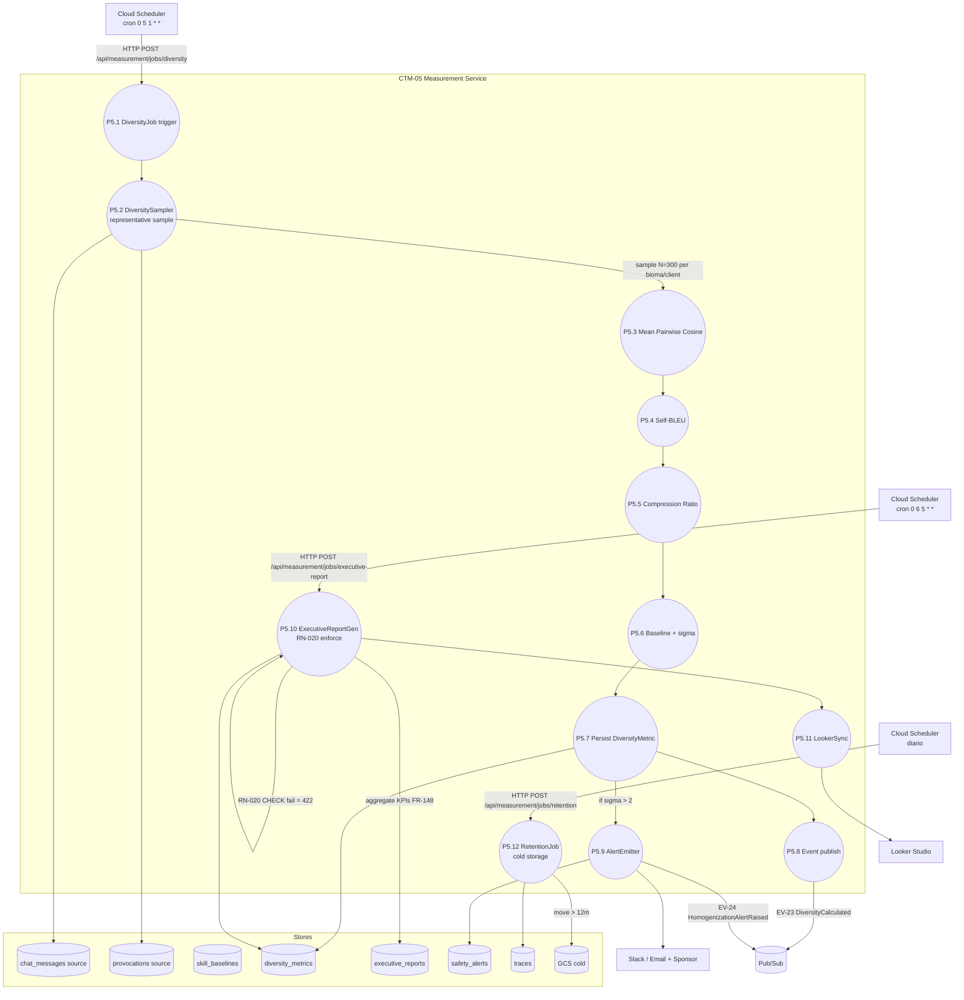
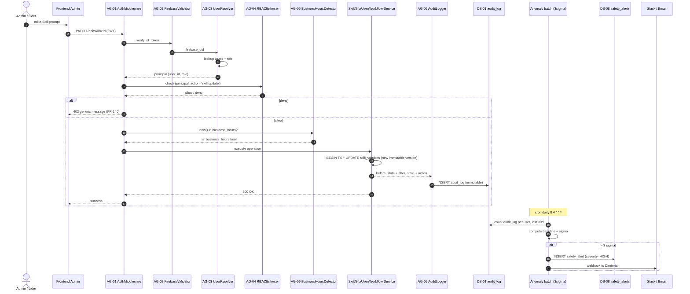
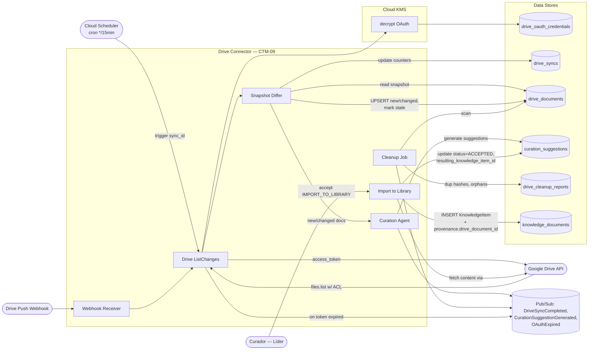

# SRD Parte 4 — Data Flows (DFD)

## 1. Introdução

### 1.1. Objetivo

Este documento mapeia os **Fluxos de Dados (Data Flows)** críticos do sunOS em múltiplos níveis, traduzindo as jornadas de usuário e as Features do PRD em fluxos rastreáveis entre **entidades externas, processos e data stores**. Os fluxos cobrem o caminho de dados desde a entrada (creator/scheduler/admin) até a persistência e os efeitos colaterais (eventos, alertas, traces).

### 1.2. Escopo

- **DFD Nível 0** — Context Diagram (visão macro do sunOS como caixa única)
- **DFD Nível 1** — Macroprocessos por Bounded Context (BC-01..BC-06)
- **DFD Nível 2** — 7 fluxos críticos de detalhe:
  1. **DFL-01** — Chat com agente (mensagem → LangGraph → LLM → Eval → Resposta)
  2. **DFL-02** — Moon Shot (briefing → retrieval divergente → Explorer → Crítico → bisociação → cards)
  3. **DFL-03** — Ingestão na Biblioteca (upload → processamento multimodal → embeddings → vector store + KG)
  4. **DFL-04** — Skill processual com context injection (Skill ativa → retrieval convergente → ReAct → output)
  5. **DFL-05** — Workflow agendado (Cloud Scheduler → executor → steps → SSE/persistência)
  6. **DFL-06** — Detecção de homogeneização (RN-019 — coleta mensal → 3 métricas → alerta SafetyAlert)
  7. **DFL-07** — Auditoria de acesso administrativo (RN-012 — operação CRUD → AuditEntry → escalonamento 3σ)
  8. **DFL-08** — Submissão para aprovação hierárquica (FA-13 — output → validators paralelos → aprovador → decisão → carimbo Validado)
  9. **DFL-09** — Sincronização periódica + webhook do Google Drive (FA-14 — OAuth → list/changes → diff → suggestions → cleanup report)

### 1.3. Notação DFD

| Elemento | Símbolo no Mermaid | Descrição |
|----------|--------------------|-----------|
| **Entidade Externa** | Retângulo `[ ]` ou `([ ])` (ator) | Usuário ou sistema externo (Firebase, Vertex AI, Cloud Scheduler) |
| **Processo** | Círculo/Oval `(( ))` | Transformação de dados (módulo backend, agent, job) |
| **Data Store** | Cilindro `[( )]` | Repositório persistente (tabela, índice pgvector, GCS bucket) |
| **Fluxo de Dados** | Seta `-->` ou `-.->` | Dados em movimento (síncrono / assíncrono pontilhado) |

### 1.4. Convenções

- **DFL-XX** — Fluxo de dados crítico (Nível 2)
- **DF-XXX** — Fluxo individual dentro de um DFL
- **P0/P1.x/P2.x.y** — Processos por nível de decomposição
- **DS-XX** — Data Store (alinhado com ENT-XX da Parte 3)
- **EXT-XX** — Entidade externa (alinhado com AC-/AE- da Parte 5/6)
- Português brasileiro nas descrições; nomes técnicos (paths, eventos `EV-XX`) em inglês

---

## 2. DFD Nível 0 — Context Diagram

### 2.1. Descrição

Visão macro do sunOS como **um único processo central (P0 — sunOS)** mostrando todas as interações com entidades externas. Útil para alinhamento com a Parte 5 (Arch As-Is) e Parte 6 (Arch To-Be).

### 2.2. Entidades Externas (alinhadas com Parte 6 §3.2)

| ID | Entidade | Tipo | Descrição | Dados Fornecidos | Dados Recebidos |
|----|----------|------|-----------|------------------|-----------------|
| EXT-01 | Creator | Pessoa | Usuário primário (Operacional/Sênior) | Mensagens, briefs, uploads, scores HITL | Streams SSE, sparks, outputs IA, dashboards |
| EXT-02 | Líder/Curador | Pessoa | Cura Biblioteca + Skills | KnowledgeItems curados, baselines, configurações | Status, alertas (RiskFlag/SafetyAlert) |
| EXT-03 | Admin | Pessoa | CRUD total + governança | Skills/Clients/Users/Workflows | Auditoria, métricas |
| EXT-04 | Sponsor/Diretoria | Pessoa | Consome ExecutiveReports | — | Dashboards mensais/trimestrais |
| EXT-05 | Firebase Auth | Sistema externo | Identidade JWT | Verificação de tokens | — |
| EXT-06 | Gemini API | Sistema externo | LLM default | Prompts | Outputs (streaming tokens) |
| EXT-07 | OpenAI / Anthropic | Sistema externo | LLM alternativos | Prompts (opt-in) | Outputs |
| EXT-08 | Vertex AI Imagen / Veo | Sistema externo | Image / Video generation | Prompts + parâmetros | URLs + operation_name |
| EXT-09 | Cloud Scheduler | Plataforma GCP | Cron de Workflows e Jobs | HTTP POST agendado | — |
| EXT-10 | Cloud Pub/Sub | Plataforma GCP | Domain Events entre BCs | Eventos `EV-XX` | Eventos consumidos |
| EXT-11 | MLflow Server | Self-hosted | Tracing 100% | Params/metrics/run_name | Traces |
| EXT-12 | GCS | Plataforma GCP | Storage (artifacts + biblioteca + cold) | Arquivos de upload | URLs assinadas |
| EXT-13 | Looker Studio | Externo (GCP) | BI Executive Reports | Materialized views (JDBC) | — |
| EXT-14 | Slack / Email | Externos | Alertas SafetyAlert | — | Notificações |

### 2.3. Data Stores Macro (agrupamento das ENT-01..ENT-33 da Parte 3)

| ID | Data Store | Descrição | Entidades ERD |
|----|------------|-----------|---------------|
| DS-01 | Identity Store | Users, roles, sessions, audit_log | ENT-08, ENT-09, ENT-10, ENT-11, ENT-12 |
| DS-02 | Tenant Store | Clients, biomas, client_users | ENT-13, ENT-14, ENT-15 |
| DS-03 | Knowledge Store | Documents + chunks (vector) + KG edges + ingestion jobs + risk flags | ENT-03, ENT-04, ENT-20, ENT-21, ENT-22 |
| DS-04 | Skill Store | Skills + versions + moons + baselines | ENT-16, ENT-17, ENT-18, ENT-19 |
| DS-05 | Workflow Store | Workflows + runs + step_logs | ENT-05, ENT-06, ENT-07 |
| DS-06 | Conversation Store | Conversations + chat_messages | ENT-01, ENT-02 |
| DS-07 | Provocation Store | Briefs + provocations + explorer_runs + critic_reviews | ENT-23, ENT-24, ENT-25, ENT-26 |
| DS-08 | Measurement Store | Traces + scores + avoided_costs + diversity_metrics + executive_reports + safety_alerts + reflection_moments | ENT-27 a ENT-33 |
| DS-09 | GCS Buckets | Arquivos físicos (biblioteca) + MLflow artifacts + Cold storage de traces > 12m | — |

### 2.4. Fluxos Macro (entrada/saída do sistema)

| ID | Fluxo | Origem | Destino | Dados | Direção |
|----|-------|--------|---------|-------|---------|
| DF-001 | Login + JWT | EXT-01/02/03/04 | sunOS | Email/senha → ID token | Entrada |
| DF-002 | Mensagens chat | EXT-01 | sunOS | message + skill_slug + context | Entrada |
| DF-003 | Streams SSE | sunOS | EXT-01 | event: text/sources/tool_call/done/error | Saída |
| DF-004 | Upload Biblioteca | EXT-02 | sunOS | multipart file + tags + scope | Entrada |
| DF-005 | Curadoria CRUD | EXT-02/03 | sunOS | Skill / Bib / Workflow CRUD | Entrada |
| DF-006 | Brief para Moon Shot | EXT-01 | sunOS | brief text + intensity + client | Entrada |
| DF-007 | Faíscas (Sparks) | sunOS | EXT-01 | provocation_text + scores + bisociation_zone | Saída |
| DF-008 | Verificação JWT | sunOS | EXT-05 | id_token | Bidirecional |
| DF-009 | Chamada LLM | sunOS | EXT-06/07 | prompt + params | Bidirecional |
| DF-010 | Geração imagem/vídeo | sunOS | EXT-08 | prompt + aspect/duration | Bidirecional |
| DF-011 | Trigger workflow | EXT-09 | sunOS | HTTP POST cron-fired | Entrada |
| DF-012 | Domain Event | sunOS | EXT-10 | EV-14/20/22/26 etc. | Saída |
| DF-013 | Trace MLflow | sunOS | EXT-11 | params/metrics/run_id | Saída |
| DF-014 | Storage GCS | sunOS | EXT-12 | files / artifacts / cold archive | Saída |
| DF-015 | Materialized views BI | sunOS | EXT-13 | dashboard data | Saída |
| DF-016 | Alertas | sunOS | EXT-14 | webhook / email | Saída |

### 2.5. Diagrama Nível 0



---

## 3. DFD Nível 1 — Macroprocessos por Bounded Context

### 3.1. Mapeamento Bounded Context → Processo Nível 1

Os 6 Bounded Contexts da Parte 2 viram os 6 macroprocessos de Nível 1. Adicionamos **P7 (Auth Gateway)** e **P8 (Multi-tenant Resolver)** como processos transversais, alinhados aos containers `CTM-01` e `CTM-07` da Parte 6.

| Processo | Nome | BC (Parte 2) | Container (Parte 6) | Features (PRD) | BRs |
|----------|------|--------------|---------------------|----------------|-----|
| P1 | Identity & Access (Auth + Audit) | BC-01 | CTM-01 Auth Gateway | FA-09, FA-12 | BR-007 |
| P2 | Knowledge & Skills | BC-02 | CTM-02 | FA-01, FA-03, FA-05 | BR-002, BR-004, BR-015 |
| P3 | Conversation & Inference | BC-03 | CTM-03 | FA-04, FA-07, FA-08 | BR-002 |
| P4 | Insight & Provocation | BC-04 | CTM-04 Provocation Engine | FA-02 | BR-001 |
| P5 | Measurement & Observability | BC-05 | CTM-05 Measurement Service | FA-10, FA-11 | BR-009, BR-013, BR-014 |
| P6 | Multi-tenant Resolver | BC-06 | CTM-07 | FA-06 | BR-008 |
| P7 | Safety Gateway | BC-05/D | CTM-06 | FA-11 | BR-010 |

### 3.2. Tabela de Processos Nível 1

| Processo | Entradas | Saídas | Data Stores | Atores | NFRs |
|----------|----------|--------|-------------|--------|------|
| **P1 Identity** | JWT, CRUD admin actions | principal autenticado, AuditEntry | DS-01 | EXT-01..04, EXT-05 | NFR-008, NFR-009 |
| **P2 Knowledge & Skills** | Uploads, queries de retrieval, CRUD Skill/Workflow | KnowledgeChunks, search results, skill_versions, Workflow definitions | DS-03, DS-04, DS-05, DS-09 | EXT-02 (curador), EXT-03 | NFR-002, NFR-003, NFR-004, NFR-007, NFR-016 |
| **P3 Conversation** | Mensagens, skill_slug, context_documents | SSE stream, persistência turn, trace | DS-06, DS-08, DS-09 | EXT-01, EXT-06/07 | NFR-001, NFR-002, NFR-026 |
| **P4 Provocation** | Brief + cliente | Sparks aprovados (RN-001/002), eventos | DS-07, DS-08 | EXT-01, EXT-06 | NFR-024 |
| **P5 Measurement** | Eventos `EV-14/20/22/26`, baselines | AvoidedCost, DiversityMetric, ExecutiveReport, SafetyAlert | DS-08 | EXT-09 (scheduler), EXT-13, EXT-14 | NFR-026, NFR-027, NFR-028 |
| **P6 Multi-tenant** | principal + client_slug | scope, solar_metadata, client_users | DS-02 | EXT-01..03 | NFR-010 |
| **P7 Safety** | Output candidato + contexto | Output validado/bloqueado, alertas | DS-08 (alerts) | (transversal) | NFR-010, NFR-020, NFR-021 |

### 3.3. Diagrama Nível 1



---

## 4. DFDs Nível 2 — 7 Fluxos Críticos

### 4.1. DFL-01 — Chat com agente (mensagem → LangGraph → LLM → Eval → Resposta)

**Features cobertas**: FA-04 (Chat ReAct), FA-07 (HITL), FA-09 (Auth)
**FRs**: FR-110 (context injection), FR-111 (truncamento), FR-116 (SSE multi-modelo), FR-117 (ModelSelector), FR-131..134 (HITL)
**RNs**: RN-009 (RBAC), RN-010 (cross-client), RN-014 (mark visual), RN-021 (truncamento)
**Componentes (Parte 5/6)**: CP-03 (chat/router), CP-06..10 (graph), CP-11..14 (agents), CP-22 (knowledge tools), CP-28 (tracing), CP-31 (conversation_store), AG-01 (AuthMiddleware), SG-01/SG-03/SG-04 (Safety)

#### 4.1.1. Subprocessos

| Processo | Descrição | FR(s) |
|----------|-----------|-------|
| P1.1.1 | Validar JWT + RBAC (Auth Gateway) | FR-138, FR-139 |
| P1.1.2 | Resolver Multi-tenant (client_id, scope) | FR-141 |
| P1.1.3 | TopSupervisor — detecta intenção | FR-116 |
| P1.1.4 | Orchestrator — carrega Skill + Agent | FR-109, FR-156 |
| P1.1.5 | ReAct loop (até 5 rounds) | FR-116 |
| P1.1.6 | search_knowledge tool (convergente) | FR-110 |
| P1.1.7 | LLM call streaming (Gemini default) | FR-116, FR-117 |
| P1.1.8 | Safety Gateway (CrossClient + VocabularyLinter + VisualMark) | FR-141, FR-152, FR-153 |
| P1.1.9 | Persistência (Conversation + ChatMessage) + Trace | FR-121, FR-144 |
| P1.1.10 | HITL feedback (thumbs/rating/comment) | FR-131..134 |

#### 4.1.2. Diagrama DFL-01



#### 4.1.3. Fluxos de dados (DFL-01)

| ID | Origem | Destino | Dados | Granularidade |
|----|--------|---------|-------|---------------|
| DF-01.1 | FE | AuthGateway | JWT Bearer + ChatRequest | Request |
| DF-01.2 | AuthGateway | DS-01 audit_log | AuditEntry (se admin) | Append |
| DF-01.3 | Orchestrator | DS-04 skills | SystemPrompt versão ativa | Read |
| DF-01.4 | search_knowledge | DS-03 knowledge_chunks | Vector cosine top_k filtered by client_id | Read |
| DF-01.5 | LLM | FE | SSE tokens (event: text) | Streaming |
| DF-01.6 | Agent | DS-06 chat_messages | role, content, response_data, agent_name | Insert |
| DF-01.7 | Agent | EXT-11 MLflow + DS-08 traces | model, prompt_tokens, output_tokens, latency_ms, cost | Insert |
| DF-01.8 | FE (HITL) | DS-08 scores | thumbs, rating, comment | Insert |

---

### 4.2. DFL-02 — Moon Shot (briefing → divergente → Explorer ↔ Crítico → Sparks)

**Features**: FA-02 (Moon Shot)
**FRs**: FR-001..018 (FRD externo), FR-152 (mark visual)
**RNs**: RN-001 (zonas bisociação), RN-002 (convergência ≥8 + dim ≥5), RN-003 (acionamento), RN-014 (mark)
**NFRs**: NFR-024 (filtragem zonas), NFR-001 (latência first-token)
**Componentes (Parte 6 §5.2)**: PE-01..PE-10, KN-02 (devour_briefing), KN-03 (KG walker)

#### 4.2.1. Subprocessos

| Processo | Descrição | RN |
|----------|-----------|-----|
| P4.1 | Receber Brief + validar client_id | RN-003 |
| P4.2 | Devour — retrieval **divergente** (Sweet Spot 0.5-0.85 + KG walk + cultural boost + MMR) | RN-001 |
| P4.3 | ExplorerAgent — gera N=3 candidatos com persona aleatória (Antropófaga/Carnavalesco/Anciã) | — |
| P4.4 | CriticAgent — avalia 3 dimensões (Novidade/Coerência/Potencial) | RN-002 |
| P4.5 | BisociationFilter — classifica zona (Óbvio/SweetSpot/Incoerente/Adjacente/Radical), descarta extremos | RN-001 |
| P4.6 | ConvergenceController — itera até `mean_score ≥ 8 AND nenhuma dim < 5` ou 5 iter | RN-002 |
| P4.7 | VisualMarkEnforcer — atribui `mark_visual='estimulo'` (RN-014) | RN-014 |
| P4.8 | StreamAdapter — envia Sparks como turn assistente para Conversation | — |
| P4.9 | EventPublisher — publica EV-19/EV-20/EV-21 no Pub/Sub | — |

#### 4.2.2. Diagrama DFL-02



#### 4.2.3. Fluxos de dados (DFL-02)

| ID | Origem | Destino | Dados |
|----|--------|---------|-------|
| DF-02.1 | FE | P4.1 | brief.text, intensity, mode, client_slug |
| DF-02.2 | P4.2 | DS-03 chunks | embedding query divergente (cosine 0.5-0.85) |
| DF-02.3 | P4.2 | DS-03 KG edges | walk metaphor/contrast/analogy |
| DF-02.4 | P4.3 | DS-07 provocations | 3 Provocations + persona |
| DF-02.5 | P4.4 | DS-07 critic_reviews | scores por dimensão |
| DF-02.6 | P4.5 | DS-07 provocations.bisociation_zone | classificação |
| DF-02.7 | P4.7 | DS-07 provocations.mark_visual | estimulo (RN-014) |
| DF-02.8 | P4.8 | FE | SSE event:spark (provocation_text + scores + zone) |
| DF-02.9 | P4.9 | EXT-10 Pub/Sub | EV-19/EV-20/EV-21 |
| DF-02.10 | P5 (subscriber) | DS-08 diversity_metrics | alimenta job mensal |

---

### 4.3. DFL-03 — Ingestão na Biblioteca (upload → processamento multimodal → embeddings → vector store + KG)

**Features**: FA-01 (Biblioteca)
**FRs**: FR-100 (ingestão multimodal), FR-101 (validação metadados), FR-102 (indexação dual), FR-107 (versionamento)
**RNs**: RN-006 (metadados ≥2 tags + descrição ≥50), RN-008 (RiskFlag), RN-013 (LGPD)
**NFRs**: NFR-002, NFR-004 (≥30 docs/min), NFR-007 (retry+DLQ)
**Componentes**: CP-04 (knowledge/router), CP-23 (embeddings), CP-24 (vector_store), CP-25..27 (ingestion)

#### 4.3.1. Subprocessos

| Processo | Descrição | FR/RN |
|----------|-----------|-------|
| P2.1.1 | Validar metadados síncronos no submit (≥2 tags, descrição ≥50) | RN-006, FR-101 |
| P2.1.2 | Salvar arquivo bruto em GCS (ou local fallback) | FR-100 |
| P2.1.3 | Criar `KnowledgeDocument` status=processing | FR-100 |
| P2.1.4 | Criar `IngestionJob` (queued) | FR-100, NFR-007 |
| P2.1.5 | Roteamento por `processor_type` (PDF/Audio/Image/Video/Text/DOCX) | FR-100 |
| P2.1.6 | Extrair texto + chunking inteligente | FR-102 |
| P2.1.7 | Gerar Embedding 768-dim por chunk | FR-102 |
| P2.1.8 | Persistir KnowledgeChunks (`vector(768)`) com client_id denormalizado | FR-102, RN-010 |
| P2.1.9 | Inferir KG edges (semantic/co-cited/metaphor via LLM extraction) | FR-102, BR-001 |
| P2.1.10 | Gerar Thumbnail | — |
| P2.1.11 | Atualizar status=READY ou DEPRECATED + chunks_count | — |
| P2.1.12 | Em falha permanente após 3 retries → DLQ + emit `EV-07 IngestionFailed` | NFR-007 |
| P2.1.13 | Job batch detecta acessos por owner único > 90d → cria RiskFlag (RN-008) | RN-008 |

#### 4.3.2. Diagrama DFL-03

```mermaid
flowchart LR
    leader([Lider Curador])
    fe[Frontend Biblioteca Modal]

    subgraph Auth
        ag((AuthGateway<br/>require_perm bib:write))
    end

    subgraph Sync[Sync upload]
        P211((P2.1.1 Valida metadata<br/>RN-006))
        P212((P2.1.2 Save GCS))
        P213((P2.1.3 Create Document<br/>status=processing))
        P214((P2.1.4 Create IngestionJob<br/>queued))
    end

    subgraph Async[Async processing]
        P215((P2.1.5 Router por tipo))
        P216((P2.1.6 Extract+Chunk))
        P217((P2.1.7 Embed 768d))
        P218((P2.1.8 Upsert chunks))
        P219((P2.1.9 KG edges<br/>LLM extraction))
        P210((P2.1.10 Thumbnail))
        P211b((P2.1.11 Mark READY))
    end

    subgraph DLQ_Risk[DLQ + Risk]
        P212b((P2.1.12 DLQ if 3 retries))
        P213b((P2.1.13 RiskFlag job<br/>90d batch))
    end

    subgraph Stores
        gcs[(GCS files)]
        DS03doc[(knowledge_documents)]
        DS03chunk[(knowledge_chunks vector(768))]
        DS03kge[(knowledge_graph_edges)]
        DS03ing[(ingestion_jobs)]
        DS03risk[(risk_flags)]
    end

    pubsub[(Pub/Sub)]
    embedSvc[Gemini text-embedding-004]
    llmextr[Gemini Pro<br/>KG relation extraction]

    leader -->|drop file + tags + scope| fe
    fe -->|POST /knowledge/upload multipart| ag
    ag --> P211
    P211 -->|reject 422 if invalido| fe
    P211 --> P212
    P212 --> gcs
    P212 --> P213
    P213 --> DS03doc
    P213 --> P214
    P214 --> DS03ing
    P214 -->|201 + doc_id status=processing| fe

    P214 -.->|asyncio.create_task| P215
    P215 --> P216
    P216 --> P217
    P217 -->|embed_query 768d| embedSvc
    embedSvc --> P217
    P217 --> P218
    P218 --> DS03chunk
    P218 --> P219
    P219 -->|extract triples| llmextr
    llmextr --> P219
    P219 --> DS03kge
    P218 --> P210
    P210 --> gcs
    P210 --> P211b
    P211b --> DS03doc
    P211b -->|EV-06 KnowledgeItemCurated| pubsub
    P211b -->|EV-09 ChunksReindexed| pubsub

    P215 -.->|fail| P212b
    P212b --> DS03ing
    P212b -->|EV-07 IngestionFailed| pubsub

    P213b -.->|cron mensal| DS03doc
    P213b --> DS03risk
    P213b -->|EV-08 RiskFlagRaised| pubsub
```

#### 4.3.3. Fluxos de dados (DFL-03)

| ID | Origem | Destino | Dados |
|----|--------|---------|-------|
| DF-03.1 | FE | knowledge/router | multipart file + title + tags + scope + description |
| DF-03.2 | router | GCS | file binary |
| DF-03.3 | router | DS-03 documents | INSERT row status=processing |
| DF-03.4 | router | DS-03 ingestion_jobs | queued job |
| DF-03.5 | processor | DS-03 chunks | vector(768) + metadata + client_id |
| DF-03.6 | KG extractor | DS-03 kg_edges | (source, target, relation, weight) |
| DF-03.7 | DLQ | EXT-10 Pub/Sub | EV-07 IngestionFailed |
| DF-03.8 | Risk job | DS-03 risk_flags + EXT-10 | EV-08 RiskFlagRaised |

---

### 4.4. DFL-04 — Skill processual com context injection

**Features**: FA-03 (Skills)
**FRs**: FR-109 (catálogo), FR-110 (context injection), FR-111 (truncamento), FR-112 (Moons), FR-113 (versionamento), FR-115 (bloqueio sem cliente)
**RNs**: RN-009 (Caixa-preta), RN-010 (cross-client), RN-021 (truncamento)
**NFRs**: NFR-003 (retrieval P95 < 300ms), NFR-016, NFR-017, NFR-025

> **Diferença vs. DFL-01**: DFL-01 cobre o caminho geral do chat; DFL-04 detalha o **caso especializado de Skill processual** com retrieval convergente + truncamento hierárquico (RN-021).

#### 4.4.1. Subprocessos

| Processo | Descrição | FR |
|----------|-----------|-----|
| P2.2.1 | SkillLoader carrega `SKILL.md` + `references/*.md` (progressive disclosure) | FR-109 |
| P2.2.2 | Verifica `skill.client_scope` permite client atual | FR-115 |
| P2.2.3 | Compõe SystemPrompt = base + Moon addendum + references | FR-112, FR-113 |
| P2.2.4 | search_knowledge com filter `(client_id IN [target, suno-global]) AND tags @> skill.required_tags` | FR-110, RN-010 |
| P2.2.5 | TruncationStrategy aplica hierarquia RN-021 | FR-111 |
| P2.2.6 | LLM call streaming + tools opcionais | NFR-001 |
| P2.2.7 | Persistência + Trace + AvoidedCost calc (se baseline existe) | FR-114, FR-149 |

#### 4.4.2. Diagrama DFL-04



#### 4.4.3. Fluxos de dados (DFL-04)

| ID | Origem | Destino | Dados |
|----|--------|---------|-------|
| DF-04.1 | router | DS-04 | SkillVersion ativo + Moon addendum |
| DF-04.2 | search_knowledge | DS-03 | top_k chunks com client_id filter |
| DF-04.3 | TruncationStrategy | LLM | prompt truncado por hierarquia (peso 0.2 → 1.0) |
| DF-04.4 | ReAct | DS-06 | persistência turn |
| DF-04.5 | Trace decorator | DS-08 traces | model, tokens, latency, cost |
| DF-04.6 | AvoidedCostCalc | DS-08 avoided_costs | (tempo_manual_baseline - tempo_skill) * custo_hora |

---

### 4.5. DFL-05 — Workflow agendado (Cloud Scheduler → executor → steps → SSE/persistência)

**Features**: FA-05 (Workflows)
**FRs**: FR-122 (builder), FR-123 (compile LangGraph), FR-124 (schedule humanizado), FR-125 (sub-workflows), FR-126 (HITL gate)
**RNs**: BR-002, BR-015
**ADRs**: ADR-001 (LangGraph engine único)
**Componentes**: CP-05 (workflows/router), CP-36 (compiler), CP-37 (executor), CP-38 (scheduler)

#### 4.5.1. Subprocessos

| Processo | Descrição | FR |
|----------|-----------|-----|
| P2.5.1 | Cloud Scheduler dispara HTTP POST `/api/workflows/:id/run` (cron-fired) | FR-124 |
| P2.5.2 | Auth Gateway valida service-account JWT | FR-138 |
| P2.5.3 | Carrega `WorkflowDefinition` + valida `status=ACTIVE` | FR-123 |
| P2.5.4 | Compiler converte definition → StateGraph | FR-123 |
| P2.5.5 | Executor inicia run; para cada step: tool / llm / condition / action / **hitl_gate** | FR-122, FR-126 |
| P2.5.6 | Cada step grava `StepLog` com input/output JSON + duration_ms | FR-122 |
| P2.5.7 | HITL gate → status=PAUSED + persiste checkpoint; aguarda `POST /resume` | FR-126 |
| P2.5.8 | Sub-workflow → recursão (FR-125) com proteção contra ciclo (já validada no compile) | FR-125 |
| P2.5.9 | Conclusão → status=COMPLETED + EV-26 + AvoidedCost lookup | FR-149, EV-26 |
| P2.5.10 | SSE stream para frontend (timeline em tempo real) | FR-122 |

#### 4.5.2. Diagrama DFL-05



#### 4.5.3. Fluxos de dados (DFL-05)

| ID | Origem | Destino | Dados |
|----|--------|---------|-------|
| DF-05.1 | Cloud Scheduler | router | trigger=scheduled + workflow_id |
| DF-05.2 | router | DS-05 workflows | SELECT definition |
| DF-05.3 | Executor | DS-05 workflow_runs | INSERT (status=running, started_at) |
| DF-05.4 | Executor | DS-05 step_logs | INSERT por step com tool_calls JSON |
| DF-05.5 | HITL gate | DS-05 workflow_runs | UPDATE checkpoint_data + status=PAUSED |
| DF-05.6 | Executor | EXT-11 MLflow + DS-08 | trace por step |
| DF-05.7 | Executor | EXT-10 Pub/Sub | EV-26 WorkflowRunCompleted |

---

### 4.6. DFL-06 — Detecção de homogeneização (RN-019: coleta mensal → análise → alerta)

**Features**: FA-10 (Mensuração), FA-11 (Safety cultural)
**FRs**: FR-147 (3 métricas mensais), FR-148 (dashboard executivo até dia 5), FR-150 (bloqueio anti-pattern)
**RNs**: RN-019 (alerta > 2σ), RN-020 (anti-pattern: nunca satisfação isolada)
**NFRs**: NFR-027 (cobertura 100% dos meses)
**Componentes**: MS-03 DiversityJob, MS-04 DiversitySampler, MS-05 ExecutiveReportGen, MS-06 RetentionJob, MS-07 AlertEmitter, MS-08 LookerSync

#### 4.6.1. Subprocessos

| Processo | Descrição | FR/RN |
|----------|-----------|-------|
| P5.1 | Cloud Scheduler dispara `DiversityJob` mensalmente (`0 5 1 * *`) | FR-147 |
| P5.2 | DiversitySampler — amostra representativa por bioma + cliente do mês fechado | RN-019 |
| P5.3 | Calcula **Mean Pairwise Cosine Distance** (semantic) | FR-147 |
| P5.4 | Calcula **Self-BLEU** (textual) | FR-147 |
| P5.5 | Calcula **Compression Ratio** (zlib avg) | FR-147 |
| P5.6 | Lookup baseline pré-sunOS + calcula `divergence_sigma` | RN-019 |
| P5.7 | Persiste `diversity_metrics` com `triggered_alert=true` se > 2σ | RN-019 |
| P5.8 | Emit `EV-23 DiversityCalculated` (e `EV-24 HomogenizationAlertRaised` se alert) | — |
| P5.9 | AlertEmitter cria SafetyAlert (severity HIGH/CRITICAL conforme magnitude) + push Slack/Email | RN-019 |
| P5.10 | ExecutiveReportJob mensal (`0 6 5 * *`) — agrega KPIs + verifica RN-020 (CHECK constraint diversity_snapshot_id NOT NULL) | FR-148, RN-020 |
| P5.11 | LookerSync atualiza views materializadas | — |
| P5.12 | RetentionJob diário move `traces` > 12m para Cold Storage GCS | RN-013 |

#### 4.6.2. Diagrama DFL-06



#### 4.6.3. Fluxos de dados (DFL-06)

| ID | Origem | Destino | Dados |
|----|--------|---------|-------|
| DF-06.1 | Scheduler | router | cron trigger |
| DF-06.2 | Sampler | DS-06 + DS-07 | amostra de outputs criativos do mês |
| DF-06.3 | calc | DS-08 diversity_metrics | INSERT ON CONFLICT DO NOTHING (UNIQUE period+bioma+client) |
| DF-06.4 | AlertEmitter | EXT-14 Slack + DS-08 safety_alerts | webhook + persistência |
| DF-06.5 | ExecutiveReportGen | DS-08 executive_reports | INSERT (CHECK diversity_snapshot_id NOT NULL — RN-020) |
| DF-06.6 | LookerSync | EXT-13 Looker | atualização views materializadas |
| DF-06.7 | RetentionJob | EXT-12 GCS | move TRACES > 12m + DELETE no Cloud SQL |

---

### 4.7. DFL-07 — Auditoria de acesso administrativo (RN-012)

**Features**: FA-09 (Governança/RBAC), FA-12 (Admin areas)
**FRs**: FR-138 (Auth), FR-139 (RBAC), FR-142 (auditoria com 3σ), FR-143 (NDA + offboarding), FR-148 (dashboard de governança)
**RNs**: RN-012 (auditabilidade administrativa)
**NFRs**: NFR-008, NFR-009
**Componentes**: AG-01..AG-06, MS-07 AlertEmitter

#### 4.7.1. Subprocessos

| Processo | Descrição | FR/RN |
|----------|-----------|-------|
| P1.2.1 | Admin/Líder dispara operação CRUD (Skill/Bib/Workflow/User/Client) | FR-156..159 |
| P1.2.2 | Auth Gateway valida JWT + RBAC | FR-138, FR-139 |
| P1.2.3 | RBACEnforcer aplica matriz de permissões (ler/criar/editar/deletar) | FR-139 |
| P1.2.4 | BusinessHoursDetector marca `is_business_hours` (RN-012) | RN-012 |
| P1.2.5 | Operação executa (transaction commit) | — |
| P1.2.6 | AuditLogger persiste **AuditEntry imutável** (before/after/action/resource) | RN-012 |
| P1.2.7 | Anomaly detector batch — se acessos por user/mês > 3σ vs. baseline → SafetyAlert | FR-142 |
| P1.2.8 | Admin consulta dashboard governança com filtros + queryáveis | FR-148 |

#### 4.7.2. Diagrama DFL-07



#### 4.7.3. Fluxos de dados (DFL-07)

| ID | Origem | Destino | Dados |
|----|--------|---------|-------|
| DF-07.1 | FE | AuthGateway | PATCH/POST/DELETE com JWT |
| DF-07.2 | UserResolver | DS-01 users + roles | SELECT principal |
| DF-07.3 | Service | DS-04/03/13 | UPDATE / INSERT / DELETE |
| DF-07.4 | AuditLogger | DS-01 audit_log | INSERT IMMUTABLE (before, after, action, is_business_hours, requires_review) |
| DF-07.5 | Anomaly batch | DS-08 safety_alerts | INSERT severity=HIGH se > 3σ |
| DF-07.6 | Anomaly batch | EXT-14 Slack/Email | webhook a Diretoria |

---

### 4.8. DFL-08 — Submissão para aprovação hierárquica (FA-13)

#### 4.8.1. Descrição

Quando um output relevante (Spark aprovado, Turn marcado como entregável, Workflow output) precisa chegar ao cliente final, o submitter cria uma `ApprovalRequest`. O Approval Engine aciona em **paralelo** o `BrandValidatorAgent` e o `PortuguêsValidatorAgent` (RN-023). O `ValidationReport` consolida os achados; só passa para humano se `status ∈ {PASS, WARNINGS_ONLY}` (RN-023). Decisão humana segue a `ApprovalChain` configurada para o cliente/skill (RN-026), com no máximo 3 rodadas (RN-025). Aprovação final estampa **Validado/Aprovado** no objeto e emite eventos para BC-05 (mensuração).

> Cobre: BR-017 · RN-023 · RN-024 · RN-025 · RN-026 · BC-07 (ApprovalRequest, ValidationReport, ApprovalChain, ApprovalDecision) · ADR-008 · ADR-010

#### 4.8.2. Diagrama DFL-08

```mermaid
flowchart TB
    Submitter([Operacional/Líder])
    Aprovador([Aprovador — Sócio])

    subgraph FE_AE["Frontend (Approval UI)"]
      SubmitForm[Submit for Approval]
      Inbox[Approval Inbox]
      Detail[Approval Detail]
    end

    subgraph AE["Approval Engine — CTM-08"]
      Submit[POST /approval/submit]
      Orchestrator[Validation Orchestrator]
      BrandV[BrandValidatorAgent]
      PortV[PortuguêsValidatorAgent]
      Router[Chain Router]
      Decide[POST /approval/{id}/decide]
      Stamp[ValidatedStamp emitter]
    end

    subgraph DS["Data Stores"]
      DS01[(approval_chains + levels)]
      DS02[(approval_requests)]
      DS03[(validation_reports)]
      DS04[(approval_decisions)]
      DS05[(brand-guideline KIs<br/>knowledge_documents)]
      DS06[(traces)]
    end

    Bus[(Pub/Sub: ValidationCompleted, ApprovalDecided)]

    Submitter --> SubmitForm --> Submit
    Submit -->|insert| DS02
    Submit --> Orchestrator

    Orchestrator -->|fan-out paralelo| BrandV
    Orchestrator -->|fan-out paralelo| PortV
    BrandV -->|read| DS05
    PortV -->|read| DS05
    BrandV -->|finding[]| Orchestrator
    PortV -->|finding[]| Orchestrator
    Orchestrator -->|insert PASS/WARN/BLOCK| DS03
    Orchestrator --> Bus

    Bus --> Router
    Router -->|read levels| DS01
    Router -->|update current_level| DS02
    Router -->|notify| Aprovador

    Aprovador --> Inbox --> Detail --> Decide
    Decide -->|insert immutable| DS04
    Decide -->|update status| DS02

    Decide -->|if APPROVE final| Stamp
    Stamp -->|update subject<br/>(spark/turn/workflow_output)| DS02
    Stamp --> Bus

    Decide --> DS06
    Orchestrator --> DS06
```

#### 4.8.3. Fluxos de dados (DFL-08)

| ID | Origem | Destino | Dados |
|----|--------|---------|-------|
| DF-08.1 | FE | Approval Engine | `POST /approval/submit { subject_type, subject_id, client_id, chain_id }` |
| DF-08.2 | Submit | DS02 approval_requests | INSERT `subject_snapshot` imutável |
| DF-08.3 | Orchestrator | BrandV + PortV (paralelo) | dispatch jobs `{request_id, round, content}` |
| DF-08.4 | BrandV/PortV | DS05 brand-guideline KIs | retrieve por `tags=['brand-guideline','tone-of-voice','glossary']` |
| DF-08.5 | BrandV/PortV | Orchestrator | `findings[]` com `{severity, span, message, suggestion}` |
| DF-08.6 | Orchestrator | DS03 validation_reports | INSERT `status, brand_findings, portugues_findings, validators_versions, latency_ms=MAX(b,p)` |
| DF-08.7 | Orchestrator | Pub/Sub | publish `ValidationCompleted{request_id, status}` |
| DF-08.8 | Router | DS01 approval_chains | SELECT levels active, próximo `level_order` |
| DF-08.9 | Router | DS02 approval_requests | UPDATE `current_level_order`, `status='PENDING_APPROVAL'` |
| DF-08.10 | Router | EXT (Slack/email do aprovador) | notify com link ao Approval Detail |
| DF-08.11 | FE | Approval Engine | `POST /approval/{id}/decide { decision, comment }` |
| DF-08.12 | Decide | DS04 approval_decisions | INSERT IMMUTABLE |
| DF-08.13 | Decide | DS02 approval_requests | se `APPROVE` no último nível → status=`APPROVED`; senão `REQUEST_CHANGES` → round++; senão `REJECT` |
| DF-08.14 | Stamp | Subject store (sparks/turns/workflow_outputs) | UPDATE `validated=true, approved=true, approved_at, approved_by` |
| DF-08.15 | Stamp | Pub/Sub | publish `ApprovalDecided{request_id, decision}` |
| DF-08.16 | Orchestrator + Decide | DS06 traces | INSERT trace MLflow (latency, validators_versions, approver_id) |

**Erros**:
- Validators timeout (NFR a definir, ver TODO-DM-08): marca `status=BLOCKING_ERRORS` e devolve para submitter
- `current_round > 3` ao tentar `REQUEST_CHANGES`: retorna 409 e marca `status=EXPIRED` (RN-025)
- Aprovador sem permissão para `level_order`: retorna 403 (RN-024 + RBAC BC-01)

---

### 4.9. DFL-09 — Sincronização Google Drive (read-only) + curadoria sugestiva (FA-14)

#### 4.9.1. Descrição

OAuth do cliente concede escopo `drive.readonly` (RN-027, ADR-009). Cloud Scheduler dispara sync periódico (RN-030); Drive Push notifications cobrem mudanças reativas. Diff entre snapshot local (`drive_documents`) e Drive listagem produz: novos documentos, versões, removidos. Para cada documento novo/atualizado, agente curador gera `CurationSuggestion` (sempre sugestiva — RN-029). Cleanup job periódico produz `DriveCleanupReport` (duplicatas via `content_hash`, órfãos via `last_seen_at`, candidatos a arquivamento). Curador humano aceita sugestões; aceitar `IMPORT_TO_LIBRARY` cria `KnowledgeItem` em BC-02 com `provenance.drive_document_id` rastreável.

> Cobre: BR-018 · RN-027 · RN-028 · RN-029 · RN-030 · BC-07 (DriveSync, DriveDocument, CurationSuggestion, DriveCleanupReport, OAuthCredential) · ADR-009

#### 4.9.2. Diagrama DFL-09



#### 4.9.3. Fluxos de dados (DFL-09)

| ID | Origem | Destino | Dados |
|----|--------|---------|-------|
| DF-09.1 | Scheduler | Drive Connector | trigger `{sync_id}` a cada `next_scheduled_sync_at` |
| DF-09.2 | Drive Push | Watcher | webhook `{channel_id, resource_id, change_type}` |
| DF-09.3 | ListChanges | DSC drive_oauth_credentials | SELECT credential ativo do cliente |
| DF-09.4 | KMS | ListChanges | decrypt `refresh_token` → mint `access_token` curto |
| DF-09.5 | ListChanges | Drive API | `changes.list?pageToken=...` (escopo readonly, RN-027) |
| DF-09.6 | Drive API | ListChanges | `[{file_id, name, mime, parents, modifiedTime, owners, permissions[]}]` |
| DF-09.7 | Differ | DSD drive_documents | UPSERT novos/atualizados; UPDATE `last_seen_at`; mark stale se ausente |
| DF-09.8 | Differ | DSS drive_syncs | UPDATE `last_full_sync_at`, contadores |
| DF-09.9 | Curator | DSU curation_suggestions | INSERT `{kind, payload, confidence, rationale, status='PENDING'}` (RN-029) |
| DF-09.10 | Cleanup | DSD | scan duplicatas (`content_hash`), órfãos (`last_seen_at > 30d`) |
| DF-09.11 | Cleanup | DSR drive_cleanup_reports | INSERT report (sempre apenas relatório, sem ação destrutiva — RN-029) |
| DF-09.12 | Curador | Importer | `POST /drive/suggestions/{id}/accept` |
| DF-09.13 | Importer | Drive API | `files.get?alt=media` (fetch conteúdo on-demand) |
| DF-09.14 | Importer | DSK knowledge_documents | INSERT KnowledgeItem com `provenance.drive_document_id` |
| DF-09.15 | Importer | DSU curation_suggestions | UPDATE `status='ACCEPTED'`, `resulting_knowledge_item_id`, `decided_by`, `decided_at` |
| DF-09.16 | OAuth check | Bus | publish `OAuthExpired{credential_id}` → SafetyAlert (`MEDIUM`) |

**Restrições**:
- **Nenhum write no Drive em momento algum** (RN-027, ADR-009)
- DriveDocument só visível a quem está em `drive_acl_snapshot` ∩ RBAC sunOS (RN-028) — filtro aplicado em `GET /drive/documents` no Backend antes de devolver
- `IMPORT_TO_LIBRARY` reutiliza pipeline de ingestão de DFL-03 (chunking, embedding, KG) preservando `provenance`

---

## 5. Inventário Consolidado de Fluxos de Dados

| ID | Nome | Origem | Destino | DS principal | Granularidade | Frequência | DFL |
|----|------|--------|---------|--------------|---------------|------------|-----|
| DF-01.x | Chat com agente | Creator | Creator (SSE) | DS-06, DS-08 | Por turn | Síncrono per-request | DFL-01 |
| DF-02.x | Moon Shot | Creator | Creator (Sparks) | DS-07, DS-03 | Por brief | Síncrono | DFL-02 |
| DF-03.x | Ingestão Biblioteca | Líder | Storage + Vector | DS-03, DS-09 | Por documento | Sob demanda + async | DFL-03 |
| DF-04.x | Skill processual | Operacional | SSE | DS-03, DS-04, DS-06 | Por turn | Síncrono | DFL-04 |
| DF-05.x | Workflow agendado | Cloud Scheduler | SSE / persistência | DS-05, DS-08 | Por run | Cron + manual | DFL-05 |
| DF-06.x | Diversity / Mensuração | Scheduler | DS-08 + Looker + Slack | DS-08 | Mensal | `0 5 1 * *` | DFL-06 |
| DF-07.x | Auditoria admin | Admin/Líder | DS-01 + Diretoria | DS-01 | Por operação | Síncrono + cron diário 3σ | DFL-07 |
| DF-08.x | Submissão p/ aprovação | Submitter | Aprovador + Subject store | approval_requests, validation_reports, approval_decisions | Por output | Síncrono + paralelo (validators) + assíncrono (notify) | DFL-08 |
| DF-09.x | Sync Drive + curadoria | Cloud Scheduler / Drive Push | drive_documents + curation_suggestions + KnowledgeItem | drive_syncs, drive_documents, curation_suggestions, drive_cleanup_reports | Cron 15min + webhook + on-accept fetch | DFL-09 |

---

## 6. Rastreabilidade Fluxo ↔ Entidades ↔ NFRs

| Fluxo | Domain Aggregates (Parte 2) | Entidades ERD (Parte 3) | NFRs (Parte 1) |
|-------|------------------------------|-------------------------|----------------|
| DFL-01 | Conversation, Turn, Trace, Score | ENT-01, ENT-02, ENT-27, ENT-28 | NFR-001, NFR-002, NFR-021, NFR-026 |
| DFL-02 | Brief, Spark, Provocation, ExplorerRun, CriticReview | ENT-23..ENT-26 | NFR-024, NFR-001 |
| DFL-03 | KnowledgeItem, KnowledgeChunk, IngestionJob, RiskFlag | ENT-03, ENT-04, ENT-20, ENT-21, ENT-22 | NFR-002, NFR-004, NFR-007, NFR-010 |
| DFL-04 | Skill, SystemPrompt, Moon, TimeBaseline, AvoidedCost | ENT-16..ENT-19, ENT-29 | NFR-003, NFR-016, NFR-025, NFR-028 |
| DFL-05 | Workflow, WorkflowRun, StepLog | ENT-05, ENT-06, ENT-07 | NFR-002, NFR-005 |
| DFL-06 | DiversityMetric, ExecutiveReport, SafetyAlert | ENT-30, ENT-31, ENT-32 | NFR-026, NFR-027 |
| DFL-07 | User, Role, AuditEntry, SafetyAlert | ENT-08..ENT-12, ENT-32 | NFR-008, NFR-009 |
| DFL-08 | ApprovalRequest, ValidationReport, ApprovalChain, ApprovalDecision, ValidatedStamp | ENT-34..ENT-38 | NFR-001 (latência validators), NFR-008, NFR-009, NFR-010, NFR-026 |
| DFL-09 | DriveSync, DriveDocument, OAuthCredential, CurationSuggestion, DriveCleanupReport | ENT-39..ENT-43 | NFR-008 (security/KMS), NFR-010 (ACL∩RBAC), NFR-011 |

---

## 7. Domain Events Mapeados aos Fluxos (cross-reference Parte 2 §5)

| Evento | Origem (BC) | Onde aparece | Consumidor principal |
|--------|-------------|--------------|----------------------|
| EV-01 UserCreated | BC-01 | DFL-07 (criação user) | BC-05 (adoção) |
| EV-02 RoleChanged | BC-01 | DFL-07 | BC-01 audit |
| EV-06 KnowledgeItemCurated | BC-02 | DFL-03 | BC-04, BC-05 |
| EV-07 IngestionFailed | BC-02 | DFL-03 | BC-05 |
| EV-08 RiskFlagRaised | BC-02 | DFL-03 (job batch 90d) | BC-01, BC-05 |
| EV-09 ChunksReindexed | BC-02 | DFL-03 | (interno) |
| EV-11 SystemPromptVersioned | BC-02 | DFL-07 | BC-01 audit |
| EV-13 TurnStarted | BC-03 | DFL-01, DFL-04 | BC-05 |
| EV-14 TurnCompleted | BC-03 | DFL-01, DFL-04 | BC-05 (AvoidedCost trigger) |
| EV-16 ScoreSubmitted | BC-03 | DFL-01 | BC-05 |
| EV-17 BriefCreated | BC-04 | DFL-02 | BC-04 (Explorer) |
| EV-18 BriefDevoured | BC-04 | DFL-02 | (interno) |
| EV-19 ProvocationGenerated | BC-04 | DFL-02 | BC-04 (Critic) |
| EV-20 SparkApproved | BC-04 | DFL-02 | BC-03, BC-05 |
| EV-21 ReflectionMomentTriggered | BC-04 | DFL-02 (após N stars) | BC-05 (UX) |
| EV-23 DiversityCalculated | BC-05 | DFL-06 | BC-05 (Report) |
| EV-24 HomogenizationAlertRaised | BC-05 | DFL-06 | SafetyAlert pipeline |
| EV-25 AvoidedCostCalculated | BC-05 | DFL-04, DFL-05 | BC-05 (Report) |
| EV-26 WorkflowRunCompleted | BC-02 | DFL-05 | BC-05 |
| EV-27 SafetyAlertRaised | BC-05 | DFL-06, DFL-07, DFL-09 (OAuthExpired) | BC-01, externos |
| EV-28 SubmissionCreated | BC-07 | DFL-08 | BC-05 |
| EV-29 ValidationStarted | BC-07 | DFL-08 | BC-05 |
| EV-30 ValidationCompleted | BC-07 | DFL-08 | BC-03/04, BC-05 |
| EV-31 ApprovalRouted | BC-07 | DFL-08 | BC-01 (notify), BC-05 |
| EV-32 ChangesRequested | BC-07 | DFL-08 (round++) | BC-03/04, BC-05 |
| EV-33 ApprovalDecided | BC-07 | DFL-08 | BC-03/04, BC-05 |
| EV-34 ApprovalExpired | BC-07 | DFL-08 (current_round>3) | BC-05 (alert) |
| EV-35 DriveSyncStarted | BC-07 | DFL-09 | BC-05 |
| EV-36 DriveSyncCompleted | BC-07 | DFL-09 | BC-05 |
| EV-37 DriveDocumentDiscovered | BC-07 | DFL-09 (Differ) | BC-07 (Curator), BC-05 |
| EV-38 CurationSuggestionGenerated | BC-07 | DFL-09 | BC-05 |
| EV-39 CurationSuggestionAccepted | BC-07 | DFL-09 (accept→Importer) | BC-02, BC-05 |
| EV-40 CleanupReportGenerated | BC-07 | DFL-09 (Cleanup) | BC-05 |
| EV-41 OAuthExpired | BC-07 | DFL-09 | BC-05 (alert) |

---

## 8. Assunções e Lacunas

### 8.1. Assunções

| ID | Assunção | Impacto se Falsa |
|----|----------|------------------|
| ASS-DF-01 | Cloud Pub/Sub disponível para fan-out de eventos (ADR-009 proposto) | Médio — fallback DB triggers |
| ASS-DF-02 | DiversityJob amostra de N=300 outputs/mês/bioma é representativa | Médio — pode subestimar |
| ASS-DF-03 | KG extraction LLM-driven ocorre durante ingestão (não em job batch separado) | Médio — pode mover para batch |
| ASS-DF-04 | Operações admin sempre dentro de transação síncrona (audit junto com commit) | Alto — risco de divergência audit vs. dado |
| ASS-DF-05 | Cold storage de traces > 12m é GCS Coldline (não BigQuery archive) | Baixo — decisão SRE |
| ASS-DF-06 | Workflows agendados rodam sob service account dedicada (JWT distinto de user JWT) | Médio — exige config Auth Gateway |
| ASS-DF-07 | Brand/Português Validators executam em paralelo via threadpool (não em containers separados na primeira versão) | Médio — pode mover para Cloud Run Jobs se latência cresce |
| ASS-DF-08 | Drive Push webhooks são entregues com confiabilidade aceitável; sync periódico (15min) é fallback suficiente | Médio — se falhar, gap até próximo sync |
| ASS-DF-09 | Conteúdo de DriveDocument é fetched on-demand (sem cache), exceto para `IMPORT_TO_LIBRARY` aceito | Médio — pode requerer cache se latência inbox curador subir |

### 8.2. Lacunas (TODOs)

| ID | Descrição | Referência | Responsável |
|----|-----------|------------|-------------|
| TODO-DF-01 | Definir tamanho exato de N de amostragem do DiversityJob (300? 500? por segmentação) | RN-019 | Heitor + Bruno |
| TODO-DF-02 | Estratégia de **idempotência** dos consumers Pub/Sub (dedup por event_id) | DFL-06 | Eng |
| TODO-DF-03 | Decidir se KG edges são populadas em ingestão síncrona ou em job batch noturno | DFL-03 | Eng + Bruno |
| TODO-DF-04 | Definir **taxa de sampling** do trace MLflow (100% no Piloto; quanto no MVP?) | NFR-026 | Heitor |
| TODO-DF-05 | Política de retry exponencial para AlertEmitter (Slack/Email) | DFL-06 | Eng |
| TODO-DF-06 | Decidir tópicos Pub/Sub (1 único `sunos.events` ou N específicos por tipo) | DFL-02/06 | Eng + ADR-009 |
| TODO-DF-07 | Confirmar se Looker acessa Cloud SQL diretamente ou via BigQuery export | DFL-06 | Data + SRE |
| TODO-DF-08 | Definir SLA agregado de ValidationReport (max(brand, portugues)) e timeout por validator | DFL-08 | Heitor + Eng |
| TODO-DF-09 | Decidir se findings de rodadas anteriores são preservados ou substituídos quando `current_round` incrementa | DFL-08 | UX + Heitor |
| TODO-DF-10 | Política de notificação ao aprovador (Slack? Email? In-app? combinação por nível) | DFL-08 | UX + Heitor |
| TODO-DF-11 | Frequência ideal do cron de sync Drive (15min vs. 1h) — depende de volume de mudanças | DFL-09 | Eng + cliente piloto |
| TODO-DF-12 | Confirmar se Drive Push channels precisam de renovação periódica (TTL Google) | DFL-09 | Eng |
| TODO-DF-13 | Decidir se `content_hash` é computado em fetch único e cacheado ou recalculado a cada sync | DFL-09 | Eng |

---

## Histórico de Versões

| Versão | Data | Autor | Alterações |
|--------|------|-------|------------|
| 1.0 | 2026-04-28 | Heitor Miranda + Claude | Versão inicial. **DFD Nível 0** (Context com 14 entidades externas + 9 data stores macro + 16 fluxos macro). **DFD Nível 1** com 7 macroprocessos (BC-01..BC-06 + Safety transversal). **DFD Nível 2** detalhando 7 fluxos críticos: DFL-01 Chat (sequenceDiagram), DFL-02 Moon Shot (flowchart Explorer↔Crítico + bisociação), DFL-03 Ingestão multimodal + DLQ + RiskFlag, DFL-04 Skill processual com truncamento RN-021, DFL-05 Workflow agendado (sequenceDiagram com HITL gate), DFL-06 Detecção de homogeneização + ExecutiveReport + RetentionJob, DFL-07 Auditoria admin + anomaly 3σ. Rastreabilidade completa Fluxo ↔ Aggregates ↔ Entidades ERD ↔ NFRs ↔ FRs ↔ RNs. 27 Domain Events mapeados aos fluxos. 6 assunções + 7 lacunas (TODO-DF-01 a 07). Status: Rascunho aguardando revisão de Eng. |
| 1.1 | 2026-04-28 | Heitor Miranda + Claude | Adicionados **DFL-08 (Submissão para aprovação hierárquica — FA-13)** e **DFL-09 (Sync Google Drive read-only + curadoria — FA-14)**. DFL-08 modela: Submitter → Approval Engine → fan-out paralelo (BrandValidatorAgent + PortuguêsValidatorAgent) → ValidationReport → ChainRouter → Aprovador → ApprovalDecision imutável → ValidatedStamp; cobre RN-023 (validators paralelos), RN-024 (humano obrigatório), RN-025 (limite 3 rodadas), RN-026 (chain configurável). DFL-09 modela: Cloud Scheduler (RN-030) + Drive Push → ListChanges (KMS-decrypt OAuth, escopo readonly RN-027) → Differ → Curator → CurationSuggestion (sempre sugestiva — RN-029) → Cleanup → DriveCleanupReport (apenas relatório, sem ação destrutiva); IMPORT_TO_LIBRARY aceito reusa pipeline DFL-03 com `provenance.drive_document_id`; ACL Drive ∩ RBAC sunOS (RN-028). Inventário consolidado, rastreabilidade Fluxo↔Entidades↔NFRs e mapa de Domain Events estendidos com EV-28 a EV-41. +3 assunções (ASS-DF-07/08/09) e +6 TODOs (TODO-DF-08 a 13). Status: Rascunho aguardando revisão de Eng. |
