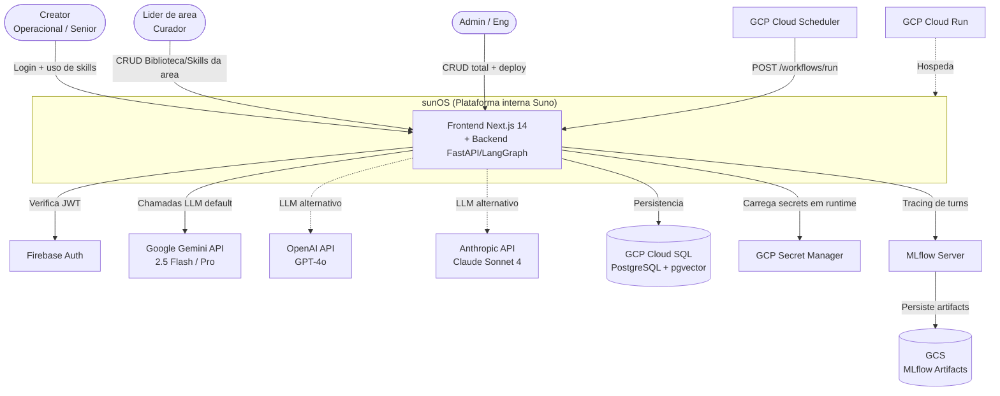
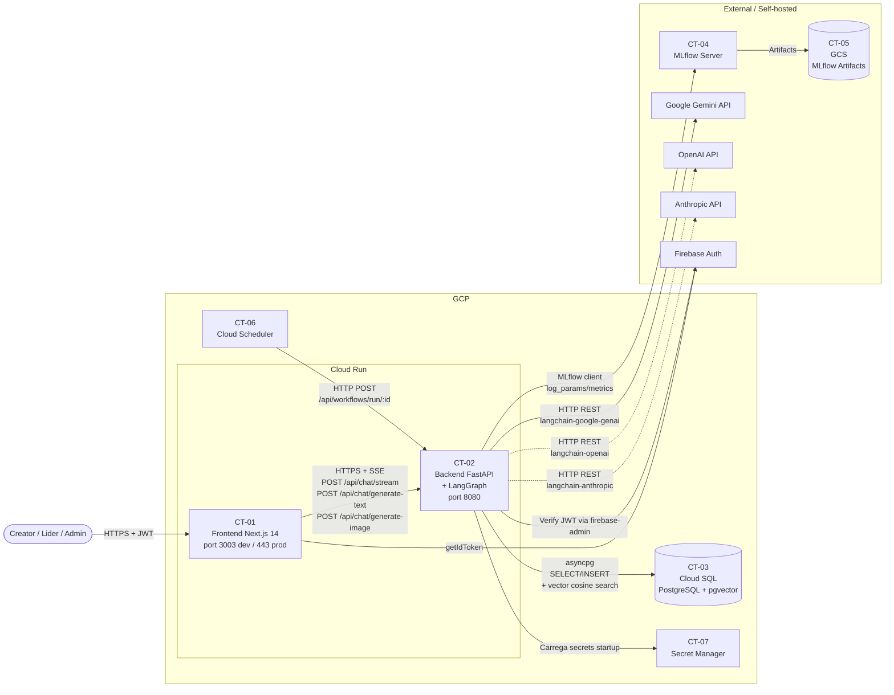

# SRD Parte 5 — Architecture As-Is

## 1. Introdução

### 1.1. Objetivo

Este documento descreve a **arquitetura atual (As-Is)** do sunOS — protótipo navegável já em desenvolvimento ativo (abril 2026) — fornecendo a baseline técnica para evolução planejada na Parte 6 (To-Be) e identificando componentes existentes, integrações e limitações observadas no código.

A documentação reflete o que **EXISTE em desenvolvimento/staging** na branch principal do monorepo `suno-os`, não o que está planejado. A Parte 6 (To-Be) capturará as evoluções decididas.

### 1.2. Escopo

- **C4 Level 1**: Context Diagram — atores e sistemas externos
- **C4 Level 2**: Container Diagram — frontend, backend, banco, MLflow, LLM providers
- **C4 Level 3**: Component Diagram — componentes internos do backend FastAPI
- **Stack tecnológica** detalhada por camada
- **Integrações atuais** (Firebase, GCP, LLM providers)
- **Limitações** e débitos técnicos visíveis no código
- **ADRs históricos**: ver Parte 7 (ADR-001, ADR-002 já aprovados)

### 1.3. Relação com Outros Artefatos

| Artefato | Relação |
|----------|---------|
| BRD Parte 1 (Contexto) | Define que sunOS é plataforma 100% interna da Suno |
| BRD Parte 3/4 (BR/RN) | NFRs derivam dessa baseline; Arch As-Is mostra gaps |
| SRD Parte 1 (NFRs) | Cada NFR é avaliado contra capacidade atual |
| SRD Parte 6 (To-Be) | Evolução planejada (próxima onda do SRD) |
| SRD Parte 7 (ADRs) | Decisões arquiteturais que moldaram o As-Is |

---

## 2. Contexto do Ambiente Atual

### 2.1. Visão Geral

O **sunOS** é um **protótipo navegável** já em estado funcional (abril 2026), desenvolvido como **monorepo** contendo frontend Next.js 14 e backend FastAPI/LangGraph como serviços separados. A plataforma é hospedada **100% no Google Cloud Platform** (Cloud Run para containers, Cloud SQL para PostgreSQL com pgvector, Secret Manager para credenciais, Cloud Scheduler para workflows agendados) e usa **Firebase Authentication** como provedor de identidade.

A arquitetura atual segue o princípio de **engine único multi-tenant** (formalizado em ADR-002): existe **um** orquestrador LangGraph que roteia intenções (criação / mídia / planejamento / conversação) e carrega skills sob demanda como **prompt + tools + references**, em vez de instanciar agentes separados por cliente. A personalização por cliente acontece via injeção de contexto (skill_slug, scope na Biblioteca, system_prompt override no SkillAdmin).

O frontend organiza navegação por **metáfora de Sistema Solar** (4 níveis: Home → Cliente → Skill → Chat/Moon) e contém módulos administrativos para CRUD de Skills, Clientes, Biblioteca e Workflows. A integração frontend↔backend é via HTTP REST + Server-Sent Events (SSE) para streaming de respostas de chat. Quando `NEXT_PUBLIC_API_URL` não está configurado, o frontend cai para **mock streaming** local — útil para desenvolvimento desconectado.

### 2.2. Stack Tecnológica Atual

#### Frontend

| Categoria | Tecnologia | Versão | Observações |
|-----------|------------|--------|-------------|
| Framework | Next.js (App Router) | 14.2.29 | TypeScript strict |
| Linguagem | TypeScript | ^5 | `tsc --noEmit` em CI |
| Estilização | Tailwind CSS | ^3.4.1 | + CSS variables (design system) |
| Ícones | lucide-react | ^0.468.0 | size 14, strokeWidth 1.5 |
| Auth client | firebase | ^12.11.0 | JWT obtido via `getIdToken()` |
| State | React Context | nativo | Sem Redux/Zustand |
| Porta dev | 3003 | — | 3000 ocupada |

#### Backend

| Categoria | Tecnologia | Versão | Observações |
|-----------|------------|--------|-------------|
| Linguagem | Python | 3.11+ | `.python-version` fixa |
| Framework HTTP | FastAPI | ≥0.115.0 | Lifespan + middleware |
| Orquestração | LangGraph | ≥0.4.1 | StateGraph |
| Integração LLM | LangChain | ≥0.3.40 | langchain-google-genai, langchain-openai, langchain-anthropic |
| ORM | SQLAlchemy | ≥2.0.25 | Async via asyncpg |
| Driver PG async | asyncpg | ≥0.30.0 | — |
| Vector | pgvector | (extensão PG) | Coluna `Vector(768)` em `knowledge_chunks` |
| Validação | Pydantic | ≥2.7.0 | + pydantic-settings ≥2.2.0 |
| Tracing | MLflow | ≥2.10.0 | `MLFLOW_TRACKING_URI` configurável |
| Auth backend | firebase-admin | ≥6.2.0 | Inicializado no lifespan |
| Package manager | uv | (Astral) | Ver Dockerfile multi-stage |
| Lint/format | ruff | ≥0.9.0 | E, F, I, W |
| Porta | 8080 | — | Cloud Run padrão |

#### Cloud / Plataforma

| Categoria | Tecnologia | Observações |
|-----------|------------|-------------|
| Compute | GCP Cloud Run | 2 serviços: frontend + backend |
| CI/CD | Cloud Build | `api/cloudbuild.yaml` |
| Banco | Cloud SQL (PostgreSQL) shared | + extensão pgvector |
| Secrets | GCP Secret Manager | API keys, DB password |
| Auth | Firebase Authentication | projeto `toolbox-67a0e` |
| Tracing | MLflow self-hosted | URI `http://localhost:5001` em dev |
| Storage MLflow | GCS `gs://toolbox-mlflow-artifacts/sunos` | — |
| Region default | `us-central1` | Definido em `config.py` |

#### LLM Providers

| Provider | Modelo default | Comentário |
|----------|----------------|------------|
| Google Gemini | `gemini-2.5-flash` | Default via `MODEL_MAP` |
| Google Gemini | `gemini-2.5-pro` | Disponível como `gemini-pro` |
| OpenAI | `gpt-4o` | Quando `OPENAI_API_KEY` definida |
| Anthropic | `claude-sonnet-4` | Quando `ANTHROPIC_API_KEY` definida |
| Fallback automático | Gemini Flash | Se key específica ausente |

### 2.3. Equipe e Capabilities

| Área | Capabilities Existentes | Gaps Identificados |
|------|------------------------|-------------------|
| Engenharia (4 devs) | Full-stack TS + Python; LangGraph; FastAPI; Cloud Run | Sem SDET dedicado; cobertura de testes baixa |
| Produto / Tutela | Heitor Miranda como tutor técnico/produto | Bottleneck para todas decisões arquiteturais |
| Design | Design system inicial (`design-system/`); CSS variables | UX research formal incipiente |
| MLOps | MLflow self-hosted; tracing decorator implementado | Sem dashboards de métricas LLM consolidados |
| Segurança | Firebase Auth; Secret Manager; CORS via Load Balancer (ADR-001) | RBAC ainda não aplicado nos endpoints |
| LGPD/Privacidade | Sem DPO formal (BRD §3.4); responsabilidade compartilhada | Política de retenção de dados pessoais a aprovar |

---

## 3. C4 Level 1 — Context Diagram (As-Is)

### 3.1. Descrição

O diagrama de contexto mostra o sunOS como um sistema central de IA usado internamente pelo grupo United Creators, com integrações a provedores externos de LLM, Firebase para autenticação, e GCP como provedor de infraestrutura.

### 3.2. Atores e Sistemas

| ID | Nome | Tipo | Descrição | Interações |
|----|------|------|-----------|------------|
| AC-01 | Creator (Operacional / Sênior) | Pessoa | Usuário primário; cria conteúdo via skills/chat | Login → navega Sistema Solar → executa skills |
| AC-02 | Líder de área (Curador) | Pessoa | Cura Biblioteca; configura skills da sua área | CRUD em Biblioteca, Skills (área), revisa logs |
| AC-03 | Admin (Eng/Heitor) | Pessoa | CRUD total; gerencia infraestrutura | CRUD total; deploy; ADRs |
| AS-01 | sunOS | Sistema (alvo) | Plataforma interna de IA | Gerencia skills, biblioteca, chat, workflows |
| AE-01 | Firebase Auth | Sistema externo (Google) | Provedor de identidade JWT | Emite tokens JWT verificados pelo backend |
| AE-02 | Google Gemini API | Sistema externo (Google) | LLM default (Gemini 2.5 Flash) | Chamadas via langchain-google-genai |
| AE-03 | OpenAI API | Sistema externo | LLM alternativo (GPT-4o) | Chamadas via langchain-openai |
| AE-04 | Anthropic API | Sistema externo | LLM alternativo (Claude Sonnet 4) | Chamadas via langchain-anthropic |
| AE-05 | GCP Cloud Run | Plataforma | Hospedagem de containers | Roda frontend e backend |
| AE-06 | GCP Cloud SQL | Plataforma | PostgreSQL gerenciado | Banco compartilhado com extensão pgvector |
| AE-07 | GCP Secret Manager | Plataforma | Cofre de credenciais | API keys, DB passwords |
| AE-08 | GCP Cloud Scheduler | Plataforma | Cron jobs gerenciados | Aciona workflows agendados (ADR-001) |
| AE-09 | MLflow Server | Sistema externo (self-hosted) | Tracing e eval | Recebe traces de chamadas LLM |
| AE-10 | GCS (MLflow artifacts) | Plataforma | Object storage | Artifacts de runs MLflow |

### 3.3. Diagrama C4 L1 (Mermaid)

---

## 4. C4 Level 2 — Container Diagram (As-Is)

### 4.1. Descrição

O sunOS é composto por **dois containers Cloud Run** principais (frontend Next.js e backend FastAPI), apoiados por **PostgreSQL** (Cloud SQL) e **MLflow self-hosted**. Comunicação frontend↔backend é via HTTPS com SSE para streaming.

### 4.2. Containers Existentes

| ID | Container | Tipo | Tecnologia | Responsabilidade | Dados |
|----|-----------|------|------------|------------------|-------|
| CT-01 | Frontend Next.js | App container | Next.js 14 + TS | UI Sistema Solar + admin CRUDs + chat client | Mock data em `data/`; sessão Firebase no browser |
| CT-02 | Backend API | App container | FastAPI + LangGraph | Endpoints chat (SSE), text/image gen, knowledge, workflows | — |
| CT-03 | PostgreSQL Cloud SQL | Database | PostgreSQL + pgvector | Persistência de conversations, knowledge_documents, knowledge_chunks (Vector 768), workflow definitions | Tabelas: conversations, chat_messages, knowledge_documents, knowledge_chunks |
| CT-04 | MLflow Server | Service | MLflow Tracking Server | Recebe traces de chamadas LLM com prompt/output/latency | Runs + metrics + params |
| CT-05 | GCS Bucket (MLflow) | Object storage | GCS | Artifacts de runs MLflow | `gs://toolbox-mlflow-artifacts/sunos` |
| CT-06 | Cloud Scheduler | Service GCP | Cron gerenciado | Dispara workflows recorrentes via HTTP POST | Definições de cron por workflow |
| CT-07 | Secret Manager | Service GCP | Cofre | Carrega API keys e credenciais em runtime | GOOGLE_API_KEY, OPENAI_API_KEY, ANTHROPIC_API_KEY, DB password |

### 4.3. Diagrama C4 L2 (Mermaid)

---

## 5. C4 Level 3 — Component Diagram (Backend FastAPI)

### 5.1. Descrição

Detalhamento dos principais componentes internos do backend (`api/`), agrupados por módulo, conforme `api/CLAUDE.md` e leitura direta do código.

### 5.2. Componentes Backend

| ID | Componente | Path | Responsabilidade |
|----|-----------|------|------------------|
| CP-01 | FastAPI App | `api/main.py` | Entrypoint; lifespan (Firebase + MLflow); middlewares (request_id, logging, CORS condicional em DEBUG); exception handlers globais |
| CP-02 | Settings | `api/config.py` | Pydantic BaseSettings; carrega `.env`; expõe `settings` singleton |
| CP-03 | Chat Router | `api/chat/router.py` | Endpoints: `POST /chat/stream` (SSE), `POST /chat/generate-text`, `POST /chat/enhance-prompt`, `POST /chat/generate-image`, `GET /chat/conversations` |
| CP-04 | Knowledge Router | `api/chat/knowledge/router.py` | CRUD de knowledge_documents, upload, busca via vector_store |
| CP-05 | Workflows Router | `api/workflows/router.py` | CRUD de WorkflowDefinition, execução, agendamento |
| CP-06 | Graph Builder | `api/chat/graph/builder.py` | Monta `StateGraph(SunosChatState)` com nós `top_supervisor`, `orchestrator`, `conversation`, `respond` |
| CP-07 | Top Supervisor | `api/chat/graph/top_supervisor.py` | Roteamento de intenção: short-circuit por skill_slug + fallback LLM classifier |
| CP-08 | Orchestrator | `api/chat/graph/orchestrator.py` | Carrega skill via `SkillLoader` + delega ao agente correto via `_INTENT_AGENT_MAP` |
| CP-09 | Graph Runner | `api/chat/graph/runner.py` | `_get_llm()` (multi-provider com fallback) + `run_chat_stream()` (async generator de SSEEvent) + `run_chat()` |
| CP-10 | State | `api/chat/graph/state.py` | `SunosChatState` TypedDict (messages, intent, agent, skill, context, model, params) |
| CP-11 | BaseAgent | `api/chat/agents/base.py` | ABC com `name`, `system_prompt`, `get_tools()`, `get_skill_references()`, `invoke()` + helper `run_react()` (loop ReAct até MAX_REACT_ROUNDS=5) |
| CP-12 | ContentCreatorAgent | `api/chat/agents/content_creator.py` | Agente para skills criativas (copy, roteiro, plano de mídia, etc.); usa `ALL_TOOLS` + `KNOWLEDGE_TOOLS` |
| CP-13 | ConversationalAgent | `api/chat/agents/conversational.py` | Agente para conversas gerais e fora-de-escopo |
| CP-14 | VisualCreatorAgent | `api/chat/agents/visual_creator.py` | Agente para geração visual (imagens, prompts visuais) |
| CP-15 | Skill Loader | `api/chat/skills/__init__.py` (+ subdirs) | Carrega `SKILL.md` + `references/*.md` por slug; injeta no system prompt |
| CP-16 | Tools — Chat | `api/chat/tools/chat_tools.py` | `chat_completion` para raciocínio profundo |
| CP-17 | Tools — Text | `api/chat/tools/text_tools.py` | `generate_text` (variations, tone, length, content_type) |
| CP-18 | Tools — Image | `api/chat/tools/image_tools.py` | `generate_image` (Imagen / fallback) |
| CP-19 | Tools — Prompt | `api/chat/tools/prompt_tools.py` | `enhance_prompt` para preparar prompts |
| CP-20 | Tools — Search | `api/chat/tools/search_tools.py` | `web_search` |
| CP-21 | Tools — Retry | `api/chat/tools/retry.py` | Helper de retry comum entre tools |
| CP-22 | Knowledge Tools | `api/chat/knowledge/document_search.py` | `search_knowledge`, `read_full_document`, `find_related_documents` (consumidos pelos agents) |
| CP-23 | Embeddings | `api/chat/knowledge/embeddings.py` | Gera embeddings (768 dims) via Google Embeddings ou similar |
| CP-24 | Vector Store | `api/chat/knowledge/vector_store.py` | `upsert_chunks`, `search_similar` (cosine via `<=>`), `delete_by_document`, `get_document_chunks` |
| CP-25 | Ingestion Processor | `api/chat/ingestion/processor.py` (+ tipos específicos) | Orquestra extração de PDFs/áudio/imagem/vídeo/texto + chunking + embedding + upsert |
| CP-26 | Ingestion — PDF/Audio/Image/Video/Text | `api/chat/ingestion/{pdf,audio,image,video,text}_processor.py` | Extratores especializados por tipo |
| CP-27 | Thumbnail Generator | `api/chat/ingestion/thumbnail.py` | Gera thumbnails de PDFs e mídia |
| CP-28 | MLflow Tracing | `api/chat/eval/tracing.py` | Decorator `trace_chat_turn` (no-op se MLflow indisponível) |
| CP-29 | Scorers | `api/chat/eval/scorers.py` | Avaliação automática de qualidade de outputs |
| CP-30 | Trajectory | `api/chat/eval/trajectory.py` | Rastreamento de trajetória multi-step |
| CP-31 | Conversation Store | `api/chat/conversation_store.py` | Persistência de conversations + chat_messages no PostgreSQL |
| CP-32 | Models — Conversation | `api/models/conversation.py` | SQLAlchemy: `Conversation` (id, user_id, skill_slug, state JSON), `ChatMessage` |
| CP-33 | Models — Knowledge | `api/models/knowledge.py` | SQLAlchemy: `KnowledgeDocument`, `KnowledgeChunk` (com `Vector(768)`) |
| CP-34 | Models — Base | `api/models/base.py` | DeclarativeBase do SQLAlchemy |
| CP-35 | Firebase Core | `api/core/firebase.py` | `get_firebase_app()` — inicializa Firebase Admin SDK |
| CP-36 | Workflows — Compiler | `api/workflows/compiler.py` | Compila `WorkflowDefinition` em `StateGraph` runtime (ADR-001) |
| CP-37 | Workflows — Executor | `api/workflows/executor.py` | Executa graph compilado; aplica timeout/retry |
| CP-38 | Workflows — Scheduler | `api/workflows/scheduler.py` | Integração com Cloud Scheduler |
| CP-39 | Workflows — Models/Schemas | `api/workflows/{models,schemas}.py` | SQLAlchemy + Pydantic para WorkflowDefinition |

### 5.3. Diagrama C4 L3 — Backend (Mermaid simplificado)

```mermaid
flowchart TB
    main[CP-01 main.py<br/>FastAPI App]
    cfg[CP-02 config.py]

    subgraph routers["Routers"]
        chatR[CP-03 chat/router.py]
        knowR[CP-04 knowledge/router.py]
        wfR[CP-05 workflows/router.py]
    end

    subgraph graph["LangGraph"]
        builder[CP-06 builder.py]
        topsup[CP-07 top_supervisor.py]
        orch[CP-08 orchestrator.py]
        runner[CP-09 runner.py]
        state[CP-10 state.py]
    end

    subgraph agents["Agents"]
        base[CP-11 BaseAgent]
        cca[CP-12 ContentCreatorAgent]
        conv[CP-13 ConversationalAgent]
        vca[CP-14 VisualCreatorAgent]
    end

    subgraph skills["Skills"]
        loader[CP-15 SkillLoader]
        sk_copy[copy-social/]
        sk_video[roteiro-de-video/]
        sk_radio[texto-de-radio/]
        sk_midia[plano-de-midia/]
        sk_report[report-performance/]
        sk_persona[persona-sintetica/]
        sk_brief[brief-builder/]
        sk_market[analise-de-mercado/]
    end

    subgraph tools["Tools"]
        t_chat[CP-16 chat_tools]
        t_text[CP-17 text_tools]
        t_img[CP-18 image_tools]
        t_prompt[CP-19 prompt_tools]
        t_search[CP-20 search_tools]
        t_retry[CP-21 retry]
    end

    subgraph knowledge["Knowledge"]
        kn_tools[CP-22 document_search<br/>KNOWLEDGE_TOOLS]
        kn_emb[CP-23 embeddings]
        kn_vec[CP-24 vector_store<br/>pgvector cosine]
    end

    subgraph ingest["Ingestion"]
        ing_proc[CP-25 processor]
        ing_pdf[CP-26 pdf_processor]
        ing_audio[CP-26 audio_processor]
        ing_img[CP-26 image_processor]
        ing_vid[CP-26 video_processor]
        ing_txt[CP-26 text_processor]
        ing_thumb[CP-27 thumbnail]
    end

    subgraph eval["Eval / Tracing"]
        tr[CP-28 tracing<br/>MLflow decorator]
        sc[CP-29 scorers]
        tj[CP-30 trajectory]
    end

    subgraph store["Persistence"]
        cs[CP-31 conversation_store]
        m_conv[CP-32 models/conversation]
        m_kn[CP-33 models/knowledge]
        m_base[CP-34 models/base]
        fbc[CP-35 core/firebase]
    end

    subgraph wf["Workflows"]
        wf_comp[CP-36 compiler]
        wf_exec[CP-37 executor]
        wf_sched[CP-38 scheduler]
        wf_mod[CP-39 models/schemas]
    end

    main --> cfg
    main --> chatR
    main --> knowR
    main --> wfR
    main --> fbc

    chatR --> runner
    runner --> builder
    builder --> topsup
    builder --> orch
    builder --> state
    orch --> loader
    loader --> sk_copy
    loader --> sk_video
    loader --> sk_radio
    loader --> sk_midia
    loader --> sk_report
    loader --> sk_persona
    loader --> sk_brief
    loader --> sk_market
    orch --> agents
    cca --> base
    conv --> base
    vca --> base
    base --> tools
    cca --> kn_tools

    knowR --> kn_vec
    knowR --> kn_emb
    knowR --> ing_proc
    ing_proc --> ing_pdf
    ing_proc --> ing_audio
    ing_proc --> ing_img
    ing_proc --> ing_vid
    ing_proc --> ing_txt
    ing_proc --> ing_thumb
    ing_proc --> kn_emb
    ing_proc --> kn_vec

    runner --> tr
    tr --> sc
    tr --> tj

    chatR --> cs
    cs --> m_conv
    kn_vec --> m_kn
    m_conv --> m_base
    m_kn --> m_base

    wfR --> wf_comp
    wfR --> wf_exec
    wf_comp --> builder
    wf_exec --> wf_sched
    wf_exec --> wf_mod
```

### 5.4. Componentes Frontend (visão de alto nível)

| ID | Componente | Path | Responsabilidade |
|----|-----------|------|------------------|
| FE-01 | Layout root | `app/layout.tsx` | RootLayout + Providers |
| FE-02 | Home (Sistema Solar) | `app/page.tsx` | Renderização do orbital system com clientes |
| FE-03 | Cliente | `app/[clientSlug]/` | Nível 2 (planeta) |
| FE-04 | Login | `app/login/` | Autenticação Firebase |
| FE-05 | Skills Admin | `app/skills/` | CRUD de skills |
| FE-06 | Biblioteca | `app/biblioteca/` | CRUD de documentos |
| FE-07 | Clientes Admin | `app/clientes/` | CRUD de clientes |
| FE-08 | Workflows | `app/workflows/` | CRUD de workflows + builder |
| FE-09 | Design System | `app/design-system/` | Showcase de componentes |
| FE-10 | API client | `lib/api.ts` | `consumeSSE()`, `generateText`, `generateImage`, `enhancePrompt`, auth headers |
| FE-11 | Firebase client | `lib/firebase.ts` | `getFirebase()`, `auth.currentUser` |
| FE-12 | Sistema Solar | `components/solar/*` | OrbitalSystem, PlanetNode, MoonNode, OrbitRing, CenterNode, FilterPills, QuickStats, SkillGroup, TinyMoon |
| FE-13 | Layout chrome | `components/layout/*` | AppShell, AppHeader, Sidebar, AuthGuard, BackButton, Breadcrumb, Logo, ChatPanel, Providers, ThemeProvider |
| FE-14 | Chat UI | `components/chat/*` | ChatInterface, ChatInput, MessageBubble, ContextSidebar, FeedbackInline, ImageGenPanel, ModelSelector, PromptTemplateBar, ResultActions, SocialPreview, StreamingIndicator, TextGenPanel, VariationCards |
| FE-15 | Admin (Skills) | `components/admin/*` | SkillCard, SkillDrawer, SkillEditor, SkillEditorTabs, SkillsSidebar, SkillsTable, SkillFilters, ClientsTab, ConfigTab, IdentityTab, MoonsTab, VersionHistoryModal |
| FE-16 | Biblioteca UI | `components/biblioteca/*` | BibliotecaCard, BibliotecaDrawer, BibliotecaFilters, BibliotecaModal, BibliotecaSidebar, BibliotecaTable, FileTypeIcon, ScopePills, TagInput |
| FE-17 | Clientes UI | `components/clientes/*` | ClientCard, ClientDrawer, ClientEditor, ClientEditorTabs |
| FE-18 | Workflows UI | `components/workflows/*` | WorkflowBuilder, WorkflowCard, WorkflowDrawer, WorkflowRunTimeline, WorkflowStepEditor, WorkflowTable, WorkflowTemplates |
| FE-19 | UI primitivas | `components/ui/*` | Toast |

### 5.5. Skills Existentes (8 slugs)

Carregadas pelo `SkillLoader` em `api/chat/skills/`:

| Slug | Intenção (TopSupervisor) | Diretório |
|------|--------------------------|-----------|
| copy-social | criacao | `chat/skills/copy-social/` |
| roteiro-de-video | criacao | `chat/skills/roteiro-de-video/` |
| texto-de-radio | criacao | `chat/skills/texto-de-radio/` |
| plano-de-midia | midia | `chat/skills/plano-de-midia/` |
| report-performance | midia | `chat/skills/report-performance/` |
| persona-sintetica | planejamento | `chat/skills/persona-sintetica/` |
| brief-builder | planejamento | `chat/skills/brief-builder/` |
| analise-de-mercado | planejamento | `chat/skills/analise-de-mercado/` |

Cada skill contém `SKILL.md` + diretório `references/` (progressive disclosure de domain knowledge).

---

## 6. Integrações Atuais

### 6.1. Mapa de Integrações

| ID | Origem | Destino | Método | Frequência | Dados | Status |
|----|--------|---------|--------|------------|-------|--------|
| INT-AS-01 | Frontend Next.js | Backend FastAPI | HTTPS REST + SSE | Síncrono (per request) | message, skill_slug, model, context_documents | Ativo |
| INT-AS-02 | Frontend | Firebase Auth | Firebase JS SDK | Per-login + token refresh | Email/password, JWT | Ativo |
| INT-AS-03 | Backend | Firebase Auth | firebase-admin (verify_id_token) | Per request | JWT validation | **Implementado, dependency ainda não aplicada nos routers** |
| INT-AS-04 | Backend | Google Gemini API | langchain-google-genai (HTTPS) | Per chat turn | prompt, params | Ativo (default) |
| INT-AS-05 | Backend | OpenAI API | langchain-openai (HTTPS) | Per chat turn (opt-in) | prompt, params | Ativo quando key configurada |
| INT-AS-06 | Backend | Anthropic API | langchain-anthropic (HTTPS) | Per chat turn (opt-in) | prompt, params | Ativo quando key configurada |
| INT-AS-07 | Backend | Cloud SQL PostgreSQL | asyncpg | Per request | conversations, knowledge_documents, knowledge_chunks (vetor 768d) | Ativo |
| INT-AS-08 | Backend | MLflow Server | mlflow client (HTTP) | Per chat turn (decorator) | params, metrics, run_name | Implementado (no-op se ausente) |
| INT-AS-09 | MLflow Server | GCS bucket | Storage SDK | Per artifact | Run artifacts | Configurado |
| INT-AS-10 | Cloud Scheduler | Backend `/api/workflows/run/:id` | HTTP POST | Cron por workflow | workflow_id | Ativo (ADR-001) |
| INT-AS-11 | Backend | Secret Manager | google-cloud-secret-manager | Startup (lifespan) | API keys, DB password | Configurável (depende do ambiente) |
| INT-AS-12 | Cloud Run Load Balancer | Frontend/Backend | HTTPS | Sempre | Tráfego HTTP | Ativo (CORS gerenciado aqui — ADR-001) |

### 6.2. Problemas Conhecidos

| ID | Integração | Problema | Impacto | Workaround Atual |
|----|------------|----------|---------|------------------|
| PRB-01 | INT-AS-03 (JWT validation) | `firebase-admin` está disponível em `core/firebase.py` mas não há dependency `Depends(get_current_user)` aplicado nas rotas — endpoints estão **abertos em DEBUG** e em prod dependem do Load Balancer | Alto — viola NFR-008 quando frontend não envia JWT | Acordo informal de não bater no backend de fora; bloquear via VPC/IAP em prod |
| PRB-02 | INT-AS-08 (MLflow) | URI default `http://localhost:5001` em `config.py`; em prod precisa apontar para servidor self-hosted ou Vertex AI Experiments | Médio — sem traces em prod até infra subir | Decorator é no-op se import falha; `WARN` log apenas |
| PRB-03 | INT-AS-04/05/06 (LLMs) | Sem circuit breaker dinâmico — `_get_llm` faz fallback estático para Gemini se key específica ausente, mas não detecta falha em runtime para alternar provider | Médio — degradação não é elegante em outage de provider | Retry tool existente (`tools/retry.py`) trata falhas pontuais |
| PRB-04 | INT-AS-07 (PostgreSQL) | `vector_store.py` cria sessão a cada chamada (sem pool reutilizado); `_get_async_session()` retorna `None` silenciosamente em falha | Médio — pode degradar latência sob carga | Aceitável em volume atual de protótipo |
| PRB-05 | INT-AS-01 (frontend ↔ backend) | Quando `NEXT_PUBLIC_API_URL` ausente, frontend cai para mock; transição mock→real precisa toggle manual | Baixo — comportamento esperado em dev | Documentado em CLAUDE.md raiz |

---

## 7. Limitações e Débitos Técnicos

### 7.1. Limitações do Ambiente Atual

| ID | Área | Limitação | Impacto no Negócio | Criticidade |
|----|------|-----------|-------------------|:-----------:|
| LIM-01 | Auth | Dependency de auth não aplicada nos routers FastAPI; em DEBUG mode CORS aberto para localhost:3003/3000 | Viola NFR-008 (Firebase JWT) e RN-009 (RBAC) | Alta |
| LIM-02 | RBAC | Não há modelo de Role no banco; perfis (Admin/Líder/Operacional) só existem conceitualmente | Bloqueia BR-007 e RN-009/011 | Alta |
| LIM-03 | Vector search | Único índice (provavelmente IVFFlat default) sem tuning; performance > 100K chunks não validada | Risco de latência > NFR-003 (P95 < 300ms) | Média |
| LIM-04 | Tracing | `trace_chat_turn` decorator não está aplicado em todas as funções de runner (atual aplicação parcial) | Viola NFR-026 (100% das chamadas LLM) | Alta |
| LIM-05 | LGPD | Sem política formal de retenção/anonimização de logs LLM | Bloqueia Piloto até aprovação Diretoria | Alta |
| LIM-06 | Testes | Cobertura de testes muito baixa (sem suite extensiva visível em `api/`); risco de regressão em refactors | Risco para BR-015 (não regredir Skills existentes) | Média |
| LIM-07 | Secrets | `.env.local` no repo (com `.gitignore` correto, mas ainda assim risco de exposure) | Médio — disciplina manual; ideal mover para Secret Manager 100% | Média |
| LIM-08 | Frontend mock fallback | Se `NEXT_PUBLIC_API_URL` ausente, UI parece funcionar mas executa lógica mocada | Confusão em demos / bug-reporting | Baixa |
| LIM-09 | LLM cost guardrail | Sem rate limiting por usuário ou budget cap; um workflow agendado pode explodir custo | Risco operacional | Média |
| LIM-10 | Knowledge embeddings | Modelo de embedding (768 dims) hardcoded em `Vector(768)`; trocar dimensão exige migration | Lock-in técnico | Baixa |
| LIM-11 | Conversation persistence | `chat_messages.role` aceita strings livres ("user", "assistant", "tool", "system") — sem enum tipado | Baixo risco de inconsistência | Baixa |
| LIM-12 | Observabilidade | Logs estruturados via `logging.basicConfig` (formato simples); sem JSON logs nem campos correlacionados (request_id existe no middleware mas não atravessa LangGraph) | Dificulta debugging em prod | Média |

### 7.2. Débitos Técnicos

| ID | Débito | Causa Raiz | Esforço para Resolver | Prioridade |
|----|--------|------------|----------------------|:----------:|
| DT-01 | Aplicar `Depends(get_current_user)` em todos endpoints `/api/*` | Auth foi deixada para "depois" no protótipo inicial | M (1-2 sprints) | Alta |
| DT-02 | Modelar tabelas `users` e `roles` + enforcement RBAC server-side | RBAC só foi acordado conceitualmente | L (3-4 sprints) | Alta |
| DT-03 | Tunar índice pgvector (HNSW vs IVFFlat) e medir P95 | Sem dataset representativo ainda | M | Média |
| DT-04 | Aplicar `trace_chat_turn` consistentemente + adicionar custo LLM estimado | Decorator existe, falta plumbing | S | Alta |
| DT-05 | Suite de testes (pytest backend + jest/vitest frontend) com smoke E2E | Time pequeno, prazos curtos do protótipo | L | Média |
| DT-06 | Migrar 100% dos secrets para Secret Manager + remover `.env.local` do filesystem em dev | Comodidade de dev | S | Média |
| DT-07 | Connection pool reutilizado em `vector_store.py` | Implementação inicial criou engine a cada chamada | S | Média |
| DT-08 | Logs JSON estruturados + propagação de `request_id` pelo LangGraph state | logging básico foi suficiente até agora | M | Média |
| DT-09 | Circuit breaker para fallback dinâmico entre LLM providers | Apenas fallback estático implementado | M | Média |
| DT-10 | Rate limiting + budget cap por usuário/workflow | Sem necessidade no volume atual | M | Média |

### 7.3. Riscos do Estado Atual

| ID | Risco | Probabilidade | Impacto | Mitigação Atual |
|----|-------|:-------------:|:-------:|-----------------|
| RSK-01 | Endpoint exposto sem auth em rede acidentalmente acessível | Baixa | Alto | VPC + Load Balancer + acordo informal |
| RSK-02 | Cross-client leak via skill mal-curada (sem `scope` correto) | Média | Alto | Curadoria manual da Biblioteca; auditoria mensal |
| RSK-03 | Custo LLM explode com adoção rápida | Média | Alto | Monitoramento manual de billing GCP; sem cap automático |
| RSK-04 | LGPD: log LLM contém dado pessoal de cliente sem política de retenção | Alta | Alto | Política em construção (PA-07 do BRD) |
| RSK-05 | Bug em ContentCreatorAgent regride skills existentes | Média | Médio | Smoke tests manuais antes de release |
| RSK-06 | MLflow indisponível: tracing perdido sem alerta | Alta | Médio | Decorator é no-op silencioso (acumula gap até Piloto) |
| RSK-07 | Gemini Flash latência sobe na região e quebra NFR-001 | Média | Médio | Fallback estático para Gemini permanece — sem switch dinâmico de provider |

---

## 8. ADRs Históricos

### 8.1. Decisões Arquiteturais Já Aceitas

Os ADRs detalhados estão em `/Users/heitor.miranda/projects/suno-os/docs/adr/` e catalogados na **Parte 7 (ADRs)** deste SRD. Sumário:

| ADR | Título | Status | Data | Impacto na Arch As-Is |
|-----|--------|--------|------|----------------------|
| ADR-001 | Agent/Workflow Builder com LangGraph como engine | Aceito (revisado) | 2026-04-14 | Justifica reutilização do mesmo `StateGraph` para chat e workflows; CORS no Load Balancer |
| ADR-002 | Engine único com context injection (não Deep Agent por cliente) | Aceito | 2026-04-14 | Determina topologia atual: `top_supervisor → orchestrator → agent` único, com personalização via `skill_slug` + `scope` + `client_id` |

### 8.2. Lições Aprendidas

| ID | Lição | Contexto | Recomendação para To-Be |
|----|-------|----------|------------------------|
| LL-01 | Engine único é mais simples e mais consistente do que N agentes por cliente | Decisão revisada na reunião de arquitetura abril 2026 | Manter em todos os roadmaps; só revisitar se cliente exigir workflow radicalmente diferente |
| LL-02 | LangGraph dá escalabilidade desde o dia zero — workflows e chat compartilham infraestrutura | Discussão Heitor + José Lucas + William | Continuar usando LangGraph como engine único |
| LL-03 | Time pequeno (4 devs) é razão para empoderar usuários técnicos com Workflow Builder, não para evitar | Reframing do ADR-001 | Priorizar self-service para analistas |
| LL-04 | Mock fallback no frontend acelera desenvolvimento mas pode confundir em demos | `lib/api.ts:apiAvailable()` | Toggle visível na UI quando em modo mock (sugestão para To-Be) |

---

## 9. Implicações para a Solução To-Be

A Parte 6 (Architecture To-Be) detalhará a evolução. Como visão preliminar derivada do gap entre As-Is e NFRs (Parte 1):

### 9.1. O que Será Mantido

| Componente | Motivo | Integração com To-Be |
|------------|--------|---------------------|
| Engine único LangGraph (top_supervisor + orchestrator + agents) | ADR-002 valida; alta coesão; baixa duplicação | Permanece como núcleo; novas skills são plugins |
| Stack Next.js 14 + FastAPI/Python 3.11 | Time já dominou; padrão Koro alinha com Meridian | Sem mudança |
| PostgreSQL + pgvector | ADR implícito a formalizar (ver Parte 7); evita lock-in vector DB | Manter; só revisitar se NFR-003 quebrar |
| Cloud Run + Secret Manager + Cloud Scheduler | Infra GCP padronizada Suno | Manter |
| Firebase Authentication | Padrão Toolbox; integrado | Manter; aplicar dependency em todas rotas |
| MLflow self-hosted | Tracing já parcial | Expandir cobertura para 100% (NFR-026) |

### 9.2. O que Será Substituído / Reforçado

| Componente | Motivo | Substituído / Reforçado por |
|------------|--------|------------------------------|
| Auth aberto em DEBUG | Viola NFR-008/009 | Dependency `get_current_user` obrigatória + RBAC server-side com tabelas `users`/`roles` |
| Logs `logging.basicConfig` simples | Dificulta debug em prod | Logs JSON estruturados + `request_id` propagado no LangGraph state |
| Fallback estático LLM | Sem resiliência dinâmica | Circuit breaker + fallback dinâmico baseado em saúde do provider |
| Cobertura de testes ad-hoc | Risco de regressão | Suíte pytest + smoke E2E mínima (NFR-014) |

### 9.3. O que Será Adicionado

| Componente | Motivo | Dependências |
|------------|--------|--------------|
| Tabelas `users`, `roles`, `audit_log` | RBAC + auditoria (RN-009, RN-012) | Migrations Alembic |
| Pipeline contínuo de métricas de homogeneização (NFR-027) | BR-014 + RN-019 | Dataset histórico + scheduler |
| Cálculo automático de custo evitado (NFR-028) | BR-013 + RN-018 | Baseline de tarefas (planilha ROI) |
| Rate limiting + budget cap | Risco operacional (RSK-03) | Middleware FastAPI |
| Marcação visual de outputs IA + confirmação de ownership (RN-014) | NFR-021 | Componentes em `components/chat/*` |
| Validação automática de copy contra Glossário (RN-016) | NFR-020 | Lint custom em CI |

---

## 10. Assunções e Lacunas

### 10.1. Assunções sobre o Ambiente Atual

| ID | Assunção | Impacto se Falsa | Status |
|----|----------|------------------|--------|
| ASS-AS-01 | Cloud SQL atual tem extensão pgvector habilitada | Alto — bloqueia knowledge | A confirmar com infra |
| ASS-AS-02 | Cloud Run autoscaling está configurado para min_instances ≥ 1 (evitar cold start em horário comercial) | Médio — afeta NFR-001 | A validar |
| ASS-AS-03 | Firebase project `toolbox-67a0e` está compartilhado com Toolbox e tem cota suficiente | Baixo — pode requerer migration para project dedicado | Validar com Heitor |
| ASS-AS-04 | MLflow self-hosted tem capacidade para volume previsto (Piloto: ~1000 turns/dia) | Médio — pode requerer Vertex AI Experiments | A medir |
| ASS-AS-05 | CORS no Load Balancer está corretamente configurado para frontend domain | Médio — quebra integração se não | A confirmar com infra (ADR-001) |
| ASS-AS-06 | Time de 4 devs sustenta velocity com débitos técnicos atuais | Médio | Acompanhar mensalmente |

### 10.2. Lacunas de Informação

| ID | Lacuna | Informação Necessária | Fonte |
|----|--------|----------------------|-------|
| TODO-AS-01 | Volume de tráfego atual (turns/dia, MAU) | Métricas Cloud Run + MLflow | Time backend / SRE |
| TODO-AS-02 | Latência real P95 first-token em produção | Medição em staging | Time backend |
| TODO-AS-03 | Quantidade atual de chunks indexados | Query em `knowledge_chunks` | Time backend |
| TODO-AS-04 | Custo mensal LLM atual | Billing GCP + dashboards LLM providers | Heitor / CFO |
| TODO-AS-05 | Configuração efetiva do índice pgvector (HNSW/IVFFlat, parâmetros) | DDL atual | Time backend |
| TODO-AS-06 | Setup de ALB / Load Balancer e regras CORS | Config de infra | Time SRE |
| TODO-AS-07 | Lista de workflows ativos hoje (se algum) | Tabela `workflow_definitions` | Time backend |

---

## Histórico de Versões

| Versão | Data | Autor | Alterações |
|--------|------|-------|------------|
| 1.0 | 2026-04-28 | Heitor Miranda + Claude | Versão inicial. C4 L1/L2/L3 documentando arquitetura atual em desenvolvimento (Next.js 14 + FastAPI/LangGraph + PostgreSQL/pgvector + MLflow + Cloud Run). Inventário completo de 39 componentes backend (CP-01 a CP-39) e 19 grupos de componentes frontend (FE-01 a FE-19). 12 integrações catalogadas, 12 limitações observadas, 10 débitos técnicos priorizados, 7 riscos mapeados. Diagramas Mermaid de Contexto, Containers e Componentes. Referências cruzadas a ADR-001 e ADR-002. Status: Rascunho. |
