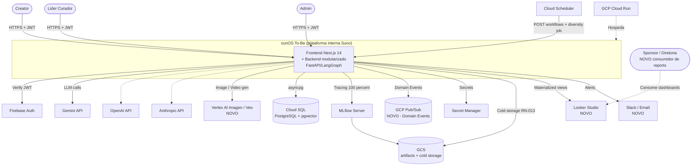
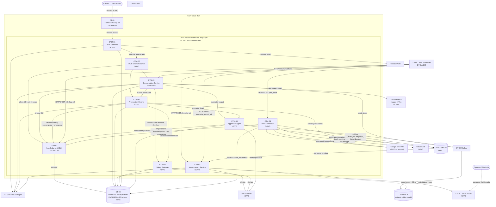
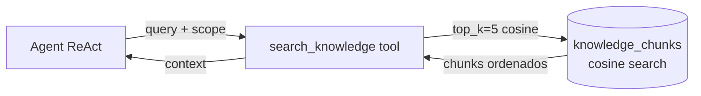
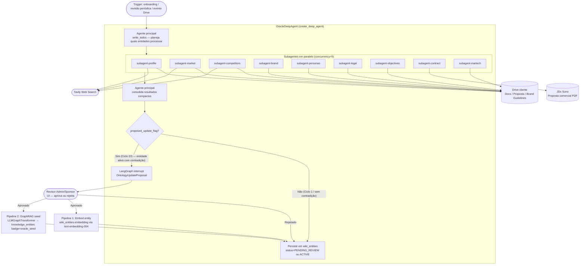
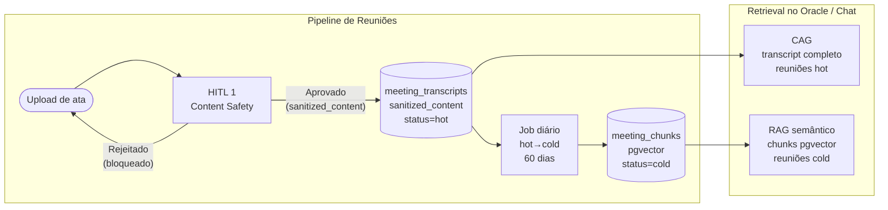
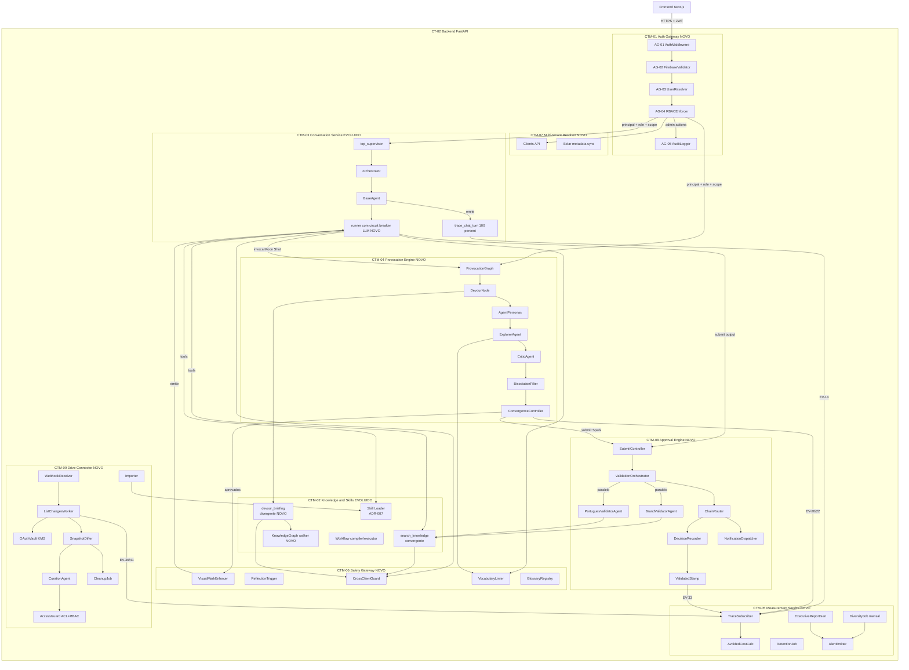

# SRD Parte 6 — Architecture To-Be

## 1. Introdução

### 1.1. Objetivo

Este documento define a **arquitetura proposta (To-Be) do sunOS**, especificando containers, componentes e integrações necessários para evoluir a baseline da **Parte 5 (As-Is)** rumo a um sistema que atende:

- Os **28 NFRs** ISO 25010 (Parte 1)
- Os **42 objetos de domínio** em **6 Bounded Contexts** (Parte 2)
- As **32 tabelas** do Data Model (Parte 3)
- Os **7 ADRs** já catalogados (Parte 7), e propõe **3 novos ADRs** decorrentes da evolução

A arquitetura é apresentada em **C4 Model** (Context, Containers, Components), com **diff explícito vs. As-Is** (Parte 5) — cada novo container/componente é marcado como `[NOVO]` ou `[EVOLUÍDO]`, e cada container existente que permanece sem mudança é marcado `[MANTIDO]`.

### 1.2. Escopo

- **C4 Level 1** — Context (atores e sistemas externos): poucas mudanças vs. As-Is
- **C4 Level 2** — Containers (deploy units): adicionar **Provocation Engine**, **Measurement Service**, **Safety Gateway**, **Auth Gateway** — quebrar monólito FastAPI em módulos com fronteiras Bounded Context
- **C4 Level 3** — Componentes (módulos internos): novos componentes para Moon Shot (Explorer, Crítico, Bisociation Filter), Mensuração (Diversity Job, Avoided Cost Calculator), Safety (Visual Mark Enforcer, Reflection Trigger, Cross-client Guard, Vocabulary Linter), e mudança de retrieval (convergente vs. divergente)
- **Integrações de alto nível**
- **Diff explícito As-Is → To-Be**

### 1.3. Relação com Outros Artefatos

| Artefato | Relação |
|----------|---------|
| SRD Parte 1 (NFRs) | Cada NFR mapeia ≥1 container/componente |
| SRD Parte 2 (Domain Model) | Bounded Contexts → módulos arquiteturais |
| SRD Parte 3 (Data Model) | Containers consomem tabelas específicas |
| SRD Parte 5 (As-Is) | Baseline de evolução (diff explícito) |
| SRD Parte 7 (ADRs) | Decisões arquiteturais — referenciadas, **não duplicadas** |
| PRD Parte 1 (Features) | Cada FA-XX é entregue por containers/componentes |

---

## 2. Visão Geral

### 2.1. Resumo Executivo

A arquitetura To-Be **mantém os pilares estabelecidos no As-Is** (Next.js 14 + FastAPI/LangGraph + PostgreSQL/pgvector + MLflow + Cloud Run, conforme ADR-001 a ADR-007) e **acrescenta 4 containers/módulos novos** que materializam capacidades hoje ausentes ou parciais:

1. **Provocation Engine** (BC-04, FA-02) — implementa o motor Moon Shot (Explorer ↔ Crítico, filtragem por zona de bisociação) que hoje só existe conceitualmente
2. **Measurement Service** (BC-05, FA-10/FA-11) — calcula avoided cost, diversity metrics e gera executive reports — endereça NFR-027/NFR-028 e RN-019/RN-020
3. **Safety Gateway** (BC-05, FA-11) — valida invariantes culturais e operacionais antes de exposição ao usuário (visual mark, reflection trigger, vocabulary linter, cross-client guard) — endereça RN-014/RN-015/RN-016/RN-020
4. **Auth Gateway** (BC-01, FA-09) — formaliza autenticação Firebase JWT como dependência obrigatória + RBAC server-side com `users`/`roles`/`audit_log` — endereça LIM-01, LIM-02, NFR-008/NFR-009

Em paralelo, o componente de **retrieval evolui** para suportar dois modos: **convergente** (já existe — `search_knowledge` para Skills processuais) e **divergente** (novo — para Moon Shot: knowledge graph + sampling em zona Sweet Spot). O backend FastAPI permanece **engine único** (ADR-002), mas é organizado internamente em **módulos por Bounded Context** com APIs explícitas entre eles, preparando split físico futuro caso necessário.

### 2.2. Objetivos Arquiteturais

| ID | Objetivo | Derivado de | Prioridade |
|----|----------|-------------|:----------:|
| OBJ-01 | Multi-tenancy seguro com isolamento cross-client | NFR-010, RN-010 | Alta |
| OBJ-02 | Latência percebida <1500ms first-token + retrieval <300ms | NFR-001, NFR-003 | Alta |
| OBJ-03 | RBAC server-side com 3 perfis e auditabilidade | NFR-008, NFR-009, RN-009, RN-012 | Alta |
| OBJ-04 | Observabilidade 100% via MLflow + dashboards | NFR-026, BR-009 | Alta |
| OBJ-05 | Pipeline Moon Shot com filtragem por zona Sweet Spot | NFR-024, BR-001, RN-001/002 | Alta |
| OBJ-06 | Mensuração contínua de homogeneização e custo evitado | NFR-027, NFR-028, BR-013/014, RN-018/019/020 | Alta |
| OBJ-07 | Safety cultural e ownership preservados na UX | NFR-021, BR-010, RN-014/015 | Alta |
| OBJ-08 | Resiliência a falhas LLM (fallback dinâmico) | NFR-006, RSK-07 | Média |
| OBJ-09 | Modularidade por Bounded Context para evolução | DDD (Parte 2) | Média |

### 2.3. Princípios Arquiteturais

| Princípio | Descrição | Justificativa |
|-----------|-----------|---------------|
| **Engine único, módulos por contexto** | LangGraph engine único (ADR-002) organizado internamente por Bounded Contexts (Parte 2) | Coesão sem multiplicar deploys |
| **Default-deny no RBAC** | Toda rota protegida; ambiguidade resolve negando | RN-009 |
| **Caixa-preta por design** | Operacionais nunca veem Biblioteca, system prompts ou referências | RN-011 |
| **Streaming first** | SSE como contrato primário do chat (LangGraph `astream`) | NFR-001 |
| **Hexagonal interna** | Cada módulo expõe portas; tools são adaptadores | Testabilidade + evolução |
| **Event-driven nas fronteiras** | Domain Events publicados via tópicos (Pub/Sub ou DB triggers) entre BCs | Desacoplamento |
| **Privacy by design** | Anonimização nos traces; retenção 12m ativa, depois cold (RN-013) | LGPD |
| **Pgvector único** (revisitar em > 1M chunks) | ADR-003 | Operação simples |

---

## 3. C4 Level 1 — Context Diagram (To-Be)

### 3.1. Diff vs. As-Is

| Item | As-Is | To-Be | Mudança |
|------|-------|-------|---------|
| Atores | Creator, Líder, Admin | Creator, Líder, Admin **+ Sponsor/Diretoria como consumidores de Executive Reports** | [NOVO ator] |
| Sistemas externos | Firebase Auth, Gemini, OpenAI, Anthropic, GCP Cloud Run/SQL/Scheduler/Secret Manager, MLflow, GCS | + **Vertex AI Imagen/Veo (FA-08)**, **Cloud Pub/Sub (eventos)**, **Looker Studio (Executive Reports)**, **Slack/Email (alertas)** | [NOVOS] |

### 3.2. Atores e Sistemas

| ID | Nome | Tipo | Descrição | Interações | Estado |
|----|------|------|-----------|------------|--------|
| AC-01 | Creator | Pessoa | Usuário primário | Login → Sistema Solar → Skills/Shoot | [MANTIDO] |
| AC-02 | Líder/Curador | Pessoa | Cura Biblioteca, Skills da área | CRUD em Biblioteca + Skills + revisa Reflection Moments + audit | [MANTIDO] |
| AC-03 | Admin | Pessoa | CRUD total + governança | CRUD + ADRs + RBAC | [MANTIDO] |
| AC-04 | Sponsor / Diretoria | Pessoa | Consome Executive Reports | Visualiza dashboards mensais/trimestrais | [NOVO] |
| AS-01 | sunOS | Sistema (alvo) | Plataforma | Engine único | [MANTIDO] |
| AE-01 | Firebase Auth | Externo | Identidade JWT | Verificação de tokens (ADR-006) | [MANTIDO] |
| AE-02 | Gemini API | Externo | LLM default | Chat + Provocation + Workflows (ADR-004) | [MANTIDO] |
| AE-03 | OpenAI API | Externo | LLM alternativo | Opt-in via skill | [MANTIDO] |
| AE-04 | Anthropic API | Externo | LLM alternativo | Opt-in via skill | [MANTIDO] |
| AE-05 | Vertex AI Imagen / Veo | Externo | Image/Video gen (FA-08) | Geração multimodal | [NOVO] |
| AE-06 | GCP Cloud Run | Plataforma | Compute | Hospedagem stateless | [MANTIDO] |
| AE-07 | GCP Cloud SQL | Plataforma | PostgreSQL+pgvector | Persistência | [MANTIDO] |
| AE-08 | GCP Secret Manager | Plataforma | Secrets | API keys | [MANTIDO] |
| AE-09 | GCP Cloud Scheduler | Plataforma | Cron | Workflows + Diversity job mensal | [EVOLUÍDO — adiciona jobs de mensuração] |
| AE-10 | MLflow Server | Self-hosted | Tracing | NFR-026 (100%) | [EVOLUÍDO — passa de "parcial" a "obrigatório"] |
| AE-11 | GCS | Plataforma | Storage | Artifacts MLflow + arquivos da Biblioteca + cold storage | [EVOLUÍDO] |
| AE-12 | GCP Pub/Sub | Plataforma | Eventos | Domain Events entre BCs (EV-XX) | [NOVO] |
| AE-13 | Looker Studio | Externo (GCP) | BI | Renderização do Executive Report (RN-005) | [NOVO] |
| AE-14 | Slack / Email | Externos | Notificação | Alertas de SafetyAlert + Reflection Skip (RN-019) | [NOVO] |

### 3.3. Diagrama C4 L1 (Mermaid)



### 3.4. Rastreabilidade Context → Features

| Ator/Sistema | Features | BRs |
|--------------|----------|-----|
| Creator | FA-01, FA-02, FA-03, FA-04, FA-06, FA-07, FA-08, FA-11 | BR-001, BR-002, BR-006, BR-010 |
| Líder/Curador | FA-01, FA-09, FA-10, FA-11, FA-12 | BR-004, BR-005, BR-007 |
| Admin | FA-09, FA-10, FA-12 | BR-007, BR-009 |
| Sponsor/Diretoria | FA-10 | BR-003, BR-013, BR-014 |
| Vertex AI | FA-08 | — |
| Pub/Sub | (Cross — eventos entre BCs) | BR-009, BR-014 |
| Looker | FA-10 | BR-003 |
| Slack/Email | FA-10, FA-11 | BR-014 |

---

## 4. C4 Level 2 — Container Diagram (To-Be)

### 4.1. Diff vs. As-Is

A As-Is tinha **2 containers Cloud Run** (Frontend + Backend monolítico). To-Be **mantém os 2 containers físicos** (engine único — ADR-002), mas o Backend é **modularizado em 6 módulos com fronteiras Bounded Context**, adiciona Cloud Pub/Sub para eventos, formaliza Auth Gateway e cria 3 novos serviços lógicos (Provocation Engine, Measurement Service, Safety Gateway).

| Categoria | As-Is | To-Be | Mudança |
|-----------|-------|-------|---------|
| Containers Cloud Run | 2 (frontend, backend) | 2 (frontend, backend) | [MANTIDO físico] / [EVOLUÍDO lógico] |
| Auth | Implementado mas não aplicado nos routers | Auth Gateway formal (middleware obrigatório) + tabela `users/roles/audit_log` | [EVOLUÍDO] |
| Retrieval | Convergente (search_knowledge cosine) | Convergente + **Divergente** (knowledge graph + sampling Sweet Spot) | [EVOLUÍDO] |
| Provocação criativa | Conceitual | **Provocation Engine** (Explorer + Crítico + BisociationFilter) | [NOVO módulo] |
| Mensuração | MLflow apenas | **Measurement Service** (DiversityJob + AvoidedCostCalc + ExecutiveReportGenerator) | [NOVO módulo] |
| Safety / cultura | Sem enforcement | **Safety Gateway** (VisualMark + ReflectionTrigger + CrossClientGuard + VocabularyLinter) | [NOVO módulo] |
| Eventos entre BCs | Síncrono in-process | Pub/Sub entre módulos críticos | [NOVO] |
| Imagem/Vídeo | Tool básica | Vertex AI Imagen 4 + Veo 3 (FA-08) | [EVOLUÍDO] |
| Cold storage | Não existe | GCS Coldline para `traces` > 12m (RN-013) | [NOVO] |

### 4.2. Containers e Módulos To-Be

| ID | Container/Módulo | Tipo | Tecnologia | Responsabilidade | Estado |
|----|------------------|------|------------|------------------|--------|
| CT-01 | Frontend Next.js 14 | App container Cloud Run | Next.js 14 + TS + Tailwind | UI Sistema Solar + Admin + Chat + dashboards | [EVOLUÍDO — novos componentes Solar/Provocation/Reports] |
| CT-02 | Backend modular | App container Cloud Run | FastAPI + LangGraph + Python 3.11 | Engine único, organizado internamente em 6 módulos por BC | [EVOLUÍDO — modularização interna] |
| CT-03 | PostgreSQL Cloud SQL | DB | PG 15+ + pgvector | 32 tabelas (Parte 3) | [EVOLUÍDO — +25 tabelas novas] |
| CT-04 | MLflow Server | Service | MLflow Tracking | NFR-026 100% | [MANTIDO — uso passa a ser obrigatório] |
| CT-05 | GCS Buckets | Storage | GCS | (a) MLflow artifacts; (b) Biblioteca files; (c) **Cold storage para `traces` > 12m** (NOVO) | [EVOLUÍDO] |
| CT-06 | Cloud Scheduler | Service GCP | Cron | Workflows + **DiversityJob mensal + RiskFlagJob trimestral + ExecutiveReportJob mensal** | [EVOLUÍDO] |
| CT-07 | Secret Manager | Service GCP | Cofre | Secrets (NFR-013) | [MANTIDO] |
| **CT-08** | **Cloud Pub/Sub** | **Service GCP** | **Pub/Sub** | **Tópicos para Domain Events (EV-01..EV-27)** | **[NOVO]** |
| **CT-09** | **Vertex AI Imagen / Veo** | **External GCP** | **Vertex AI** | **Image gen (Imagen 4) + Video gen (Veo 3.1) — FA-08** | **[NOVO]** |
| **CT-10** | **Looker Studio Workspace** | **External GCP** | **Looker** | **Renderiza Executive Reports baseados em views materializadas** | **[NOVO]** |

#### Módulos internos do Backend (CT-02)

| ID | Módulo | BC (Parte 2) | Path proposto | Responsabilidade | Estado |
|----|--------|--------------|---------------|------------------|--------|
| **CTM-01** | Auth Gateway | BC-01 | `api/auth/` | Validação Firebase JWT obrigatória + RBAC server-side + AuditEntry trigger | [NOVO] |
| **CTM-02** | Knowledge & Skills Service | BC-02 | `api/chat/knowledge/` + `api/chat/skills/` + `api/workflows/` | Biblioteca + Skills + Workflows | [EVOLUÍDO — adiciona retrieval divergente, knowledge_graph_edges, ingestion DLQ] |
| **CTM-03** | Conversation Service | BC-03 | `api/chat/` | Chat ReAct + streaming + agents + tools | [EVOLUÍDO — modulariza, adiciona Cross-client Guard hook] |
| **CTM-04** | Provocation Engine | BC-04 | `api/provocation/` | Pipeline Explorer ↔ Crítico + BisociationFilter + AgentPersona | [NOVO] |
| **CTM-05** | Measurement Service | BC-05 | `api/measurement/` | DiversityJob + AvoidedCostCalc + ExecutiveReportGenerator + SafetyAlert publisher | [NOVO] |
| **CTM-06** | Safety Gateway | BC-05/D | `api/safety/` | VisualMarkEnforcer + ReflectionTrigger + CrossClientGuard + VocabularyLinter | [NOVO] |
| **CTM-07** | Multi-tenant Resolver | BC-06 | `api/clients/` | Sistema Solar metadata + Client/Bioma + scope filter | [NOVO módulo, dados hoje em `data/clients.ts` mocado] |
| **CTM-08** | Approval Engine | BC-07 | `api/approval/` | Submit + ValidationOrchestrator (BrandValidator + PortuguêsValidator paralelos) + ChainRouter + DecisionRecorder + ValidatedStamp | [NOVO — para FA-13] |
| **CTM-09** | Drive Connector | BC-07 | `api/drive/` | OAuthVault (KMS) + Watcher (Drive Push) + ListChanges + Differ + CurationAgent + CleanupJob + Importer | [NOVO — para FA-14] |

### 4.3. Diagrama C4 L2 (Mermaid)



### 4.4. Especificação dos Containers/Módulos NOVOS

Containers/módulos existentes mantidos (CT-01 frontend, CT-04 MLflow, CT-07 Secret Manager) já especificados na Parte 5 — não duplicar.

#### CTM-01 — Auth Gateway [NOVO]

**Descrição**

Middleware FastAPI obrigatório em todas as rotas `/api/*` (exceto `/health`). Valida Firebase JWT, popula `request.state.principal` (UUID interno + role + bioma_id), aplica RBAC server-side (default-deny), e emite `AuditEntry` para operações administrativas.

**Tecnologia**: Python 3.11 / FastAPI middleware + dependency `get_current_user`

**Responsabilidades**:
- Validação JWT via `firebase-admin` (com cache de chaves públicas)
- Resolução de `principal` (mapeia `firebase_uid` → `users.user_id`, faz lazy-create se primeiro login)
- Carregamento de `role` ativa via `user_roles`
- RBAC server-side por endpoint (decorators `@require_role('Admin')`, `@require_perm('skill:write')`)
- AuditEntry para operações administrativas (CRUD Skill, CRUD Biblioteca, RoleChange, prompt:read)
- Detecção de `is_business_hours` + flag `requires_review`

**Dados consumidos/produzidos**:
- Lê: `users`, `roles`, `user_roles`, `user_profiles`
- Escreve: `audit_log`

**ADRs aplicáveis**: ADR-006 (Firebase Auth)

**NFRs aplicáveis**: NFR-008, NFR-009, NFR-013

**Diff vs. As-Is**: resolve **LIM-01** e **LIM-02** da Parte 5; substitui o "acordo informal" por enforcement.

---

#### CTM-04 — Provocation Engine [NOVO]

**Descrição**

Pipeline multi-agente Moon Shot que **Devora** briefing e **Provoca** Faíscas via loop Explorer ↔ Crítico, com filtragem por zona de bisociação (RN-001) e convergência por score médio ≥ 8 (RN-002). Implementa as personas brasileiras (Antropófaga, Carnavalesco, Anciã) via system prompts dedicados.

**Tecnologia**: Python 3.11 + LangGraph (subgraph compilado, ADR-005) + pgvector (cosine + graph) + Gemini 2.5 Flash (default — ADR-004) com Claude opt-in para Crítico

**Responsabilidades**:
- **Devour Briefing** — recebe `Brief`, recupera contexto via Knowledge Service em **modo divergente** (ver §5.1)
- **ExplorerRun** — gera N candidatos `Provocation` via LLM com persona randomizada
- **CriticReview** — avalia cada candidato (Novidade, Coerência, Potencial Criativo) — RN-002
- **BisociationFilter** — calcula `cosine_distance(brief.embedding, provocation.embedding)`, classifica em zona, descarta extremos por padrão (RN-001)
- **Convergência** — itera até score médio ≥ 8 ou 5 iterações (RN-002)
- **Persistência** — `briefs`, `provocations`, `explorer_runs`, `critic_reviews`
- **Stream para Conversation** — emite Sparks como turn assistente marcado visualmente
- **Eventos** — publica `EV-19 ProvocationGenerated`, `EV-20 SparkApproved`, `EV-21 ReflectionMomentTriggered`

**Componentes internos** (C4 L3, §5.2)

**Dados consumidos/produzidos**:
- Lê: `briefs`, `knowledge_chunks`, `knowledge_graph_edges` (divergente)
- Escreve: `briefs`, `provocations`, `explorer_runs`, `critic_reviews`
- Publica: `EV-19/20/21`

**ADRs aplicáveis**: ADR-005 (LangGraph), ADR-008 (proposto — Pipeline Multi-Agente Explorer↔Crítico)

**NFRs aplicáveis**: NFR-001, NFR-024 (filtragem zonas)

**FRs/Features**: FA-02 (Moon Shot)

---

#### CTM-05 — Measurement Service [NOVO]

**Descrição**

Conjunto de jobs e endpoints que materializam mensuração: cálculo de **AvoidedCost por turn/run**, cálculo mensal de **DiversityMetric** (Mean Pairwise Cosine, Self-BLEU, Compression Ratio sobre amostra) com alerta automático > 2σ (RN-019), geração de **ExecutiveReport** com bloqueio anti-pattern (RN-020), e mover `traces` > 12m para Cold Storage (RN-013).

**Tecnologia**: Python 3.11 (jobs assíncronos invocados por Cloud Scheduler), FastAPI (endpoints query-only)

**Responsabilidades**:
- Subscriber Pub/Sub de `EV-14 TurnCompleted`, `EV-22 SparkStarred`, `EV-26 WorkflowRunCompleted` → calcula `AvoidedCost` se baseline existe
- Job mensal `DiversityJob` (Cloud Scheduler 0 5 1 * *) — amostra outputs do mês, calcula 3 métricas, persiste `diversity_metrics`, dispara `SafetyAlert` se > 2σ
- Job mensal `ExecutiveReportJob` (Cloud Scheduler 0 6 5 * *) — agrega KPIs, valida invariante RN-020, persiste `executive_reports`, sincroniza com Looker Studio
- Job diário `RetentionJob` — move `traces` > 12m para `archive` schema ou export GCS
- API `GET /api/measurement/avoided-cost` (filtros: skill, client, period)
- API `GET /api/measurement/diversity` (último período + tendência)
- API `GET /api/measurement/reports/:report_id` (read-only para frontend FE)

**Dados consumidos/produzidos**:
- Lê: `traces`, `provocations`, `chat_messages`, `workflow_runs`, `skill_baselines`, `clients`
- Escreve: `avoided_costs`, `diversity_metrics`, `executive_reports`, `safety_alerts`
- Publica: `EV-23 DiversityCalculated`, `EV-24 HomogenizationAlertRaised`, `EV-25 AvoidedCostCalculated`, `EV-27 SafetyAlertRaised`

**ADRs aplicáveis**: ADR-009 (proposto — Measurement Service como módulo dedicado)

**NFRs aplicáveis**: NFR-026, NFR-027, NFR-028

**FRs/Features**: FA-10 (Mensuração)

---

#### CTM-06 — Safety Gateway [NOVO]

**Descrição**

Conjunto de **interceptadores e validadores** chamados pelo Conversation Service e Provocation Engine **antes** de devolver outputs ao usuário. Garante invariantes culturais e de segurança que hoje só existem como guidelines.

**Componentes**:
- **VisualMarkEnforcer** (RN-014) — atributo `mark_visual` obrigatório em outputs IA; remoção exige confirmação explícita registrada em `audit_log`
- **ReflectionTrigger** (RN-015) — conta stars na conversa, dispara `ReflectionMoment` ao atingir threshold (5 default, 3 junior)
- **CrossClientGuard** (RN-010) — antes de qualquer retrieve/inject de contexto, verifica `client_id` da Conversation vs. `scope` dos chunks; bloqueia + audit + `SafetyAlert` se violação
- **VocabularyLinter** (RN-016) — valida copy de UI/output contra Glossário (lista de anti-patterns: "gerar", "otimizar", "eficiência", "accelerator") — modo CI (lint estático) + modo runtime (filter pré-emissão)

**Tecnologia**: Python 3.11 — funções puras chamadas por Conversation/Provocation; biblioteca compartilhada

**Dados**:
- Lê: `conversations`, `knowledge_documents.scope`, glossary YAML
- Escreve: `audit_log`, `safety_alerts`, `reflection_moments`

**NFRs aplicáveis**: NFR-010, NFR-011, NFR-020, NFR-021

**Features**: FA-11 (Safety cultural)

---

#### CTM-07 — Multi-tenant Resolver [NOVO módulo]

**Descrição**

Hoje `data/clients.ts` no frontend é a fonte do Sistema Solar (mocada — não modificável conforme `CLAUDE.md`). To-Be: backend `api/clients/` torna-se source of truth com `clients`, `biomas`, `client_users`. Resolve `principal` → lista de clients elegíveis, expõe `solar_metadata` (cores, posições orbitais), serve scope para downstream services.

**Responsabilidades**:
- API `GET /api/clients` (filtrada por permissão e `client_users`)
- API `GET /api/clients/:slug/biomas`
- Resolve `Scope` (`suno-global`, `client:<slug>`, `cross-client`) para uso por Knowledge Service
- Sincroniza `solar_metadata` com Frontend Solar Components

**Migração**: dados de `data/clients.ts` migrados via seed script para `clients`/`biomas`; frontend passa a consumir API.

**Features**: FA-06 (Sistema Solar), FA-09

---

#### CTM-08 — Approval Engine [NOVO]

**Descrição**

Container/módulo dedicado a `BC-07 Approval & Validation` — orquestra submissão para aprovação hierárquica + pré-validação automatizada paralela. Implementa FA-13 e materializa as decisões dos ADR-008 (validators paralelos) e ADR-010 (chain configurável manual).

**Componentes**:
- **SubmitController** — `POST /approval/submit` — cria `ApprovalRequest` + `subject_snapshot` imutável
- **ValidationOrchestrator** — fan-out paralelo (asyncio.gather) para BrandValidator + PortuguêsValidator (RN-023)
- **BrandValidatorAgent** — agente LLM com prompt pinned + retrieval de KIs `tags=['brand-guideline','tone-of-voice']` do cliente; produz `Finding[]` com `{severity, span, message, suggestion}`
- **PortuguêsValidatorAgent** — agente LLM com prompt pinned + glossário/tone do cliente
- **ChainRouter** — lê `approval_chain_levels`, encaminha ao próximo nível humano após validação OK; aplica RN-024 (humano obrigatório), RN-026 (chain por cliente/skill)
- **DecisionRecorder** — `POST /approval/{id}/decide` — INSERT IMMUTABLE em `approval_decisions`; aplica RN-025 (limite 3 rodadas)
- **ValidatedStamp** — emissor; após APPROVE final, atualiza subject (spark/turn/workflow_output) com `validated=true, approved=true, approved_at, approved_by`
- **NotificationDispatcher** — Slack/Email para aprovador atual

**Tecnologia**: Python 3.11 / FastAPI / LangGraph (validators como sub-agentes); asyncio para paralelismo; tracing MLflow obrigatório (NFR-026)

**Dados**:
- Lê: `approval_chains`, `approval_chain_levels`, `knowledge_documents` (brand-guideline)
- Escreve: `approval_requests`, `approval_decisions` (imutável), `validation_reports`, `traces`
- Emite (Pub/Sub): `SubmissionCreated`, `ValidationCompleted`, `ApprovalRouted`, `ApprovalDecided`, `ApprovalExpired`

**NFRs aplicáveis**: NFR-001 (latência p95 — TODO-DM-08), NFR-008 (auth), NFR-009 (RBAC), NFR-010 (cross-client), NFR-026 (tracing)

**Features**: FA-13 (Aprovação Hierárquica)

**ADRs relacionados**: ADR-008, ADR-010

---

#### CTM-09 — Drive Connector [NOVO]

**Descrição**

Container/módulo dedicado a sincronização **read-only** com Google Drive do cliente + curadoria sugestiva. Implementa FA-14 e materializa o ADR-009 (read-only + curadoria sugestiva — adjustment vs. pedido literal de "espelho bidirecional"). **Nunca escreve no Drive**.

**Componentes**:
- **OAuthVault** — gerencia `drive_oauth_credentials` com `refresh_token_encrypted` via Cloud KMS; valida escopo `drive.readonly` (RN-027)
- **WebhookReceiver** — endpoint para Drive Push notifications (TODO-DF-12 sobre TTL renewal)
- **ListChangesWorker** — chama Drive API `changes.list` (paginated); decrypt OAuth via KMS; respeita escopo readonly
- **SnapshotDiffer** — diff entre snapshot local (`drive_documents`) e Drive listagem; UPSERT novos/alterados, marca stale removidos
- **CurationAgent** — agente LLM que gera `CurationSuggestion` (`IMPORT_TO_LIBRARY`, `TAG`, `MERGE_WITH`, `MARK_DUPLICATE`, `MARK_OUTDATED`); sempre sugestiva (RN-029)
- **CleanupJob** — Cloud Scheduler periódico; produz `DriveCleanupReport` com duplicatas (`content_hash`), órfãos (`last_seen_at > 30d`), candidatos a arquivamento — apenas relatório, sem ação destrutiva
- **Importer** — quando curador aceita `IMPORT_TO_LIBRARY`, fetch conteúdo via Drive API, cria `KnowledgeItem` com `provenance.drive_document_id`; reusa pipeline de DFL-03
- **AccessGuard** — em qualquer leitura de DriveDocument, aplica filtro **Drive ACL ∩ RBAC sunOS** (RN-028) antes de devolver ao caller

**Tecnologia**: Python 3.11 / FastAPI; Google Drive API v3; Cloud KMS para decrypt de OAuth tokens; Cloud Scheduler para sync periódico (RN-030)

**Dados**:
- Lê: `drive_oauth_credentials`, `drive_syncs`, `drive_documents`, KMS keys
- Escreve: `drive_documents` (UPSERT), `drive_syncs` (counters), `curation_suggestions`, `drive_cleanup_reports`, `knowledge_documents` (Importer)
- Emite (Pub/Sub): `DriveSyncStarted`, `DriveSyncCompleted`, `DriveDocumentDiscovered`, `CurationSuggestionGenerated`, `CurationSuggestionAccepted`, `CleanupReportGenerated`, `OAuthExpired`

**Restrições críticas**:
- **NUNCA** chama endpoints write do Drive (validado em code review + unit test que falha se `drive.scope` contém `'write'`)
- Token nunca persistido em log
- Cron sync mínimo de 15min (RN-030 — TODO-DF-11 ajusta com piloto)

**NFRs aplicáveis**: NFR-008 (security), NFR-010 (cross-client), NFR-011 (Caixa-preta — operacional não vê origem Drive)

**Features**: FA-14 (Drive como Fonte)

**ADRs relacionados**: ADR-009

---

### 4.5. Mudança no Fluxo de Retrieval (Convergente vs. Divergente)

Esta é uma das **mudanças mais relevantes** do To-Be, então recebe seção dedicada.

#### 4.5.1. As-Is (uma única tool `search_knowledge`)



**Comportamento**: cosine similarity puro — retorna chunks **mais próximos** semanticamente. Ótimo para Skills processuais (modo convergente).

#### 4.5.2. To-Be (dois modos: convergente e divergente)

**Modo Convergente** (Skills processuais — FA-03): mantido como hoje, com adições — filter `client_id` denormalizado (NFR-010), índice HNSW (NFR-003), cross-client guard (RN-010).

**Modo Divergente** (Moon Shot — FA-02): novo — combina:
1. **Recuperação na zona Sweet Spot**: amostra chunks com cosine distance entre 0.5 e 0.85 do `brief.embedding` (não os mais próximos!)
2. **Walk no knowledge_graph_edges**: a partir de chunks recuperados, segue arestas tipo `metaphor`, `contrast`, `analogy` para territórios distantes
3. **Sampling cultural**: prioriza chunks com tag `cultura` ou `referencia` (vetor cultural brasileiro)
4. **Diversificação MMR** (Maximal Marginal Relevance): garante que sample final é diverso entre si

```mermaid
flowchart TB
    brief[Brief embedding]

    subgraph divergent["Modo Divergente NOVO - Moon Shot"]
        sweet[1 - Sample Sweet Spot zone<br/>cosine 0.5-0.85]
        graph[2 - Walk knowledge_graph_edges<br/>metaphor / contrast / analogy]
        cult[3 - Boost cultural<br/>tag cultura / referencia]
        mmr[4 - MMR diversification]
    end

    subgraph convergent["Modo Convergente Skills"]
        cos[search_knowledge cosine top_k]
    end

    brief --> sweet
    brief --> cos
    sweet --> graph
    graph --> cult
    cult --> mmr
    mmr -->|seed Provocations| explorer[Explorer]
    cos -->|context| skill[Skill processual]
```

**Implementação**: tool `devour_briefing` no Knowledge & Skills Service (CTM-02), invocada pelo Provocation Engine (CTM-04). Endpoint interno só (não exposto).

---

## 4.6. Oracle v2 — Onboarding como Deep Agent [NOVO]

> **Referências:** ADR-015 (Oracle Deep Agent Architecture), ADR-016 (Meeting Processing CAG/RAG), `docs/superpowers/specs/2026-06-23-oracle-deep-agent-design.md`

### 4.6.1. Contexto e Motivação

O Oracle v1 (`api/onboarding/oracle_agent.py`) é um LangGraph de 2 nós (`research → extract`) invocado serialmente uma vez por entidade. Tem quatro limitações críticas que o redesign v2 resolve:

| Limitação v1 | Solução v2 |
|---|---|
| Sem paralelização nativa (9 × ~10s ≈ 90s serial) | Subagentes com `concurrency=9` (~15–20s total) |
| Contexto monolítico causa interferência semântica entre entidades | Contexto isolado por subagente |
| Sem HITL nativo (não há interrupt no grafo) | LangGraph `interrupt()` nativo via harness `deepagents` |
| Sem planning adaptativo (caller orquestra externamente) | Agente principal planeja via `write_todos` |

### 4.6.2. Arquitetura: deep agent com subagentes por entidade

O Oracle v2 é um **único deep agent principal** (`create_deep_agent`) com **9 subagentes especializados** por tipo de entidade. Integra-se ao backend como módulo `api/onboarding/` (novo ou reescrito), orquestrado pelo Knowledge & Skills Service (CTM-02) e pelo Onboarding Service.

```
OracleDeepAgent (create_deep_agent)
│
├── Agente principal
│   ├── tools: write_todos, list_client_documents, get_entity_current_state
│   ├── Planeja via write_todos quais entidades atualizar (ciclo 1/2/3)
│   ├── Despacha subagentes em paralelo (concurrency=9)
│   ├── Coleta resultados compactos de cada subagente
│   └── LangGraph interrupt → HITL 2 quando proposed_update_flag=True
│
└── Subagentes (um por entity_type — contexto isolado)
    ├── subagent-profile      → CLIENT_PROFILE
    ├── subagent-market       → MARKET_CONTEXT
    ├── subagent-competitors  → COMPETITORS
    ├── subagent-brand        → BRAND_VOICE
    ├── subagent-personas     → TARGET_PERSONAS
    ├── subagent-legal        → LEGAL_CONSTRAINTS
    ├── subagent-objectives   → BUSINESS_OBJECTIVES
    ├── subagent-contract     → CONTRACTED_SCOPE
    └── subagent-martech      → MARTECH_STACK
```

#### Fontes por subagente

| Subagente | entity_type | Fontes primárias |
|---|---|---|
| `subagent-profile` | `CLIENT_PROFILE` | Drive cliente + web (Tavily) |
| `subagent-market` | `MARKET_CONTEXT` | Drive + web + Tavily |
| `subagent-competitors` | `COMPETITORS` | Drive + web + Tavily |
| `subagent-brand` | `BRAND_VOICE` | Drive + brand guidelines do cliente |
| `subagent-personas` | `TARGET_PERSONAS` | Drive + brief |
| `subagent-legal` | `LEGAL_CONSTRAINTS` | Drive + contrato |
| `subagent-objectives` | `BUSINESS_OBJECTIVES` | Drive + proposta comercial |
| `subagent-contract` | `CONTRACTED_SCOPE` | Proposta comercial PDF + JDs Suno |
| `subagent-martech` | `MARTECH_STACK` | Drive + proposta + tech docs |

**`subagent-contract`** é especializado: lê proposta comercial final/contrato assinado (PDF) e job descriptions das pessoas/departamentos Suno relevantes. Extrai serviços contratados por área (criação/mídia/planejamento/data), tier financeiro, SLAs implícitos e responsáveis internos. Output tem flag `min_role=sponsor` — roles `admin` e `sponsor` apenas; Operacional recebe 404 (caixa-preta — ver `.claude/rules/caixa-preta.md`).

**`subagent-martech`** é condicional: verifica evidência de ferramentas/integrações antes de popular. Se não houver dados suficientes, retorna `status=EMPTY` sem criar entidade fantasma.

### 4.6.3. Diagrama de fluxo do deep agent



### 4.6.4. HITL 2 — LangGraph interrupt para aprovação de ontologia

HITL 2 é acionado quando um subagente detecta contradição com uma entidade existente (`status=ACTIVE`) ou quando `confidence < 0.75`. Implementado via `interrupt()` nativo do harness `deepagents`.

```python
# api/onboarding/oracle_graph.py — padrão do LangGraph interrupt
if agent_proposes_update:
    interrupt(value=OntologyUpdateProposal(
        entity_id=entity_id,          # UUID em wiki_entities
        entity_type=entity_type,      # ex: "BRAND_VOICE"
        evidence_anchor=excerpt,      # trecho exato da fonte
        proposed_change=diff,         # diff semântico antes/depois
        confidence=score,             # 0.0–1.0
        source_path=path,             # Drive path ou URL
    ))
    # Grafo pausa — retoma após decisão humana
```

**Não se aplica no Ciclo 1** (onboarding inicial) — não há entidade anterior para contradizer. Todos os 9 subagentes persistem diretamente com `status=PENDING_REVIEW`.

**Pipelines pós-HITL 2 (após aprovação):**

- **Pipeline 1 — Embed entity:** `UPDATE wiki_entities.content` → `embed_text(text-embedding-004)` → `UPDATE wiki_entities.embedding` → invalidate cache L1
- **Pipeline 2 — GraphRAG seed (ADR-013):** `LLMGraphTransformer` → UPSERT `knowledge_entities` (`badge=oracle_seed`) + `entity_relationships` → enqueue pgvector

---

## 4.7. Pipeline de Reuniões — Dual HITL + CAG/RAG [NOVO]

> **Referência:** ADR-016 (Meeting Processing — Dual HITL + CAG/RAG híbrido)

### 4.7.1. Posição na arquitetura

O pipeline de reuniões é parte do módulo `api/onboarding/` e alimenta a Camada L4 da arquitetura de conhecimento (ver §4.8). Atas de reunião contêm decisões estratégicas relevantes para a ontologia do cliente mas também conteúdo sensível (PII, RH, fofoca). O pipeline resolve ambos os problemas com dois checkpoints humanos obrigatórios antes de qualquer processamento por AI.

### 4.7.2. Dual HITL

```
Upload de ata
    │
    ▼
[HITL 1 — Content Safety]           ← fora do deep agent, pré-AI
    Revisor: Admin/Sponsor
    Remove: PII, RH, fofoca, vida pessoal, gestão confidencial
    Resultado: meeting_transcripts.sanitized_content preenchida
    Gate: indexing_status muda de 'pending_hitl1' → 'hot'
    Conteúdo bruto NUNCA é lido por LLM antes desta etapa
    │
    ▼ (somente conteúdo sanitizado)
[Deep Agent Oracle — Ciclo 3 (evento)]
    Subagentes leem sanitized_content
    │
    ▼ (se contradição com entidade existente)
[HITL 2 — Ontology Update Proposal] ← dentro do deep agent, LangGraph interrupt
    Revisor: Admin/Sponsor
    Payload: entity_id, evidence_anchor, proposed_change, confidence
    Aprovado → Pipelines pós-HITL 2 (embed + GraphRAG seed)
    Rejeitado → entidade permanece; feedback armazenado
```

**Caixa-preta:** Endpoint de aprovação HITL 1 retorna 404 (não 403) para `meeting_id` de outro cliente. `client_id` é coluna denormalizada em todas as queries (RN-010).

### 4.7.3. CAG/RAG híbrido com critério temporal

Reuniões aprovadas pelo HITL 1 são servidas por dois mecanismos de retrieval conforme a idade da ata:

| Estado | Critério | Mecanismo | Localização |
|---|---|---|---|
| `hot` | `created_at >= NOW() - INTERVAL '60 days'` | **CAG** — transcript completo no context window | `meeting_transcripts.sanitized_content` |
| `cold` | `created_at < NOW() - INTERVAL '60 days'` | **RAG** — chunks semânticos no pgvector | `meeting_chunks` (pgvector, schema ADR-008) |
| `pending_hitl1` | Aguardando aprovação | **Bloqueado** — inacessível ao AI | `meeting_transcripts.raw_content` |

**CAG (hot):** Transcript completo carregado no context window. Gemini 2.5 Flash (1M token window) comporta múltiplas atas completas. Reuniões ordenadas por data DESC; carregadas até ≈70% do context budget. Prompt caching para queries repetidas na mesma sessão.

**RAG (cold):** `RecursiveCharacterTextSplitter(chunk_size=512, chunk_overlap=102)` — 20% de sobreposição para preservar contexto de fala. Mesmo schema AlloyDB + pgvector do ADR-008 (tabela `meeting_chunks`).

**Transição hot→cold:** Job diário. Atas com `created_at < NOW() - INTERVAL '60 days' AND indexing_status = 'hot'` são indexadas no pgvector e marcadas `cold`. Job é idempotente — falha é não-fatal.



---

## 4.8. Arquitetura de Conhecimento — Camadas L1–L5 [NOVO]

> **Referência:** ADR-015 §Decisão 4 — Camadas de conhecimento

O sunOS organiza o conhecimento em **5 camadas** com retrieval e estabilidade distintos. A prioridade de retrieval quando há sobreposição é L1 > L2 > L5 > L3 > L4.

| Camada | Nome | Conteúdo | Retrieval | Estabilidade | Componente |
|---|---|---|---|---|---|
| **L1** | Ontologia | `wiki_entities` — 9 entidades backbone (Type A) | Semantic RAG (pgvector 768d, `text-embedding-004`) | Alta — curada via Oracle + HITL 2 | CTM-02 + `api/onboarding/` |
| **L2** | Biblioteca | Docs `biblioteca_documents` | Semantic + BM25 + Compressão (ADR-008) | Média — curada por Líder/Admin | CTM-02 (Knowledge & Skills) |
| **L3** | Drive Raw | Documentos brutos sincronizados do Drive cliente | Semantic RAG — chunks pgvector | Contínua — sync via Drive Connector | CTM-09 (Drive Connector) |
| **L4** | Reuniões | Atas processadas (HITL 1 + CAG/RAG híbrido) | CAG hot (< 60 dias) + RAG cold (≥ 60 dias) | Quente/sensível — dual HITL obrigatório | `api/onboarding/` + ADR-016 |
| **L5** | Stakeholders | Registry de stakeholders por cliente (Type B) | Semantic RAG (by `client_id`) | Viva — acumulada ao longo do tempo | CTM-02 + tabela `stakeholders` |

### Notas de design das camadas

**L1 — Ontologia (wiki_entities):** 9 entidades backbone (Type A — texto blob, um registro por cliente, substituível a cada ciclo). Requer coluna `embedding vector(768)` — migration: `ALTER TABLE wiki_entities ADD COLUMN embedding vector(768)`. Busca semântica substitui `SELECT *` atual (context stuffing). STAKEHOLDERS (Type B — N registros acumulados) vive em tabela separada como L5, **não** é gerado pelo Oracle.

**L4 — Reuniões:** Camada mais sensível. Conteúdo bruto nunca entra no pipeline de AI antes do HITL 1. `indexing_status = 'pending_hitl1'` é gate programático, não apenas convencional.

**Isolamento cross-tenant:** Toda query em todas as camadas filtra `client_id` no SELECT (padrão caixa-preta RN-010 — `.claude/rules/caixa-preta.md`). Endpoints retornam 404 genérico para recursos de outro client.

---

## 4.9. Oracle Guardrails — 3 Camadas [NOVO]

> **Referência:** ADR-015 §Decisão 8 — Guardrails do Oracle

O Oracle v2 opera sob 3 camadas de guardrails que se aplicam ao agente principal e a todos os subagentes.

### Guardrail 1 — Input (o que o Oracle pode ler)

| Regra | Implementação |
|---|---|
| Somente documentos com status `ready` ou `approved` no Drive | Filtro em `drive_documents.status` antes de passar paths aos subagentes |
| Somente reuniões que passaram por HITL 1 | `WHERE indexing_status != 'pending_hitl1'` em todas as queries |
| Nunca lê `system_prompts` ou `brand_guidelines` de **outros** clientes | Virtual FS do harness `deepagents` com wrapper `client_id`-scoped; paths fora de `/{client_id}/oracle/` bloqueados |

### Guardrail 2 — Output (o que o Oracle pode escrever)

| Regra | Implementação |
|---|---|
| PII filter | Nomes de pessoas físicas removidos ou anonimizados, exceto stakeholders explicitamente cadastrados |
| Sensitive topic detector — valores financeiros | Detecta valores monetários específicos no output; filtra para CONTRACTED_SCOPE (acesso restrito) |
| Sensitive topic detector — RH | Detecta menção a dados de RH; filtra do output público |
| Informação de concorrência confidencial | Detecta e flag para revisão (não bloqueia automaticamente) |

### Guardrail 3 — Acesso à ontologia gerada

| Entidade | Roles com acesso | Mecanismo |
|---|---|---|
| `CONTRACTED_SCOPE` (tier financeiro) | `admin`, `sponsor` somente | Row-level filter em `wiki_entities` via `min_role` flag |
| Demais 8 entidades backbone | Roles normais do cliente | Acesso padrão com filtro `client_id` |

**Caixa-preta:** Operacional que tenta acessar `CONTRACTED_SCOPE` recebe 404 — nunca 403. A existência da entidade com acesso restrito não é revelada.

---

## 5. C4 Level 3 — Componentes (Backend To-Be)

### 5.1. Componentes EVOLUÍDOS — Conversation Service (CTM-03)

| Componente As-Is | Componente To-Be | Mudança |
|------------------|-------------------|---------|
| CP-07 top_supervisor | top_supervisor + **CrossClientGuard hook** | [EVOLUÍDO] |
| CP-08 orchestrator | orchestrator + **Skill ACL check via Auth Gateway** | [EVOLUÍDO] |
| CP-09 runner | runner + **fallback dinâmico LLM (circuit breaker)** | [EVOLUÍDO — endereça PRB-03/RSK-07] |
| CP-22 search_knowledge | search_knowledge + **devour_briefing** (modo divergente) | [EVOLUÍDO] |
| CP-28 trace_chat_turn | trace_chat_turn **aplicado em 100% dos paths** (NFR-026) | [EVOLUÍDO — endereça LIM-04/DT-04] |
| — | **VisualMarkEnforcer** chamado antes de SSE `done` | [NOVO] |
| — | **ReflectionTrigger** check após cada Score | [NOVO] |
| — | **VocabularyLinter** filter pré-emissão | [NOVO] |

### 5.2. Componentes do Provocation Engine (CTM-04) [NOVO]

| ID | Componente | Path | Responsabilidade |
|----|-----------|------|------------------|
| PE-01 | ProvocationGraph | `api/provocation/graph/builder.py` | StateGraph LangGraph com nós Devour, Explorer, Crítico, Filter, Converge |
| PE-02 | DevourNode | `api/provocation/graph/devour.py` | Recebe Brief, invoca Knowledge.divergent_retrieval, monta contexto |
| PE-03 | ExplorerAgent | `api/provocation/agents/explorer.py` | Gera N=3 Provocations com persona aleatória |
| PE-04 | CriticAgent | `api/provocation/agents/critic.py` | Avalia 3 dimensões (Novidade, Coerência, Potencial) |
| PE-05 | BisociationFilter | `api/provocation/filter/bisociation.py` | Classifica zona, descarta Óbvio/Incoerente (RN-001) |
| PE-06 | AgentPersonas | `api/provocation/personas/` | System prompts: Antropófaga, Carnavalesco, Anciã |
| PE-07 | ConvergenceController | `api/provocation/controller.py` | Loop até score≥8 ou 5 iter (RN-002) |
| PE-08 | StreamAdapter | `api/provocation/adapters/sse.py` | Adapta Sparks aprovados para SSE turn no Conversation |
| PE-09 | EventPublisher | `api/provocation/events/publisher.py` | Publica EV-19/20/21 no Pub/Sub |
| PE-10 | ProvocationStore | `api/provocation/store.py` | Persistência em `briefs`, `provocations`, `explorer_runs`, `critic_reviews` |

### 5.3. Componentes do Measurement Service (CTM-05) [NOVO]

| ID | Componente | Path | Responsabilidade |
|----|-----------|------|------------------|
| MS-01 | TraceSubscriber | `api/measurement/subscribers/trace.py` | Consome EV-14 TurnCompleted, calcula AvoidedCost |
| MS-02 | AvoidedCostCalculator | `api/measurement/calculators/avoided_cost.py` | Lookup baseline → calcula ((tempo_manual - tempo_skill)/60) * custo_hora |
| MS-03 | DiversityJob | `api/measurement/jobs/diversity.py` | Job mensal: amostra → Mean Pairwise Cosine + Self-BLEU + Compression Ratio |
| MS-04 | DiversitySampler | `api/measurement/sampling/sampler.py` | Estratégia de amostragem representativa por bioma/cliente |
| MS-05 | ExecutiveReportGenerator | `api/measurement/jobs/executive_report.py` | Job mensal: agrega KPIs, valida RN-020, persiste |
| MS-06 | RetentionJob | `api/measurement/jobs/retention.py` | Move traces > 12m (RN-013) |
| MS-07 | AlertEmitter | `api/measurement/alerts/emitter.py` | Cria SafetyAlert + push para Slack/Email |
| MS-08 | LookerSync | `api/measurement/sinks/looker.py` | Sincroniza materialized views para Looker |
| MS-09 | MeasurementAPI | `api/measurement/router.py` | Endpoints query-only para FE/Looker |

### 5.4. Componentes do Safety Gateway (CTM-06) [NOVO]

| ID | Componente | Path | Responsabilidade |
|----|-----------|------|------------------|
| SG-01 | VisualMarkEnforcer | `api/safety/visual_mark.py` | Garante `mark_visual` em outputs IA (RN-014) |
| SG-02 | ReflectionTrigger | `api/safety/reflection.py` | Conta stars + dispara ReflectionMoment (RN-015) |
| SG-03 | CrossClientGuard | `api/safety/cross_client.py` | Valida `client_id` vs. `scope` em retrievals (RN-010) |
| SG-04 | VocabularyLinter | `api/safety/vocab_linter.py` | Linter contra anti-patterns do Glossário (RN-016) |
| SG-05 | SafetyMiddleware | `api/safety/middleware.py` | Hook FastAPI/LangGraph wrapping outputs |
| SG-06 | GlossaryRegistry | `api/safety/glossary/` | YAML do Glossário + lista de anti-patterns |

### 5.5. Componentes do Auth Gateway (CTM-01) [NOVO]

| ID | Componente | Path | Responsabilidade |
|----|-----------|------|------------------|
| AG-01 | AuthMiddleware | `api/auth/middleware.py` | Aplica `Depends(get_current_user)` global em `/api/*` |
| AG-02 | FirebaseValidator | `api/auth/firebase_validator.py` | `verify_id_token` + cache de chaves públicas |
| AG-03 | UserResolver | `api/auth/user_resolver.py` | Lazy-create de `users` ao 1º login + load de role |
| AG-04 | RBACEnforcer | `api/auth/rbac.py` | Decorators `@require_role`, `@require_perm` |
| AG-05 | AuditLogger | `api/auth/audit.py` | Persiste AuditEntry para operações administrativas |
| AG-06 | BusinessHoursDetector | `api/auth/business_hours.py` | Flag `is_business_hours` (RN-012) |

### 5.6. Diagrama C4 L3 (Backend To-Be — visão modular)



### 5.7. Componentes do Approval Engine (CTM-08) [NOVO]

| Componente | Responsabilidade | Inputs | Outputs |
|------------|------------------|--------|---------|
| SubmitController | Recebe submissão; cria ApprovalRequest + subject_snapshot imutável | `{subject_type, subject_id, client_id, chain_id?}` | `request_id`, status=`PENDING_VALIDATION` |
| ValidationOrchestrator | Fan-out paralelo (asyncio.gather) para validators (RN-023); consolida ValidationReport | `request_id` | `ValidationReport` (PASS/WARNINGS/BLOCKING) |
| BrandValidatorAgent | LLM agent pinned com brand-guideline KIs do cliente | content + brand-guideline retrieval | `Finding[]` |
| PortuguêsValidatorAgent | LLM agent pinned com glossário/tone do cliente | content + glossary retrieval | `Finding[]` |
| ChainRouter | Lê levels da chain ativa; encaminha ao próximo aprovador (RN-024, RN-026) | `request_id`, ValidationReport.status | UPDATE current_level + notify |
| DecisionRecorder | INSERT IMMUTABLE em approval_decisions; aplica RN-025 | `request_id, decision, comment, approver_id` | `decision_id` |
| ValidatedStamp | Após APPROVE final, atualiza subject (spark/turn/output) com `validated`, `approved_at`, `approved_by` | `request_id` | UPDATE subject store |
| NotificationDispatcher | Slack/Email para aprovador atual | `level, approver_id, request_id` | webhook → notify |

### 5.8. Componentes do Drive Connector (CTM-09) [NOVO]

| Componente | Responsabilidade | Inputs | Outputs |
|------------|------------------|--------|---------|
| OAuthVault | Gerencia drive_oauth_credentials (KMS encrypt/decrypt); valida escopo readonly (RN-027) | `client_id` | `access_token` curto |
| WebhookReceiver | Endpoint para Drive Push notifications | `{channel_id, resource_id, change_type}` | trigger ListChangesWorker |
| ListChangesWorker | Drive API `changes.list` paginado | `sync_id, pageToken` | lista de changes |
| SnapshotDiffer | Diff snapshot local vs. Drive; UPSERT/stale | changes | UPSERT drive_documents |
| CurationAgent | LLM agent gera CurationSuggestion (RN-029 — sempre sugestiva) | DriveDocument novo/alterado | `CurationSuggestion[]` |
| CleanupJob | Scan dedup/órfãos; produz DriveCleanupReport (apenas relatório) | `sync_id` | DriveCleanupReport |
| Importer | Aceitar IMPORT_TO_LIBRARY → cria KnowledgeItem com provenance | `suggestion_id` | KnowledgeItem |
| AccessGuard | Filtro Drive ACL ∩ RBAC sunOS antes de devolver DriveDocument (RN-028) | DriveDocument + principal | DriveDocument visível ou 403 |

---

## 6. Integrações de Alto Nível (To-Be)

### 6.1. Mapa de Integrações (diff em destaque)

| ID | Origem | Destino | Propósito | Protocolo | Estado |
|----|--------|---------|-----------|-----------|--------|
| INT-TB-01 | Frontend | Backend (Auth Gateway) | Login + APIs | HTTPS + JWT | [EVOLUÍDO — JWT obrigatório] |
| INT-TB-02 | Frontend | Firebase Auth | Login | Firebase JS SDK | [MANTIDO] |
| INT-TB-03 | Backend | Firebase Auth | Verify JWT | firebase-admin | [EVOLUÍDO — agora obrigatório em 100% endpoints] |
| INT-TB-04 | Backend | Gemini / OpenAI / Anthropic | LLM | LangChain | [EVOLUÍDO — circuit breaker dinâmico] |
| INT-TB-05 | Backend | Cloud SQL | Persistência | asyncpg + connection pool | [EVOLUÍDO — pool reutilizado, DT-07] |
| INT-TB-06 | Backend | MLflow | Tracing 100% | MLflow client | [EVOLUÍDO — obrigatório] |
| INT-TB-07 | MLflow | GCS | Artifacts | GCS SDK | [MANTIDO] |
| INT-TB-08 | Cloud Scheduler | Backend `/api/workflows/run/:id` | Workflows | HTTP POST | [MANTIDO] |
| **INT-TB-09** | **Cloud Scheduler** | **Backend `/api/measurement/jobs/diversity`** | **DiversityJob mensal** | **HTTP POST** | **[NOVO]** |
| **INT-TB-10** | **Cloud Scheduler** | **Backend `/api/measurement/jobs/executive-report`** | **ExecutiveReportJob mensal** | **HTTP POST** | **[NOVO]** |
| **INT-TB-11** | **Cloud Scheduler** | **Backend `/api/measurement/jobs/retention`** | **RetentionJob diário** | **HTTP POST** | **[NOVO]** |
| **INT-TB-12** | **Cloud Scheduler** | **Backend `/api/knowledge/jobs/risk-flag`** | **RiskFlagJob trimestral** | **HTTP POST** | **[NOVO]** |
| **INT-TB-13** | **Backend** | **Pub/Sub topic `sunos.events`** | **Domain Events (EV-XX)** | **gRPC Pub/Sub** | **[NOVO]** |
| **INT-TB-14** | **Pub/Sub** | **Measurement Service (subscriber pull)** | **EV-14/20/22/26** | **gRPC** | **[NOVO]** |
| **INT-TB-15** | **Backend** | **Vertex AI (Imagen/Veo)** | **Image/Video gen** | **REST** | **[NOVO]** |
| **INT-TB-16** | **Backend** | **Looker Studio (via BigQuery materialized views ou Cloud SQL JDBC)** | **Executive Reports** | **JDBC/REST** | **[NOVO]** |
| **INT-TB-17** | **Backend (AlertEmitter)** | **Slack Webhook + Email (SendGrid/SES)** | **Alertas SafetyAlert** | **REST** | **[NOVO]** |
| INT-TB-18 | Backend | Secret Manager | Secrets | google-cloud-secret-manager | [MANTIDO] |
| INT-TB-19 | Cloud Run LB | Frontend/Backend | Tráfego | HTTPS + CORS | [MANTIDO — ADR-001] |
| **INT-TB-20** | **Backend (Approval Engine)** | **Pub/Sub** | **`SubmissionCreated`, `ValidationCompleted`, `ApprovalDecided`** | **gRPC Pub/Sub** | **[NOVO]** |
| **INT-TB-21** | **Backend (Approval Engine)** | **Slack Webhook + Email** | **Notificação de aprovador** | **REST** | **[NOVO]** |
| **INT-TB-22** | **Cloud Scheduler** | **Backend `/api/drive/sync/run`** | **Sync periódico Drive (RN-030)** | **HTTP POST** | **[NOVO]** |
| **INT-TB-23** | **Google Drive Push** | **Backend `/api/drive/webhook`** | **Notificação reativa de mudanças** | **HTTPS** | **[NOVO]** |
| **INT-TB-24** | **Backend (Drive Connector)** | **Google Drive API v3** | **`changes.list`, `files.get?alt=media`** | **REST `drive.readonly`** | **[NOVO]** |
| **INT-TB-25** | **Backend (Drive Connector)** | **Cloud KMS** | **Encrypt/Decrypt OAuth refresh_token** | **gRPC KMS** | **[NOVO]** |
| **INT-TB-26** | **Backend (Drive Connector)** | **Pub/Sub** | **`DriveSyncCompleted`, `OAuthExpired`, `CurationSuggestionGenerated`** | **gRPC Pub/Sub** | **[NOVO]** |

---

## 7. Rastreabilidade Container ↔ Features ↔ FRs ↔ NFRs ↔ ADRs

| Container/Módulo | Features | NFRs | ADRs |
|------------------|----------|------|------|
| Frontend Next.js (CT-01) | FA-01..FA-12 | NFR-018, NFR-019, NFR-020, NFR-021 | — |
| Auth Gateway (CTM-01) | FA-09 | NFR-008, NFR-009, NFR-013 | ADR-006 |
| Multi-tenant Resolver (CTM-07) | FA-06, FA-09 | NFR-010 | — |
| Knowledge & Skills (CTM-02) | FA-01, FA-03, FA-05 | NFR-002, NFR-003, NFR-004, NFR-007, NFR-010, NFR-011, NFR-016, NFR-025 | ADR-003, ADR-007 |
| Conversation Service (CTM-03) | FA-04, FA-07, FA-08 | NFR-001, NFR-002, NFR-006, NFR-017, NFR-026 | ADR-002, ADR-004, ADR-005 |
| Provocation Engine (CTM-04) | FA-02 | NFR-001, NFR-024 | ADR-005, **ADR-008 (proposto)** |
| Measurement Service (CTM-05) | FA-10 | NFR-026, NFR-027, NFR-028 | **ADR-009 (proposto)** |
| Safety Gateway (CTM-06) | FA-11 | NFR-010, NFR-020, NFR-021 | **ADR-010 (proposto)** |
| Cloud SQL + pgvector (CT-03) | FA-01..FA-05, FA-10 | NFR-003, NFR-023 | ADR-003 |
| MLflow (CT-04) | FA-10 | NFR-026 | — |
| Pub/Sub (CT-08) | (transversal) | NFR-005, NFR-026 | **ADR-009 (proposto)** |
| Vertex AI (CT-09) | FA-08 | — | (eventual ADR sobre Imagen/Veo) |
| Looker Studio (CT-10) | FA-10 | — | — |
| **Approval Engine (CTM-08)** | **FA-13** | **NFR-001 (TODO-DM-08), NFR-008, NFR-009, NFR-010, NFR-026** | **ADR-008, ADR-010** |
| **Drive Connector (CTM-09)** | **FA-14** | **NFR-008 (KMS), NFR-010 (ACL∩RBAC), NFR-011** | **ADR-009** |
| **Oracle v2 Deep Agent** (`api/onboarding/`) | **FA-15 (Onboarding Oracle v2 — SPEC-015 v2)** | **NFR-010 (caixa-preta), NFR-026 (tracing MLflow)** | **ADR-015, ADR-007 v2, ADR-012, ADR-013** |
| **Meeting Pipeline** (`api/onboarding/meeting_*`) | **FA-16 (Meeting Capture — SPEC-016)** | **NFR-010 (caixa-preta), NFR-009 (RBAC HITL 1/2)** | **ADR-016, ADR-008 (schema pgvector)** |

---

## 8. ADRs Relacionados

ADRs já catalogados na **Parte 7** sustentam a arquitetura To-Be. Decisões adicionais que **emergem** desta Parte 6 são listadas como **propostas para futuro ADR**:

| ADR | Título | Status | Impacto na To-Be |
|-----|--------|--------|------------------|
| ADR-001 | Workflow Builder com LangGraph | Aceito | Workflows continuam reusando o mesmo engine |
| ADR-002 | Engine único + context injection | Aceito | Modularização interna (CTM-01..07) sem multiplicar deploys |
| ADR-003 | pgvector como vector store | Proposto | Mantido; revisitar se > 1M chunks ou NFR-003 quebrar |
| ADR-004 | Gemini Flash default | Proposto | Provocation Engine pode usar Claude no Crítico (opt-in) |
| ADR-005 | LangGraph framework | Proposto | Provocation Engine implementa StateGraph dedicado |
| ADR-006 | Firebase Auth | Proposto | Auth Gateway formaliza como dependência obrigatória |
| ADR-007 | Skills como SKILL.md + references/ | Proposto | Mantido; SkillLoader continua sendo entrypoint |
| **ADR-008** (proposto) | **Pipeline Multi-Agente Explorer ↔ Crítico para Moon Shot** | **A escrever** | Define topologia LangGraph sub-graph + filtragem por zona |
| **ADR-009** (proposto) | **Pub/Sub para Domain Events entre Bounded Contexts** | **A escrever** | Define quando usar event-driven (cross-BC) vs. síncrono (intra-BC) |
| **ADR-010** (proposto) | **Safety Gateway como interceptor obrigatório nas fronteiras de saída** | **A escrever** | Define padrão de validação de invariantes (visual mark, vocabulary, cross-client) |
| **ADR-011** (proposto, opcional) | **Looker Studio para Executive Reports vs. dashboard custom** | **A discutir** | Time + UX |
| **ADR-015** | **Oracle v2 — deep agent com subagentes por entidade** | **Proposto** | Oracle migra de LangGraph 2-nós para `create_deep_agent` + 9 subagentes em paralelo com HITL 2 via interrupt |
| **ADR-016** | **Pipeline de reuniões — Dual HITL + CAG/RAG híbrido** | **Proposto** | Atas de reunião: HITL 1 (content safety pré-AI) + CAG hot (< 60 dias) + RAG cold (≥ 60 dias) + HITL 2 (ontology update via interrupt) |

> Veja seção **§10 (ADRs Adicionais Sugeridos)** abaixo para racional dos novos ADRs.
> ADR-015 e ADR-016 já documentados em `docs/adr/`.

---

## 9. Diff Resumido As-Is → To-Be

### 9.1. O que foi MANTIDO (sem mudança arquitetural relevante)

- Stack core: Next.js 14, FastAPI, Python 3.11, LangGraph, LangChain, PostgreSQL+pgvector, MLflow, Cloud Run, Secret Manager, Cloud Scheduler
- ADR-001 e ADR-002 (engine único, workflow no mesmo engine)
- Skills como diretórios `SKILL.md + references/` (ADR-007)
- Firebase Auth como provedor (ADR-006)
- Padrão Koro (mesma stack do Meridian)

### 9.2. O que foi EVOLUÍDO

| Item | Evolução |
|------|----------|
| **Auth/RBAC** | De "implementado mas não aplicado" para Auth Gateway obrigatório + RBAC server-side com `users/roles/audit_log` (LIM-01, LIM-02, DT-01, DT-02) |
| **Tracing** | De parcial para 100% das chamadas LLM (LIM-04, DT-04, NFR-026) |
| **Retrieval** | De convergente único para convergente + divergente (modo Sweet Spot) — habilita FA-02 |
| **LLM resilience** | De fallback estático para circuit breaker dinâmico (PRB-03, RSK-07, NFR-006) |
| **Cobertura testes** | De ad-hoc para suíte pytest + smoke E2E (DT-05, NFR-014) |
| **Connection pool** | De sessão por chamada para pool reutilizado (PRB-04, DT-07) |
| **Logs** | De `logging.basicConfig` para JSON estruturado + propagação `request_id` (LIM-12, DT-08) |
| **Frontend Solar** | De `data/clients.ts` mocado para consumo de API `clients`/`biomas` |
| **Conversations** | Adiciona `client_id` (RN-010); tipos UUID nativos; CHECK em `role` |
| **Knowledge chunks** | Migra IVFFlat → HNSW (DT-03); coluna `client_id` denormalizada para filtro rápido |
| **Cloud Scheduler** | Adiciona jobs DiversityJob, ExecutiveReportJob, RetentionJob, RiskFlagJob |
| **GCS** | Adiciona Cold Storage para `traces` > 12m (RN-013) |

### 9.3. O que foi ADICIONADO (containers/módulos/integrações novos)

- **CTM-01 Auth Gateway** (RBAC, AuditEntry)
- **CTM-04 Provocation Engine** (Moon Shot — Explorer + Crítico + BisociationFilter)
- **CTM-05 Measurement Service** (DiversityJob, AvoidedCostCalc, ExecutiveReportGen, RetentionJob)
- **CTM-06 Safety Gateway** (VisualMarkEnforcer, ReflectionTrigger, CrossClientGuard, VocabularyLinter)
- **CTM-07 Multi-tenant Resolver** (Clients API, Solar metadata sync)
- **CT-08 Cloud Pub/Sub** (Domain Events entre BCs)
- **CT-09 Vertex AI Imagen / Veo** (FA-08)
- **CT-10 Looker Studio** (Executive Reports)
- **Slack/Email integrations** (alertas)
- **25 novas tabelas** PostgreSQL (Parte 3)
- **Knowledge graph edges** (`knowledge_graph_edges`) para retrieval divergente
- **CTM-08 Approval Engine** (FA-13 — pré-validação automatizada paralela + aprovação hierárquica humana configurável)
- **CTM-09 Drive Connector** (FA-14 — sync read-only + curadoria sugestiva)
- **Cloud KMS** (criptografia de OAuth refresh tokens — FA-14)
- **Google Drive API + Drive Push webhook** integrations (FA-14)
- **+10 tabelas** PostgreSQL para BC-07 (ENT-34..ENT-43 — Parte 3)
- **Oracle v2 Deep Agent** (`api/onboarding/oracle_agent.py` reescrito) — `create_deep_agent` com 9 subagentes em paralelo, isolamento de contexto por entidade, HITL 2 via LangGraph interrupt, 3 ciclos de execução (onboarding / revisão periódica / evento Drive)
- **Meeting Pipeline** (Dual HITL + CAG/RAG) — HITL 1 (content safety pré-AI), CAG para reuniões hot (< 60 dias), RAG pgvector para reuniões cold (≥ 60 dias), job diário hot→cold, tabela `meeting_transcripts` + `meeting_chunks`
- **Arquitetura de conhecimento L1–L5** — 5 camadas com retrieval e prioridade distintos (L1 Ontologia > L2 Biblioteca > L5 Stakeholders > L3 Drive Raw > L4 Reuniões)
- **Oracle Guardrails (3 camadas)** — Input (fontes permitidas), Output (PII filter + sensitive detector), Acesso (row-level filter `CONTRACTED_SCOPE` para admin/sponsor)
- **`wiki_entities.embedding vector(768)`** — migration necessária para RAG semântico na Camada L1 (substitui context stuffing atual)

### 9.4. O que foi DEPRECADO ou substituído

- **Mock fallback do frontend** (LIM-08, LL-04): To-Be exige `NEXT_PUBLIC_API_URL` configurado em todos os ambientes não-dev; toggle visível na UI quando em modo mock
- **`logging.basicConfig` simples** → JSON estruturado com `request_id`
- **`data/clients.ts` como source** → API `/api/clients`
- **CORS condicional em DEBUG no backend** → 100% via Load Balancer (ADR-001)

---

## 10. ADRs Adicionais Sugeridos (para Parte 7 expandir)

A construção desta Parte 6 fez **emergir 3 decisões arquiteturais adicionais** que merecem ADR formal Michael Nygard (a serem documentados em `docs/adr/`):

### 10.1. ADR-008 (proposto) — Pipeline Multi-Agente Explorer ↔ Crítico para Moon Shot

**Drivers**: BR-001, RN-001/002; FA-02; NFR-024

**Decisão proposta**: implementar Moon Shot como **sub-graph LangGraph dedicado** (não como Skill regular) com nós Devour, Explorer, Crítico, Filter, Converge — invocado pelo Conversation Service via `interrupt`/sub-graph composition.

**Alternativas a considerar**:
- (a) Implementar como Skill regular usando ContentCreatorAgent (baixo esforço, mas perde explicitação do loop)
- (b) Microservice dedicado em outro container (over-engineering para protótipo; viola ADR-002)
- (c) Sub-graph LangGraph dentro do Conversation Service (decisão proposta)

**Consequências**:
- (+) Reuso de infraestrutura LangGraph; debug visual via `graph.draw()`
- (+) Streaming nativo das Faíscas para o Conversation
- (-) Acoplamento ao ciclo de vida do Conversation Service

---

### 10.2. ADR-009 (proposto) — Pub/Sub para Domain Events entre Bounded Contexts

**Drivers**: Modularidade DDD (Parte 2); NFR-005 (resiliência); BR-009/014 (mensuração desacoplada)

**Decisão proposta**: usar **GCP Pub/Sub** para comunicação assíncrona entre Bounded Contexts em **eventos específicos** (`EV-14 TurnCompleted`, `EV-20 SparkApproved`, `EV-22 SparkStarred`, `EV-26 WorkflowRunCompleted`); manter chamadas síncronas para retrievals e validações imediatas (Safety Gateway).

**Alternativas**:
- (a) Tudo síncrono (atual As-Is) — simples, mas acopla Measurement ao caminho quente
- (b) Database triggers (PG NOTIFY/LISTEN) — sem garantias delivery
- (c) Cloud Pub/Sub (decisão proposta) — at-least-once + DLQ + replay
- (d) Kafka self-hosted — over-engineering

**Consequências**:
- (+) Measurement não bloqueia chat
- (+) Replay de eventos para reprocessamento
- (-) Complexidade adicional (idempotência, dedup)

---

### 10.3. ADR-010 (proposto) — Safety Gateway como Interceptor Obrigatório nas Fronteiras de Saída

**Drivers**: BR-010, BR-011, BR-014; RN-010, RN-014, RN-015, RN-016, RN-020; NFR-021

**Decisão proposta**: Safety Gateway é **obrigatório** entre qualquer geração de output (Conversation, Provocation) e a entrega ao cliente (SSE, response). Implementado como middleware/decorator chamado pelos services.

**Alternativas**:
- (a) Validação no Frontend (perigoso — bypass trivial)
- (b) Validação distribuída em cada agent (duplicação + risco de esquecer)
- (c) Safety Gateway centralizado (decisão proposta)

**Consequências**:
- (+) Cumprimento garantido de RN-014/015/016/020/010
- (+) Single place to reason about safety
- (-) Latência adicional (~10-30ms) — aceitável

---

## 11. Assunções e Lacunas

### 11.1. Assunções

| ID | Assunção | Impacto se Falsa | Status |
|----|----------|------------------|--------|
| ASS-TB-01 | Cloud Pub/Sub disponível na região e dentro de cota | Médio — DB triggers como fallback | A confirmar com SRE |
| ASS-TB-02 | Looker Studio acessa Cloud SQL diretamente (ou via BigQuery export) | Médio — alternativa: dashboard custom no FE | A validar com Data |
| ASS-TB-03 | Vertex AI Imagen 4 + Veo 3 disponíveis em região southamerica-east1 | Médio — fallback para us-central1 | A validar |
| ASS-TB-04 | Time consegue construir Provocation Engine + Measurement em 1 trimestre | Alto — pode atrasar Piloto | A validar com squad |
| ASS-TB-05 | Modularização interna (CTM-01..07) é suficiente — não precisa split físico | Médio — pode evoluir se Conversation virar gargalo | Decisão revisitada em MVP |
| ASS-TB-06 | Knowledge graph edges podem ser populadas semi-automaticamente (LLM extraction + curadoria) | Alto — sem grafo, modo divergente fica limitado | TODO-DM-01 |
| ASS-TB-07 | Brand/Português Validators rodam como agents LLM no mesmo container (não containers separados) | Médio — pode mover para Cloud Run Jobs se latência ou custo cresce | A revisitar pós-piloto FA-13 |
| ASS-TB-08 | Drive Push channels exigem renovação periódica (TTL Google ≈ 7d) — agendar via Cloud Scheduler | Médio — sync periódico cobre gap | TODO-DF-12 |
| ASS-TB-09 | Cloud KMS key per environment é suficiente (não key per cliente) — TODO-DT-10 | Médio — pode evoluir se compliance exigir isolamento | A validar com SRE + Jurídico |

### 11.2. Lacunas

| ID | Lacuna | Informação Necessária | Responsável |
|----|--------|----------------------|-------------|
| TODO-TB-01 | Confirmar topologia de Pub/Sub (1 tópico vs. 1 por evento) | Decisão de arquitetura | Heitor + Eng |
| TODO-TB-02 | Definir SLA de DiversityJob mensal (até dia 5? dia 10?) | Sponsor + Diretoria | Heitor + Guga |
| TODO-TB-03 | Estratégia de migração de `data/clients.ts` para API sem quebrar UI atual | Eng FE | Eng |
| TODO-TB-04 | Decisão sobre Looker vs. dashboard custom no FE | UX + Time + Heitor | Onda 3 |
| TODO-TB-05 | Provisioning de Vertex AI Imagen/Veo (cotas, projeto GCP) | SRE | SRE + Heitor |
| TODO-TB-06 | Definir formato concreto do `glossary YAML` para VocabularyLinter | Bruno Prosperi + Heitor | PA-10 do BRD |
| TODO-TB-07 | População inicial de `knowledge_graph_edges` (estratégia LLM extraction) | Eng + Bruno | Antes do Piloto |
| TODO-TB-08 | Métrica de circuit breaker (threshold de erro / window) | Eng | Antes do Piloto |
| TODO-TB-09 | Padrão de chains default por cliente (Vivo, Sicredi) — quem aprova o quê | Heitor + Líderes | Antes da Implementação FA-13 |
| TODO-TB-10 | Provisioning de Google Cloud KMS keyring + IAM | SRE | Antes da Implementação FA-14 |
| TODO-TB-11 | Definir SLA de inbox aprovação (notify ≤ X minutos? polling? push?) | UX + Heitor | Antes da Implementação FA-13 |

---

## Histórico de Versões

| Versão | Data | Autor | Alterações |
|--------|------|-------|------------|
| 1.0 | 2026-04-28 | Heitor Miranda + Claude | Versão inicial. C4 L1/L2/L3 com **diff explícito** vs. Parte 5 (As-Is). Mantém 2 containers Cloud Run físicos (ADR-002), modulariza backend em **7 módulos** por Bounded Context. **Novos containers/integrações**: Cloud Pub/Sub, Vertex AI Imagen/Veo, Looker Studio, Slack/Email. **Novos módulos backend**: Auth Gateway (CTM-01), Provocation Engine (CTM-04), Measurement Service (CTM-05), Safety Gateway (CTM-06), Multi-tenant Resolver (CTM-07). **Evoluções**: retrieval convergente + divergente (Sweet Spot + knowledge graph + MMR), Auth obrigatório, tracing 100%, circuit breaker LLM, HNSW pgvector, jobs Cloud Scheduler para mensuração, cold storage para traces > 12m. **3 ADRs novos sugeridos**: ADR-008 (Pipeline Explorer ↔ Crítico), ADR-009 (Pub/Sub para Domain Events), ADR-010 (Safety Gateway interceptor). 19 integrações catalogadas (12 mantidas/evoluídas + 7 novas). Status: Rascunho aguardando revisão de Eng + arquitetura. |
| 1.1 | 2026-04-28 | Heitor Miranda + Claude | Adicionados **CTM-08 Approval Engine** (FA-13 — para BC-07) e **CTM-09 Drive Connector** (FA-14 — para BC-07). Diagrama C4 L2 atualizado com novos módulos, sistemas externos (Google Drive API, Cloud KMS) e fluxos de submissão/aprovação/sync. Diagrama C4 L3 expandido com 8 componentes do Approval Engine (SubmitController, ValidationOrchestrator, BrandValidatorAgent, PortuguêsValidatorAgent, ChainRouter, DecisionRecorder, ValidatedStamp, NotificationDispatcher) e 8 componentes do Drive Connector (OAuthVault KMS, WebhookReceiver, ListChangesWorker, SnapshotDiffer, CurationAgent, CleanupJob, Importer, AccessGuard). +7 integrações (INT-TB-20 a INT-TB-26) — Pub/Sub Approval/Drive events, Slack notify, Cloud Scheduler sync, Drive Push webhook, Drive API readonly, Cloud KMS. Rastreabilidade Container↔Features↔NFRs↔ADRs estendida com CTM-08/09→FA-13/14, ADR-008/009/010. Diff §9.3 atualizado. +3 assunções (ASS-TB-07/08/09) e +3 TODOs (TODO-TB-09/10/11). Status: Rascunho aguardando revisão de Eng + arquitetura. |
| 1.2 | 2026-06-23 | Heitor Miranda + Claude | **Oracle v2 como deep agent (ADR-015):** adicionadas §4.6 (Oracle v2 — deep agent com 9 subagentes em paralelo, isolamento de contexto, HITL 2 via LangGraph interrupt, 3 ciclos de execução, diagrama Mermaid do fluxo), §4.7 (Pipeline de Reuniões — Dual HITL + CAG/RAG com critério temporal 60 dias, HITL 1 content safety pré-AI, HITL 2 ontology update via interrupt, transição hot→cold, diagramas), §4.8 (Arquitetura de Conhecimento L1–L5 com camadas, prioridade de retrieval e migration `wiki_entities.embedding vector(768)`), §4.9 (Oracle Guardrails — 3 camadas: Input, Output, Acesso). **Rastreabilidade**: Oracle v2 + Meeting Pipeline adicionados à tabela §7. **ADRs**: ADR-015 e ADR-016 adicionados à tabela §8. **Diff §9.3**: 5 novos itens (Oracle v2, Meeting Pipeline, camadas L1–L5, guardrails, migration wiki_entities.embedding). Status: Rascunho aguardando revisão de Eng + arquitetura. |
